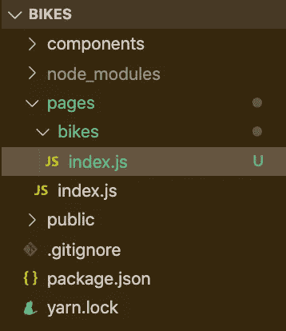
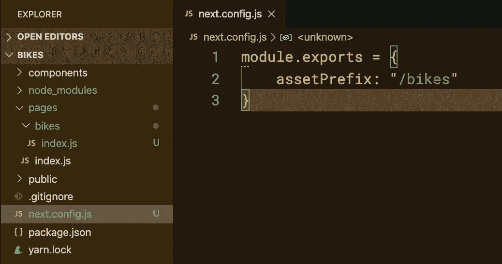

# 一个域—多个 Next.js 应用程序

> 原文：<https://itnext.io/one-domain-multiple-next-js-apps-5e39b0ffa1bf?source=collection_archive---------2----------------------->

关于如何使用 Nginx 在一个域上使用子目录服务多个 Next.js 应用程序的快速教程。


照片由[丹尼尔·萨尔西乌斯](https://unsplash.com/@dsalcius?utm_source=unsplash&utm_medium=referral&utm_content=creditCopyText)在 [Unsplash](https://unsplash.com/?utm_source=unsplash&utm_medium=referral&utm_content=creditCopyText) 拍摄

默认情况下，如果你使用`create-next-app`来启动一个 Next.js 项目，它会假设你正在运行一个大型的网站。最近，我遇到了一个小用例，其目标是托管多个 Next。JS 项目，并使用单个域和子目录提供服务。

假设我们有三个 Next.js 项目，即`bikes`、`cars`和`trucks`，它们都是具有独立 git 库的独立项目。我们希望在单个服务器实例上为这三个项目提供子目录。

1.  `bikes`应该在`yourdomain.com/bikes`上菜
2.  `cars`应该在`yourdomain.com/cars`上菜
3.  `trucks`应在`yourdomain.com/trucks`送达

我个人在生产中使用 Nginx 作为反向代理来服务我的 Next.js 应用程序。我让 PM2 担任流程经理。但是因为 Next.js 假设你总是把它作为一个单独的网站来提供服务，所以加载构建的资产会有问题。通常你所有的静态资产都会得到 404 分。为了达到上述要求，我们需要做一些调整。

# 将所有路由放在一个文件夹中，子目录名称为

例如，如果您实例中的项目目录在`/home/ubuntu/bikes`中，那么您在`pages`中创建一个`bikes`文件夹。然后在这里创建你所有的其他路线。



# 2.将 assetPrefix 添加到 next.config .文件中

`assetPrefix`选项允许从不同的目录中提供静态文件。默认情况下，从`/_next`开始供应。但是因为我们使用子目录，我们需要从示例`/bikes/_next`中提供这些资产。但是如果您在构建 Next.js 之后查看项目文件夹，您会注意到没有`/next`文件夹。但是它叫做`/.next`我们将在下一步解决这个问题。



# 3.修改 Nginx 反向代理

我们需要确保为项目、它的公共目录和`/pages/api`路由设置了反向代理。我把我的项目文件放在`/home/ubuntu`里，因为我在一台 Ubuntu 机器上。这可能会有所不同。请注意，我们将 _next 路径别名化为每个路径。改为下一个文件夹。确保重启 Nginx。

[要诀在此](https://gist.github.com/skolhustick/dcbec823ad78c43380112d3136e028cf)

```
server { listen 80 default_server;
  listen [::]:80 default_server; server_name _; #ONE FOR EACH NEXTJS APP AND SUBDOMAIN #BIKES - PORT 3001 location /bikes/_next/static {
    autoindex on;
    alias /home/ubuntu/bikes/.next/static;
  }location /bikes/api {
    proxy_pass [http://localhost:3001/api](http://localhost:3001/api);
    proxy_http_version 1.1;
    proxy_set_header Upgrade $http_upgrade;
    proxy_set_header Connection 'upgrade';
    proxy_set_header Host $host;proxy_cache_bypass $http_upgrade;
  }location /bikes {
    proxy_pass [http://localhost:3001](http://localhost:3001);
    proxy_http_version 1.1;
    proxy_set_header Upgrade $http_upgrade;
    proxy_set_header Connection 'upgrade';
    proxy_set_header Host $host;
    proxy_cache_bypass $http_upgrade;
  }#CARS - PORT 3002
  location /cars/_next/static {
    autoindex on;
    alias /home/ubuntu/cars/.next/static;
  }location /cars/api {
    proxy_pass [http://localhost:3002/api](http://localhost:3002/api);
    proxy_http_version 1.1;
    proxy_set_header Upgrade $http_upgrade;
    proxy_set_header Connection 'upgrade';
    proxy_set_header Host $host;proxy_cache_bypass $http_upgrade;
  }location /cars {
    proxy_pass [http://localhost:3002](http://localhost:3002);
    proxy_http_version 1.1;
    proxy_set_header Upgrade $http_upgrade;
    proxy_set_header Connection 'upgrade';
    proxy_set_header Host $host;
    proxy_cache_bypass $http_upgrade;
  }#TRUCKS - PORT 3003
  location /trucks/_next/static {
    autoindex on;
    alias /home/ubuntu/trucks/.next/static;
  }location /trucks/api {
    proxy_pass [http://localhost:3003/api](http://localhost:3003/api);
    proxy_http_version 1.1;
    proxy_set_header Upgrade $http_upgrade;
    proxy_set_header Connection 'upgrade';
    proxy_set_header Host $host;proxy_cache_bypass $http_upgrade;
  }location /trucks {
    proxy_pass [http://localhost:3003](http://localhost:3003);
    proxy_http_version 1.1;
    proxy_set_header Upgrade $http_upgrade;
    proxy_set_header Connection 'upgrade';
    proxy_set_header Host $host;
    proxy_cache_bypass $http_upgrade;
  }}
```

就是这样！