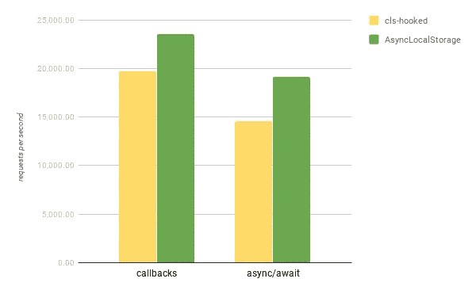
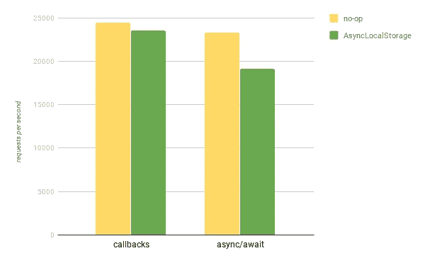

# 一个 Node.js CLS API 来管理它们

> 原文：<https://itnext.io/one-node-js-cls-api-to-rule-them-all-1670ac66a9e8?source=collection_archive---------1----------------------->

照片由[在位](https://unsplash.com/@jareeign?utm_source=medium&utm_medium=referral)在 [Unsplash](https://unsplash.com?utm_source=medium&utm_medium=referral) 上拍摄

Node.js v13.10.0 引入了内置的 CLS API，即位于众所周知的实验`async_hooks`模块中的新类`[AsyncLocalStorage](https://nodejs.org/api/async_hooks.html#async_hooks_class_asynclocalstorage)`。在这篇短文中，我将试着解释为什么它如此重要。

# CLS API 101

CLS 代表连续本地存储，是多线程世界中线程本地存储概念的异步变体。CLS API 允许您通过异步执行链关联和跟踪上下文。如果没有这样的 API，您必须要么显式传递上下文对象(有时这不是一个选项)，要么处理 Node.js 中所有异步 API 的大量猴子补丁。

CLS API 通常用于各种云平台中 Node.js 的应用性能监控(APM)工具。但是有些情况下，你可能想在你的应用程序中直接或间接使用 CLS，也就是说，它可能在你的依赖项中使用。请求 id 跟踪就是这样的用例之一。你可以在我的[上一篇博文](/request-id-tracing-in-node-js-applications-c517c7dab62d)中读到更多关于这个话题的内容。

但是让我们回到`AsyncLocalStorage`。为了让您对 API 有一个印象，这里有一个例子，展示了如何使用`AsyncLocalStorage`来构建一个具有请求 id 跟踪功能的原始日志记录器。

# 为什么异步本地存储很重要？

现在，当您对这个主题有了更好的理解时，让我们来看一下新 API 的一系列优点。

1.  有几个 Node.js 用户土地模块实现了 CLS，其中最流行的是`[continuation-local-storage](https://github.com/othiym23/node-continuation-local-storage)`和它的继任者`[cls-hooked](https://github.com/Jeff-Lewis/cls-hooked)`。不幸的是，它们都没有在社区中被广泛采用，许多 Node.js 库不能很好地处理这些模块，导致各种上下文丢失问题。作为标准库的一部分，`AsyncLocalStorage`有机会改变这一点，因为库的维护者更有可能修复与核心 API 相关的问题，而不是第三方。
2.  `AsyncLocalStorage`提供了一个简单的高级 API，隐藏了异步钩子的复杂性和底层细节。因此，它比它所构建的 API 更稳定(就兼容性而言),并且有可能被移到一个单独的、稳定的模块中。
3.  性能方面`AsyncLocalStorage`明显快于其用户地竞争对手(参见下一节的基准测试结果)。主要是因为它避免了使用`destroy`钩子(感谢`[executionAsyncResource](https://nodejs.org/api/async_hooks.html#async_hooks_async_hooks_executionasyncresource)`)。

# 性能比较

> 免责声明。这种比较有意保持尽可能简单，即它只考虑在开发机器上收集的基准运行系列的平均结果。

您可能已经知道，Node.js core 包括一组由核心团队维护的各种基准。其中一个基准(即`[async-resource-vs-destroy.js](https://github.com/nodejs/node/blob/ec204d86b06e4cc9259c1308e365a3e104212a16/benchmark/async_hooks/async-resource-vs-destroy.js)`和必要的修改)用于比较`AsyncLocalStorage`和替代方案。该基准旨在模拟一个或多或少标准的 web 应用程序。为此，它启动一个 HTTP 服务器，该服务器调度一个`setTimeout`，然后在处理传入请求时读取一个文件(都在相同的 CLS 上下文中)。

首先，让我们看看`AsyncLocalStorage`与`cls-hooked`相比如何，后者是最受欢迎的用户-CLS API 之一。

以 cls 为基准-挂钩

正如我们在上面的图表中看到的，`AsyncLocalStorage`在普通回调和异步/等待语法上都比`cls-hooked`快得多。

现在，让我们试着测量一下新 API 与同样的 web 应用相比的开销，这个 web 应用有一个无操作的 CLS 实现，即一个什么也不做的实现(因此，没有启用任何异步挂钩)。

以不采取行动的 CLS 为基准

如您所见，当您的代码基于回调时，开销几乎为零。使用 async/await 语法时，这变得更加明显，但是代价并没有那么高，并且还有一些空间[用于将来的改进。](https://twitter.com/stephenbelanger/status/1234395447327805440?s=20)

# 行动呼吁

此时，你可能会好奇`AsyncLocalStorage`的成熟度，以及它是否足够稳定，可以在你的应用或库中使用。

我要说的是，API 在这一点上(2020 年 3 月)需要一些时间来“安顿下来”(例如，[这个 PR](https://github.com/nodejs/node/pull/31950) 涉及到明显的变化)，但是早起的鸟儿有虫吃。

一旦`AsyncLocalStorage`在 API 方面变得更加稳定，像`cls-hooked`这样处理用户土地 CLS 库的开发者肯定应该考虑切换到核心模块。此外，对 Node.js v12 的反向移植正在进行中，因此应该有助于更广泛的采用。

作为 Node.js 社区成员，我要感谢所有使`AsyncLocalStorage`成为可能的核心合作者(尤其是 [Vladimir de Turckheim](https://medium.com/u/b662fb63374b?source=post_page-----1670ac66a9e8--------------------------------) 为 API 投入了大量精力)。另一方面，作为这个核心 CLS API 的合著者，我承诺尽我所能传播消息，并支持`AsyncLocalStorage`将 Node.js 作为一个平台和生态系统做得更好。

**更新**。`AsyncLocalStorage`在 Node.js v12.17.0 和 v14.0.0 中也有