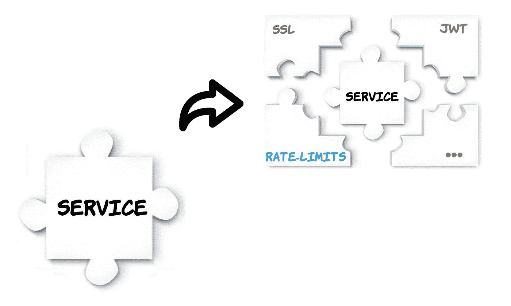
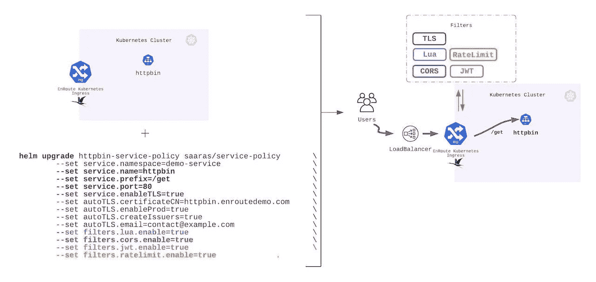
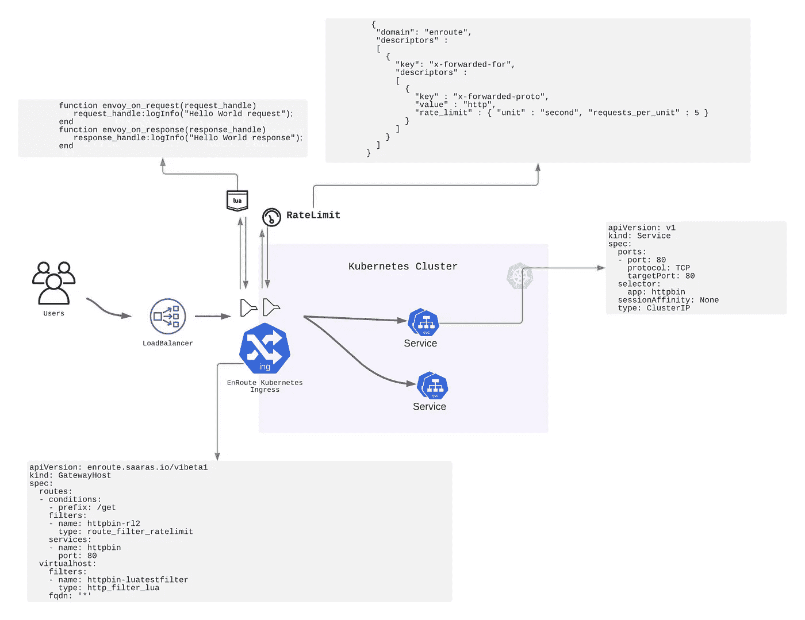

# 一步进入

> 原文：<https://itnext.io/one-step-ingress-57e748b0575a?source=collection_archive---------7----------------------->



一步到位保护和连接您的微服务

# 使用一个命令保护和连接微服务

[途中入口](https://getenroute.io/docs/getting-started-enroute-ingress-controller/)允许您一步到位地在 Kubernetes 入口为服务配置任何安全策略



例子包括-

*   [从 Let's Encrypt](https://getenroute.io/docs/ingress-filter-legos-secure-microservices-apis-using-helm-envoy/) 获取、验证并安装 SSL 证书
*   [服务的速率限制配置](https://getenroute.io/reference/plugins/advanced-rate-limiting/)
*   [服务的 JWT 验证](https://getenroute.io/reference/plugins/jwt/)
*   [将 Lua 脚本附加到服务的请求/响应路径上](https://getenroute.io/reference/plugins/lua/)
*   [为服务启用 CORS](https://getenroute.io/reference/plugins/cors/)

除此之外，在不久的将来，我们计划扩展对的支持

*   设置外部 dns 以自动创建 DNS 记录并设置 DNS 自动证书续订
*   更多的安全模块，如 CSRF 过滤器，以防止请求伪造和 IP 标签，以标记可信的 IP 地址
*   使用 WASM 提供现成的 Web 程序集代码调用功能，从而提高可编程性

# 真正的宣言

途中模型是真正的声明式服务策略。服务策略不需要配置，声明它就足够了。声明后，将自动为服务创建并实施策略配置。

例如，要启用 JWT 插件，只需调用-

```
helm install httpbin-service-policy saaras/service-policy       \
        --set service.namespace**=**demo-service                    \
        --set service.name**=**httpbin                              \
        --set service.port**=80**                                   \
        --set filters.jwt.enable**=**true                           \
```

这将启用服务的 JWT 插件`httpbin`

# 使用相同的抽象更新 L7 策略块

L7 策略块(如 SSL、CORS、JWT、速率限制等。)可以声明性地包含/排除。可以使用一个舵命令添加或删除它们。

舵图支持启用/禁用服务过滤器

复制

```
helm upgrade httpbin-service-policy saaras/service-policy       \
        --set service.namespace**=**demo-service                    \
        --set service.name**=**httpbin                              \
        --set service.prefix**=**/get                               \
        --set service.port**=80**                                   \
        --set service.enableTLS**=**true                            \
        --set autoTLS.certificateCN**=**httpbin.enroutedemo.com     \
        --set autoTLS.enableProd**=**true                           \
        --set autoTLS.createIssuers**=**true                        \
        --set autoTLS.email**=**contact@example.com                 \
        --set filters.cors.enable**=**true                          \
        --set filters.jwt.enable**=**false                          \
```

可以使用`helm install`指定声明性策略。使用`helm upgrade`声明性地修改这个策略，将服务的 L7 策略协调到新的状态。

# 高级抽象

一步到位提供了更高层次的抽象。与汇编代码相比，这类似于更高级的编程语言。

更高级别的抽象(和语言)简化了入口编程。

EnRoute 利用现有的 Envoy 过滤器抽象，并将其扩展到入口层。在使用众所周知的 EnRoute 过滤器抽象时，使用像`helm`这样的众所周知的工具是很简单的。它为特使代理形成了一个轻量级的垫片。

# 安全第一

EnRoute 与 Let's Encrypt 的深度集成从根本上简化了证书的设置、验证和安装。


# 开箱详情

舵命令[创建](https://getenroute.io/docs/getting-started-enroute-ingress-controller/) `[GatewayHost](https://getenroute.io/docs/getting-started-enroute-ingress-controller/)` [和相关工件](https://getenroute.io/docs/getting-started-enroute-ingress-controller/)以支持安装不同的滤镜。



创建工件的 [helm 代码可以被修改以满足创建微服务连接和安全配置文件。](https://github.com/saarasio/enroute/tree/master/helm-chart)

# 在途中单步入口控制器上运行策略的优势

运行入口控制器并在入口实施策略有几个明显的优势。

*   Ingress 提供了一种可移植的机制来在 Kubernetes 集群内部实施策略。在集群内部实施的策略更容易跨云移植。
*   入口可以在 Kubernetes 集群内水平扩展。L7 面料的弹性使其更容易操作和伸缩
*   L7 策略可以与服务一起托管在具有群集本机状态存储的群集中
*   让 L7 策略更接近服务简化了策略实施以及服务和 API 的故障排除。

# 结论

单步导入提供了一个机会，使导入变得非常容易理解和操作。它减少了配置服务连接和策略选项所需的工件数量。当有更高层次的抽象时，使用 Kubernetes 可以提高操作速度，而不会牺牲 DevOps 的灵活性

由于 Kubernetes 被作为运行微服务和采用 DevOps 实践的标准，使用更少的工具可以减少移动部件的数量。途中一步进入通过依赖 helm 和 Envoy 等现有工具来提高简单性和操作速度。

有问题吗？[时差](https://join.slack.com/t/saaras-io/shared_invite/zt-pz1qay34-9UNGwJWTOMG5jolGrbWH~g) [给我们发短信](https://getenroute.io/contact)