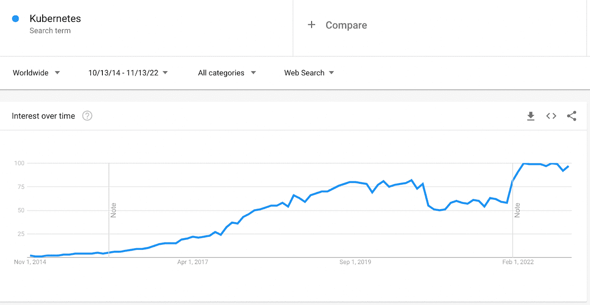
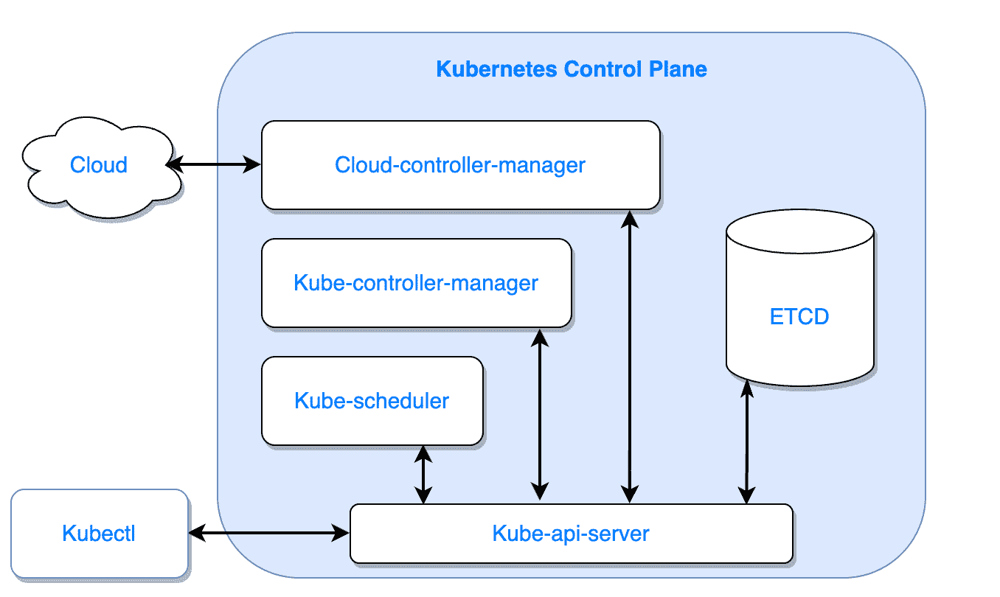
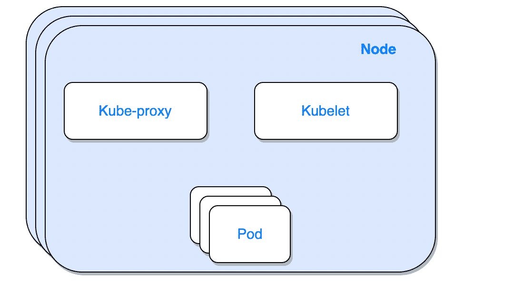
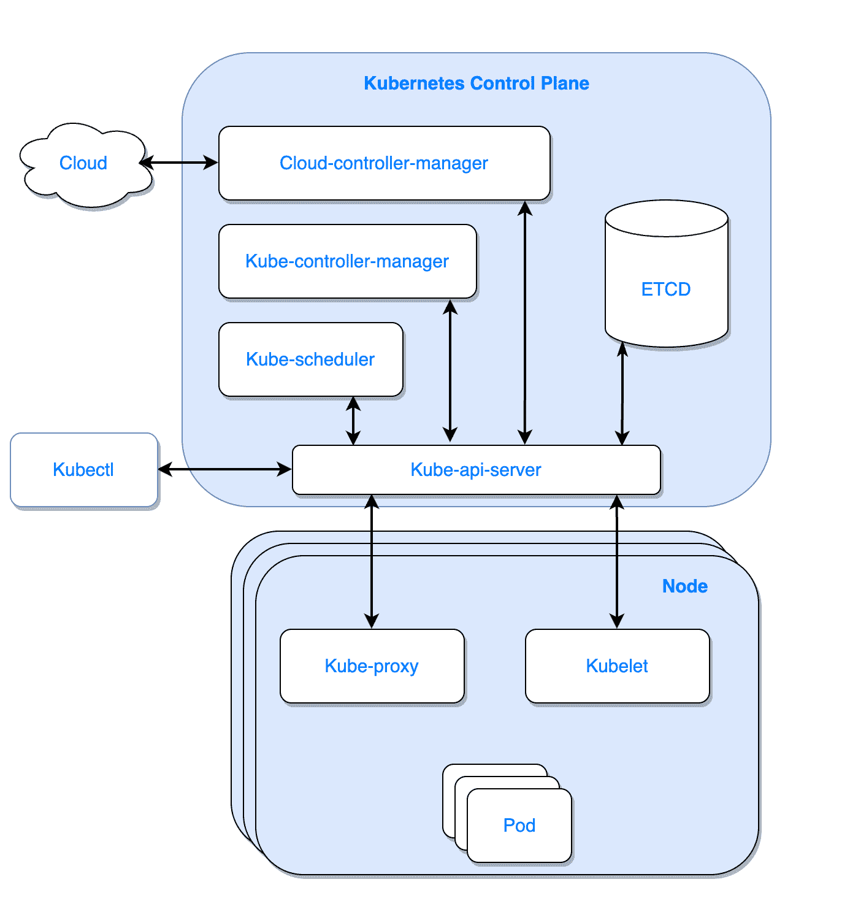
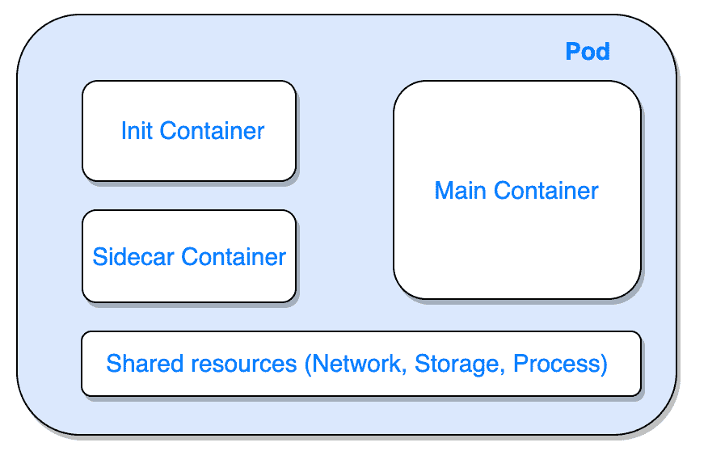
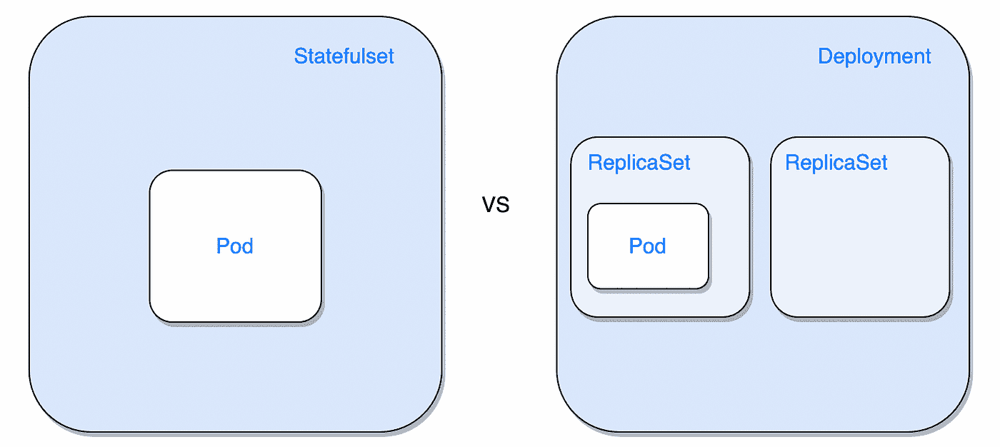
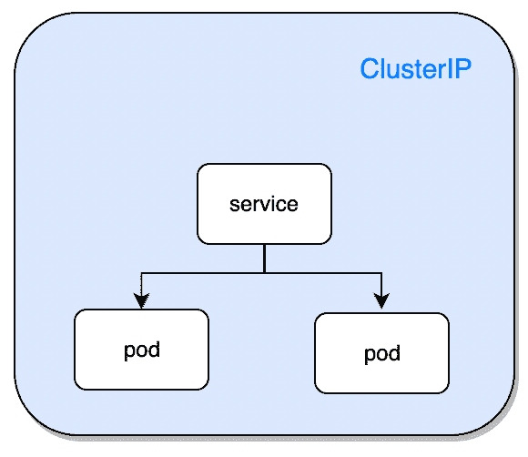
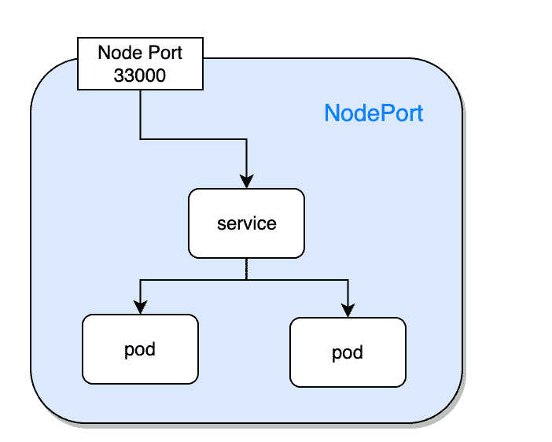
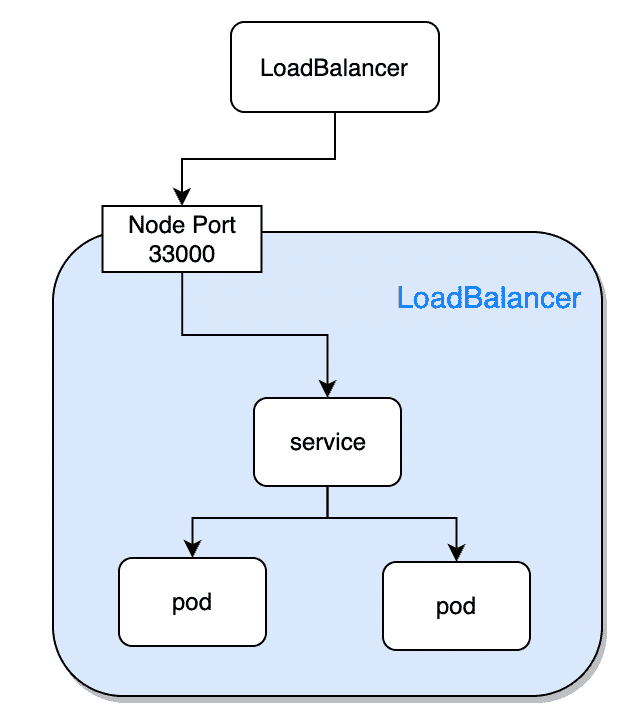

# 2023 年轻松通过 Kubernetes 面试问题的一个故事

> 原文：<https://itnext.io/one-story-for-effortlessly-passing-kubernetes-interview-questions-in-2023-f93e828cee9f?source=collection_archive---------0----------------------->

欢迎来到我的 Kubernetes 博客。这些博客旨在为您提供有效的 Kubernetes 知识和工具，提高效率，同时减少压力和交付高质量解决方案的时间。点按“关注”按钮，以便在新故事发布时得到通知。

**让我们开始吧……**

如今，科技公司技术堆栈中最常用的工具之一是 Kubernetes。自发布以来，Kubernetes 获得了巨大的采用率，推动了其生态系统并增加了用户。2021 年，CNCF(云计算原生计算基金会)做了一项[调查](https://www.cncf.io/announcements/2022/02/10/cncf-sees-record-kubernetes-and-container-adoption-in-2021-cloud-native-survey/)，发现 96%的组织(回答了调查)正在他们的技术堆栈中使用或评估 Kubernetes。



不言而喻，随着 Kubernetes 的采用，对技术人员的需求比以往任何时候都高。在这篇博客中，我们将看看面试官最常问的问题以及他们的答案。

**那么我们来看看最常见的 Kubernetes 面试问题**

*   Kubernetes 控制平面组件是什么及其用途？
*   什么是工作节点组件及其用途？
*   init 容器和 sidecar 容器有什么区别？
*   部署和状态集之间有什么区别？
*   列出不同的服务类型及其用途

**Kubernetes 控制平面组件是什么及其用途？**



Kubernetes 控制平面节点是 Kubernetes 集群操作背后的“大脑”。控制平面节点管理集群中的 pod，以及参与集群的工作节点。

Kubernetes 控制平面由本地 Kubernetes 集群上的四个组件和 Kubernetes 云/混合集群上的五个组件组成。作为群集管理员，出于 HA 原因，我们希望生产环境中至少有三个控制平面节点。

*   **Kube-api-server**—Kubernetes API 服务器验证和配置 API 对象的数据，包括 pod、服务、复制控制器等。API 服务器服务于 REST 操作，并提供集群共享状态的前端，所有其他组件通过它进行交互。
*   **Kube-controller-manager**—Kubernetes 控制器管理器是一个守护程序，嵌入了 Kubernetes 附带的核心控制循环。在机器人和自动化应用中，控制回路是调节系统状态的非终止回路。Kubernetes 目前附带的控制器示例有复制控制器、端点控制器、名称空间控制器和 serviceaccounts 控制器。
*   **Kube-scheduler**—Kubernetes 调度程序是一个控制平面进程，它将 pod 分配给节点。调度器根据约束和可用资源确定哪些节点是调度队列中每个 Pod 的有效位置。然后，调度器对每个有效节点进行排序，并将 pod 绑定到合适的节点。可以有多个调度程序。
*   **Etcd** —开源、分布式、一致的键值存储，用于分布式系统或机器集群的共享配置、服务发现和调度协调。在 Kubernetes 控制面板中，Etcd 用于存储和复制所有的 Kubernetes 集群状态。
*   **云控制器管理器**(用于云提供商)——云控制器管理器提供了 Kubernetes 集群和云服务 API 之间的接口。云控制器管理器允许 Kubernetes 集群提供、监控和删除集群运行所需的云资源。

在大多数控制平面节点关闭的情况下，群集将无法为 API 请求提供服务，并且群集将不可用。尽管如果工作节点是健康的，pod 将继续运行，但是将不能重新调度。

**什么是工作节点组件及其用途？**



工作节点负责在集群中托管应用程序单元。虽然可以在控制平面节点中托管适用的 pod，但出于安全原因，最佳做法是将 pod 安排在工作节点上。工作者节点持有允许它们对控制平面请求进行操作的组件。

*   **Kube-proxy** — kube-proxy 负责维护节点上的网络规则。网络规则允许从集群内部和外部与您的 pod 进行网络通信。
*   **Kubelet** — Kubelet 是在每个节点上运行的代理。它负责根据提供的 YAML 规范创建 pod，向 API 服务器发送 pod 的健康状态，并提供节点的状态信息，如网络、磁盘空间等。



**init 容器和 sidecar 容器有什么区别？**

pod 最简单的设计是提供 pod 主要功能的单容器 pod，但是如果您想扩展现有的功能而不改变主容器或增加其复杂性，该怎么办呢？

因此，豆荚可以包裹一个或多个容器。有一种容器设计模式适用于不同的场景，但是这些设计模式的构建块是用 init 容器和 sidecar 容器实现的。



*   **初始化容器** —初始化容器总是在边车和主应用程序容器之前运行。init 容器必须成功运行，然后其他容器才能运行。使用 init 容器的原因可能是为了多种选择。例如，它可以用来检查应用程序的依赖关系是否可用，设置主容器或副容器环境，等等。
*   **边车容器** —边车容器与主应用程序容器平行运行。使用边车集装箱的原因可能有多种。例如，在 Istio 中，sidecar 容器被用作管理主容器的传入流量的代理，它还可以用于日志记录、监控等目的。

初始化环境和拦截容器流量的 Istio 注入容器示例。

```
apiVersion: v1
kind: Pod
metadata:
name: example
spec:
# init container section where you can setup your init containers
  initContainers:
  - name: istio-init
    image: istio/proxyv2:1.11.2
  containers:
  - name: hello
    image: alpine
# our sidecar container which will intercept the pod network tarffic
  - name: istio-proxy
    image: istio/proxyv2:1.11.2
    volumeMounts:
    - mountPath: /etc/certs
      name: certs
  volumes:
  - name: certs
    secret:
      secretName: istio-certs
```

**部署和状态集之间有什么区别？**

我们在面试中会遇到的最常见的问题之一。要回答这个问题，我们需要了解每种资源并理解它们的区别。



*   **部署** —部署是在 Kubernetes 集群中部署应用程序的最简单和最常用的资源。部署通常用于无状态应用程序，这意味着驻留在 pod 上的数据将随 pod 一起删除。如果我们在部署中使用持久性存储，我们将对参与部署的所有 pod 拥有一个持久性卷声明。部署包装了一个 ReplicaSet 资源，允许他在版本之间轻松回滚。pod 的命名约定设置如下:<部署名称> - <复制集 id>-<pod id>。
*   **Statefulset** —随着社区要求能够在 Kubernetes 集群上托管有状态应用程序，这种资源在 Kubernetes 1.9 版本中变得稳定。Statefulset 不使用 Replicaset 作为辅助控制器，而是自己管理豆荚。pod 的命名约定如下:<状态集名称> -0，<状态集名称> -1。命名约定用于网络标识符和升级控制。Statefulset 需要 headless 服务，为参与 Statefulset 的 pod 启用网络识别和 DNS 解析。Statefulset 部署中的每个副本都有自己的持久性卷声明，因此每个 pod 都有自己的状态。

总之，经验法则是无状态应用程序应该与部署一起部署。部署包装了另一个名为 Replicaset 的控制器，以便于升级和回滚。Statefulset 是出于社区需要而创建的，通常用于有状态的应用程序，如数据库，其中识别集群中的其他副本是至关重要的，并且升级应该优雅地完成。

## **列出不同的服务类型及其用途**

Kubernetes 服务是由选择器选择的一组 pod 的逻辑抽象。该服务用于设置访问底层 pod 的策略。

在你的面试中，你可能会被问到以下四种最常见的服务类型。

*   **cluster IP**—cluster IP 类型是默认的服务类型，也是 Kubernetes 生态系统中最常见的服务。ClusterIP 服务具有内部群集 IP，并且只能从群集内部访问。



*   **负载平衡器** —负载平衡器服务类型通过分配负载平衡器用于外部流量访问。为了使用这种类型的服务，需要一个能够分配负载平衡器的支持平台。负载平衡器将异步创建，当负载平衡器的信息可用并分配给服务时，它将在服务上可用。LoadBalancer 服务类型也具有 ClusterIP，并分配 Nodeport 来访问服务。



*   **节点端口** —当您想要将服务公开给来自集群的外部流量，并且服务类型负载平衡器不可用时，通常使用节点端口服务类型。使用 NodePort 服务类型，您将决定一个端口(在 3000 到 32767 的可接受范围内),集群中的每个节点都将公开该端口以接收流量并将其转发给服务。NodePort 服务类型还具有 ClusterIP，允许从集群内部访问该服务。



*   **无头** —当需要与 pod 直接通信时，使用无头服务类型。例如，在作为数据库的 Statefulset 应用程序中，辅助 pod 需要直接与主 pod 通信，以便在副本之间复制数据。无头服务允许 DNS 解析底层 pod 并通过 pod 名称访问它们。无头服务是没有 clusterIP 设置的服务。通过无头服务访问 pod 的例子如下:< pod-name >。<服务名称>。<命名空间> .svc.cluster.local

**结论**

Kubernetes 是当今行业中使用最多的技术之一，作为一个这样的组织，它正在寻找在该主题上受过教育和有经验的人才。这个故事中回顾的主题是采访中最常被问到的一些问题。虽然这个故事回答了五个主要问题，但是这里写的信息在不同的问题场景中会有所帮助。

谢谢，如果您有任何问题或需要任何帮助，您可以通过 LinkedIn 联系我。如果你想对以下评论中的任何主题进行深入的评论，请告诉我，或者直接发邮件给我。

***********************************************************************

链接:

[www.devunet.com](http://www.devunet.com)(访问我公司网站)

https://www.linkedin.com/in/dekel-malul/[(在 Linkedin 上联系我)](https://www.linkedin.com/in/dekel-malul/)

https://www.linkedin.com/company/devunet/(在 Linkedin 上关注我们的未来视频)