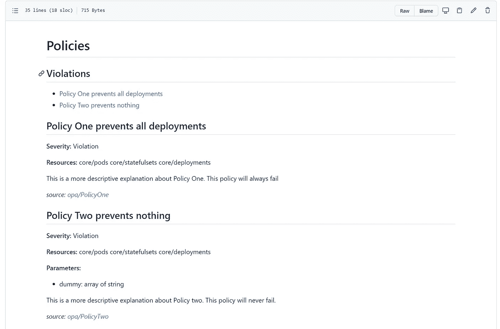

# OPA/减压阀—生成文档

> 原文：<https://itnext.io/opa-rego-generating-documentation-2f5445090092?source=collection_archive---------5----------------------->

在我之前的博客中，我分享了一个叫做 [konstraint](https://github.com/plexsystems/konstraint) 的工具的细节。该条目专注于生成 YAML。作为后续，我将更深入地研究文档生成功能。

许多编程语言在代码中使用文档约定，并且通常会有注释来支持解析器提取数据以生成文档。

Konstraint 为 rego 语言做这件事。让我们看看 rego header 和可用的注释和输出文档:

```
# @title this is a basic title for my policy
#
# This is the longer explanation of my policy details 
# and the opinions it enforces# @enforcement deny  # This is the default, but could be dryrun# The line below is used to generate the constraint by linking the resource types of interest to the policy
# @kinds core/pod bigquerydatasets.crnm.cloud.google.com/BigQueryDataset# The line below defines parameters for the ConstraintTemplate. As such, you need to define the Constraints yourself.
# @parameter <name> array string
# @parameter resource_types array string
```

*   @title —这将成为文档中策略的标题。它还将用于创建目录
*   @enforcement —记录策略是拒绝还是处于试运行模式。默认值为“拒绝”
*   @ kinds—API group/resourceName 格式的以空格分隔的资源列表，用于约束要附加到的内容。
*   @ parameter 定义约束模板 CRD 及其数据类型的参数

konstraint doc 将解析 rego 文件中的文档块，如上所示，并生成一个 policies.md 文件，其中包含目录和对每个策略的解释。

为了演示这个工具和输出，我创建了一个样例存储库:【https://github.com/patpicos/rego_doc_gen



# 结论

自动化文档生成是确保文档得到维护和保持最新的又一小步。make 指令可以在预提交挂钩或 CI 管道中使用，以确保存储库在每次合并时都是最新的。