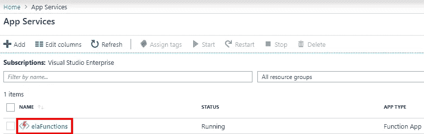
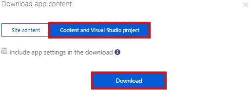
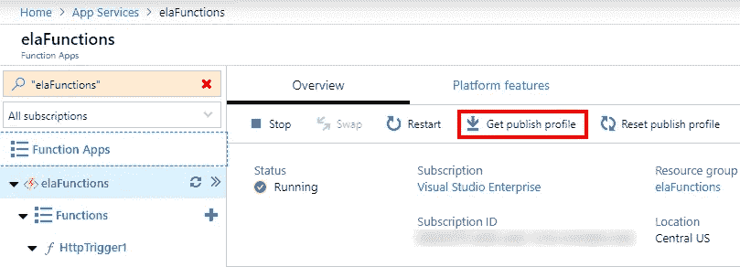
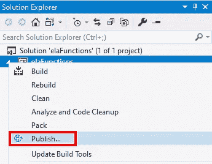
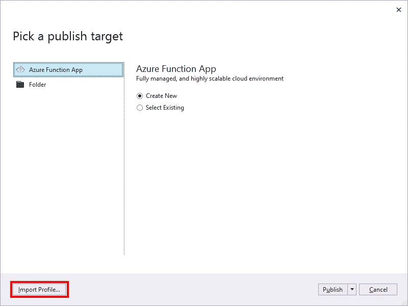
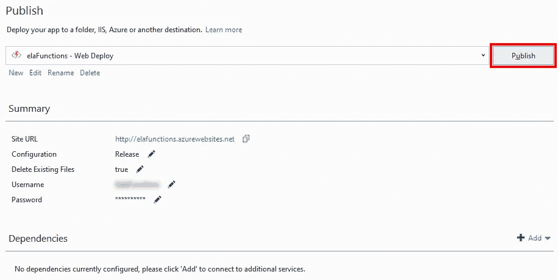

# 在 Visual Studio 中打开 Azure Portal 创建的函数

> 原文：<https://itnext.io/open-an-azure-portal-created-function-in-visual-studio-a76f2352163a?source=collection_archive---------4----------------------->

在上周的帖子中， [Azure Functions 简介](https://elanderson.net/2019/06/azure-functions-introduction/)，我们创建了一个新的 Azure Function 应用，它有一个通过 HTTP 触发的单一功能。门户对于功能的初始创建非常有用，但是当您的需求发生变化时会发生什么呢？例如，您可能希望将您的函数与应用程序的其余代码存储在一个 repo 中。在这篇文章中，我们将带着我们的门户创建的函数，并把它下载到可以在 Visual Studio 中编辑的地方。

## 下载应用程序内容

从 Azure 门户选择应用服务。


接下来，选择您想要获取代码的功能应用程序。



将加载功能应用程序的详细信息，并在屏幕顶部点击**下载应用程序内容**选项。


在弹出窗口中选择**内容和 Visual Studio 项目**，然后点击**下载**按钮。



点击下载后，你会得到一个包含所有功能应用的压缩文件。提取文件并双击项目文件以在 Visual Studio 中打开它。

## 改变功能

该项目将为应用程序中存在的每个函数创建一个文件夹。在我们的示例中，您会看到一个 **HttpTrigger1** 目录，在该目录中，实际函数的代码位于 **run.csx** 文件中。查看代码，您会发现它与您在门户中看到的是一样的。这是代码。

```
#r "Newtonsoft.Json"

using System.Net;
using Microsoft.AspNetCore.Mvc;
using Microsoft.Extensions.Primitives;
using Newtonsoft.Json;

public static async Task<IActionResult> Run(HttpRequest req, ILogger log)
{
    log.LogInformation("C# HTTP trigger function processed a request.");

    string name = req.Query["name"];

    string requestBody = await new StreamReader(req.Body).ReadToEndAsync();
    dynamic data = JsonConvert.DeserializeObject(requestBody);
    name = name ?? data?.name;

    return name != null
        ? (ActionResult)new OkObjectResult($"Hello, {name}")
        : new BadRequestObjectResult("Please pass a name on the query string or in the request body");
}
```

此时，您可以对应用程序进行任何更改。我要改变返回值。

```
Before:
(ActionResult)new OkObjectResult($"Hello, {name}")

After:
(ActionResult)new OkObjectResult($"Yo, {name}")
```

## 将更改推回到 Azure

现在我们已经对我们的函数进行了更改，我们如何将更改返回到 Azure？返回 Azure Function 应用的概览页面，点击**获取发布个人资料**链接。



在 Visual Studio 中，右键单击项目并选择**发布**。



在发布对话框中点击**导入配置文件**按钮，选择从 Azure 下载的配置文件。



一旦导入了配置文件，您就可以点击**发布**按钮来推送对您的 Azure Function 应用程序的任何更改。



此时，如果您执行您的函数，您应该会看到您在 Visual Studio 中所做的更改。

## 包扎

虽然上面的方法有效，但在 Visual Studio 中它实际上并不友好，因为该函数是一个 csx 文件，而不是普通 C#使用的 cs 文件。下周寻找一个从 Visual Studio 启动一个函数应用程序的例子，看看它是否会产生一个更容易维护的项目。

*原载于*[](https://elanderson.net/2019/07/open-an-azure-portal-created-function-in-visual-studio/)**。**