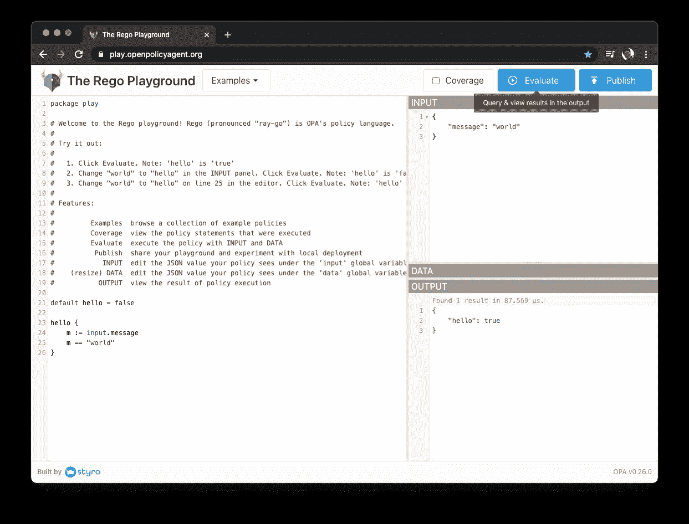
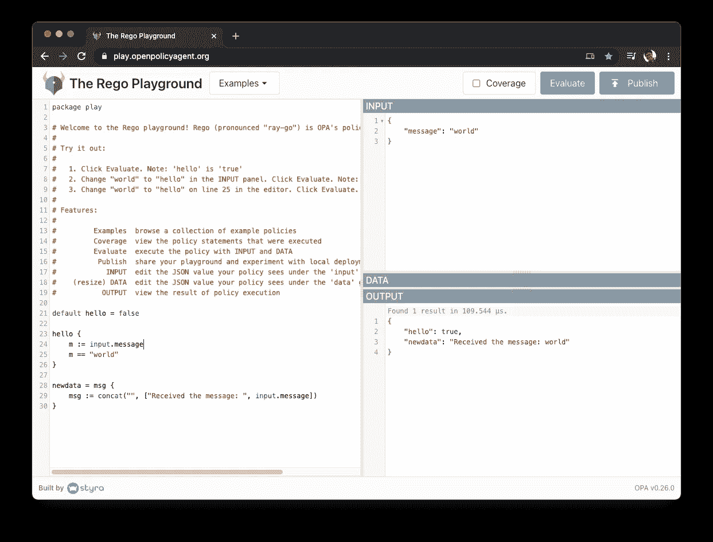
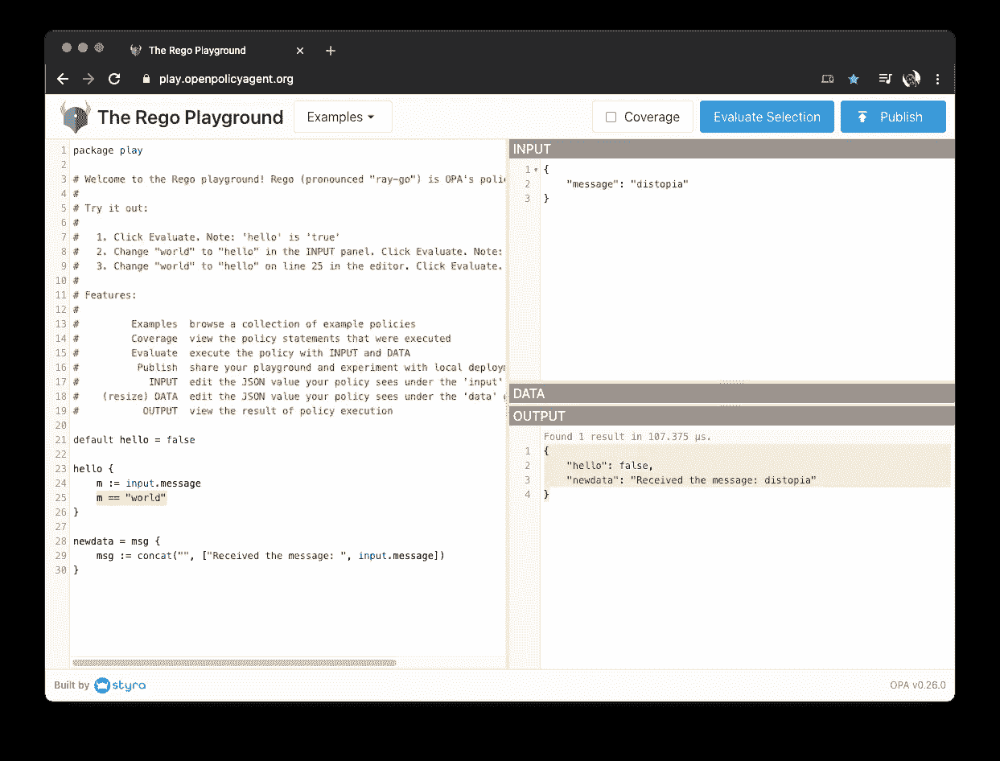
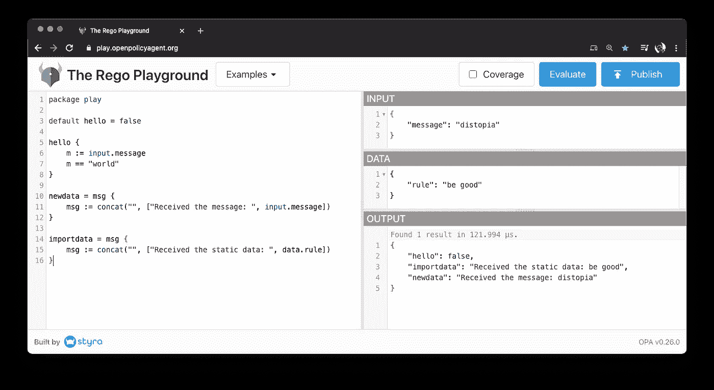

# 开放策略代理(OPA):启动并运行

> 原文：<https://itnext.io/open-policy-agent-opa-up-and-running-9220ff591fa1?source=collection_archive---------2----------------------->

## 8 分钟后你的第一个减压阀节目

最新消息:**开放政策代理(OPA)**2021 年 2 月毕业于 CNCF。恭喜你，OPA！由此可见 OPA 的成熟。

[https://blog . openpolicyagent . org/open-policy-agent-graduates-in-the-cloud-native-computing-foundation-f 00145202 a 99](https://blog.openpolicyagent.org/open-policy-agent-graduates-in-the-cloud-native-computing-foundation-f00145202a99)

这个文档是为那些想使用[开放策略代理(OPA)](https://www.openpolicyagent.org/) 一次的人准备的。这是 OPA 的“hello world”。

最快也要 8 分钟。

(这是从 [github](https://github.com/onelittlenightmusic/opa-up-and-running) 、[日文版](https://gist.github.com/onelittlenightmusic/README-jp.md)克隆的文章)

# 1.你的第一个编码:试试减压阀游乐场

不使用实际的 OPA 也能掌握 OPA 是什么。这是尝试 OPA 最快的方法。方式是[“减压阀游乐场”](https://play.openpolicyagent.org/)，承蒙[斯泰拉](https://gist.github.com/onelittlenightmusic/styra.com)的好意。

*   访问[https://play.openpolicyagent.org/](https://play.openpolicyagent.org/)
*   点击`Evaluate`按钮。



## 先试试你的**减压阀语**编码。

*   将这些行添加到左窗格的最后一行。

```
newdata = msg {
  msg := concat("", ["Received the message: ", input.message])
}
```

这几行意味着你要生成一个名为`newdata`的新数据。

*   再次点击`Evaluate`。
*   您将会看到新的结果`newdata`被添加到`OUTPUT`窗格中。



结果是这样的。

```
{
  "hello": true,
  "newdata": "Received the message: world"
}
```

第二行`"newdata": ...`是你的结果。除此之外，`"hello"`是现有代码`hello {...}`的结果

## 改变`input`

您会在`INPUT`窗格中看到`"message":...`。

将消息内容更改为`"message": "distopia"`

再次点击`Evaluate`。



你会得到这样的新结果。

```
{
    "hello": false,
    "newdata": "Received the message: distopia"
} 
```

看`hello`结果。结果从`true`变为`false`。原因如下。

*   `hello`表示`m == "world"`。这意味着如果`message`是`"world"`，它返回`true`。否则返回`false`。

## 改变`data`

将这些线插入`data`面板。

```
{
  "rule": "be good"
}
```

*   在左窗格的最后添加行。

```
importdata = msg {
  msg := concat("", ["Received the static data: ", data.rule])
}
```

*   再次点击`Evaluate`



*   结果显示了下面的新行。

```
"importdata": "Received the static data: be good",
```

## OPA 的作用(3 分钟)

你看 OPA 在减压阀游乐场做了什么。

1.  **OPA 了解一些政策文件**。
    该策略文件就像`newdata = msg {...}`一样用减压阀语言编写。(操场左侧窗格)
2.  **OPA 接收** `**input**`。
    `input`必须是 JSON 格式。(操场右上窗格)
3.  **OPA 接收** `**data**` **太**。
    `data`也必须是 JSON 格式。(操场的右中窗格。上例中的`data`是一个空的 JSON 对象`{}`
4.  **OPA 做运算生成** `**output**` **。**
    `output`也是 JSON 格式。(操场右下角的窗格)

**概要** : OPA 读取减压阀文件和 2 个 JSON 对象。然后 OPA 生成 JSON 输出。

详细内容见官方`introduction`文件[https://www.openpolicyagent.org/docs/latest/](https://www.openpolicyagent.org/docs/latest/)。

# 2.在您的环境中运行 OPA

## 2.1.安装 OPA(大约 5 分钟)

*   对于 MacOS，只需运行这个命令。

```
brew install opa
```

*   对于其他环境，按照下面的文档安装`opa`命令。

[](https://www.openpolicyagent.org/docs/latest/#running-opa) [## 介绍

### 开放策略代理(OPA，发音为“oh-pa”)是一个开源的通用策略引擎，它统一了策略…

www.openpolicyagent.org](https://www.openpolicyagent.org/docs/latest/#running-opa) 

## 2.2.检查 OPA 运行(5 分钟)

运行`opa run`测试运算放大器

```
# add ./data.json to command arguments opa run -s ./example.rego ./data.json
```

此外，您可以执行类似`a = 3`或`exit`的命令来退出。

```
$ opa run
OPA 0.26.0 (commit , built at )

Run 'help' to see a list of commands and check for updates.

> a = 3
Rule 'a' defined in package repl. Type 'show' to see rules.
> x = 3
Rule 'x' defined in package repl. Type 'show' to see rules.
> show
package repl

a = 3

x = 3
> exit
```

## 2.3.将 OPA 作为服务器运行(5 分钟)

*   创建文件`example.rego`

将以下文件另存为`example.rego`。

```
package play

default hello = false

hello {
    m := input.message
    m == "world"
}

newdata = msg {
    msg := concat("", ["Received the message: ", input.message])
}

importdata = msg {
    msg := concat("", ["Received the static data: ", data.rule])
}
```

*   创建文件`input.json`

将以下文件另存为`input.json`。

```
{
  "input": {
    "message": "world"
  }
}
```

上面的例子和第一节完全一样。

*   运行此命令来运行服务器

```
opa run -s ./example.rego
```

*   从另一个命令提示符向 OPA 服务器发送请求

1.  `/v1/data/play`

```
$ curl localhost:8181/v1/data/play -i -d @input.json -H 'Content-Type: application/json'

{"result":{"hello":true,"newdata":"Received the message: world"}}
```

2.`/v1/data/play/hello`

```
$ curl localhost:8181/v1/data/play/hello -i -d @input.json -H 'Content-Type: application/json'

{"result":true}
```

与第 1 节中“hello”的值相同。

3.`/v1/data/play/newdata`

```
$ curl localhost:8181/v1/data/play/newdata -i -d @input.json -H 'Content-Type: application/json'

{"result":"Received the message: world"}
```

与第 1 节中“newdata”的值相同。

4.`/v1/data/play/importdata`

```
$ curl localhost:8181/v1/data/play/importdata -i -d @input.json -H 'Content-Type: application/json'

{}
```

这是未定义的，因为没有导入数据。

## 2.4.运行 OPA 服务器并加载数据(5 分钟)

*   创建`data.json`

```
{
  "rule": "be good"
}
```

*   运行此命令来运行服务器。

```
# add ./data.json to command arguments
opa run -s ./example.rego ./data.json
```

从另一个命令提示符向 OPA 服务器发送请求。

1.  `/v1/data/play`

```
$ curl localhost:8181/v1/data/play -i -d @input.json -H 'Content-Type: application/json'

**{"result":{"hello":true,"importdata":"Received the static data: be good","newdata":"Received the message: world"}}**
```

添加了“导入数据”字段。

2.`/v1/data/play/importdata`

```
$ curl localhost:8181/v1/data/play/importdata -i -d @input.json -H 'Content-Type: application/json'

**{"result":"Received the static data: be good"}**
# Data was added. Same as the value of "importdata" in section 1.1
```

数据已添加。与第 1 节中“importdata”的值相同。

## 2.5.OPA 服务器的功能(3 分钟)

*   OPA 服务器运行在您的环境中，等待 HTTP 请求
    HTTP 请求应该有 JSON 主体。
    -身体应该是`{"input": ***}`的形式。
*   OPA 服务器有端点
    `<server>/v1/api/data/<package name>[/<object name>]`。
    -rego 文件`package play`第一行声明`<package name>`为`play`。
    -rego 文件中的一个对象声明`hello {...}`表示`<object name>`是`hello`。
*   OPA 的返回值是 JSON 形式的`{"result": ***}`。
    返回值因请求的端点而异。
    -如果`<package name>`被请求，响应包括`"result"`字段中的所有对象。
    -如果`<package name>/<object name>`被请求，响应在`"result"`字段中包含一个对象输出。

# 3.参考

*   https://play.openpolicyagent.org/减压阀游乐场:
*   https://github.com/open-policy-agent/opa 的 Github `OPA`仓库: