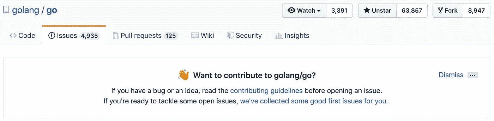

# 开源变得更容易

> 原文：<https://itnext.io/open-source-made-easier-aab8aebd849f?source=collection_archive---------5----------------------->

# **TL；博士**

我做了一个程序，在你标有星号的知识库中，找出最有可能成为做出贡献的好选择的问题。要快速开始，请查看 [GitHub 项目页面](https://github.com/igorperikov/mighty-watcher#how-to-use)上的操作方法。

# 为什么人们需要它？

**如今，开发者痴迷于开源开发。每个人都想回馈社区，在开发最广为人知的软件产品时获得一些新的技能和经验。想象一下，从世界各地经验丰富的工程师那里获得宝贵的见解:非常令人兴奋，对吗？**

然而，人们很难找到合适的工作。如果你是这个项目的新手，维护人员很可能不会让你从事一些大的、奇特的功能，以免你错过大量的细节和细节。每个人都同意**一个人最好从最简单的任务**开始，学习诀窍，从维护者那里获得一些信任，然后进行更难的任务。

# 那么，你是如何找到这些容易解决的问题的呢？

前段时间，GitHub 开始列出合适的问题，比如[https://github.com/golang/go/contribute](https://github.com/golang/go/contribute)。您可以从“问题”页面的标题访问此列表。它看起来是这样的:

他们为你收集了一些好的第一期杂志！

虽然它非常准确，但有时缺少适当的标签或遗漏了一些项目。

我通常的*“让我做点贡献”*的一天看起来是这样的:我浏览我的标有星号的存储库并跳转到这个“新贡献”部分，或者手动滚动问题列表。那是一项非常单调和耗时的任务，所以我以前很快就会对这个过程感到厌倦，并会放弃。那时我决定让它自动化。

# 解决办法

首先，我需要制定游戏规则。我做了一些研究，并提出了以下启发:

*   问题不应被关闭。
*   指派就是指派，别在这上面浪费时间。
*   一个问题应该标上“容易”的标签或类似的东西。
*   老问题很可能已经过时；如果这个问题长期得不到解决，维护人员很可能对它不感兴趣，也不太想在这个过程中帮助你。

此外，事实证明，每个存储库都使用自己的标签集**，并且很少只是“需要帮助”**。他们人数众多。我浏览了我的标有星号的资料库和其他流行的资料库中的所有标签，得出了一个大约 60 个标签的[最终列表](https://github.com/IgorPerikov/mighty-watcher/blob/master/src/main/kotlin/com/github/igorperikov/mightywatcher/service/EasyLabelsStorage.kt)。**如果你的任何存储库有不同的标签，创建一个拉取请求或联系我**——我会尽快添加。当我设定界限的时候，就是创建程序本身的时候了。

我构建了一个 Kotlin 应用程序，它查看标有星号的存储库列表，搜索带有预定义标签的问题，对它们进行排序，并将它们打印到控制台。当前的分发方式是 Docker 镜像——人们更有可能安装它而不是 Java)

随着标签列表的增长，我注意到速度急剧下降，API 使用限制的消耗增加。该工具的第一版是搜索所有给定标签的问题，尽管其中 95%从未在回购中使用过！那是我的“啊哈！”所以我添加了一个额外的调用来从存储库中获取所有的标签，并将它们与我的列表相交。我获得了显著的性能提升，并且使用了更少的 API 限制。

每天，这个工具都可以很好地作为开源贡献世界的向导，它也将帮助你实现你的 [Hacktoberfest](https://hacktoberfest.digitalocean.com/) 目标。要尝试它，请访问项目页面并遵循[说明](https://github.com/igorperikov/mighty-watcher#how-to-use)。如果你缺少带星号的库——我也有一些建议给你。

如果您有话要说，请在下面的部分中说，或者在专门的[反馈问题](https://github.com/IgorPerikov/mighty-watcher/issues/67)中说。