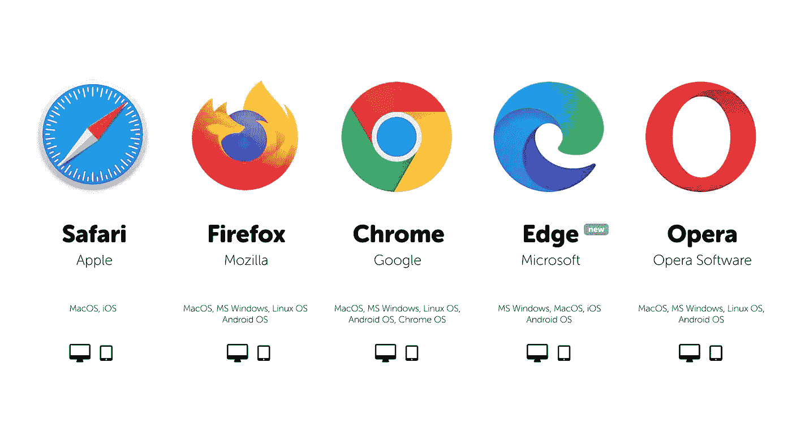

# 在 SwiftUI 应用中打开 URL，让用户更改浏览器。

> 原文：<https://itnext.io/open-urls-in-your-swiftui-app-and-let-the-user-change-the-browser-b0e6a490238d?source=collection_archive---------1----------------------->



**图片来源:互动力量的阐述**

使用 SwiftUI 2，您可以使用新的`Link`结构打开 URL。也可以用`SFSafariViewController`打开应用内的网址。但也许你想给用户选择，如果他想让链接在应用内打开，在 Safari 甚至在其他浏览器如谷歌浏览器，火狐浏览器或 Opera 中打开。

# 浏览器选择

该选择将被保存在`UserDefaults`中。如果你只想给用户两个选项，你可以使用一个`Bool`值，如果你想多次使用`Int`。

对于其他所有浏览器，将此输入`Picker`:

只需将“Google Chrome”替换为浏览器名称，将 URL 替换为浏览器的 URL 类型。你可以在[这个网站](https://ios.gadgethacks.com/news/always-updated-list-ios-app-url-scheme-names-0184033/)上获得应用程序 URL 类型的最新列表。只有在安装了浏览器的情况下才会显示。

# 创建 URL 按钮

我们想让 URL 按钮可重用，所以我们为它创建了一个视图。它有一个`View`和一个`String`作为输入。

要在应用程序中显示链接，您还需要`SFSafariViewController`。只需将它添加到您的项目中。

然后，您只需通过以下方式调用 URL 按钮:

```
URLButton(content: Text("Open link"), url: "https://www.apple.com")
```

对于其他浏览器，在`switch`语句中添加一个`case`和一个新的 URL 变量。

就是这样。现在你可以在你的应用周围使用`URLButton`并给用户更多？

# 显示所有支持的浏览器

到目前为止，当没有安装浏览器时，它不会显示在`Picker`中。我们也可以显示所有浏览器，但是当浏览器没有安装时，你不能选择它，它是灰色的。

只需移除`.tag()`并添加`.secondary`颜色。现在，当点击时，它仍然关闭选取器，但不改变选择-