# OpenShift 服务网格基础—第二部分—控制平面

> 原文：<https://itnext.io/openshift-service-mesh-essentials-part-ii-control-plane-9c76a35936b5?source=collection_archive---------2----------------------->


在第二篇文章中，我们将介绍 OpenShift 服务网格控制平面的准备和部署。您将看到在部署您的服务网格控制平面时使用的不同配置选项，包括您应该如何为生产环境设置它(剧透:这不是默认配置)，以及如何在您的 OpenShift 集群中部署它们。

我将尝试包含比当前官方 [OpenShift 文档](https://docs.openshift.com/container-platform/4.5/welcome/index.html)更多的信息，但本文的大部分内容都可以在那里找到。我将添加一些您可能会觉得有用的屏幕截图和具体示例，我们还将回顾一下运营商在您的集群中安装和配置了什么。

如果您错过了简介，您可以在此回顾服务网格存在的原因，请在此处查看:

[](https://medium.com/@luis.ariz/openshift-service-mesh-essentials-part-i-the-why-and-what-of-it-a3ef09bf8aa8) [## open shift Service Mesh essentials—第一部分—原因和内容

### 在这第一篇文章中，我们将讨论一些关于 OpenShift 服务网格的介绍性问题，包括它的特性…

medium.com](https://medium.com/@luis.ariz/openshift-service-mesh-essentials-part-i-the-why-and-what-of-it-a3ef09bf8aa8) 

或者你也可以直接跳到下面的文章，如果你对那些文章更感兴趣的话:

[](https://luis-javier-arizmendi-alonso.medium.com/openshift-service-mesh-essentials-part-iii-data-plane-341ce477c269) [## OpenShift 服务网格基础—第三部分—数据平面

### 在本文中，我们将通过展示一个应用程序部署来探索 OpenShift 服务网格数据平面…

luis-javier-arizmendi-alonso.medium.com](https://luis-javier-arizmendi-alonso.medium.com/openshift-service-mesh-essentials-part-iii-data-plane-341ce477c269) 

或者开始检查服务网格功能:

[](https://luis-javier-arizmendi-alonso.medium.com/openshift-service-mesh-essentials-part-iv-features-routing-3189dae64615) [## OpenShift 服务网格基础—第四部分—功能:路由

### 了解如何使用高级路由来修改应用程序的行为，而不包括 API 网关或…

luis-javier-arizmendi-alonso.medium.com](https://luis-javier-arizmendi-alonso.medium.com/openshift-service-mesh-essentials-part-iv-features-routing-3189dae64615) 

# OpenShift 服务网格安装和使用与上游 ISTIO 不同吗？

[在本系列文章的第一部分](https://medium.com/@luis.ariz/openshift-service-mesh-essentials-part-i-the-why-and-what-of-it-a3ef09bf8aa8)中，您已经看到了 OpenShift 服务网格如何使用上游 ISTIO 项目作为主要组件。现在，您可能想知道是否有任何定制使安装或使用变得不同。如果您将 OpenShift 服务网格与默认的 ISTIO 上游部署进行比较，就会发现在某些方面存在差异([此处](https://docs.openshift.com/container-platform/4.5/service_mesh/service_mesh_arch/ossm-vs-community.html)您可以找到更多详细信息):

*   安装:上游 [ISTIO 有多种安装方式](https://istio.io/latest/docs/setup/install/)，其中之一是[基于操作员的安装](https://istio.io/latest/docs/setup/install/operator/)，它简化了 ISTIO 部署的生命周期管理。这也是 OpenShift 用来部署服务网格的模式，但是在 ISTIO upstream 中，您使用`istioctl`客户端，而在 OpenShift 中，您将使用[操作员生命周期管理器](https://docs.openshift.com/container-platform/4.5/operators/understanding/olm/olm-understanding-olm.html)和[操作员中心](https://operatorhub.io/)来安装和管理操作员。
*   多租户:默认情况下，上游 ISTIO 部署不是多租户的，尽管您可以按照一些步骤部署它以获得一些软多租户。相比之下，当您在 OpenShift 中部署服务网格时，您将默认获得 ISTIO 的多租户设置，如下所示。
*   Sidecar 注入:Upstream Istio 默认安装会自动将 sidecar 注入到您已标记的项目内的 pod 中，但是 OpenShift 服务网格要求您指定一个注释。这使得精细选择哪些服务将被包括在网格中成为可能。
*   伊斯迪奥·RBAC:OpenShift 服务网格提供了所有上游 RBAC 的可能性，而且通过使用正则表达式扩展了匹配请求头的能力，我们将在开始使用 open shift 服务网格功能时看到这一点。
*   SSL 库:OpenShift 服务网格用 OpenSSL 替换了 BoringSSL。
*   网络配置:Red Hat OpenShift 服务网格包括 CNI 插件，它为您提供了配置应用程序 pod 网络的替代方法。CNI 插件取代了`init-container`网络配置，不再需要授予服务帐户和项目访问安全上下文约束(SCC)的特权。当 Multus 的二级接口被配置时，这个 CNI 插件的使用也有影响，我们将在本系列博客的“数据平面”部分看到。
*   不支持的功能(OpenShift 4.5): OpenShift 服务网格不支持基于 QUIC 的服务和秘密发现服务(SDS)功能的使用。它也不支持包含外部元素(即虚拟机)。

# 如何在 OpenShift 中安装服务网格？

安装 OpenShift Service Mesh 有两种不同的方法:使用 Web 控制台或使用 CLI。在本文中，我们将使用 Web 控制台，但是如果您想查看一些 CLI 提示和技巧，我建议您看一看[“open shift worker nodes 中的安全区域”博客系列](/security-zones-in-openshift-worker-nodes-part-i-introduction-4f85762962d7)。

如果你[还记得第一部分的话，](https://medium.com/@luis.ariz/openshift-service-mesh-essentials-part-i-the-why-and-what-of-it-a3ef09bf8aa8) OpenShift 服务网格包含多个部分，包括 ISITO、Jaeger、Kiali、Prometheus 和 Grafana。

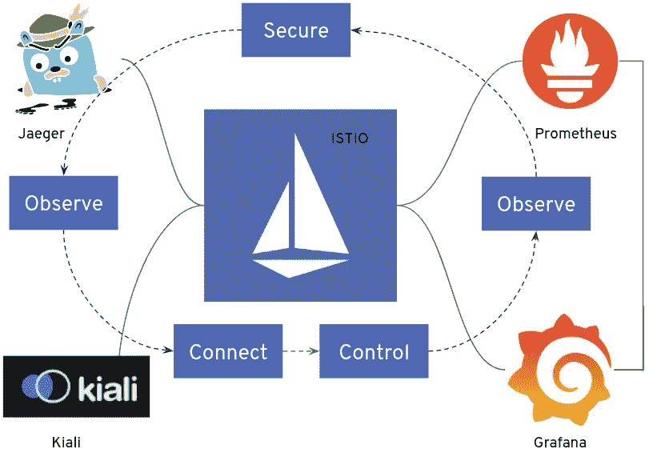

感谢[运营商](https://www.openshift.com/learn/topics/operators)的部署和生命周期管理(即更新)非常容易，而且由于 OpenShift [运营商生命周期管理器](https://docs.openshift.com/container-platform/4.5/operators/understanding/olm/olm-understanding-olm.html)和[运营商中心](https://operatorhub.io/)，用户体验比寻找上游运营商并手动部署它们要好得多。

让我们来看看安装 OpenShift 服务网格的步骤

## 1.安装所需的操作器

在我们的例子中，在 OpenShift 4.5 中(将来可能会被简化)，我们将不得不部署(作为 *cluster-admin* 用户)一些操作符，作为安装 OpenShift 服务网格操作符之前的先决条件。如果您想获得支持，请不要安装“社区”版本的操作系统):

在操作期间保持默认选择的选项。您可能希望选择手动更新，以确保运营商不会升级服务，直到有人手动启动升级，如果您认为这可能意味着更稳定的环境。

1.  Elasticsearch operator:将托管 Jaeger 数据。

> 注意:如果您查看[官方文档](https://docs.openshift.com/container-platform/4.5/service_mesh/v1x/installing-ossm.html#jaeger-operator-install-elasticsearch_installing-ossm-v1x)，其中显示的步骤提到该操作符应安装在 *openshift-operators-redhat 名称空间*中，但是我发现仅在*open shift-operators-red hat*名称空间中安装 elasticsearch 而不是在所有名称空间中安装可能意味着，如果您想要部署 Jaeger 模板“production-elasticsearch”(如下所述)，您将面临 Jaeger 部署的问题，因为 elasticsearch 集群尚未创建(可能是因为控制平面名称空间没有访问权限如果您在所有命名空间中安装此运算符，此问题会消失，但也可以通过安装文档中提到的，但在控制平面命名空间上添加一些额外权限来解决

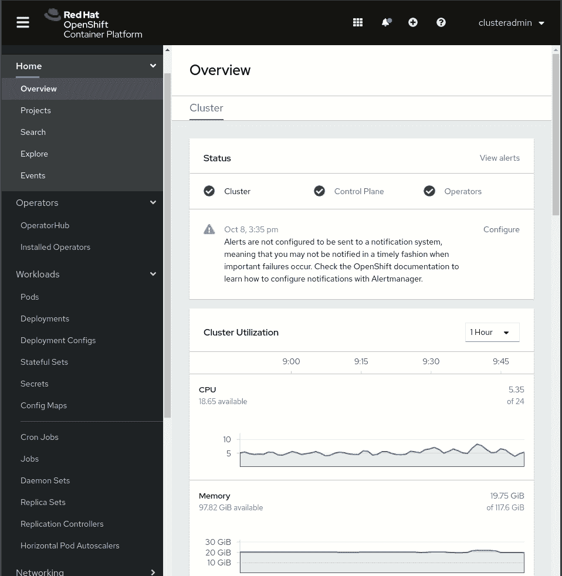

2.耶格操作员:将提供追踪功能。

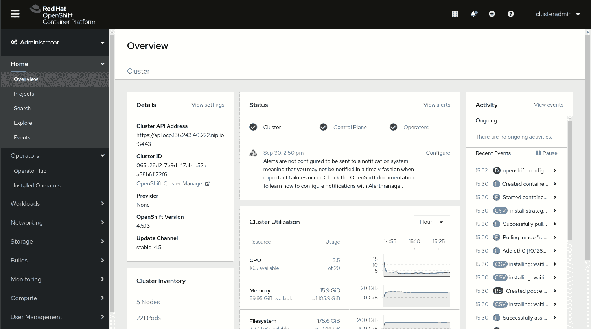

3.Kiali 操作员:将为 ISTIO 系统提供网络控制台。

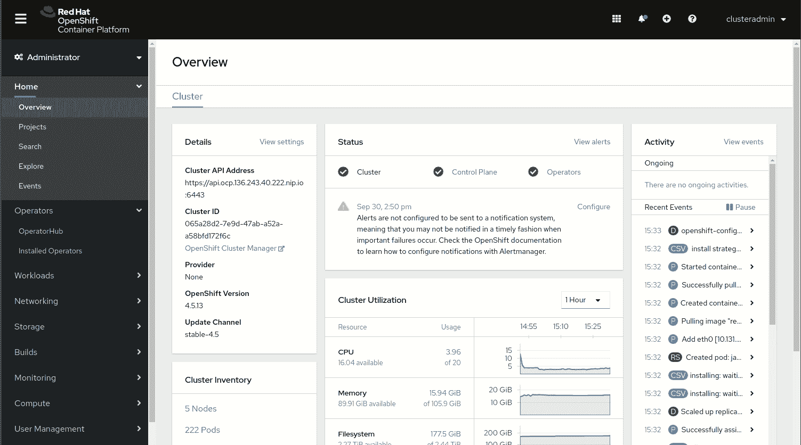

因为必须为所有名称空间安装操作符，所以操作符窗格将位于" *openshift-operators* "名称空间中，您可以检查它们是否已经部署并正在运行:

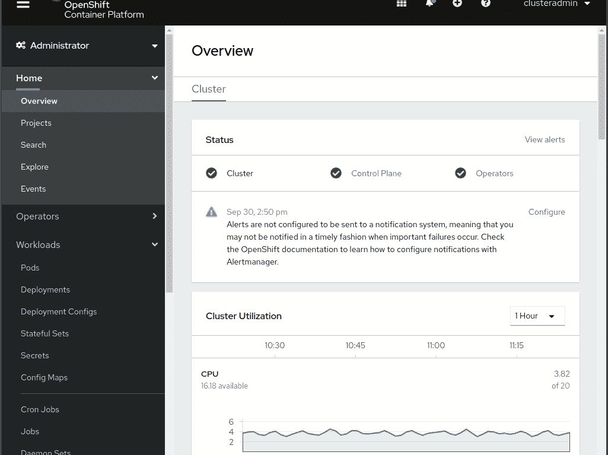

一旦部署了预先需要的操作符，就可以部署 OpenShift 服务网格操作符(缺省值是 OK 的):

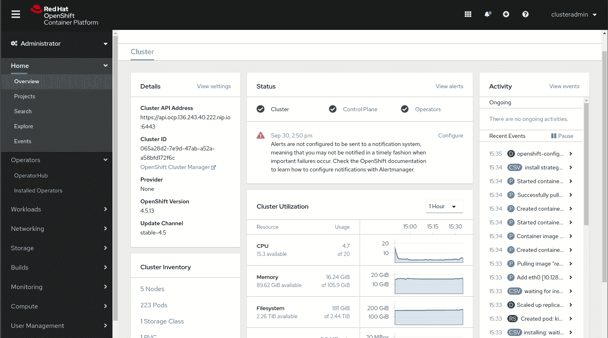

这个 OpenShift 服务网格操作器是从[上游 Maistra 项目](https://maistra.io/)中产品化出来的。操作员配置 ISTIO(和其余组件),这在前面的章节中已经描述过(即多租户部署)

## 2.准备 OpenShift 服务网格控制平面配置

我们已经安装了操作符，但是操作符并不提供他们自己“管理”的服务，操作符提供了[自定义资源定义](https://kubernetes.io/docs/tasks/extend-kubernetes/custom-resources/custom-resource-definitions/)(cdr)来扩展 Kubernetes API，并使得以一种简单的方式部署实际的服务成为可能。

例如，我们已经部署了“Jaeger Operator ”,但我们仍然没有在 OpenShift 集群上运行 Jaeger，我们已经部署了 Openshift 服务网格 Operator，但我们甚至还没有部署任何 ISTIO 控制平面组件。

在这里，我们有一些好消息，你不必使用他们的运营商逐个部署服务(Elasticsearch，Jaeger，Kiali，Prometheus，Grafana，ISTIO)，你只需部署一个“服务网格”控制平面，一切都会自动完成。

在部署服务网格控制平面之前，仍然有两个先决条件必须满足。

第一个是您必须创建一个 OpenShift 项目(Kubernetes 名称空间),您将在其中部署 pod。在大多数 OpenShift 文档中，您会发现项目被命名为“istio-system ”,但是您可以在任何项目中部署控制平面。

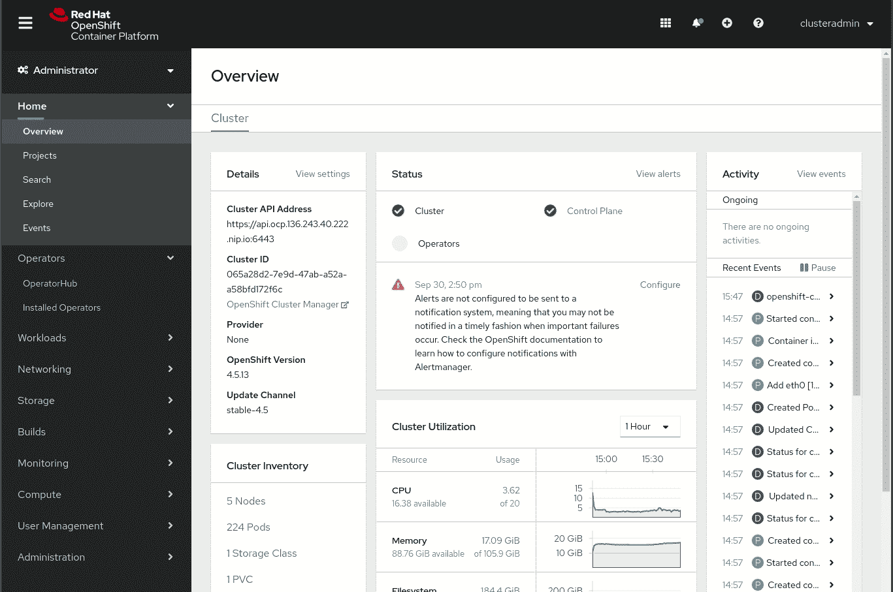

> 注意:如果您计划安装多个控制平面，您需要考虑到每个名称空间/项目只能部署一个 OpenShift 服务网格控制平面。在我们的示例中，我们将使用两个控制平面，因此我还创建了第二个名称空间“istio-system-b”来托管第二个名称空间。

第二个先决条件是您需要控制平面配置。

当您尝试部署 OpenShift 服务网格控制平面时，您将看到一个默认的"*基本-安装* " *服务网格控制计划*对象(旨在用作实验室环境，而非生产环境)。如果您想查看此配置，您可以执行控制面板安装步骤，但…无需按“创建”按钮。

请注意，如果您这样做了，您会发现默认情况下表单视图(从 OpenShift 4.5 开始)是在配置中进行一些更改的一种简单方法，但遗憾的是并没有显示所有选项，因此您需要更改为 YAML 视图:

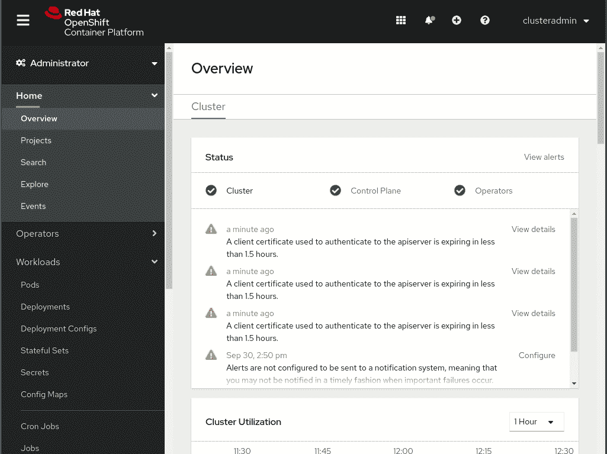

您可以使用尝试部署控制面板时出现的默认配置(用于实验室，而不是我们将看到的生产)，但在这里，我们将探索一些我们可以使用的选项。

关于“默认”概念的一个注意事项。这个“*基本安装*”默认对象并不强制执行与操作符相同的“默认值”，这意味着，对于某些值，如果您不包含任何配置，您会发现操作符的默认值(因此在这种情况下会使用的值)与您在“*基本安装*”默认对象中找到的值不同。 例如， *traceSampling* 变量默认为 1(运算符)，但在您尝试部署控制平面时发现的“ *basic-install* ”默认对象中为 100。

在本文中，当我提到“默认值”时，我指的是操作符默认值，而不是"*basic-install*"*ServiceMeshControlPlane*对象，您可以在下面找到它的配置(OpenShift 4.5)，您将看到它如何覆盖一些 Maistra 操作符默认值:

```
apiVersion: maistra.io/v1
kind: ServiceMeshControlPlane
metadata:
  name: basic-install
  namespace: <selected namespace>
spec:
  version: v1.1
  istio:
    gateways:
      istio-egressgateway:
        autoscaleEnabled: false
      istio-ingressgateway:
        autoscaleEnabled: false
        ior_enabled: false
    mixer:
      policy:
        autoscaleEnabled: false
      telemetry:
        autoscaleEnabled: false
    pilot:
      autoscaleEnabled: false
      traceSampling: 100
    kiali:
      enabled: true
    grafana:
      enabled: true
    tracing:
      enabled: true
      jaeger:
        template: all-in-one
```

关于操作变量，您可以[查看文档](https://docs.openshift.com/container-platform/4.5/service_mesh/service_mesh_install/customizing-installation-ossm.html#customize-installation-ossm)中所有支持的值。我将使用您可以在该文档中找到的相同结构，浏览不同的部分，但我会尝试澄清一些变量。

**全局**

默认值(Maistra 1.1):

```
...
istio:
  global:
    disablePolicyChecks: true
    policyCheckFailOpen: false
    hub: registry.redhat.io/openshift-service-mesh/
    tag: 1.1.0
    proxy:
      resources:
        requests:
          cpu: 10m
          memory: 128Mi
        limits:
          cpu: 2000m
          memory: 1024Mi
    mtls:
      enabled: false
...
```

*   禁用策略检查

该参数启用/禁用[混合器的策略执行](https://istio.io/latest/docs/reference/config/policy-and-telemetry/)。正如我们在[这个博客系列的第一部分](https://medium.com/@luis.ariz/openshift-service-mesh-essentials-part-i-the-why-and-what-of-it-a3ef09bf8aa8)中所评论的，在新的 ISTIO 架构中，Mixer 被弃用，Mixer 提供的功能被转移到了 Envoy 代理中。虽然 Maistra 1.x 尚未部署 Istiod 和新架构(这将由 2.0 版完成，可能会与 OpenShift 4.6 保持一致)，但政策和遥测功能的变化已在一段时间前开始。

如果您查看与最新版本上的上游策略特性相关的[上游文档，您将会看到其中一些是如何被“否决”的。如果你输入其中的任何一个，你会看到新推荐的方式来提供相同的功能，但使用特使而不是混合器。请记住，Maistra 部署的 ISTIO 版本不是最后一个，因此如果您检查上游文档，您应该](https://istio.io/latest/docs/tasks/policy-enforcement/)[检查正确的 ISTIO 版本](https://archive.istio.io/)，而不是最新的版本。

如果您想了解正在安装的 Maistra 版本中包含的 ISTIO 版本，您需要查看 OpenShift 发行说明。[您可以在这里找到 OpenShift 4.5 和 Maistra 1.1.9 版本](https://docs.openshift.com/container-platform/4.3/service_mesh/servicemesh-release-notes.html#component-versions-included-in-red-hat-openshift-service-mesh-version-1-1-9)的示例。如您所见，对于 Maistra 1.1.9，ISTIO 版本为 1.4.10，因此您应该查看 [ISTIO 1.4 上游文档](https://istio.io/v1.4/docs/)。在这里，您可以看到[您仍然可以使用基于 Mixer](https://istio.io/v1.4/docs/tasks/policy-enforcement/) 的“旧”策略特性。我们将在另一篇文章中讨论这个概念，并且我们将看到如果我们想要使用这个特性，我们必须如何[启用它。](https://maistra.io/docs/troubleshooting/troubleshooting_policy/)

*   policyCheckFailOpen

如 OpenShift 文档中所述，此参数指示当无法到达混合器策略服务时，是否允许流量通过特使边车。默认值为 false，这意味着当客户端无法连接到 Mixer 时，流量被拒绝。

*   中心

如果您计划在自己的注册表中托管 ISTIO 映像，请考虑此参数，例如，[您可以在此处检查，](https://access.redhat.com/articles/4740011)服务网格运营商支持[断开环境](https://docs.openshift.com/container-platform/4.5/operators/admin/olm-restricted-networks.html)，在这些情况下，注册表将是本地的，而不是在线默认注册表 *quay.io* 。

*   标签

与“hub”变量相关，“tag”将用于了解从注册表中提取哪些 ISTIO 容器图像。

*   imagePullSecret(默认情况下不设置)

与“hub”变量相关，如果注册表已经用凭证保护，您可以在这里分配拉秘密。你必须在这一个中使用它:

```
...
istio:
  global:
...
    imagePullSecrets:
      - MyPullSecret
...
```

如果你想了解更多关于如何在 OpenShift 中使用拉取密码的信息，你可以查看文档。

*   代理人

这是一个小节，包含了特使代理的一些配置，更具体地说，您可以在 sidecar 容器中包含 [(Kubernetes)请求以及 CPU 和内存的限制](https://kubernetes.io/docs/tasks/configure-pod-container/quality-service-pod/)。

*   mtls

如果设置为“true ”,将在您的所有网格中强制执行相互传输层安全性(mTLS)通信。如果您的工作负载不与网格外部的服务通信，这是一种启用 mTLS 的简单方法(否则，您的通信将会中断，因为它将只接受加密连接)。如果您想微调 mTLS 在您的网格中的使用位置，您可以将该变量保持为“false ”,并为每个服务或名称空间配置 mTLS 的使用(在后续文章中可以看到)。

**网关**

默认值(Maistra 1.1):

```
...
istio:
...
  gateways:
       istio-egressgateway:
         autoscaleEnabled: true
         autoscaleMin: 1
         autoscaleMax: 5
       istio-ingressgateway:
         autoscaleEnabled: true
         autoscaleMin: 1
         autoscaleMax: 5
         ior_enabled: false
...
```

*   istio-egressgateway

在这里，您可以找到一个开关(*autoscalenabled*)来启用/禁用自动缩放，以及两个附加变量来设置此控制平面的最大和最小网关数量。

*   istio-Ingres 网关

与 istio-egressgateway 中的相同，外加一个变量来启用/禁用 IOR 特性。IOR 是 Maistra 控制平面的一个组件，它将 Istio 网关与 OpenShift 路由同步，当我们在后续文章中讨论这个路由同步时，会更好地理解这一点。

在过去，它是默认启用的，但由于一些问题，它被禁用。现在这些问题都消失了，但是默认特性仍然是禁用的。

> 注意:还有更多(不太常见的)配置选项将在本系列的下一篇文章中与数据层一起讨论。

**混合器**

默认值(Maistra 1.1):

```
...
istio:
...
  mixer:
    enabled: true
    policy:
      autoscaleEnabled: true
      autoscaleMin: 1
      autoscaleMax: 5
    telemetry:
      autoscaleEnabled: true
      autoscaleMin: 1
      autoscaleMax: 5
      resources:
        requests:
          cpu: 10m
          memory: 128Mi
        limits:
          cpu: 4800m
          memory: 4G
...
```

*   使能够

您可以使用该变量完全禁用混音器，包括指标(请记住，我们讨论的是带有发布版本< 2.0, as you find in OpenShift 4.5 and previous releases, where a new architecture without Mixer will be deployed)

*   policy

You can enable/disable the autoscaling of the policy component of Mixer as we mentioned above while reviewing the defaults.

*   telemetry

Aside from enabling/disabling the autoscaling, you can also setup the QoS (requests/limits) for the telemetry Mixer containers.

**pilot** 的 Maistra 操作符

默认值(Maistra 1.1):

```
...
istio:
...
  pilot:
    resources:
      requests:
        cpu: 10m
        memory: 128Mi
    autoscaleEnabled: true
    traceSampling: 1.0
...
```

*   资源

您可以通过 Pilot PODs 设置所需的 CPU 和内存。

*   自动缩放启用

启用/禁用先导组件的自动缩放。

*   示踪取样

分布式跟踪使用户能够通过分布在多个服务中的网格来跟踪请求。这允许通过可视化更深入地理解请求延迟、序列化和并行性。Istio 利用 [Envoy 的分布式跟踪](https://www.envoyproxy.io/docs/envoy/v1.12.0/intro/arch_overview/observability/tracing)功能提供开箱即用的跟踪集成(Maistra 部署 Jaeger 作为跟踪后端，在那里收集这些跟踪)。

您需要从您的流量中获取跟踪，使用此参数，您可以决定从中获取多少样本。OpenShift 服务网格默认值中的“*基本安装*”ServiceMeshControlPlane 默认对象为 100(而实际的 Maistra 默认值为 1.0)，这意味着对 100%的流量进行采样。这对于开发或测试来说非常好，但在某些情况下(生产环境)，可能会发现收集了“太多的数据”(不仅要考虑存储，还要考虑 Envoy 代理消耗的 CPU 资源)，这也是为什么不将这个"*basic-install*" ServiceMeshControlPlane 默认对象用于生产的另一个原因。

**基亚利**

默认值(Maistra 1.1):

```
...
istio:
...
  kiali:
    enabled: true
    dashboard:
      viewOnlyMode: false
    ingress:
      enabled: true
...
```

*   使能够

切换到启用/禁用 ISTIO 安装的 Web 用户界面。

*   仪表盘

Kiali 不仅“显示”当前配置和您的 ISTIO 服务网格中正在发生的事情，它还提供允许更改一些 ISTIO 特定配置的功能。Maistra 提供了一个变量 *viewOnlyMode* 使这些特性被禁用，但是在 OpenShift(至少在当前版本中)中，由于 kiali 与 OpenShift SSO 集成在一起，用户权限会覆盖 Kiali 提供的权限，因此用户将始终能够修改他们有权访问的对象。

默认情况下，仪表板下还有两个额外参数没有设置。

第一个是“grafanaURL”变量。Kiali 可以自动检测 Grafana URL，但是如果您有自定义的 Grafana 安装，您可以使用此变量设置 URL 值，例如:

```
...
istio:
...
  kiali:
...
    dashboard:
      viewOnlyMode: false
 **grafanaURL:  "https://grafana-istio-system.ocp.domain.com"**
...
```

与 grafana 的情况一样，您也可以设置一个自定义 Jaeger，并通过添加 jaegerURL 变量将 URL 包含在 Kiali 中:

```
...
istio:
...
  kiali:
...
    dashboard:
      viewOnlyMode: false
 **jaegerURL: "http://jaeger-query-istio-system.ocp.domain.com"**
...
```

*   进入

当您部署 Kiali 时，默认情况下会创建一个 OpenShift 路由，以便从 OpenShift 集群外部访问 Kiali，但是您可以通过设置 *enabled=false* 来禁用此元素创建，这样 Kiali 将被安装，但它只能通过内部服务使用。

**格拉夫纳**

默认值(OpenShift 4.5):

```
...
istio:
...
  grafana:
     enabled: true
...
```

*   使能够

启用/禁用 Grafana 的自动部署。理论上，您可以将此设置为禁用，并部署您自己的 Grafana 架构，然后将其与服务网格集成。但是如果您启用此选项，操作员会为您完成。

**追踪**

默认值(Maistra 1.1):

```
...
istio:
...
  tracing:
    enabled: true
    ingress:
      enabled: true
    jaeger:
      template: all-in-one
...
```

*   使能够

您可以启用/禁用跟踪功能。

*   进入

正如在 Kiali 一节中，您会发现这个变量使得不创建从 OpenShift 集群外部访问 Jaeger 的 OpenShift 路径成为可能

*   贼鸥

这里我们有两个部署选项，默认的`all-in-one`为 Jaeger 使用内存存储，另一个`production-elasticsearch`选项旨在用于生产(这是唯一支持的在生产中部署它的方式)。

如上所述，默认使用`all-in-one`模板，这样可以使用最少的资源完成安装(如果您正在部署一个生产环境，请记住更改这一点)。

在 Jaeger 部分，如果您将默认的" *all-in-one"* 模板更改为"*production-elasticsearch*"，您还可以在 elasticsearch 部分配置一些参数，在这里您可以定制相关的 elastic search 部署。您可以为 elasticsearch PODs 设置节点数(默认为 1，但对于生产，您需要将其设置为 3，用于 HA)或 QoS(对于生产用途，您应该为每个 Pod 默认分配不少于 16Gi，但最好尽可能多分配，每个 Pod 最多 64Gi 和至少 1 个 CPU)，这是一个带有默认参数的示例

```
...
istio:
...
  tracing:
    enabled: true
    ingress:
      enabled: true
    jaeger:
      template: production-elasticsearch
      elasticsearch:
        nodeCount: 1
        resources:
          requests:
            cpu: "500m"
            memory: "1Gi"
          limits:
            cpu: ""
            memory: ""
...
```

**3 刻度 ISTIO 适配器**

我们不会在这一系列文章中涉及它，但[它确实存在一个用于 3SCALE](https://docs.openshift.com/container-platform/4.5/service_mesh/threescale_adapter/threescale-adapter.html) 的适配器，允许您将 OpenShift 服务网格与 [3scale API 管理解决方案](https://www.redhat.com/en/technologies/jboss-middleware/3scale)集成。您可以在控制平面配置描述符的“ *threeScale* ”部分设置所需的参数。

**sidecarInjectorWebhook**

如果您计划将 Multus 与服务网格一起使用，您会发现还有一个额外的配置很有用(请记住，Multus 接口将在服务网格之外)。

当您想在使用 Multus 的 pod 中包含额外的接口时，您将需要添加一个注释，但是这些注释不会被 automatic Envoy sidecar injector 保存，它会用自己的注释覆盖它们。如果您想将该值与边车注射器引入的新注释一起保留，您可以通过将`injectPodRedirectAnnot=true`变量添加到您的控制平面配置中来实现。

```
...
spec:
  istio:
    sidecarInjectorWebhook:
      injectPodRedirectAnnot: true
...
```

## 3.部署 OpenShift 服务网格控制平面

现在我们准备创建我们的控制平面。正如您将在下面看到的，我们将部署两个不同的控制平面，但是，为什么您希望在您的群集中有多个控制平面呢？嗯，您可能需要不同的人群，使用不同的控制平面配置，或者您可能只需要额外的多租户级别，因为在这种情况下，您还将拥有两个不同的数据平面，因此您将能够完全隔离这些流量。您可以在下面找到我们将要部署的两种控制面板配置。

第一个控制平面(*“控制平面-A”*)将部署在项目“ *istio-system* ”中，而*“控制平面-B”*将托管在项目“ *istio-system-b* ”中(请记住，您不能在同一个项目/命名空间中安装两个不同的控制平面)，正如您在对象描述符的命名空间分配中看到的那样。看一下预览文章，其中解释了每个配置变量。

*控制平面-A:*

```
apiVersion: maistra.io/v1
kind: ServiceMeshControlPlane
metadata:
  name: controlplane-A
  namespace: istio-system
spec:
  version: v1.1
  istio:
    global:
      proxy:
        resources:
          requests:
            cpu: 20m
            memory: 200Mi
          limits:
            cpu: 3000m
            memory: 2048Mi
    gateways:
      istio-egressgateway:
        autoscaleEnabled: true
        autoscaleMin: 1
        autoscaleMax: 3
      istio-ingressgateway:
        autoscaleEnabled: true
        autoscaleMin: 2
        autoscaleMax: 3
        ior_enabled: true
    pilot:
      traceSampling: 10.0    
    sidecarInjectorWebhook:
      injectPodRedirectAnnot: true
    tracing:
      jaeger:
        template: production-elasticsearch
        elasticsearch:
          nodeCount: 1
          resources:
            requests:
              cpu: "500m"
              memory: "1Gi"
            limits:
              cpu: "1000m"
              memory: "2Gi"
```

默认值有一些变化:

*   网关的自动缩放以及最小值和最大值已启用。我还包括至少两个入口网关
*   IOR 设置也已启用
*   特使代理的 QoS 已配置
*   追踪取样增加到 10%
*   边车注射器将保持多点注释
*   jaeger template 将使用一个 elasticsearch 集群(但只有一个节点),其中我们还设置了一些 QoS 设置。

*控制平面-B:*

```
apiVersion: maistra.io/v1
kind: ServiceMeshControlPlane
metadata:
  name: controlplane-B
  namespace: istio-system-b
spec:
  version: v1.1
  istio:
    global:
      disablePolicyChecks: false
    gateways:
      istio-egressgateway:
        autoscaleEnabled: false
      istio-ingressgateway:
        autoscaleEnabled: false
        ior_enabled: false
    mixer:
      policy:
        autoscaleEnabled: false
      telemetry:
        autoscaleEnabled: false
    pilot:
      autoscaleEnabled: false
      traceSampling: 100  
    kiali:
      enabled: true
      dashboard:
        viewOnlyMode: false
    grafana:
      enabled: false
    tracing:
      ingress:
        enabled: true
      jaeger:
        template: all-in-one
```

在此控制面板(将安装在 istio-system-b 命名空间中)中，我们更改了这些默认值:

*   将 disablePolicycheck 设置为 false
*   Kiali *viewOnlyMode* 已启用，因此我们检查该变量是否会影响 OpenShift 4.5 中的 Kiali 部署
*   格拉夫纳残疾人
*   从集群外部访问它的 Jaeger OpenShift 路径不会自动生成

你如何部署控制平面？使用安装 OpenShift 服务网格操作符时创建的 CRD 对象。在本例中，您将看到我如何删除默认的“基本安装”对象并粘贴我们的配置:

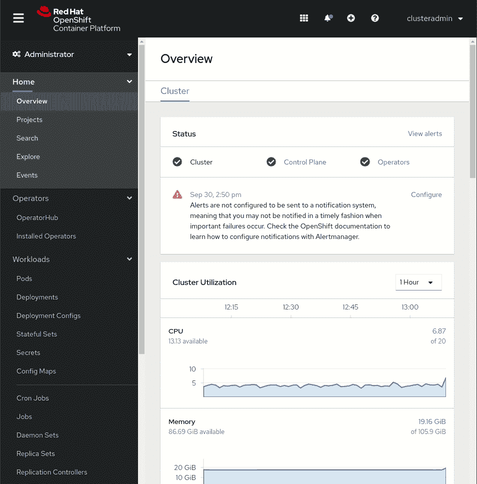

但是要考虑到，因为我们在配置描述符中有所有信息(甚至包括名称空间)，所以我们可以只使用顶栏上的“+”符号来创建对象。这里是第二个控制平面的示例:

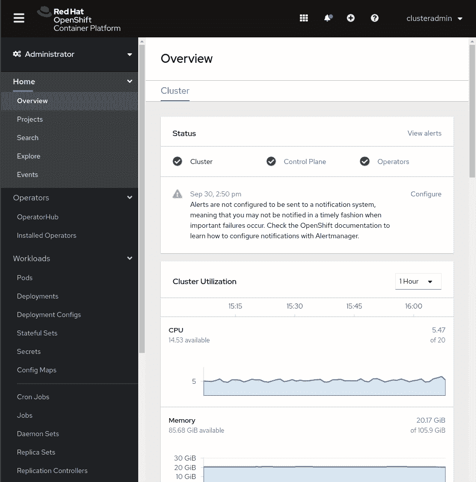

当您创建 ServiceMeshControlPlane 时，实际的 OpenShift 服务网格控制平面已部署，您可以检查是否在创建后立即移动到部署控制平面的命名空间上的窗格列表:

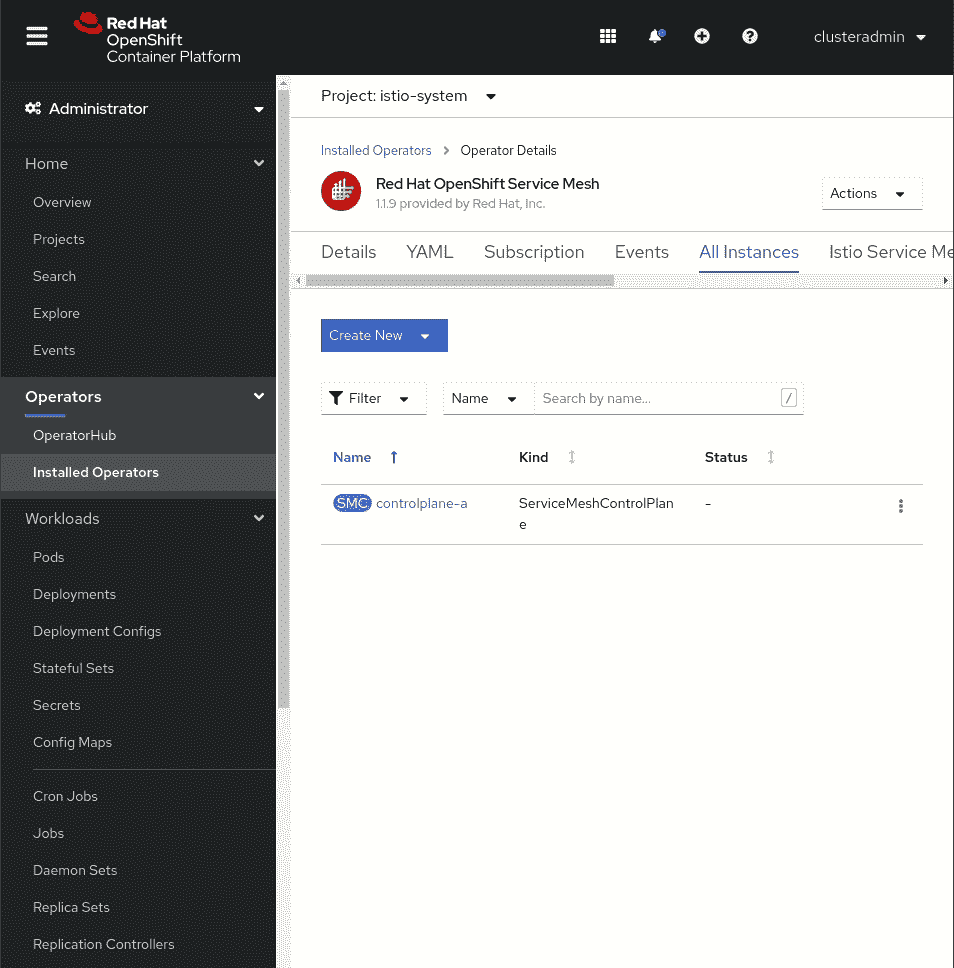

## 4.创建 OpenShift 服务网格成员卷

使用 OpenShift，您不必安装单个集群范围的 Istio 服务网格，您可以根据需要部署任意多的控制平面，因此您需要一种方法来将不同的项目/名称空间分配给“正确的”服务网格。在 OpenShift 中，我们使用由服务网格操作符创建的*ServiceMeshMemberRoll*CRD 对象来实现。

为了使用它，您必须在与`ServiceMeshControlPlane`相同的项目中创建一个名为`default`的`ServiceMeshMemberRoll`资源，并在其中包含相关的项目。对于我们的示例，我创建了四个项目，其中两个将被分配给控制平面 A(项目-A1 和项目-A2)，另外两个将被分配给控制平面 B(项目-B1 和项目-B2)。

这些是您应该为这样的配置创建的`ServiceMeshMemberRoll`资源(您可以使用上面显示的“+”方法部署它们)(注意“名称空间”和“成员”):

```
apiVersion: maistra.io/v1
kind: ServiceMeshMemberRoll
metadata:
  name: default
  namespace: istio-system
spec:
  members:
    - project-a1
    - project-a2
```

和

```
apiVersion: maistra.io/v1
kind: ServiceMeshMemberRoll
metadata:
  name: default
  namespace: istio-system-b
spec:
  members:
    - project-b1
    - project-b2
```

在开始回顾我们已经部署的内容之前，需要注意的是，前面所有的步骤都是由具有集群管理权限的用户执行的，但是有时让不具有集群范围管理权限的项目管理员将他们的项目包含/排除到特定的服务网格中是很有用的。OpenShift 通过执行以下步骤实现了这一点:

1.  将`mesh-user`角色添加到服务网格控制平面名称空间(*控制平面的*istio-system*-示例*的*)中，以添加到您想要授予此功能的项目管理员用户(在此示例中为 user1)*

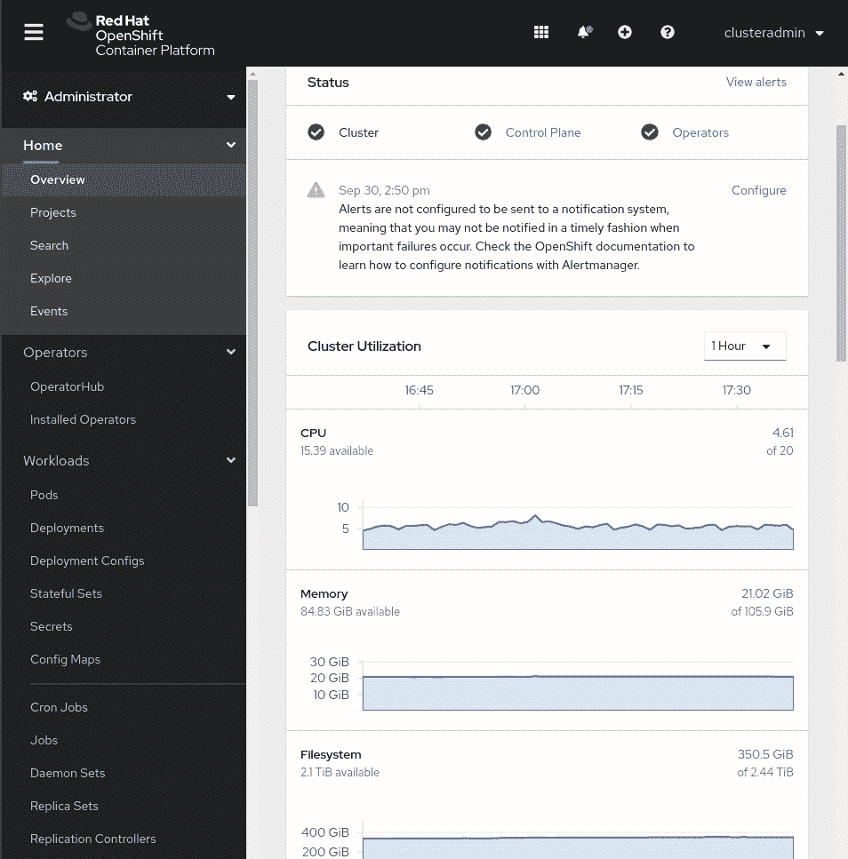

2.然后，无特权用户(检查右上角)可以创建一个`ServiceMeshMember`对象，该对象将在特定控制平面(用户仍然没有访问权)中执行`ServiceMeshMemberRoll`的自动升级。继续我们的示例，用户 1 将创建一个新项目，并将其包含到控制面板 a 中

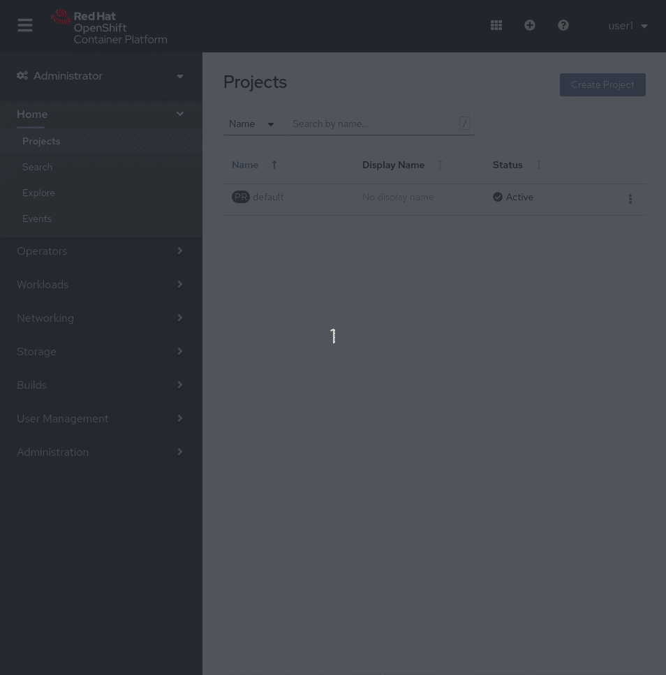

如果您尝试使用不具有网格用户角色的用户(步骤 1)或在不同的服务网格控制平面中创建这样的对象，您将会得到以下错误:

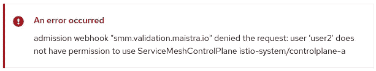

您可以检查(使用 cluster-admin 用户)该项目是否已经包含在`ServiceMeshMemberRoll`中，即使 user1 没有“直接”权限来更改它:

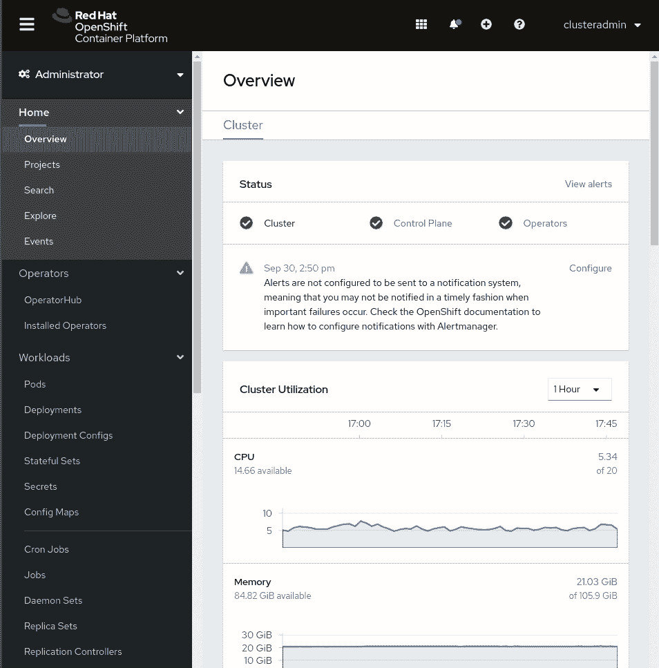

# 检查控制面板安装

让我们回顾一下创建对象时操作员执行的资源和一些集群配置，比较两个控制平面。

**Istio 控制平面**

如果您检查用于托管服务网格控制平面的任何名称空间(在我们的示例中是 istio-system 或 istio-system-b ),您将看到创建运行 istio 控制平面组件的 pod 的部署对象:

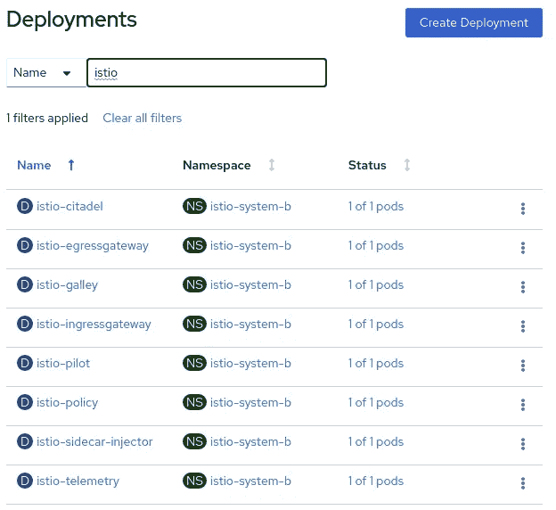

如果您[还记得第一篇文章](https://medium.com/swlh/openshift-service-mesh-essentials-part-i-the-why-and-what-of-it-a3ef09bf8aa8)中的 ISTIO 控制平面(在 ISTIO 1.5 之前，由 Maistra 在 2.0 之前的版本中部署)有几个组件，让我们试着将它们与上面显示的部署相匹配:

*   城堡: *istio-citadel*
*   试点: *istio-pilot*
*   图库: *istio-gallery*
*   Mixer:它有两个主要职责，访问控制策略管理和遥测数据收集，这些职责被分成两个不同的部署: *istio-policy* 和 *istio-telemetry*

还有两个额外的部署:

*   *istio-sidecar-injector* 他将使用部署对象中的注释在 pod 中注入 sidecar 代理，我们将在下一篇文章中看到
*   *istio-Ingres gateway*和 *istio-egressgateway* 将创建入口和出口网关。

考虑到为了 Istio 正常工作，进入网格的流量必须总是通过入口网关，因此进入的流量应该到达服务网格控制平面名称空间(即 istio-system)进入网络网格，独立于我们部署服务的名称空间(即项目-a1)。为了发布该入口网关，运营商还在控制平面名称空间中自动创建服务和开放移位路由:

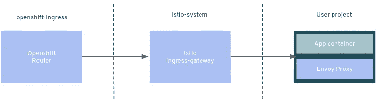

你还记得在位于 *istio-system* 名称空间的控制平面中，我们至少配置了两个入口网关吗？，您可以检查操作员如何配置了两个*istio-Ingres gateway*部署的副本:

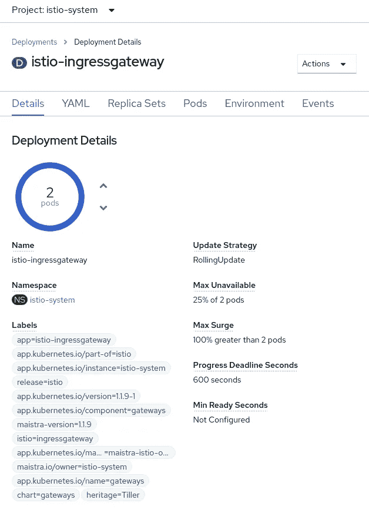

除了这些部署，在我们部署的启用了 IOR 路由同步的控制平面中，还有一个额外的部署(名称为 *ior* )来创建负责此类同步的 POD

**Istio CNI 插件**

如这里的[所解释的](https://istio.io/latest/docs/setup/additional-setup/cni/)，*默认情况下，Istio 在网格中部署的 pod 中注入一个* `*initContainer*` *，* `*istio-init*` *。* `*istio-init*` *容器设置去往/来自 Istio 边车代理的 pod 网络流量重定向。这要求将 pod 部署到网格的用户或服务帐户拥有足够的 Kubernetes RBAC 权限来部署具有* `[*NET_ADMIN*](https://kubernetes.io/docs/tasks/configure-pod-container/security-context/#set-capabilities-for-a-container)` [*和*](https://kubernetes.io/docs/tasks/configure-pod-container/security-context/#set-capabilities-for-a-container) `[*NET_RAW*](https://kubernetes.io/docs/tasks/configure-pod-container/security-context/#set-capabilities-for-a-container)` [*功能*](https://kubernetes.io/docs/tasks/configure-pod-container/security-context/#set-capabilities-for-a-container) *的* [*容器。要求 Istio 用户具有提升的 Kubernetes RBAC 权限对于一些组织的安全合规性来说是有问题的。Istio CNI 插件是* `*istio-init*` *容器的替代品，它执行相同的网络功能，但不要求 Istio 用户启用提升的 Kubernetes RBAC 权限。*](https://kubernetes.io/docs/tasks/configure-pod-container/security-context/#set-capabilities-for-a-container)

OpenShift 服务网格使用 Istio CNI 插件，该插件由服务网格操作者通过在部署服务网格操作者的名称空间中创建 DaemonSet ( `*istio-node*`)而部署在每个节点中(在我们的例子中是 openshift-operators，因为操作者是在集群范围内部署的)

这个插件负责操作节点中的 iptables 路由规则，这些节点是用 Envoy sidecar 容器注入的。

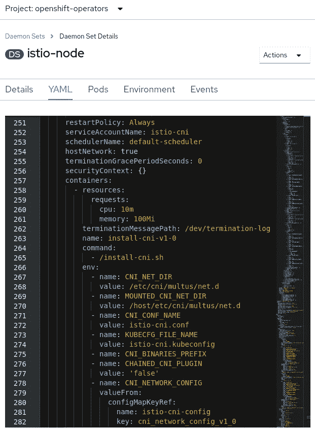

**命名空间网络配置**

服务网格操作符还在作为网格一部分的每个项目中创建一个`NetworkAttachmentDefinition`对象。`NetworkAttachmentDefinition`是一个定制资源，它将第二层暴露给一个特定的名称空间，在本例中是 ISTIO CNI。

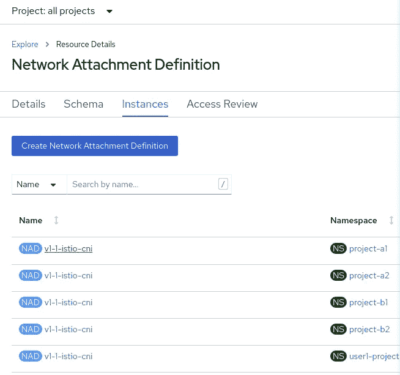

操作员还在每个成员项目中创建`NetworkPolicy`对象(如果您从服务网格中删除一个成员，这个`NetworkPolicy`资源也将从项目中删除)。每个名称空间创建两个`NetworkPolicy`对象:

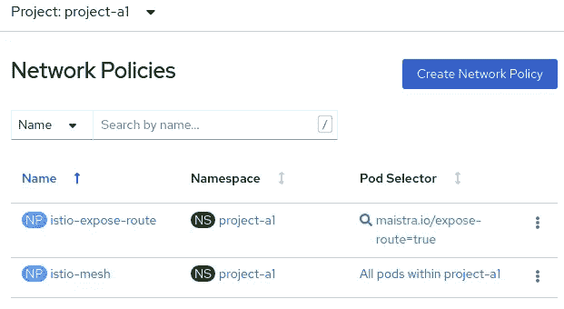

`istio-mesh`策略只允许进入该服务网格控制平面的成员项目的流量(使用标签*maistra.io/member-of: istio-system*的名称空间)。

```
...
spec:
  podSelector: {}
  ingress:
    - from:
        - namespaceSelector:
            matchLabels:
              maistra.io/member-of: istio-system
  policyTypes:
    - Ingress
```

如果需要从非成员项目直接进入(不通过入口网关)PODs，您需要创建一个`NetworkPolicy`来允许该流量，但是请记住，您应该通过入口网关来确保 ISTIO 按预期工作。

网络策略强制将对网格中的服务的直接访问限制到作为同一控制平面成员的命名空间上的 pod，例如 *project-a2* 是控制平面 *controlplane-a* 的成员，该控制平面部署在 *istio-system* 命名空间中:

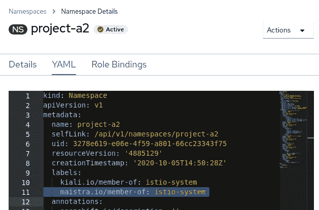

ISTIO 入口网关还需要直接访问部署在网格上的服务，因此可以想象，控制平面名称空间也包含此标签:

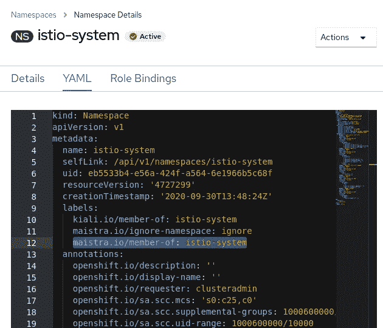

还有一个`istio-expose-route`网络策略:

```
...
spec:
   podSelector:
    matchLabels:
      maistra.io/expose-route: 'true'
   ingress:
    - from:
        - namespaceSelector:
            matchLabels:
              network.openshift.io/policy-group: ingress
   policyTypes:
    - Ingress
```

它仅适用于标签为*maistra.io/expose-route:“真”*的 pod，并且对于允许需要在服务网格登记的名称空间内部署并且必须使用标准路由发布的非网格服务(并且不通过允许的业务流的 ISTIO 入口网关)是有用的。

如果您需要在服务网格之外的名称空间中部署一个服务，您应该用标签`maistra.io/expose-route: "true"` 来标记它的部署，以确保 OpenShift 容器平台到这些服务的路由仍然工作。尽管如此，请记住，最佳实践是将服务部署到网格外部的独立名称空间中，这些名称空间不在任何网格中。我们将在以后的文章中回顾一个例子，这样可能会更好理解。

**吉利**

如果没有在控制平面配置中禁用 Kiali，则由服务网格运营商使用部署对象来部署它。运营商还在控制平面命名空间中创建一个 OpenShift 路由(如果您没有在控制平面配置中禁用 Kiali 入口),该路由向群集外部公开:

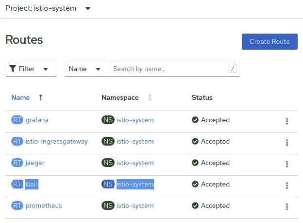

如您所见，Kiali 部署了 SSO 集成，您可以使用 OpenShift 凭证来访问:

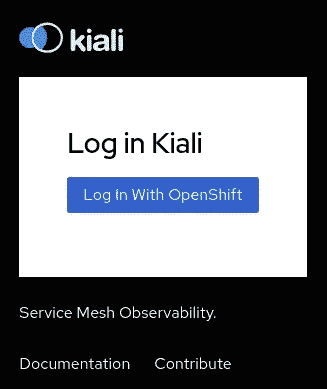

在这个特定的设置中，我发现了我们两个服务网格部署之间的差异。我们部署了一个使用 Jaeger 模板`all-in-one`的控制面板和另一个使用`production-elasticsearch`的控制面板，我注意到在 Kiali 中，直接访问 Jager 控制台(查看下面的截图，你会在左侧看到一个名为“分布式跟踪”的链接)只出现在`all-in-one` 安装中。

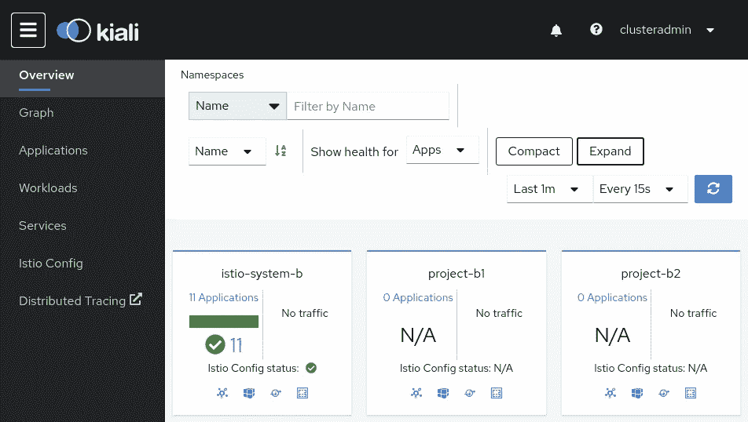

没问题！，你还记得有一个控制平面配置选项，我们可以包括 Jaeger 的网址吗？我们可以获取 Jaeger route(您将在控制平面名称空间中找到它， *istio-system* )并在控制平面描述符的 Kiali 部分下添加配置选项(JaegerURL):

> 注意:确保您的更改在规格> istio>kiali 下，而不是在状态>最后应用配置> istio>kiali 下，否则配置不会被保存

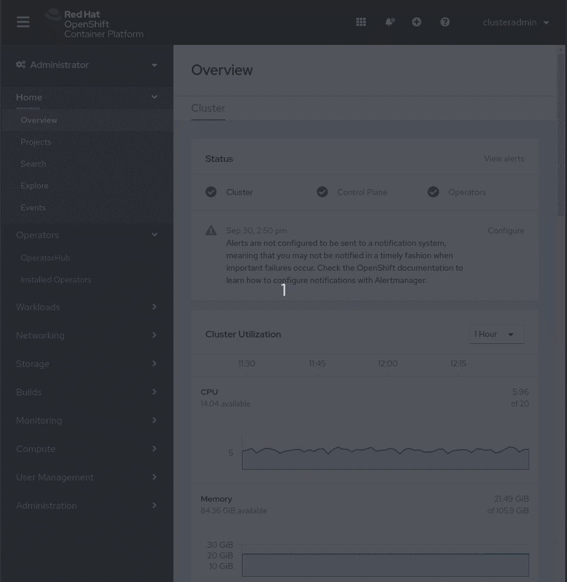

一段时间后(你需要等一会儿)，你会发现从 Kiali 到你的 Jaeger 控制台的直接访问也是由那个控制平面部署的。

为了测试 *viewOnlyMode* 参数对用户可以从 Kiali 修改的内容没有实际影响，您可以打开我们尝试启用这种“仅查看”模式的控制平面的 Kiali UI，然后尝试修改一个对象(在这种情况下，我已经创建了一个网关对象，这将在下一篇文章中针对这一特定测试进行解释)

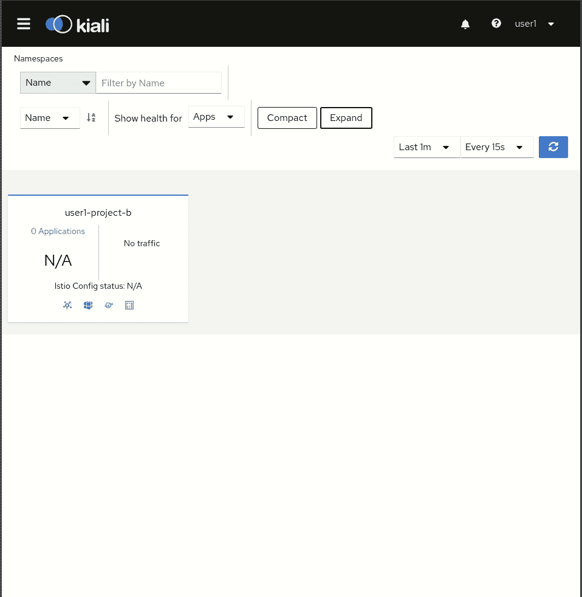

正如在[上一篇文章](https://medium.com/swlh/openshift-service-mesh-essentials-part-i-the-why-and-what-of-it-a3ef09bf8aa8)中所解释的，Istio 与 Jaeger 和 Prometheus 集成，作为提供跟踪和度量的后端，而不仅仅是 Istio，如果您看一下 [Kiali 架构](https://kiali.io/documentation/v1.0/architecture/)您会看到“Kiali 图表”,所以让我们继续这些组件…

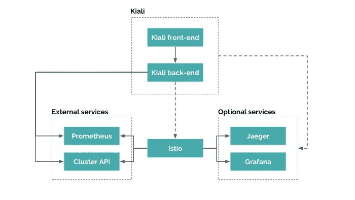

**Jaeger + elasticsearch**

在这里，我们将发现部署的两个服务网格之间的巨大差异。在名称空间 *istio-system* 上，我们部署了一个由 elasticsearch 支持的 Jaeger 控制平面(我们只配置了一个节点)，但在部署在 *istio-system-b* 名称空间上的控制平面中，Jaeger 使用的是内存数据库(`all-in-one`模板)。这使得在 *istio-system-b* 名称空间中，您将找到一个部署(`jaeger` )…

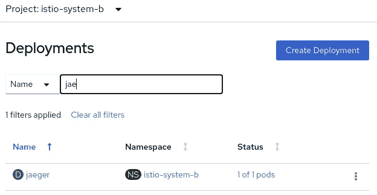

…在 *istio-system* 名称空间中，您会发现`jaeger-collector`和`jaeger-query`以及 elasticsearch 部署。

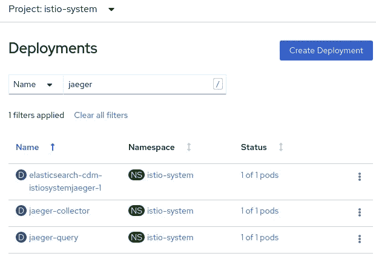

如果你想了解更多关于这些部分的信息，你可以看一下 [Jaeger 架构文档](https://www.jaegertracing.io/docs/1.19/architecture/)，在那里你可以找到 *jaeger-collector* 和 *jaeger-query* 的解释(以及这个示例模式):

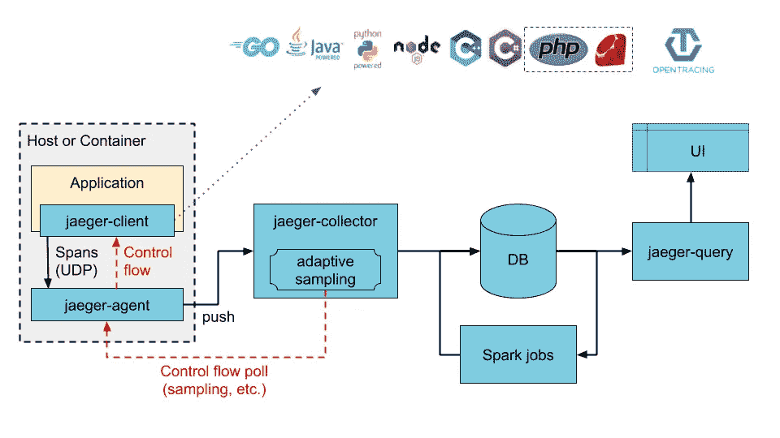

如果您稍微研究一下部署对象，您会发现`jaeger`对象没有任何对外部 elasticsearch 的引用…

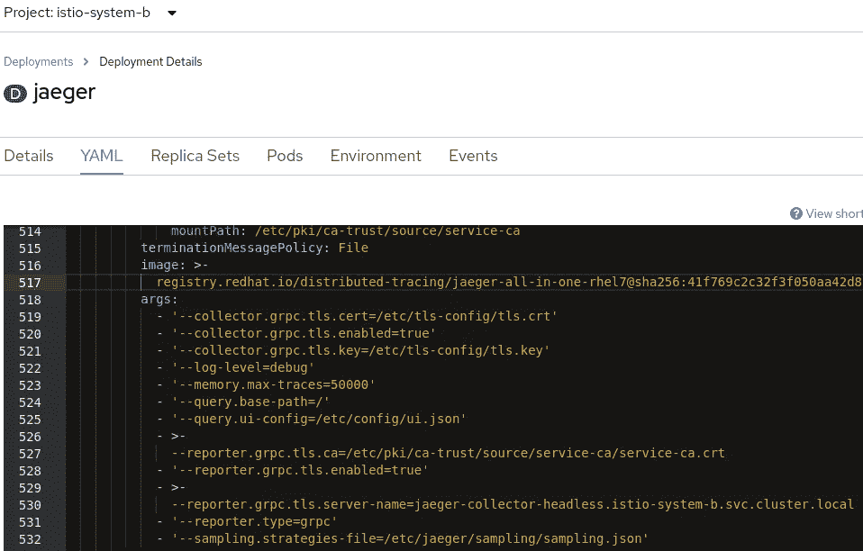

…但是`jaeger-collector`和`jaeger-query`对象指向内部的 Kubernetes 服务，该服务公开了由我们的运营商部署的 elasticsearch(查看上面的 Jaeger 架构模式，这两个部分需要访问数据库):

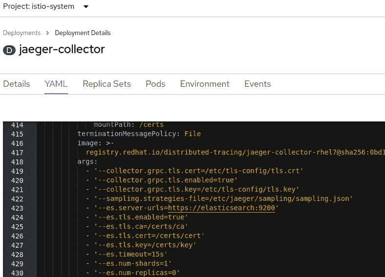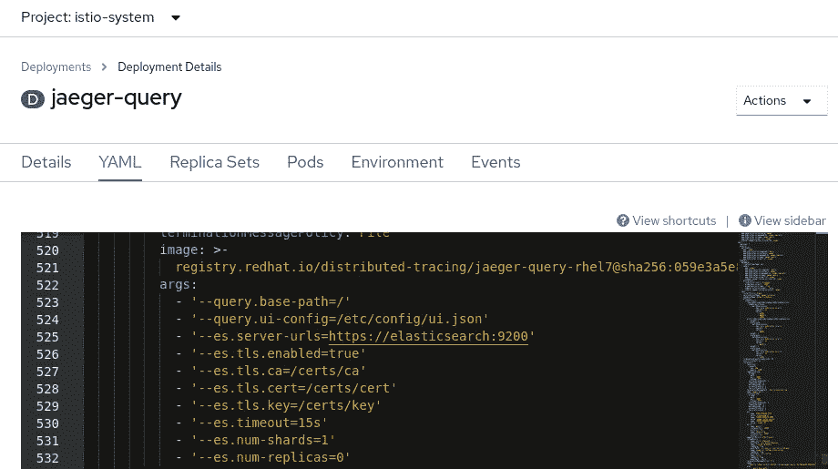

**普罗米修斯**

您可以进入 Prometheus Web 控制台并检查目标的状态:

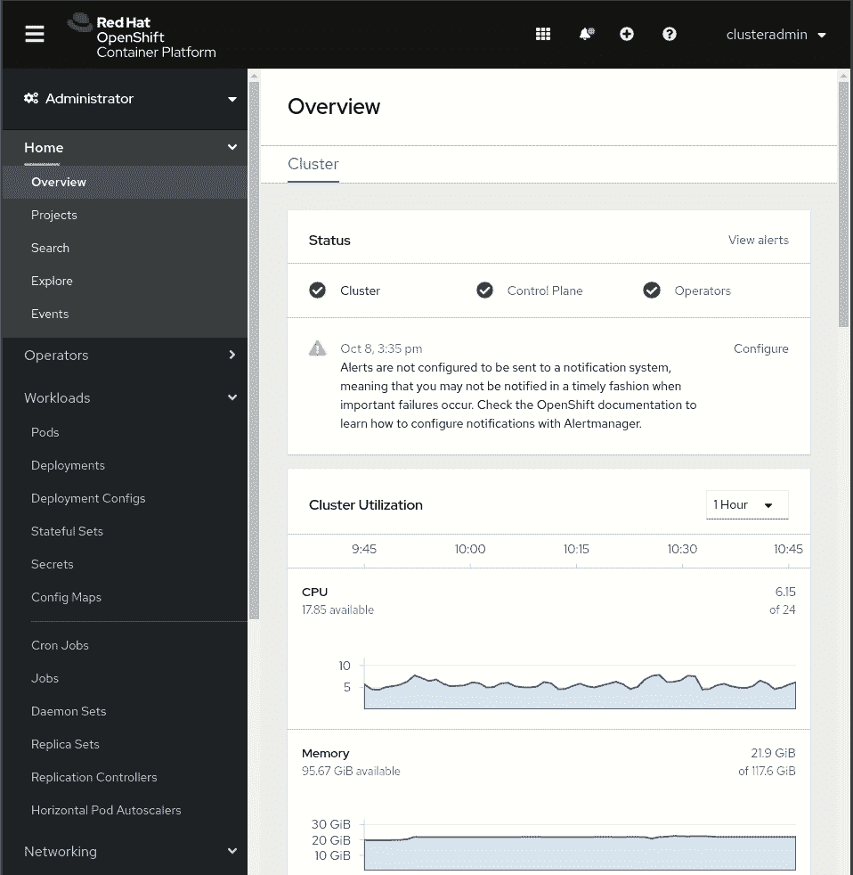

**格拉夫纳**

关于 Grafana 没有太多要说的(我们将在下一篇文章中检查仪表板)，也许最重要的部分是检查位于 *istio-system-b* 名称空间中的控制平面 *controlplane-b* 中，我们禁用了 Grafana，因此您不应该发现它是该控制平面的一部分。

# 下一步是什么？

我们已经了解了如何部署 OpenShift 服务网格控制平面，以及一旦部署完成，我们如何查看一些主要的 OpenShift 服务网格组件，您会发现这些组件已经安装在您的 OpenShift 集群中。

在下一篇文章中，我们将看到如何注入 sidecar 代理来启用数据平面，并且我们将开始使用服务网格特性。


> 在本系列的下一篇文章中，我们将从数据平面和服务网格功能开始。
> 
> 您也可以重新回顾本系列第一篇文章中的概念:

[](https://medium.com/@luis.ariz/openshift-service-mesh-essentials-part-i-the-why-and-what-of-it-a3ef09bf8aa8) [## open shift Service Mesh essentials—第一部分—原因和内容

### 在这第一篇文章中，我们将讨论一些关于 OpenShift 服务网格的介绍性问题，包括它的特性…

medium.com](https://medium.com/@luis.ariz/openshift-service-mesh-essentials-part-i-the-why-and-what-of-it-a3ef09bf8aa8) 

> 或者继续阅读下一篇文章:

[](https://luis-javier-arizmendi-alonso.medium.com/openshift-service-mesh-essentials-part-iii-data-plane-341ce477c269) [## OpenShift 服务网格基础—第三部分—数据平面

### 在本文中，我们将通过展示一个应用程序部署来探索 OpenShift 服务网格数据平面…

luis-javier-arizmendi-alonso.medium.com](https://luis-javier-arizmendi-alonso.medium.com/openshift-service-mesh-essentials-part-iii-data-plane-341ce477c269) [](https://luis-javier-arizmendi-alonso.medium.com/openshift-service-mesh-essentials-part-iv-features-routing-3189dae64615) [## OpenShift 服务网格基础—第四部分—功能:路由

### 了解如何使用高级路由来修改应用程序的行为，而不包括 API 网关或…

luis-javier-arizmendi-alonso.medium.com](https://luis-javier-arizmendi-alonso.medium.com/openshift-service-mesh-essentials-part-iv-features-routing-3189dae64615)