# OpenShift 服务网格基础—第三部分—数据平面

> 原文：<https://itnext.io/openshift-service-mesh-essentials-part-iii-data-plane-341ce477c269?source=collection_archive---------0----------------------->


在[上一篇文章](https://luis-javier-arizmendi-alonso.medium.com/openshift-service-mesh-essentials-part-ii-control-plane-9c76a35936b5)中，我们已经看到了一些最重要的服务网格控制平面方面，现在是数据平面的时候了。

如果您想查看控制平面部分，请跳转到:

[](https://luis-javier-arizmendi-alonso.medium.com/openshift-service-mesh-essentials-part-ii-control-plane-9c76a35936b5) [## OpenShift 服务网格基础—第二部分—控制平面

### 在第二篇文章中，我们将介绍 OpenShift 服务网格控制平面的准备和部署。

luis-javier-arizmendi-alonso.medium.com](https://luis-javier-arizmendi-alonso.medium.com/openshift-service-mesh-essentials-part-ii-control-plane-9c76a35936b5) 

或者如果你想从头开始:

[](https://medium.com/swlh/openshift-service-mesh-essentials-part-i-the-why-and-what-of-it-a3ef09bf8aa8) [## open shift Service Mesh Essentials—第一部分—原因和内容

### 在这第一篇文章中，我们将讨论一些关于 OpenShift 服务网格的介绍性问题，包括它的特性…

medium.com](https://medium.com/swlh/openshift-service-mesh-essentials-part-i-the-why-and-what-of-it-a3ef09bf8aa8) 

或者从展示服务网格功能的一些示例开始:

[](https://luis-javier-arizmendi-alonso.medium.com/openshift-service-mesh-essentials-part-iv-features-routing-3189dae64615) [## OpenShift 服务网格基础—第四部分—功能:路由

### 了解如何使用高级路由来修改应用程序的行为，而不包括 API 网关或…

luis-javier-arizmendi-alonso.medium.com](https://luis-javier-arizmendi-alonso.medium.com/openshift-service-mesh-essentials-part-iv-features-routing-3189dae64615) 

在本文中，我们将探索 OpenShift 服务网格数据平面。这里的想法是通过展示如何发布服务网格应用程序来了解数据平面，但不使用扩展的 Istio 特性(即智能路由、控制策略等)，因此我们将获得标准 OpenShift SDN 功能，但使用服务网格。Istio 特性的解释将在以后的文章中完成。

# 特使边车集装箱

在这一节中，我们将检查特使边车是如何注入到吊舱中的，以及当你包括它时有什么含义(即。流量重定向、多点注释移除等)。

## 边车容器注射

如果你阅读官方 Istio 文档，你会发现[有两种方法可以在应用程序盒](https://istio.io/latest/docs/setup/additional-setup/sidecar-injection/)中注入代理边车:手动和自动注入。

在 OpenShift 服务网格中，我们也有这两个选项，但是正如在 [OpenShift 服务网格要点—第二部分—控制平面](https://medium.com/@luis.ariz/openshift-service-mesh-essentials-part-ii-control-plane-9c76a35936b5)文章中所述，Istio 文档所提出的内容与 OpenShift 中自动边车注入的方式之间有一个主要区别，而默认的 Istio 配置将边车注入到任何带有`istio-injection=enabled` 标签的命名空间中的 pod 中。 在 OpenShift 服务网格中，该标签不包含在名称空间中，而是包含在部署对象的注释中，这提供了额外的灵活性，同时将服务网格内部和外部的应用程序包含在同一个名称空间中，例如，防止构建或部署 pod 也与 sidecar 一起注入。

自动注入非常棒，因为它不仅简化了部署，还处理了额外的 Envoy 代理容器生命周期。假设有一个新版本的 OpenShift 服务 Mesh Envoy sidecar 代理。如果您使用自动注入，sidecar 升级将像重新启动 pod 一样简单(服务网格操作符中的自动更新策略将升级控制平面，但它不会自动重新启动 pod 以升级 sidecar，确保它不会影响您的应用程序)，但如果您使用手动注入，您将需要逐个更改 Envoy sidecar 容器映像的部署定义，这就是为什么自动注入是在您的 pod 中包含 sidecar 代理的推荐方法。

你可能想知道自动边车注射是如何工作的？注射是由准入控制器触发的，但是……什么是准入控制器？…让我们过一遍…

一个[准入控制器是 Kubernetes API 服务器代码](https://kubernetes.io/docs/reference/access-authn-authz/admission-controllers/)的一部分，它可以在请求被集群执行之前，但在请求被认证和授权之后拦截 API 请求，因此它就像是集群做您想要做的事情之前要跨越的最后一个堡垒。Kubernetes 内置了[多个准入控制器，例如，如果您已经阅读了我关于](https://kubernetes.io/docs/reference/access-authn-authz/admission-controllers/#what-does-each-admission-controller-do)[如何在单个 OpenShift 集群](https://medium.com/@luis.ariz/security-zones-in-openshift-worker-nodes-part-i-introduction-4f85762962d7)中配置不同安全区域的文章，您会记得在上一部分中，当我们[通过在 Kubernetes 对象中包含额外的注释来修改包含白名单容忍](/security-zones-in-openshift-worker-nodes-part-iv-user-restrictions-and-recap-5ec0ba7bdaf9)的默认名称空间创建模板时，我们实际上使用的是[podcallationrestriction 准入控制器](https://kubernetes.io/docs/reference/access-authn-authz/admission-controllers/#podtolerationrestriction)。

但是也有一种通过使用 webhooks 来包含额外控制器的方法，你可以有两种类型的准入控制器:

*   **验证准入 webhook，**允许在验证您的请求期间实施自定义管理策略。
*   **变异准入 webhook** :允许您更改请求以实施自定义默认值。

正如这里提到的，为了注册准入 webhooks，你必须创建`MutatingWebhookConfiguration`或`ValidatingWebhookConfiguration` API 对象。

在我们的例子中，我们用来在 POD 中自动注入 sidecar 代理的是一个变异准入 webhook，所以我们可以看一下*变异 Webhookconfiguration* 对象，您将看到每个控制平面名称空间至少有一个这样的对象，另外还有一个由 Maistra 操作符使用:

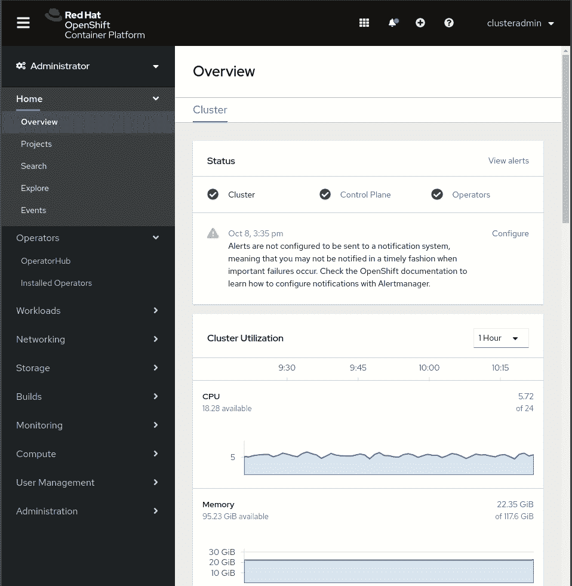

你可以打开一个边车注射器 webhook，看看 YAML 定义文件，你会看到一个“ *webhooks* ”部分，如下所示:

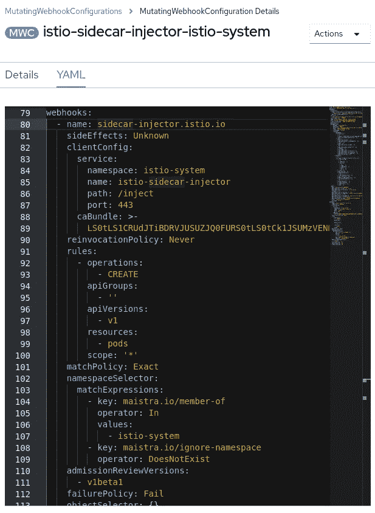

当 apiserver 接收到一个与`rules`之一匹配的请求时，apiserver 向 webhook 发送一个`admissionReview`请求，如`clientConfig`中所指定的。在我们的准入控制器定义中，当我们试图创建一个 POD 时，我们强制从您的控制平面名称空间调用`istio-sidecar-injector`服务的`/inject`端点。如果部署包含`sidecar.isito.io/inject="true"`注释，这将最后“添加”和配置(如果您使用`sidecar.maistra.io/proxyEnv`注释，您也可以将环境变量注入到 Envoy 代理中)您试图创建的 POD 中的附加代理 sidecar 容器。

让我们在一个测试应用程序中注入 sidecar。首先，我们将部署应用程序，我将使用这个部署:

```
apiVersion: apps/v1
kind: Deployment
metadata:
  name: hello
spec:
  replicas: 1
  selector:
    matchLabels:
      app: hello
  template:
    metadata:
      labels:
        app: hello
    spec:
      containers:
      - name: hello
        image: openshift/hello-openshift
        ports:
        - containerPort: 8080
```

我将在位于名称空间 *istio-system* 中的 *project-a1* 中创建该应用程序，该名称空间包含在 OpenShift 服务网格*控制平面-a* (还记得我们在上一篇文章中创建的 *ServiceMeshMemberRoll* 对象)中，因此，如果您检查该控制平面的 Kiali 接口，您应该会看到该应用程序正在运行，但是您会看到一条消息，指出此类工作负载没有所需的代理

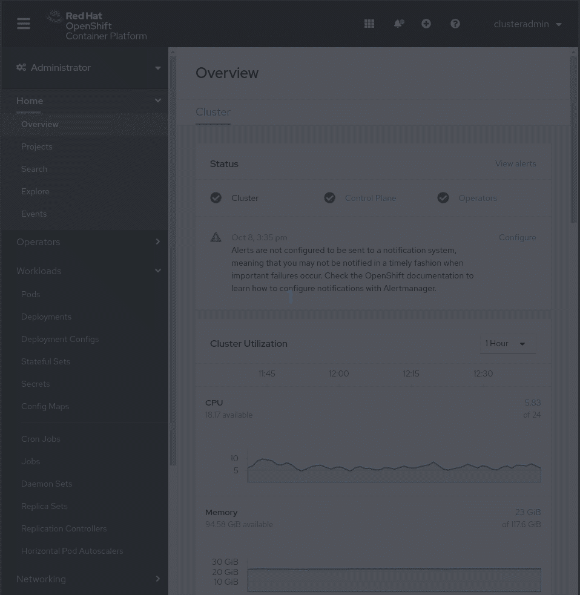

> 注意:除了部署标准的 Kubernetes 对象，OpenShift 还提供了 DeploymentConfig 对象，它带来了一些扩展功能。如果您使用 DeploymentConfigs 而不是 deployment，您需要知道我在 Kiali 中发现的行为(在最新版本中，如 OpenShift 4.5 中的 1.12)是它只显示基本的 Kubernetes 对象，如部署、构建、服务等，而不显示 OpenShift 特定的对象(即 DeploymentConfigs)作为 UI 中的工作负载。
> 
> 如果您使用部署或部署配置，服务网格(包括边卡自动注入)将独立工作(目前在此版本中),唯一会失去的是工作负载 Kiali 可见性。如果您想查看这一点，可以部署相同的应用程序，但使用 DeploymentConfig 对象:

```
apiVersion: apps.openshift.io/v1
kind: DeploymentConfig
metadata:
  name: helloDC
spec:
  replicas: 1
  selector:
      app: helloDC
  template:
    metadata:
      labels:
        app: helloDC
    spec:
      containers:
      - name: helloDC
        image: openshift/hello-openshift
        ports:
        - containerPort: 8080
```

好了，现在让我们使用*sidecar.istio.io/inject:“真”*注释注入边车。您应该以这种方式在部署中包含注释(检查粗体文本):

```
apiVersion: apps/v1
kind: Deployment
metadata:
  name: hello
spec:
  replicas: 1
  selector:
    matchLabels:
      app: hello
  template:
    metadata:
      labels:
        app: hello
 **annotations:
        sidecar.istio.io/inject: "true"**
    spec:
      containers:
      - name: hello
        image: openshift/hello-openshift
        ports:
        - containerPort: 8080
```

您可以检查在包含注释之后，与部署相关联的窗格将如何拥有一个附加的" *istio-proxy* "容器，该容器是特使代理边车:

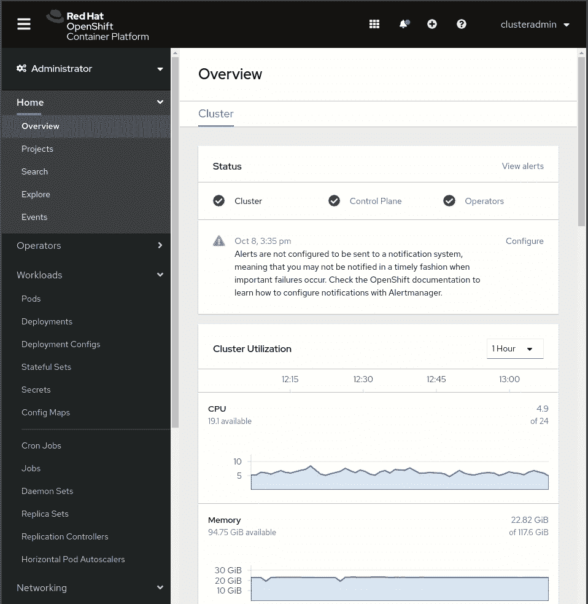

你也可以检查一旦完成，Kiali 界面上的“丢失边车”信息就消失了。

关于边车的另一件事，你还记得在上一篇文章中的[吗，当我们创建控制平面-服务网状配置时，我们包括了我们的边车的请求和限制。(检查以下内容)](https://medium.com/@luis.ariz/openshift-service-mesh-essentials-part-ii-control-plane-9c76a35936b5)

```
apiVersion: maistra.io/v1
kind: ServiceMeshControlPlane
metadata:
  name: controlplane-A
  namespace: istio-system
spec:
  version: v1.1
  istio:
    global:
      proxy:
        resources:
          requests:
            cpu: 20m
            memory: 200Mi
          limits:
            cpu: 3000m
            memory: 2048Mi
 ...
```

现在，我们可以检查容器中是否通知了 QoS 策略:

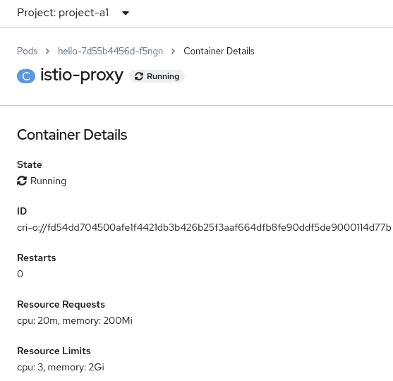

让我们回顾一下，如果我们将我们的应用程序部署在与另一个已经部署的服务网格控制平面(controlplane-b)关联的名称空间( *project-b1* )中，而我们没有设置 QoS 值，会发生什么情况:

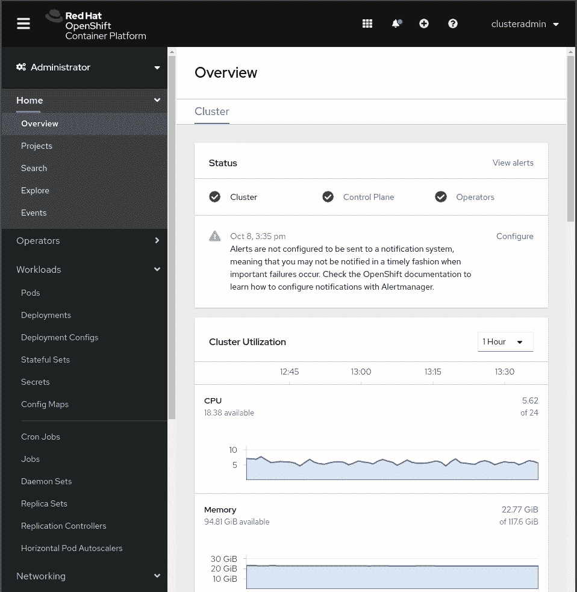

正如你所看到的，有一个默认设置已经被应用在这种情况下，没有限制的边车容器。

## 自动将 POD 流量重定向到特使代理

现在，我们的应用程序容器和新的 sidecar 容器一起在 POD 中运行，我们如何确保流量是由这个新的 sidecar 而不是我们自己的容器管理的呢？好消息是，一切都是自动为您设置的，您不必担心这一点，但如果您关心它实际上是如何工作的，您就在正确的位置，因为我们将探索它。

> 注意:自动流量重定向到特使代理容器使代理侧柜对您的应用程序透明…嗯，几乎透明，因为这种强制重定向意味着在特使代理启动之前，POD 将无法获得连接，请考虑这一点，因为我发现一些应用程序需要在第一(子)秒内连接到其他地方才能工作，如果应用程序容器在 POD 上的特使代理之前启动，前者将无法在此期间访问外部资源

在上一篇文章中，我描述了 [OpenShift 服务网格控制平面，](https://medium.com/@luis.ariz/openshift-service-mesh-essentials-part-ii-control-plane-9c76a35936b5)您看到了 Maistra 操作符(服务网格操作符)如何在 *openshift-operators* 名称空间中部署一个名为“ *istio-node* 的 DaemonSet，它在每个节点中部署了一个 *istio-cni* POD，用于监视该节点中是否调度了服务网格工作负载，并在这种情况下修改节点 *iptables 现在我们来看看那些 *iptable* 规则。*

*istio-cni* 资源在 POD 运行的网络名称空间内配置 *iptables* 规则，因此它仅影响该 POD 上的入/出流量，而不是节点中的全局流量。如果我们想检查 *istio-cni* 正在做什么，我们需要一种方法来检查网络名称空间内的 *iptable* 规则。我来自 OpenStack 世界，在那里我们曾经通过使用`**ip netns exec**`命令在特定的网络名称空间中运行 Linux 命令，但是如果您曾经处理 docker 容器，您可能已经使用过`**nsenter**`命令，因为`**ip netns exec**`命令只对在 */var/run/netns* 中列出的名称空间有用，docker 默认不会将其名称空间放在那里。

幸运的是，在这里我们可以使用`**ip netns exec**`或`**nsenter**`命令，我会告诉你怎么做。

第一步是常见的，我们需要知道在我们的节点上运行的任何 POD 容器 id(在我们的示例中，我们有两个容器在我们的 POD 中运行，app 容器和 sidecar 容器，因此将有两个不同的容器 id 绑定到这个 POD)。该信息包含在我们的 POD 的描述中(查找“ **cri-o** ”，作为 CRIO 容器运行时)

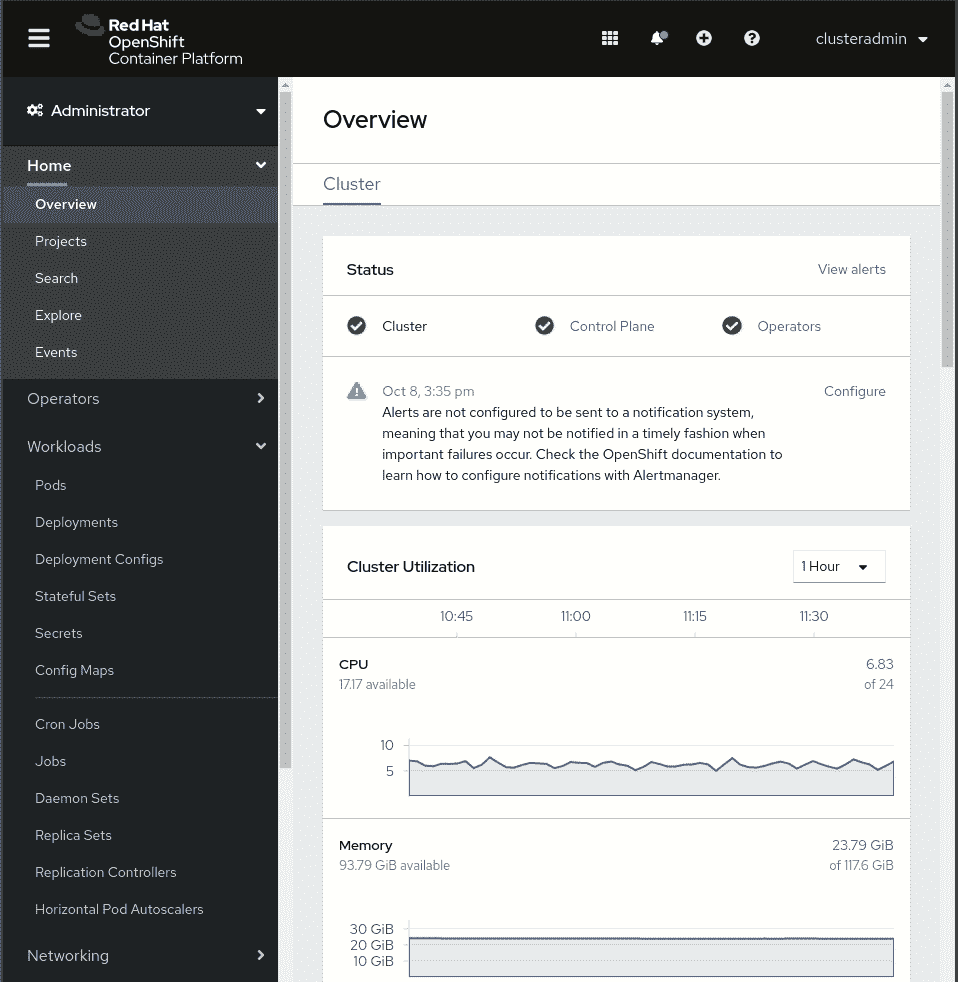

现在我们需要知道这个容器 ID 的详细信息。为此，我们需要跳转到 POD 正在运行的节点，并运行以下命令:

```
crictl inspect --output json <container ID>
```

这会给我们很多有用的信息，但我们只需要关注一件事。根据您是否想要使用`**ip netns exec**`或`**nsenter**`命令，您将需要与容器相关联的网络名称空间 ID 或进程 ID，因此这里的最佳想法是，如果您打算使用`**ip netns exec**`，则使用“ *netns* 进行 grep，如果您打算使用`**nsenter**`，则使用“ *pid*

一旦获得了网络名称空间 id 或进程 id，就可以在名称空间中运行所需的命令。

用`**ip netns exec**`你可以跑

```
ip netns exec <namespace id> <my command>
```

使用`**nsenter**`，您的命令将是(`**-n**`意味着该命令将在进程正在使用的网络名称空间中运行):

```
nsenter -t <pid> -n <my command>
```

在我们的例子中，我们想要检查 iptables NAT 规则，所以“我的命令”是:

```
iptables -t nat -S
```

让我们回顾一个使用这两个命令的端到端示例，从`**ip netns exec**`命令开始:

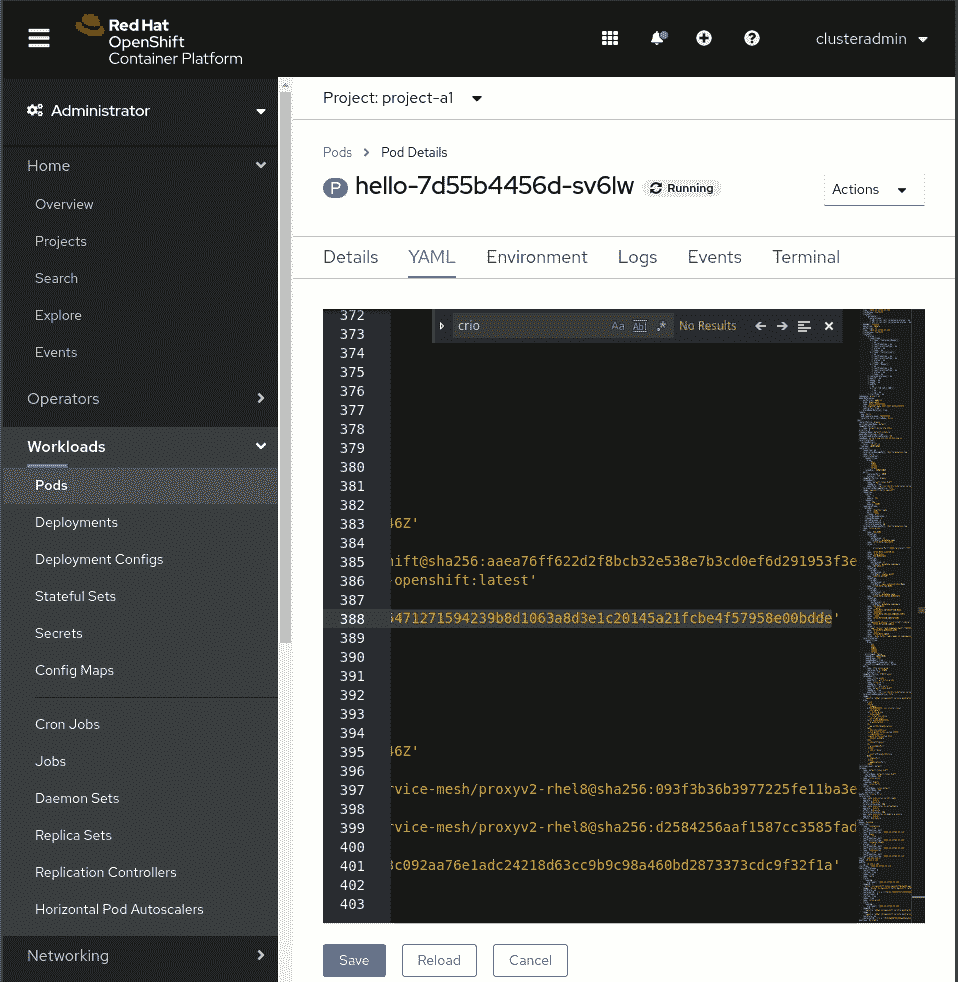

现在有了`**nsenter**`

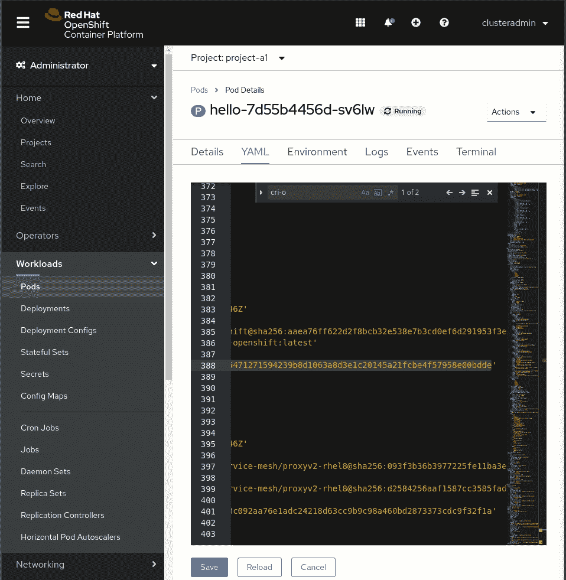

这两个命令都提供了以下输出:

```
-P PREROUTING ACCEPT
-P INPUT ACCEPT
-P POSTROUTING ACCEPT
-P OUTPUT ACCEPT
-N ISTIO_REDIRECT
-N ISTIO_IN_REDIRECT
-N ISTIO_INBOUND
-N ISTIO_OUTPUT
-A PREROUTING -p tcp -j ISTIO_INBOUND
-A OUTPUT -p tcp -j ISTIO_OUTPUT
**-A ISTIO_REDIRECT -p tcp -j REDIRECT --to-ports 15001** -A ISTIO_IN_REDIRECT -p tcp -j REDIRECT --to-ports 15001
**-A ISTIO_INBOUND -p tcp -m tcp --dport 8080 -j ISTIO_IN_REDIRECT**
-A ISTIO_OUTPUT -s 127.0.0.6/32 -o lo -j RETURN
-A ISTIO_OUTPUT ! -d 127.0.0.1/32 -o lo -j ISTIO_IN_REDIRECT
-A ISTIO_OUTPUT -m owner --uid-owner 1000710001 -j RETURN
-A ISTIO_OUTPUT -m owner --gid-owner 1000710001 -j RETURN
-A ISTIO_OUTPUT -d 127.0.0.1/32 -j RETURN
-A ISTIO_OUTPUT -j ISTIO_REDIRECT
```

这些规则使得所有进出应用程序容器的流量都被重定向到 pod 的端口 15001，在本例中，我们的应用程序" *hello* "正在侦听端口 8080，但是您可以看到 8080 最终是如何被重定向到 15001 的…但是在 POD 的那个端口上侦听的是什么呢？

如果您检查 POD YAML 定义，您将不会找到任何对端口 15001 的引用，这是因为在本地侦听 POD，它不会“暴露”在外部。您可以通过在 POD 网络名称空间中运行以下命令来检查端口是否正在监听 POD 和与其相关联的进程(记住如何使用`**ip netns exec**`或`**nsenter**`命令)

```
ss -nlp | grep 15001
```

这是使用`**nsenter**`命令的输出

```
sh-4.4# nsenter -t 1765412 -n ss -nlp | grep 15001tcp                LISTEN              0                    128                                                                                         0.0.0.0:15001              0.0.0.0:*      users:(("envoy",**pid=1765590**,fd=63))
```

您可以看到 PID 1765590 是如何侦听该端口的，让我们看看使用`**ps aux**`的节点上是什么:

```
sh-4.4# ps aux | grep 17655901000710+ 1765590  0.1  0.2 173012 49724 ?        Sl   08:45   0:16 **/usr/local/bin/envoy** -c /etc/istio/proxy/envoy-rev0.json --restart-epoch 0 --drain-time-s 45 --parent-shutdown-time-s 60 --service-cluster hello.project-a1 --service-node sidecar~10.129.2.106~hello-7d55b4456d-sv6lw.project-a1~project-a1.svc.cluster.local --max-obj-name-len 189 --local-address-ip-version v4 --log-format [Envoy (Epoch 0)] [%Y-%m-%d %T.%e][%t][%l][%n] %v -l warning --component-log-level misc:error --concurrency 2root     2313349  0.0  0.0   9180  1084 ?        S+   11:21   0:00 grep 1765590
```

如果您想完全确定 PID 与我们的 POD 的 sidecar 容器相关联，我们可以按照上面提到的过程获取该容器的根 PID(但是获取的是 *istio-proxy* 容器的 CRIO ID，而不是 *hello* 容器的 CRIO ID ),您将会看到(在我的例子中是 1765517)…哦，令人惊讶的是，这不是侦听 15001 端口的同一个 PID (1765590 ),这是一个

这是因为 *istio-proxy* 容器的根进程，即您使用 CRIO ID (1765517)找到的那个，是“主”进程( *pilot-agent* )的根进程，但是该进程启动了另一个子进程，即与 envoy 命令关联的 PID (1765590)。通过使用`**pstree**`命令和您在端口 15001 上监听的 PID，您可以很容易地知道这一点，格式如下:

```
pstree -p -s <envoy process ID listening on 15001>
```

这将为您提供所有父节点的视图，在那里您肯定会找到从 CRIO ID inspect 中获得的根 PID(在我的例子中是 1765517)。这是我的输出(忘记“+”下面的流程，那些是具有相同分支的[流程):](https://linux.die.net/man/1/pstree)


因此，现在您可以完全确定，您的所有 POD 流量都是由您注入的边车容器管理的(如果您不相信我在此测试之前提到的话)

## Multus 和自动 Istio 边车注射

您可能还记得在[上一篇文章中，当我介绍不同的控制平面配置选项](https://medium.com/@luis.ariz/openshift-service-mesh-essentials-part-ii-control-plane-9c76a35936b5)时，Multus 注释在默认情况下不会被 automatic Envoy sidecar 注入器保存，但是您有一个控制平面配置变量( *sidecarInjectorWebhook* )允许维护它们。我们在*控制平面-a* 中配置了该选项，但在*控制平面-b* 中没有，所以让我们检查一下这是否可行。

> **注意** : Multus 接口不会是服务网格的一部分，它将是应用程序的一个额外网络访问，但服务网格功能不能在那里使用。

首先，我们需要在集群中配置额外的网络，并测试其工作情况。在我之前的一个博客系列中，特别是在 OpenShift worker nodes 中的[安全区域—第三部分—网络配置](/security-zones-in-openshift-worker-nodes-part-iii-network-configuration-3a887854a4d)文章中，我们回顾了在 OpenShift 中创建网络设置的不同方式。在当前版本 OpenShift 4.5 中，我们仍然没有默认可用的 [*nmstate*](https://github.com/nmstate/kubernetes-nmstate) 对象(在路线图上)，因此我可以在我的集群中安装 OpenShift 虚拟化来访问该 API，或者使用“标准”方法修改网络集群操作符对象。在这种情况下，我将使用后者。

在我的工作节点中，我有两个接口，一个由 OpenShift SDN 使用，另一个我将使用 Multus 提供对我的 pod 的直接网络访问。您可以使用具有 *clusteradmin* 权限的 OpenShift 控制台检查节点中的可用接口。在我的例子中， *ens3* 是 SDN 的集群网络，而 *ens4* 将是 Multus 使用的网络(该节点已经有了一个 IP，因为 DHCP 在该接口上启用):

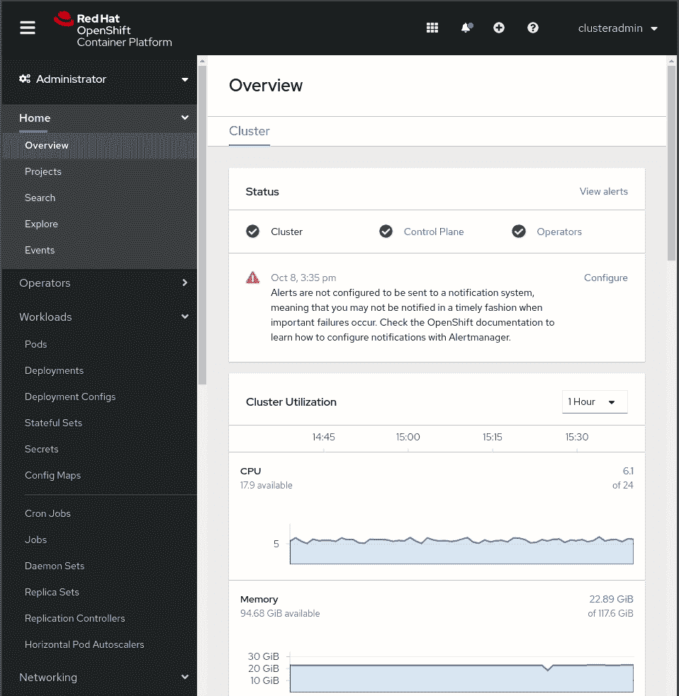

如前所述，在 OpenShift 中启用附加网络的方法是修改网络集群操作符。

```
apiVersion: operator.openshift.io/v1
kind: Network
...
spec:
...
  additionalNetworks:
    - name: prov-net
      namespace: project-a1
      rawCNIConfig: '{ "cniVersion": "0.3.1", "type": "macvlan", "capabilities": { "ips": true }, "master": "ens4", "mode": "bridge", "ipam": { "type": "dhcp" } }'
      type: Raw
    - name: prov-net
      namespace: project-b1
      rawCNIConfig: '{ "cniVersion": "0.3.1", "type": "macvlan", "capabilities": { "ips": true }, "master": "ens4", "mode": "bridge", "ipam": { "type": "dhcp" } }'
      type: Raw
...
```

紧接着，一个新的*NetworkAttachmentDefinition*被自动创建在每个已配置的名称空间中(在本例中为 *project-a1* 和 *project-b1* )，该名称空间可用于向 pod 分配额外的网络


为了测试 Multus 配置，您可以创建一个带有附加 NIC 的 POD 并测试连接性(我 ping 我的默认网关 192.168.100.1):

> 注意:我在这里使用 centos/tools 容器映像，这样我就可以使用 POD bash 来运行一些测试(openshift/hello-openshift 没有终端)

```
apiVersion: v1
kind: Pod
metadata:
  name: multus-test
 **annotations:
    k8s.v1.cni.cncf.io/networks: '[
        {
                "name": "prov-net"
        }
    ]'**
spec:
  containers:
  - name: example-pod
    command: ["/bin/bash", "-c", "sleep 99999999999"]
    image: centos/tools
```

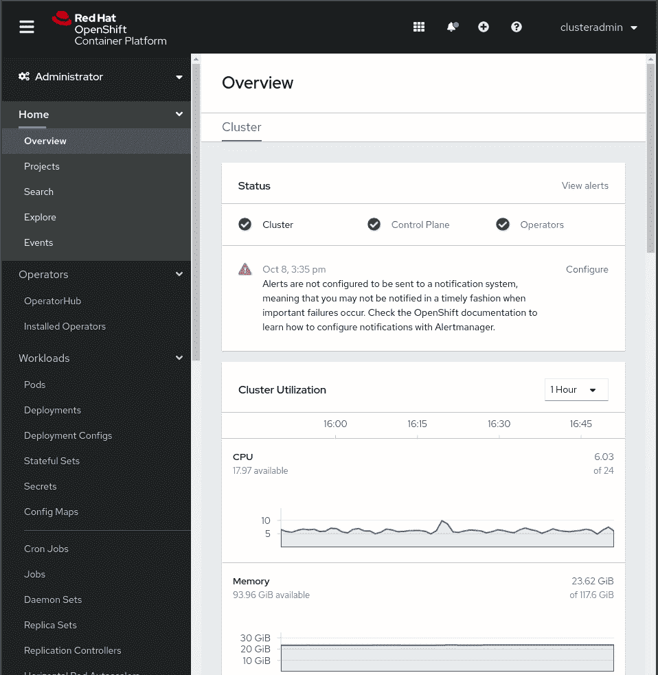

好了，现在我们确信 multus 正在工作，所以让我们创建两个部署，包括 sidecar 注入和 Multus 注释，一个在*项目-a1* (连接到*控制平面-a* ，其中选项应该保留 Multus 注释)中，另一个在*项目-b1 中。*您将看到附加接口仅在前一种情况下是如何配置的，此时 Multus 注释被保留。

```
apiVersion: apps/v1
kind: Deployment
metadata:
  name: test-sidecar-multus
spec:
  replicas: 1
  selector:
    matchLabels:
      app: test-sidecar-multus
  template:
    metadata:
      labels:
        app: test-sidecar-multus
 **annotations:
        sidecar.istio.io/inject: "true"
        k8s.v1.cni.cncf.io/networks: '[
            {
              "name": "prov-net"
            }
          ]'**
    spec:
      containers:
      - name: test-sidecar-multus
        command: ["/bin/bash", "-c", "sleep 99999999999"]
        image: centos/tools
```

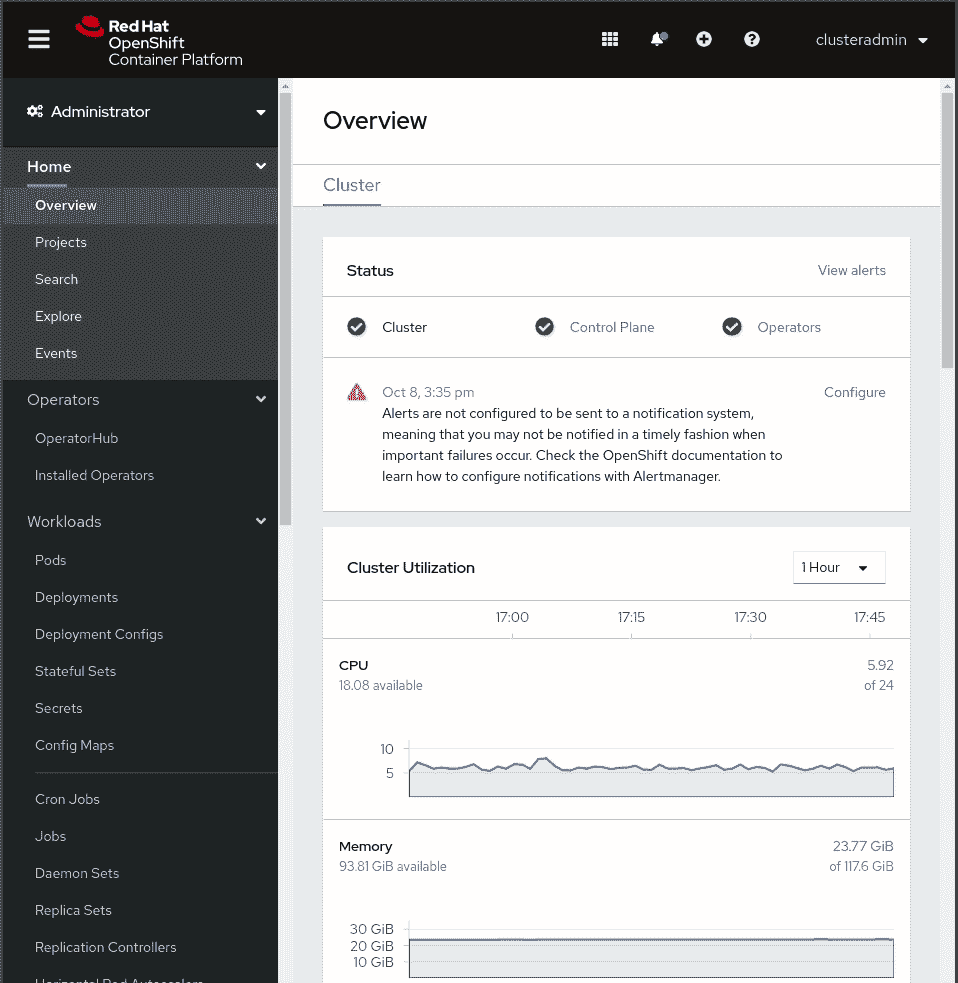

# 从群集外部访问应用程序

我们的服务网格上运行着“Hello World”应用程序，现在我们想从 OpenShift 集群外部访问它。

## 服务

Istio 创建了自己的服务注册中心，其中自动填充了安装它的 OpenShift/Kubernetes 集群提供的信息，特别是服务对象(以及相关的端点)。所以为了让 Istio 了解一个服务，我们需要创建一个标准的“服务”Kubernetes 对象。

```
apiVersion: v1
kind: Service
metadata:
  name: hello
  labels:
    app: hello
spec:
  ports:
  - port: 8080
    name: http
  selector:
    app: hello
```

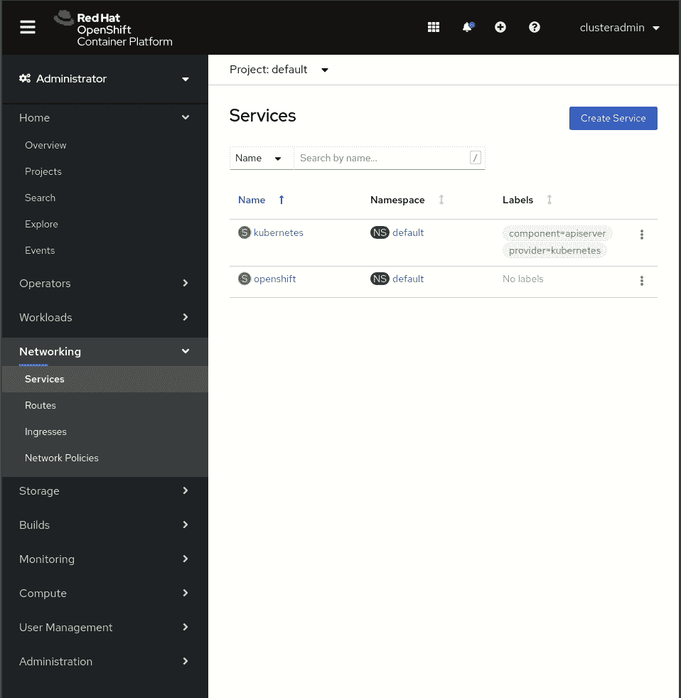

如果您没有删除我们创建的用于显示 Multus with sidecar container injection 的 POD，您可以测试该服务是否工作正常(记住使用正确的服务端口，在本例中为 8080)

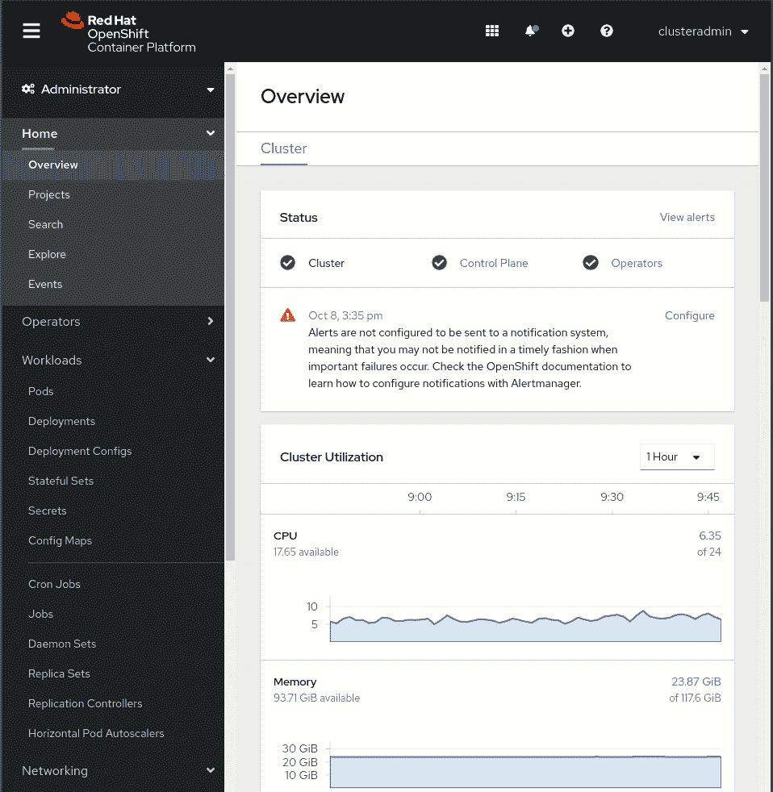

既然我们创建了 OpenShift 服务，Istio 也会知道它。您可以查看 Kiali 是如何为其专门开辟一个部分的:


**使用常规路由**在“ *Istio 名称空间*中公开服务

我们仍然没有使用任何特定的 Istio 对象(我们使用了一个 Kubernetes 服务对象)，如果我们希望继续使用“常规”对象来公开此服务(考虑到我们将失去 Istio 功能)，我们现在将创建一个路由/入口来公开集群外部的内部服务…让我们尝试一下:

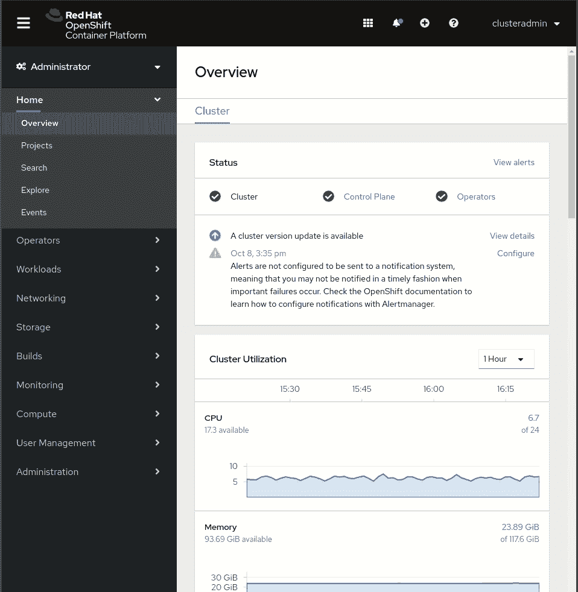

“常规”路由对象不起作用，为什么？因为您不应该使用该标准对象来公开您的服务网格应用程序。如果您还记得上一篇文章中的[，作为服务网格运营商引入的修改的一部分，当您将名称空间作为特定服务网格控制平面的一部分时，会有一系列网络策略来阻止不是来自 Istio 入口网关的入站流量， 这是网格的预期入口点，您必须记住，您的应用程序应该使用服务网格，因为它位于附属于服务网格的名称空间中(在配置控制平面时，我们使用 *ServiceMeshMemberRoll* 对象来配置它)。](https://medium.com/@luis.ariz/openshift-service-mesh-essentials-part-ii-control-plane-9c76a35936b5)

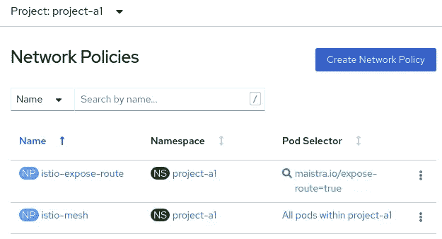

> **注意**:记住 *istio-mesh* 网络策略只允许同一个 mesh 中的流量(应用之间以及应用和网关之间)。这包括连接到同一控制平面的所有名称空间，这意味着，如果没有修改，默认情况下，您将能够看到部署在网格中的所有服务，如果它们是同一网格的一部分，则独立于您的应用程序运行的名称空间。该网络策略不仅会拒绝任何不通过入口的外部访问，还会阻止从网格外部直接访问内部 Kubernetes 服务

如果作为一个需求，我需要在一个连接到网格的名称空间内运行一个应用程序，但是我想使用常规的 Route 对象将它发布到该网格之外(这样就失去了一些主要的 Istio 功能)，会发生什么呢？

你需要允许从路由器到 pod 的流量…但是您不需要接触网络策略，因为已经为这种情况准备了一个规则。

正如您在 *istio-expose-route* 网络策略(上面列表中的第一个)中看到的，如果流量来自带有标签`**network.openshift.io/policy-group=ingress**` 的名称空间，并且到达带有标签`**maistra.io/expose-route: "true"**`的 pod，它就会允许流量

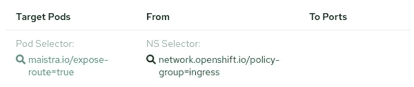

您可以检查路由器运行的名称空间( *openshift-ingress* )已经包含标签`**network.openshift.io/policy-group=ingress**`

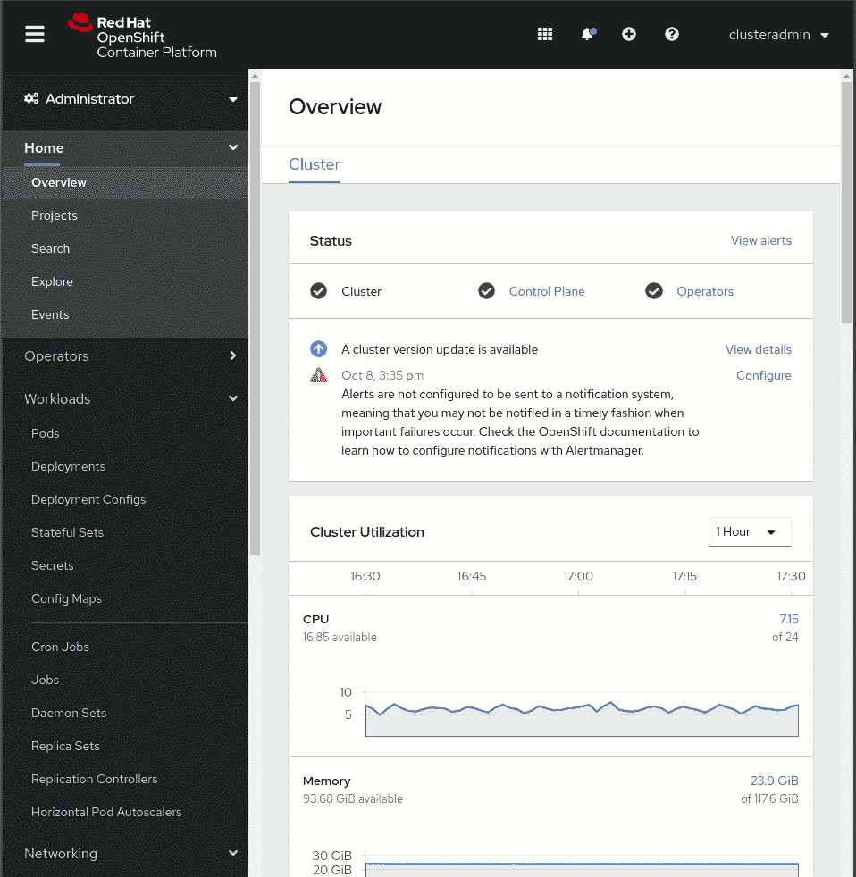

那么剩下的唯一事情就是给我们的豆荚加上标签`**maistra.io/expose-route: "true"**`。让我们尝试一下，我将创建一个新的应用程序来添加该标签:

```
apiVersion: apps/v1
kind: Deployment
metadata:
  name: hello-noistio
spec:
  replicas: 1
  selector:
    matchLabels:
      app: hello-noistio
  template:
    metadata:
      labels:
        app: hello-noistio
        **maistra.io/expose-route: "true"**
      annotations:
        sidecar.istio.io/inject: "true"
    spec:
      containers:
      - name: hello-noistio
        image: openshift/hello-openshift
        ports:
        - containerPort: 8080
```

我还将创建一个关联的服务:

```
apiVersion: v1
kind: Service
metadata:
  name: hello-noistio
  labels:
    app: hello-noistio
spec:
  ports:
  - port: 8080
    name: http-noistio
  selector:
    app: hello-noistio
```

这应该足够了，所以我将尝试使用常规路由来公开新服务:

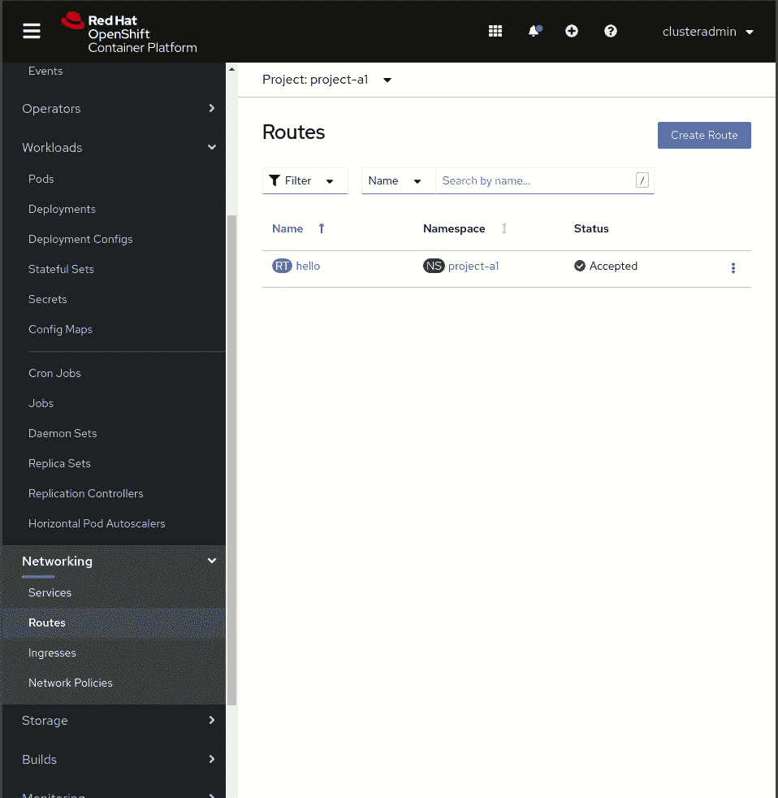

它仍然不工作！为什么？…如果我包括了网络策略期望的标签。

> **注意**:它可能对你有用…这取决于你的底层环境，继续阅读了解为什么

如果您已经阅读了 OpenShift worker nodes-Part III-Network Configuration 一文中的[安全区域，您可能知道原因…入口控制器/路由器以不同的方式发布，具体取决于 open shift 运行的平台(*endpoint publishingstrategy*)，例如，如果您在公共云中运行，路由器将使用 a `**LoadBalancerService**`，但是如果您使用裸机节点，它们将使用`**HostNetwork**`发布方法。](/security-zones-in-openshift-worker-nodes-part-iii-network-configuration-3a887854a4d)

如果您使用对网络策略如何影响您的路由器有一些影响的`**HostNetwork**`发布方法，因为来自入口控制器的流量被分配了`netid:0`虚拟网络 ID (VNID)。该 VNID 被附加到`default`名称空间，因此在网络策略中使用的任何您想要暗示路由器/入口控制器的名称空间标签必须被分配到`default`名称空间。

总之，如果您正在使用裸机部署(像我在这个例子中一样)，从网络策略的角度来看，您的路由器将“使用”名称空间`default`，而不是`openshift-ingress`。

> 仅当您的入口控制器在裸机上部署时使用*主机网络* *端点发布策略*时，才需要以下步骤(作为我的示例)，如果您在公共云上部署了 OCP，则端点发布策略将是*负载平衡器*，然后您不需要在默认名称空间中添加任何标签。

如果您仔细检查`default`命名空间上的标签，您将不会找到所需的标签`**network.openshift.io/policy-group=ingress**` ，我们已经在`openshift-ingress`命名空间中拥有该标签，并且该网络策略需要该标签来允许流量……因此，这里的解决方案是将该标签添加到`default`命名空间

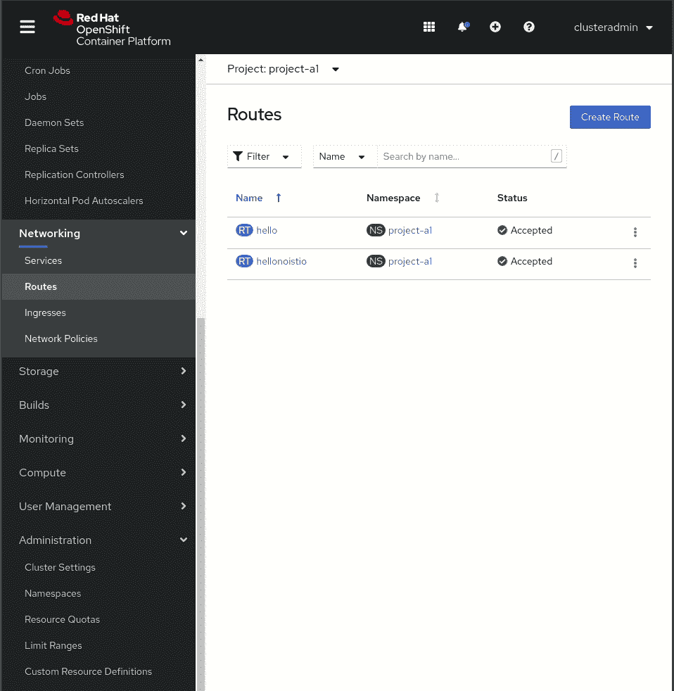

有用！因此，从现在开始，在这个集群中，如果您希望通过常规路由公开，您只需将标签`**maistra.io/expose-route: "true"**`添加到部署中，即使您使用“裸机”方法部署了 OpenShift 集群(因为现在*默认的*命名空间具有“右”标签)。

好了，足够的“非 istio 的东西”，让我们进入 Istio 入口网关对象。

> 注意:我已经删除了我在本节中创建的路由和非 istio 服务和部署，因此您在以后的屏幕截图中不会再看到它们

**使用 Istio 入口网关公开应用**

我们已经看到了如何使用常规的 OpenShift/Kubernetes 对象在与服务网格相关联的名称空间中公开服务，但是如果您已经部署了服务网格，是因为您想要利用它的特性，并且为了获得许多好处，您的流量必须使用 Istio 入口网关作为入口点。

[在上一篇文章](https://medium.com/@luis.ariz/openshift-service-mesh-essentials-part-ii-control-plane-9c76a35936b5)中，我们回顾了入口网关是如何在服务网格控制平面名称空间上运行并通过标准 OpenShift 路由对外发布的 pod(实际上它们也是特使代理，作为边车容器)。现在，我们将了解如何配置它们，以公开在与该控制平面相关联的任何名称空间中运行的服务。

当在与控制平面相关联的任何命名空间中创建新的“网关”对象时，位于控制平面命名空间中的入口网关被自动配置，让我们创建一个:

> 注意:请包括你的申请子域名，如 apps.ocp.domain.com 的<domain></domain>

```
apiVersion: networking.istio.io/v1alpha3
kind: Gateway
metadata:
  name: hello-gateway
spec:
  selector:
    istio: ingressgateway
  servers:
  - port:
      number: 80
      name: http
      protocol: HTTP
    hosts:
    - "hello.<domain>"
```

> 注意:在我的示例测试中，我在 *project-a1* 名称空间中创建了这个对象，它与运行在 *istio-system* 名称空间上的控制平面相关联

该对象将入口网关配置为接受主机名为" *hello "的端口 80 上的连接。<域>*“……但它还包含一个*选择器*，为什么？

在这个服务网格中，我们只部署了一个入口网关。这是很常见的(你必须认为你可以在同一个 Openshift 集群中部署多个不同的服务网格，正如我们在上一篇文章中描述的[，以便区分/隔离流量和配置)，但是也有可能在同一个服务网格控制平面中部署多个网关(入口或出口)，在这种情况下，你可以使用这个网关*选择器*选择你想要配置的网关..](https://luis-javier-arizmendi-alonso.medium.com/openshift-service-mesh-essentials-part-ii-control-plane-9c76a35936b5)

如何在同一个服务网格中部署多个网关？(首先，我要说的是，根据您的使用情况，考虑一下拥有多个控制平面……但是如果您真的想这么做……)

为了部署多个网关，您需要在服务网格控制平面定义中包括这样的配置，例如，假设我想在*控制平面中配置辅助入口和出口网关，这是我们在上一篇文章中[创建的](https://luis-javier-arizmendi-alonso.medium.com/openshift-service-mesh-essentials-part-ii-control-plane-9c76a35936b5)*控制平面，我应该在这里包括粗体文本标记的行:

```
apiVersion: maistra.io/v1
kind: ServiceMeshControlPlane
metadata:
  name: controlplane-A
  namespace: istio-system
spec:
  version: v1.1
  istio:
    global:
      proxy:
        resources:
          requests:
            cpu: 20m
            memory: 200Mi
          limits:
            cpu: 3000m
            memory: 2048Mi
    gateways:
      istio-egressgateway:
        enabled: true
        autoscaleEnabled: true
        autoscaleMin: 1
        autoscaleMax: 3
      istio-ingressgateway:
        enabled: true
        autoscaleEnabled: true
        autoscaleMin: 2
        autoscaleMax: 3
        ior_enabled: true
 **istio-secondary-egressgateway:
        enabled: true
        autoscaleEnabled: false
        labels: 
          istio: secondary-egressgateway
        ports:
          - name: http2
            protocol: TCP
            port: 80
            targetPort: 8080
          - name: https
            protocol: TCP
            port: 443
            targetPort: 8443
          - name: tls
            protocol: TCP
            port: 15443
            targetPort: 15443
      istio-secondary-ingressgateway:
        enabled: true
        autoscaleEnabled: false
        ior_enabled: false
        resources:
          requests:
            cpu: 100m
            memory: 128Mi
        labels: 
          istio: secondary-ingressgateway
        ports:
          - name: status-port
            protocol: TCP
            port: 15020
            targetPort: 15020
          - name: http2
            protocol: TCP
            port: 80
            targetPort: 8080
          - name: https
            protocol: TCP
            port: 443
            targetPort: 8443
          - name: tls
            protocol: TCP
            port: 15443
            targetPort: 15443**
    pilot:
      traceSampling: 10.0    
    sidecarInjectorWebhook:
      injectPodRedirectAnnot: true
    tracing:
      jaeger:
        template: production-elasticsearch
        elasticsearch:
          nodeCount: 1
          resources:
            requests:
              cpu: "500m"
              memory: "1Gi"
            limits:
              cpu: "1000m"
              memory: "2Gi"
```

您需要在“*网关*”部分下添加条目。正如你所看到的，你可以为它们定制配置(IOR 设置、资源、自动缩放等)，但是你需要在每一个里面添加一个新的" *ports* "部分。

该配置将用于创建与新网关 PODs 相关联的 Kubernetes 服务(我从我们已经部署的入口和出口网关复制粘贴了相同的端口)。默认情况下，服务是使用" *type: ClusterIP* 创建的，但是您可以在控制平面配置中添加 *type: LoadBalancer* (与*端口*或*标签*处于同一级别)，并且如果您的 OpenShift 集群部署支持该类型的服务，运营商将配置该类型的服务。

在这里，您可以看到在控制面板上的配置被修改后创建的网关单元，如上所示。

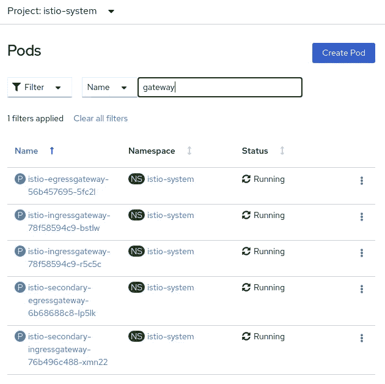

这个新网关中的另一个重要设置是*标签*，因为我们可以在*网关*对象的*选择器*字段中使用这些标签来选择正确的入口网关。如果您检查新的辅助网关上的标签，您将看到*istio = secondary-egress gateway*标签已设置

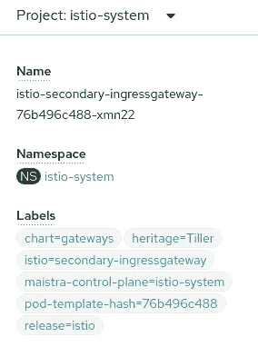

然后您可以在您的*选择器*中使用它，设置您的*网关*对象:

```
apiVersion: networking.istio.io/v1alpha3
kind: Gateway
metadata:
  name: hello-secondary-gateway
spec:
 **selector:
    istio: secondary-ingressgateway**
  servers:
  - port:
      number: 80
      name: http
      protocol: HTTP
    hosts:
    - "hello-secondary.<domain>"
```

在这种情况下，配置是在*二级 Ingres gateway*单元中完成的，而不是在*Ingres gateway*单元中完成的，但是为什么这样做有用呢？

除了每个网关“类型”有不同的配置之外，我们可以使用配置的标签并在专用节点中运行新的 Istio 网关 POD，这样我们就可以在新旧网关之间分流流量。除此之外，如果我们配置具有路由分片的专用入口控制器(请记住，在一天结束时，我们在 Istio 网关前配置“常规”OpenShift 路由，因此在分流流量时，您也应该考虑这一点)，我们可以为我们的服务网格输入/输出创建差异化的“区域”。

如果你不知道我在说什么，我建议你看一看 OpenShift worker nodes 博客系列中的[安全区域，更具体地说是网络配置文章:](/security-zones-in-openshift-worker-nodes-part-i-introduction-4f85762962d7)

[](/security-zones-in-openshift-worker-nodes-part-iii-network-configuration-3a887854a4d) [## OpenShift 工作节点中的安全区域—第三部分—网络配置

### 在本帖中，我们将重点讨论在我们的安全系统中分离入站和出站流量所需的网络配置…

itnext.io](/security-zones-in-openshift-worker-nodes-part-iii-network-configuration-3a887854a4d) 

谈到在我们的 Istio 入口网关前面配置的路由器，如果您还记得上一篇文章中的[，在控制平面网关定义上有一个设置，它执行“路由同步”:IOR。](https://luis-javier-arizmendi-alonso.medium.com/openshift-service-mesh-essentials-part-ii-control-plane-9c76a35936b5)

在*控制平面-a* 中，我们启用了 IOR，并在*控制平面-b* 中保持禁用状态，让我们探究一下这到底意味着什么。如果您看到当我在与启用了 IOR 的 *controlplane-a* 相关联的一个名称空间中创建如上所示的网关对象时发生了什么，您将会注意到在控制平面名称空间中如何自动创建具有已配置主机名的新路由:

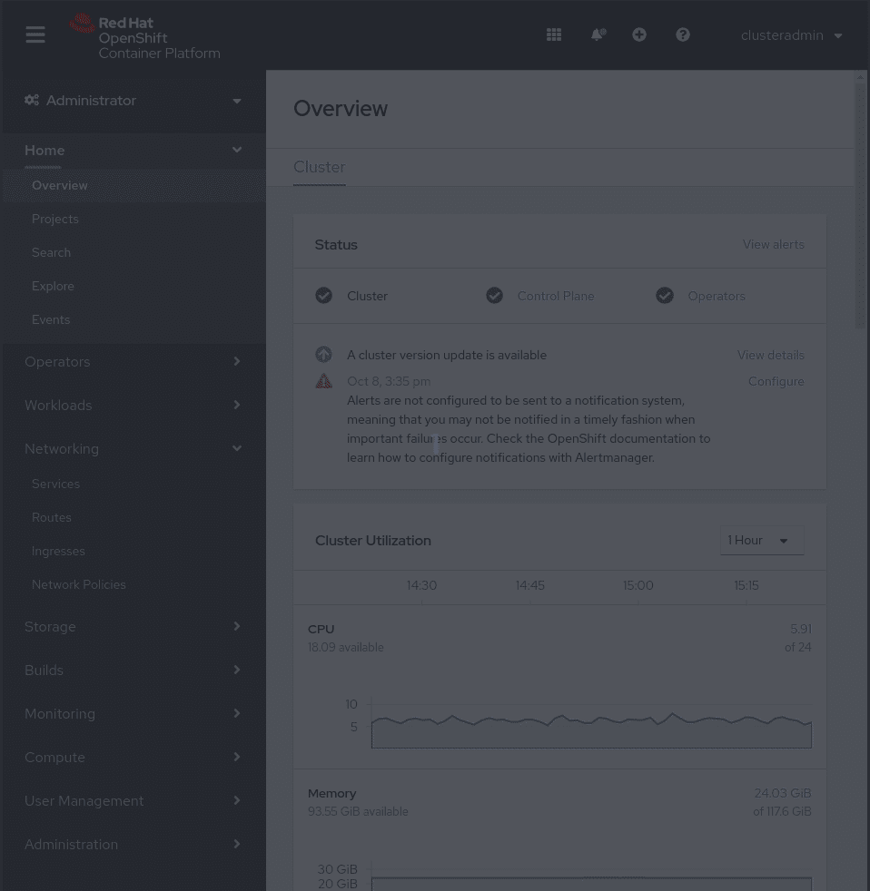

启用 IOR 后，您可以立即配置 Istio 入口网关，以接受主机名和必须放在它前面的 OpenShift 路由，从而将连接重定向到正确的 Istio 入口网关。

如果您看一下路由定义，您会发现该路由正在将流量发送回一个名为*istio-Ingres Gateway*的服务，该服务是带有标签*app = Istio-Ingres Gateway*和*Istio = Ingres Gateway*的负载平衡 PODs，这是我们的(主要，而不是我们刚刚配置的辅助)Istio 入口网关 PODs(有两个，因为我们在控制平面定义中配置了最少两个):

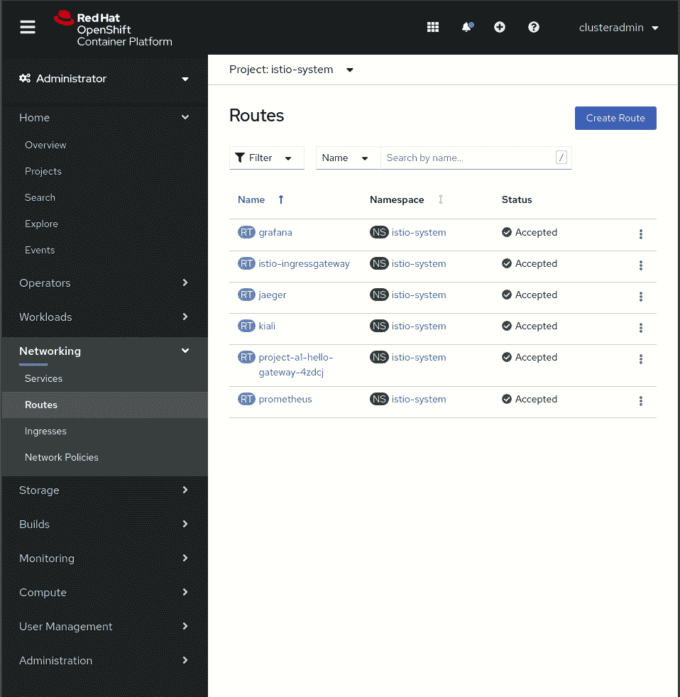

如果您在与禁用 IOR 的 *controlplane-b* 关联的名称空间中创建网关，您会发现在您的控制平面中没有任何路由:


您可以手动创建一个指向正确入口网关服务的路由条目，否则，您在网关对象中配置的特定主机名的用户请求将在 OpenShift 入口控制器级别被丢弃，因此它甚至不会到达 Istio 入口网关。在这种标准设置中，Istio 入口网关使用路由来获取流量，但如果您可以使用其他服务设计(非 ClusterIP)来发布它们，从而可以在不使用入口控制器的情况下访问 pod，则您可以使流量到达 Istio 入口网关，而无需 OpenShift 路由(在这种情况下，IOR 禁用可能有意义)。

我们已经看到了如何公开 HTTP 服务，但是 HTTPS 呢？我们将在下一篇文章的“安全特性”一节中讨论这个问题。

好的，我们讨论了许多事情，但是我们没有检查我们的路由在创建“网关”Istio 对象(在本例中是由 IOR sync 创建的 OpenShift 路由)后是否工作:

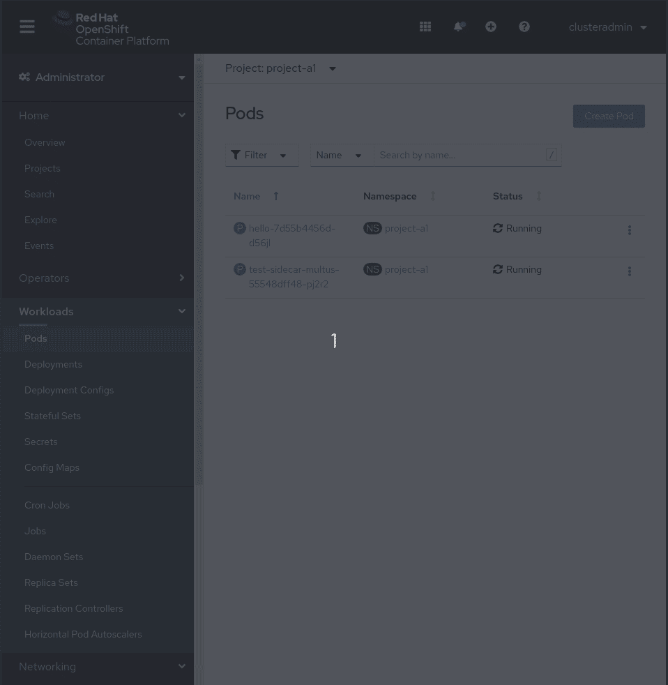

….它不起作用…不要惊慌，这是因为，如果你看一下网关定义，我们没有在任何地方包括我们创建的用于访问我们的应用程序的 Kubernetes 服务名称对象，所以 Istio 入口网关不能配置到它的内部路由。

入口网关并不像我们看到的那样自动意识到它们必须使用的服务。为了使入口网关知道网格中的服务，必须定义一个[虚拟服务](https://istio.io/latest/docs/reference/config/networking/virtual-service/)并将其应用于网关对象。

**虚拟服务**

虚拟服务对象可用于配置路由，包括不同的高级设置(默认情况下，入口网关使用循环模式在每个服务的负载平衡池中分配流量)，这将在另一篇文章中讨论(与其他额外的对象一起作为“目的地规则”)。在这里，我们只关注为网格中的应用程序提供外部连接，没有任何额外的设置。

让我们来看一个基本的虚拟服务对象定义:

```
apiVersion: networking.istio.io/v1alpha3
kind: VirtualService
metadata:
  name: hello-vs
spec:
  hosts:
  - "hello.<domain>"
  gateways:
  - hello-gateway
  http:
  - route:
    - destination:
        host: hello
        port:
          number: 8080
```

虚拟服务对象绑定了网关( *hello-gateway* )和在网关( *hello)中配置的一个主机(在我们的示例中，我们只配置了一个，但是可以包含多个主机定义)。<域>* )以及目的地 Kubernetes 服务( *hello* )及其端口号。一旦创建了绑定，您就可以测试您最终是否能够从集群外部访问应用程序:

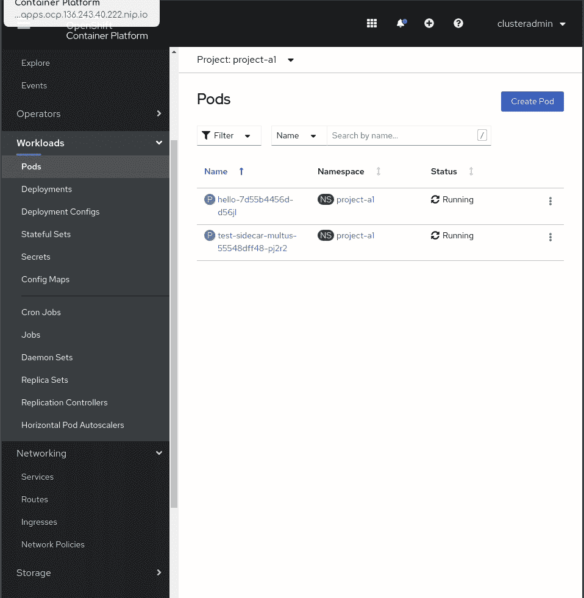

> 注意:如果您发现这不起作用，请查看一下 Kiali UI，因为如果您错误地配置了服务名，您在创建虚拟服务时不会得到任何错误，但是您会在 Kiali 中看到一条消息:

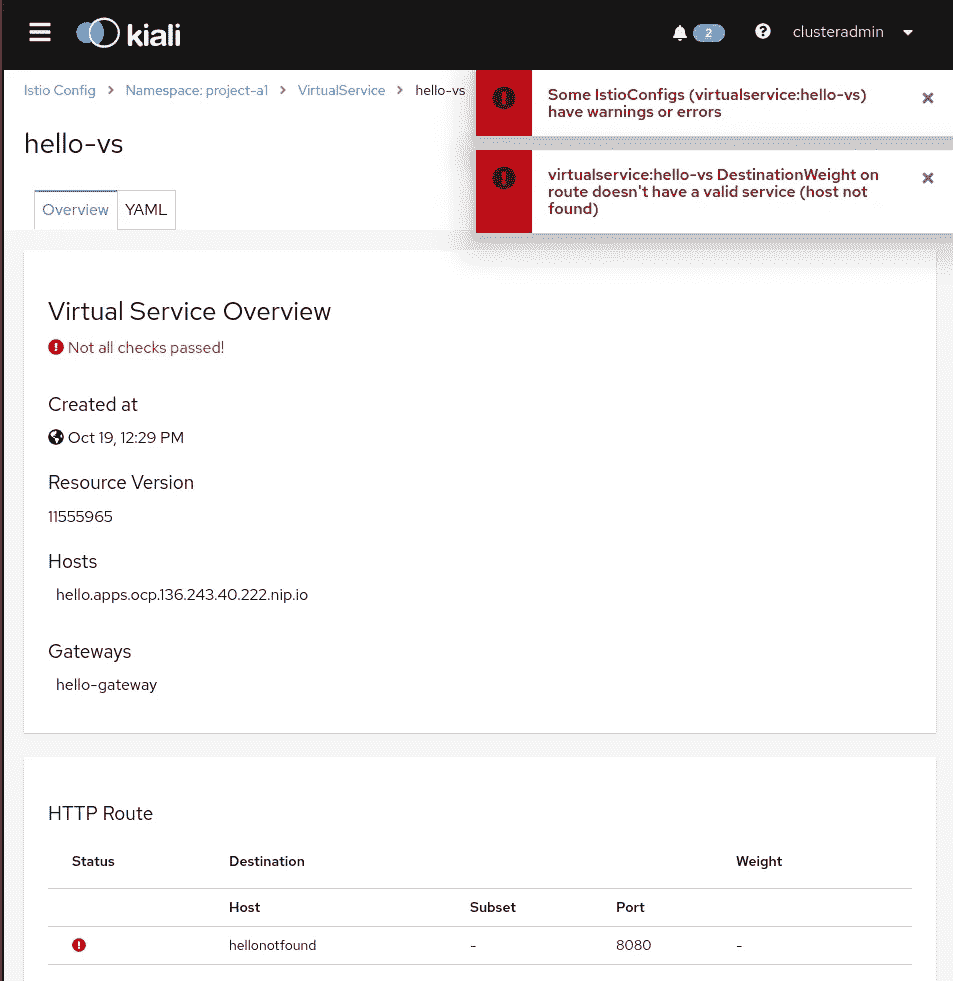

# 出口流量

这里的第一个问题是，默认情况下，服务网格如何处理传出流量？

您可能认为您会有与非服务网格传出流量相同的默认行为，即使用运行它的节点的 IP，让我们检查一下:

> **注意**:如果你不知道如何在 CoreOS 中使用 tcpdump，我建议你看看我的[关于 OpenShift worker 节点的安全区域](/security-zones-in-openshift-worker-nodes-part-i-introduction-4f85762962d7)系列，在那里，你可以看到关于在节点上使用非预安装 rpm 的解释，以及其他技巧

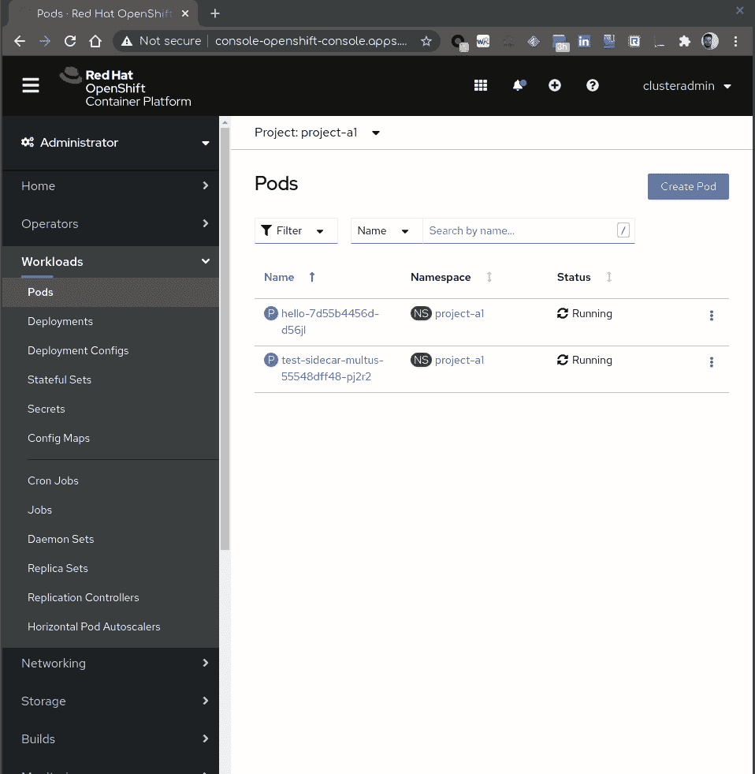

正如您在上面看到的，默认情况下，POD 使用节点 IP，那么，为什么我们有出口网关呢？您可以使用它们，但是您需要为这样的事情配置您的服务机制，在另一篇文章的服务网格路由特性回顾中，将会显示该配置以及其他配置。


> 既然我们已经回顾了控制平面和数据平面，在本系列的下一篇文章中，我们将开始研究一些服务网格特性。我希望你觉得它有用…当它完成时。
> 
> 以下是与 OpenShift 服务网格系列相关的其余文章:

[](https://medium.com/swlh/openshift-service-mesh-essentials-part-i-the-why-and-what-of-it-a3ef09bf8aa8) [## open shift Service Mesh Essentials—第一部分—原因和内容

### 在这第一篇文章中，我们将讨论一些关于 OpenShift 服务网格的介绍性问题，包括它的特性…

medium.com](https://medium.com/swlh/openshift-service-mesh-essentials-part-i-the-why-and-what-of-it-a3ef09bf8aa8) [](https://luis-javier-arizmendi-alonso.medium.com/openshift-service-mesh-essentials-part-ii-control-plane-9c76a35936b5) [## OpenShift 服务网格基础—第二部分—控制平面

### 在第二篇文章中，我们将介绍 OpenShift 服务网格控制平面的准备和部署。

luis-javier-arizmendi-alonso.medium.com](https://luis-javier-arizmendi-alonso.medium.com/openshift-service-mesh-essentials-part-ii-control-plane-9c76a35936b5) [](https://luis-javier-arizmendi-alonso.medium.com/openshift-service-mesh-essentials-part-iv-features-routing-3189dae64615) [## OpenShift 服务网格基础—第四部分—功能:路由

### 了解如何使用高级路由来修改应用程序的行为，而不包括 API 网关或…

luis-javier-arizmendi-alonso.medium.com](https://luis-javier-arizmendi-alonso.medium.com/openshift-service-mesh-essentials-part-iv-features-routing-3189dae64615)