# OpenShift 服务网格基础—第四部分—功能:路由

> 原文：<https://itnext.io/openshift-service-mesh-essentials-part-iv-features-routing-3189dae64615?source=collection_archive---------1----------------------->


在本系列的第一篇文章中，我们解释了为什么服务网格作为您的架构的一部分是有用的。

[](https://medium.com/swlh/openshift-service-mesh-essentials-part-i-the-why-and-what-of-it-a3ef09bf8aa8) [## open shift Service Mesh Essentials—第一部分—原因和内容

### 在这第一篇文章中，我们将讨论一些关于 OpenShift 服务网格的介绍性问题，包括它的特性…

medium.com](https://medium.com/swlh/openshift-service-mesh-essentials-part-i-the-why-and-what-of-it-a3ef09bf8aa8) 

在本文中，我们将开始配置服务网格，以更好地理解我们当时谈到的它的主要好处之一:高级路由。您可以使用这一功能来修改您的应用程序的行为，而不必在您的微服务中包含作为 API 网关或附加代码的外部部分。

我将谈到一些我们已经讨论过的控制平面和数据平面概念，因此如果您没有阅读之前的文章，我鼓励您阅读:

[](https://luis-javier-arizmendi-alonso.medium.com/openshift-service-mesh-essentials-part-ii-control-plane-9c76a35936b5) [## OpenShift 服务网格基础—第二部分—控制平面

### 在第二篇文章中，我们将介绍 OpenShift 服务网格控制平面的准备和部署。

luis-javier-arizmendi-alonso.medium.com](https://luis-javier-arizmendi-alonso.medium.com/openshift-service-mesh-essentials-part-ii-control-plane-9c76a35936b5) [](https://luis-javier-arizmendi-alonso.medium.com/openshift-service-mesh-essentials-part-iii-data-plane-341ce477c269) [## OpenShift 服务网格基础—第三部分—数据平面

### 在本文中，我们将通过展示一个应用程序部署来探索 OpenShift 服务网格数据平面…

luis-javier-arizmendi-alonso.medium.com](https://luis-javier-arizmendi-alonso.medium.com/openshift-service-mesh-essentials-part-iii-data-plane-341ce477c269) 

# 部署示例应用程序

我将使用与您在 Istio 文档中找到的相同的经典[示例应用程序:Bookinfo](https://istio.io/latest/docs/examples/bookinfo/)

该应用程序由四个主要部分组成:产品页面(登录页面)、有三个不同版本的评论(星级变化，从 v1 的无到 v3 的红星)、详细信息和评级。

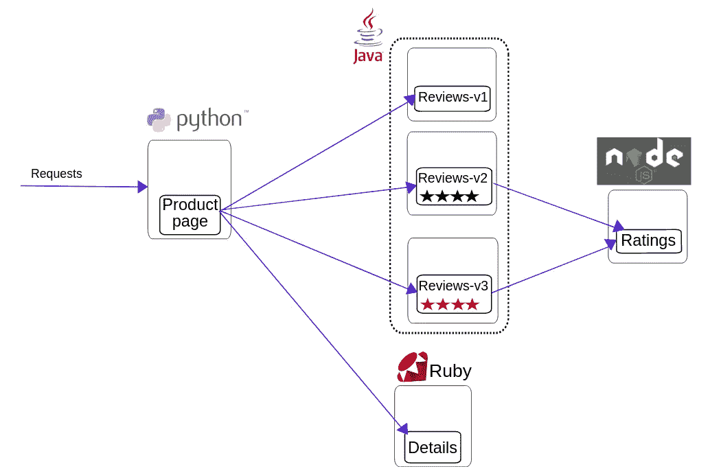

你可以在这里仔细检查部署 YAML [，但是那些不包括我们在 OpenShift 中需要的边车注入注释。为了简化操作，我将创建一个定义整个应用程序的对象，这很有用，因为使用 Web 控制台上的“+”按钮一次只能创建一个对象。我们这里有两个选项来将多个对象包含在一个单独的对象中，使用*种类:列表*或*种类:模板*。](https://raw.githubusercontent.com/istio/istio/release-1.4/samples/bookinfo/platform/kube/bookinfo.yaml)

唯一能在“+”按钮中工作的将是 Template，所以这是我将使用的一个，但是请记住，当您使用这种技术创建模板时，您将需要在第二步中“提供”该模板。

首先，看一下 YAML 对象(你将看到我是如何加入一些额外的注释和标签来使应用程序在开发者控制台上看起来更漂亮的)，然后检查下面的步骤。

```
kind: Template
apiVersion: template.openshift.io/v1
metadata:
  name: bookinfo-app
objects:
  ##############################
  # Details service
  ##############################
- apiVersion: v1
  kind: Service
  metadata:
    name: details
    labels:
      app: details
      service: details
  spec:
    ports:
    - port: 9080
      name: http
    selector:
      app: details

- apiVersion: v1
  kind: ServiceAccount
  metadata:
    name: bookinfo-details
    labels:
      account: details
- apiVersion: apps/v1
  kind: Deployment
  metadata:
    name: details-v1
    labels:
      app: details
      version: v1
      app.openshift.io/runtime: ruby
      app.kubernetes.io/part-of: Details
  spec:
    replicas: 1
    selector:
      matchLabels:
        app: details
        version: v1
    template:
      metadata:
        annotations:
          sidecar.istio.io/inject: "true"
        labels:
          app: details
          version: v1
      spec:
        serviceAccountName: bookinfo-details
        containers:
        - name: details
          image: maistra/examples-bookinfo-details-v1:1.1.0
          imagePullPolicy: IfNotPresent
          ports:
          - containerPort: 9080##############################
  # Ratings service
  ##############################
- apiVersion: v1
  kind: Service
  metadata:
    name: ratings
    labels:
      app: ratings
      service: ratings
  spec:
    ports:
    - port: 9080
      name: http
    selector:
      app: ratings

- apiVersion: v1
  kind: ServiceAccount
  metadata:
    name: bookinfo-ratings
    labels:
      account: ratings

- apiVersion: apps/v1
  kind: Deployment
  metadata:
    name: ratings-v1
    labels:
      app: ratings
      version: v1
      app.openshift.io/runtime: nodejs
      app.kubernetes.io/part-of: Ratings
  spec:
    replicas: 1
    selector:
      matchLabels:
        app: ratings
        version: v1
    template:
      metadata:
        annotations:
          sidecar.istio.io/inject: "true"
        labels:
          app: ratings
          version: v1
      spec:
        serviceAccountName: bookinfo-ratings
        containers:
        - name: ratings
          image: maistra/examples-bookinfo-ratings-v1:1.1.0
          imagePullPolicy: IfNotPresent
          ports:
          - containerPort: 9080##############################
  # Reviews service
  ##############################
- apiVersion: v1
  kind: Service
  metadata:
    name: reviews
    labels:
      app: reviews
      service: reviews
  spec:
    ports:
    - port: 9080
      name: http
    selector:
      app: reviews

- apiVersion: v1
  kind: ServiceAccount
  metadata:
    name: bookinfo-reviews
    labels:
      account: reviews

- apiVersion: apps/v1
  kind: Deployment
  metadata:
    name: reviews-v1
    labels:
      app: reviews
      version: v1
      app.openshift.io/runtime: java
      app.kubernetes.io/part-of: Reviews
  spec:
    replicas: 1
    selector:
      matchLabels:
        app: reviews
        version: v1
    template:
      metadata:
        annotations:
          sidecar.istio.io/inject: "true"
        labels:
          app: reviews
          version: v1
      spec:
        serviceAccountName: bookinfo-reviews
        containers:
        - name: reviews
          image: maistra/examples-bookinfo-reviews-v1:1.1.0
          imagePullPolicy: IfNotPresent
          ports:
          - containerPort: 9080

- apiVersion: apps/v1
  kind: Deployment
  metadata:
    name: reviews-v2
    labels:
      app: reviews
      version: v2
      app.openshift.io/runtime: java
      app.kubernetes.io/part-of: Reviews
    annotations:
      app.openshift.io/connects-to: ratings-v1
  spec:
    replicas: 1
    selector:
      matchLabels:
        app: reviews
        version: v2
    template:
      metadata:
        annotations:
          sidecar.istio.io/inject: "true"
        labels:
          app: reviews
          version: v2
      spec:
        serviceAccountName: bookinfo-reviews
        containers:
        - name: reviews
          image: maistra/examples-bookinfo-reviews-v2:1.1.0
          imagePullPolicy: IfNotPresent
          ports:
          - containerPort: 9080

- apiVersion: apps/v1
  kind: Deployment
  metadata:
    name: reviews-v3
    labels:
      app: reviews
      version: v3
      app.openshift.io/runtime: java
      app.kubernetes.io/part-of: Reviews
    annotations:
      app.openshift.io/connects-to: ratings-v1
  spec:
    replicas: 1
    selector:
      matchLabels:
        app: reviews
        version: v3
    template:
      metadata:
        annotations:
          sidecar.istio.io/inject: "true"
        labels:
          app: reviews
          version: v3
      spec:
        serviceAccountName: bookinfo-reviews
        containers:
        - name: reviews
          image: maistra/examples-bookinfo-reviews-v3:1.1.0
          imagePullPolicy: IfNotPresent
          ports:
          - containerPort: 9080##############################
  # Productpage services
  ##############################
- apiVersion: v1
  kind: Service
  metadata:
    name: productpage
    labels:
      app: productpage
      service: productpage
  spec:
    ports:
    - port: 9080
      name: http
    selector:
      app: productpage

- apiVersion: v1
  kind: ServiceAccount
  metadata:
    name: bookinfo-productpage
    labels:
      account: productpage

- apiVersion: apps/v1
  kind: Deployment
  metadata:
    name: productpage-v1
    labels:
      app: productpage
      version: v1
      app.openshift.io/runtime: python
      app.kubernetes.io/part-of: ProductPage
    annotations:
      app.openshift.io/connects-to: reviews-v1,reviews-v2,reviews-v3,details-v1 
  spec:
    replicas: 1
    selector:
      matchLabels:
        app: productpage
        version: v1
    template:
      metadata:
        annotations:
          sidecar.istio.io/inject: "true"
        labels:
          app: productpage
          version: v1
      spec:
        serviceAccountName: bookinfo-productpage
        containers:
        - name: productpage
          image: maistra/examples-bookinfo-productpage-v1:1.1.0
          imagePullPolicy: IfNotPresent
          ports:
          - containerPort: 9080
```

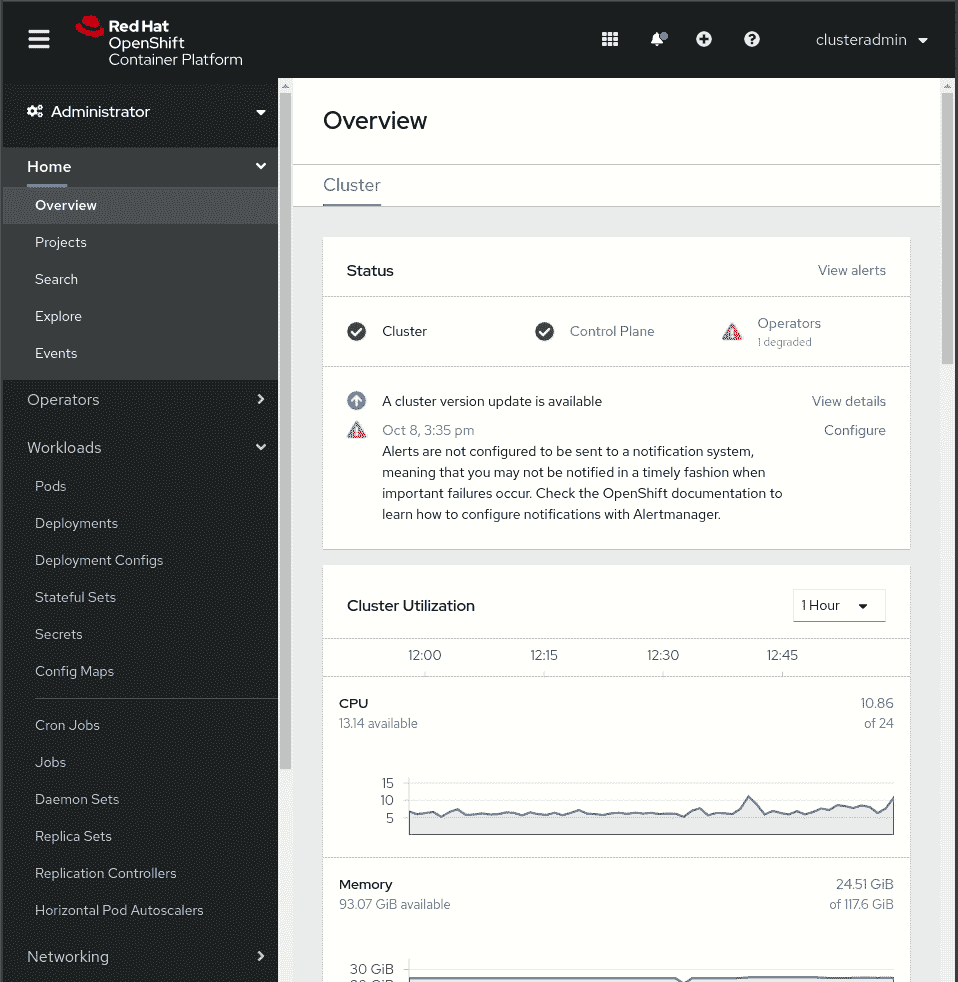

我们想要公开应用程序，所以现在我们必须创建*网关*和*虚拟服务*对象。如果你不知道我在说什么，看看上一篇文章中做的 [OpenShift 服务网格数据平面回顾。](https://luis-javier-arizmendi-alonso.medium.com/openshift-service-mesh-essentials-part-iii-data-plane-341ce477c269)

```
apiVersion: networking.istio.io/v1alpha3
kind: Gateway
metadata:
  name: bookinfo-gateway
spec:
  selector:
    istio: ingressgateway
  servers:
  - port:
      number: 80
      name: http
      protocol: HTTP
    hosts:
    - "bookinfo.<domain>"apiVersion: networking.istio.io/v1alpha3
kind: VirtualService
metadata:
  name: bookinfo-vs
spec:
  hosts:
  - "bookinfo.<domain>"
  gateways:
  - bookinfo-gateway
  http:
  - route:
    - destination:
        host: productpage
        port:
          number: 9080
```

完成后，您应该可以访问该应用程序:

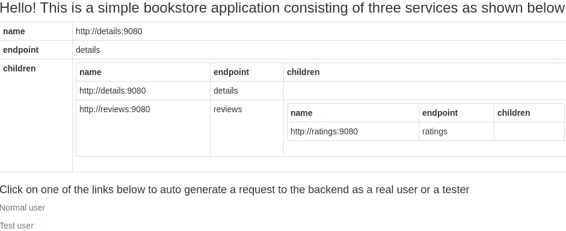

这是登录页面，但是为了到达实际的“服务”，您应该选择一个可能的请求(正常或测试)或者直接进入:

```
http://bookinfo.<domain>/productpage
```

我们现在可以开始使用服务网格功能了。

# 配置流量路由

在这一节中，我们将探索 Istio 提供的一些高级路由功能。

## 重定向登录页面

在这个例子中，我想去掉的第一件事是登录页面，我想直接进入评论，所以我需要一种方法来重定向我来自` *bookinfo 的请求。<域> /* `到` *bookinfo。<域> /productpage* `中

您还记得配置中介绍网关实际路由的部分吗？VirtualService，因此创建一个重定向请求的附加 VirtualService 就足够了。

```
apiVersion: networking.istio.io/v1alpha3
kind: VirtualService
metadata:
  name: bookinfo-vs-redirect
spec:
  hosts:
  - "bookinfo.<domain>"
  gateways:
  - bookinfo-gateway
  http:
  - match:
    - uri:
        exact: /
    redirect:
      uri: /productpage
```

在我们将要使用的 VirtualService 定义中，有两件事情需要注意:

1-有一个" *match* "/redirect 语句将选择受影响的请求，在本例中，任何请求都指向` *bookinfo。<域> /* `，并重定向到` *bookinfo。<域>/产品页面*`

2-没有" *route* "语句，将使用已经配置的语句。这里，我们在已经部署的*虚拟服务*的基础上添加了额外的配置，因为`istio-pilot`会将额外的路由规则合并到主机的现有配置中。您现在可能会想到一个问题:如果我们可以通过创建额外的 VirtualService 对象来添加配置，那么应用 VirtualService 对象的顺序是什么？

答案是顺序无法保证，所以注意不要配置冲突的规则。关于这一点也有一个很好的实践，试着配置一个“默认”规则(没有*匹配*语句或者有*匹配* =*)放在列表的末尾。

## 多个微服务版本

当我们打开` *bookinfo。<域> /* `我们的请求到达*产品页面*服务(这是我们在第一个*虚拟服务*中定义的)，然后*产品页面*将通过向 Kubernetes 服务名称发送请求来查询*详细信息*和*评论*微服务，如您在[源代码](https://github.com/istio/istio/blob/master/samples/bookinfo/src/productpage/productpage.py)中所见:

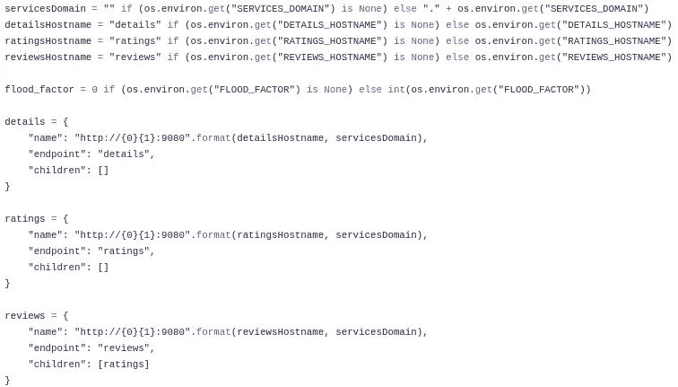

“r*eviews*”Kubernetes 服务后面有三个 pod:

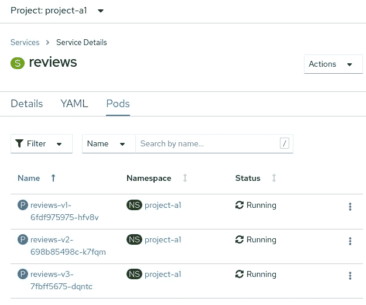

每个 POD 运行不同的容器映像(不同的版本)，并且它们是由不同的部署创建的(它们共享服务，因为它们也共享“ *app: reviews* ”标签)。如你所知，Kubernetes 服务的负载平衡行为是循环的，这就是为什么每次你刷新` *bookinfo。<域> /* `你会看到你正在到达一个不同版本的*评论*微服务(你可以看一看，看看评级星是如何变化的)。

感谢 Kiali，让我们轻松测试一下这种行为。首先，我们需要向我们的服务发送多个请求，因为我不想不断刷新我的 web 浏览器，所以我将使用一个 *watch* 加*一个 *curl* 命令(包括-L 以便跟随 HTTP 重定向):*

```
watch --interval 1 curl -L [http://bookinfo](http://bookinfo).<domain>
```

然后，您可以转到 Kiali>Graph 并启用“请求百分比”:

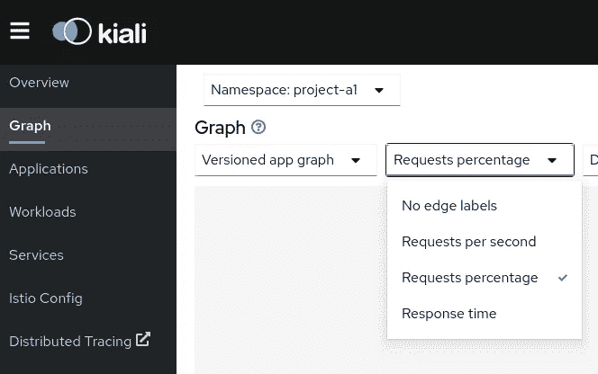

您可以看到点评服务和不同应用程序版本之间的流量百分比应该接近 33% (100/3)

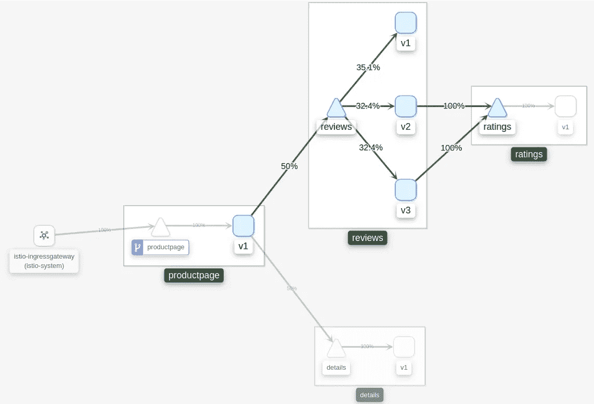

但是，如果我想按照任何常规的部署策略来部署我的不同版本，例如，A/B 或蓝绿色部署，该怎么办呢？我们如何改变这种默认行为，例如，将总流量的 80%发送到一个特定版本？

无论有没有 OpenShift 服务网格，这都是可能的，但正如您所理解的，当您有 OpenShift 服务网格时，可能性会更大。

如果你想了解如何在“简单的”OpenShift 中做到这一点，我建议你看看我创建的 OCP 开发者入门实验室:

[](https://github.com/luisarizmendi/lab-ocp-intro) [## luisarizmendi/lab-ocp-intro

### 本教程将作为帮助您理解 Openshift 概念的逐步指南。我们将部署…

github.com](https://github.com/luisarizmendi/lab-ocp-intro) 

如果你没有自己的 OpenShift 集群，你可以通过在 learn.openshift.com 订购一个免费的 OpenShift 游乐场来运行它，尽管这个环境只能持续一个小时。

> **注意**:如果您想在 KVM 中部署 OpenShift 集群，您可能会发现这个库很有用: [ocp-kvm-bm-upi](https://github.com/luisarizmendi/ocp-kvm-bm-upi) 和 [ocp-libvirt-ipi](https://github.com/luisarizmendi/ocp-libvirt-ipi) 。如果您只是需要关于 OpenShift 先决条件的帮助，您可以使用这个角色: [ocp-prereq-role](https://github.com/luisarizmendi/ocp-prereq-role)

如果你只是想阅读[的内容，我介绍了不同的部署策略，以及如何在 OpenShift 中配置它们，你可以看看研讨会源代码中的 ADOC 文件。](https://github.com/luisarizmendi/lab-ocp-intro/blob/master/workshop/content/modules/16advdeploystrategy.adoc)

如您所见，当使用不带服务网格的 OpenShift 时，背后的想法不是改变 Kubernetes 服务对象的行为方式，而是使用 OpenShift 路由器的扩展功能(将它们与常规入口控制器对象进行比较)。

OpenShift 服务网格不会改变标准的 Kubernetes 服务对象，但也不会使用 OpenShift 路由器，它会通过配置 *VirtualService* 对象来配置路由规则。

我们需要在配置虚拟服务时考虑以下几点:

*   当请求发送到 Kubernetes 服务名(而不是用于从集群外部到达服务的 URI)时，它必须生效，因此我们需要在“host”字段中添加服务名。
*   我们需要一种方法来区分不同的微服务版本，这里我们需要讨论一个新的对象，Istio[*destination rules*](https://istio.io/latest/docs/reference/config/networking/destination-rule/)

*DestinationRules* 影响流量在被 *VirtualService* 路由后的交付方式，但也可用于定义如何隔离我们不同的微服务版本，并在 *VirtualService* 对象中使用该定义。

在我们的例子中，我们将使用我们在每个不同版本的每个部署对象中配置的标签(特别是标签“ *version* ”)。

```
apiVersion: networking.istio.io/v1alpha3
kind: DestinationRule
metadata:
  name: reviews-dr
spec:
  host: reviews
  subsets:
  - name: **v1**
    labels:
      **version: v1**
  - name: **v2**
    labels:
      **version: v2**
  - name: **v3**
    labels:
      **version: v3**
```

正如您所看到的，我们给每个标签匹配起了一个名字(即。使用将在虚拟服务的“*子集*字段中使用的*版本=v1* 时，命名 *v1* :

```
apiVersion: networking.istio.io/v1alpha3
kind: VirtualService
metadata:
  name: reviews-80v1-20v2
spec:
  hosts:
    - reviews
  http:
  - route:
    - destination:
        **host: reviews**
        **subset: v1**
     ** weight: 80**
    - destination:
       ** host: reviews
        subset: v2**
      **weight: 20**
```

通过这种方式，我们可以区分不同的微服务版本(在本例中应用不同的权重),而不必部署多个 Kubernetes 服务对象。

您可以在 Kiali 中查看这些百分比，80%到 v1，20%到 v2，0%到 v3

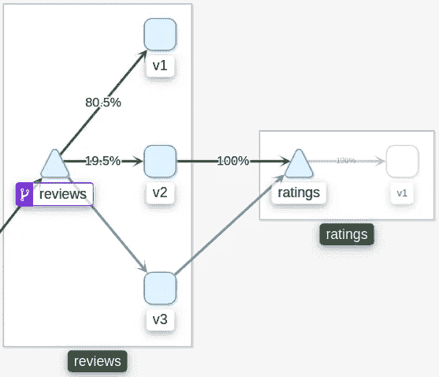

Kiali 还可以更容易地发现我们使用此*虚拟服务*配置的 80/20 流量分布:

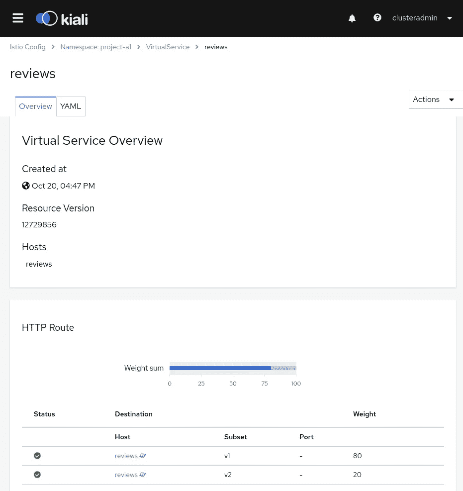

如果我试图用几个子集字段配置一个*虚拟服务*，但是我忘记创建匹配的 *DestinationRule* 怎么办？在创建*虚拟服务*时，您不会注意到任何事情，但是如果您看一下 Kiali UI，您会看到一些消息:

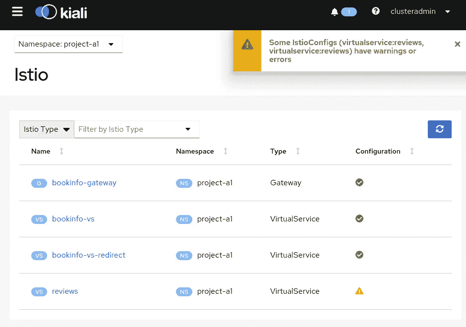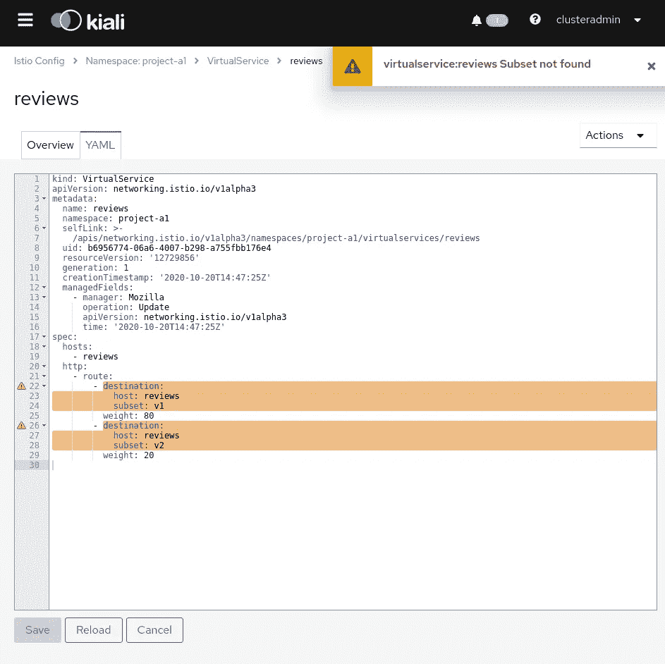

使用上面的配置，我们将 80%的请求发送到 v1，20%发送到 v2(未使用 v3)。如果您删除权重变量，您将得到定义的子集之间的 50/50(v3 也不会被使用)。这很好，但并不令人印象深刻，因为我们可以在没有服务网格的情况下使用 OpenShift 获得相同的行为(尽管在这种情况下更复杂，灵活性更低)，让我们超越这一点，基于其他触发器配置路由，而不仅仅是“权重”，让我们基于 HTTP 头进行路由。

如果你注意的话，在主页的右上角你可以找到一个“登录”按钮:


[查看应用程序的源代码](https://github.com/istio/istio/blob/81fe6075722b5a083743ee6d7180daff1bb77f93/samples/bookinfo/src/productpage/productpage.py)，您可以看到该按钮正在做什么，它正在设置一个变量“ *user* ，其名称在“ *session* 数组中引入。

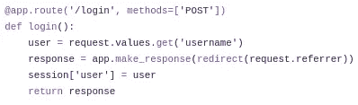

如果您继续查看代码，您会看到它是如何在一个名为“*最终用户*的新头中转发变量“*用户*”(到*评论*和*细节*服务):

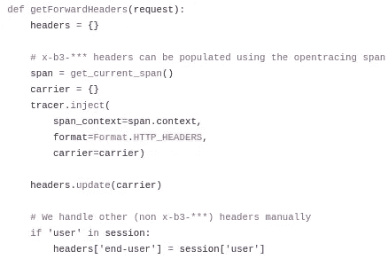

当您在没有登录的情况下请求页面时，您可以通过检查 HTTP cookies 来检查它实际上是如何工作的，当您登录时，您应该会看到有一个名为“session”的新 Cookie:


我的“会话”Cookie 的内容是:

```
eyJ1c2VyIjoiamFzb24ifQ.X48MLA.aeYGJKietWgCLAPAgNrSMCO85NA
```

如果您使用 base64 解码该内容，您将看到实际的变量和值:

```
$ echo -ne eyJ1c2VyIjoiamFzb24ifQ.X48MLA.aeYGJKietWgCLAPAgNrSMCO85NA | base64 -d{"user":"jason"}
```

接下来的想法是检查这个头，并根据发现的内容决定如何路由请求，但是请记住，我们已经检查了代码，我们发现这里有两个不同的头，我应该使用哪个头呢？(位于从我的浏览器到*产品页面*的请求中的*会话*头或者从*产品页面*转发到*的*最终用户*头审查*微服务，并且也包含用户信息)

我们想要修改的流量是对 reviews 微服务的请求，因此我们需要选择包含在这些请求中的报头，即*最终用户*报头。

既然我们知道我们需要基于*终端用户*头创建一个规则，那么让我们来确定匹配的实际值。我将使用与您在 Istio 文档中找到的示例相同的示例:

*   当您以“Jason”用户的身份登录时，您将到达 reviews 微服务的版本 v2(您将在“Review”下找到黑色星星)
*   当以任何其他用户身份登录或未登录时，请求将被路由到 reviews 微服务的版本 v1(无星号)

如果您还记得在第一个例子中，我们将请求重定向到"/"，我们在*虚拟服务*中使用了一个"*匹配*"语句来选择流量，这次我们也将使用它，但不是 URI，我们将看看头部。

如果"*最终用户*标题上的内容与" *jason* "完全匹配，请求将被路由到 reviews v2(请记住，我们使用的是由之前创建的 *DestinationRule* 定义的“子集”)

> 注意:这个 VirtualService 与上一个不冲突，在上一个中，我们以 80/20 的方式进行平衡，所以您可以同时配置两个服务，但是在继续基于头配置这个服务之前，最好删除那个服务。

```
apiVersion: networking.istio.io/v1alpha3
kind: VirtualService
metadata:
  name: reviews-jasonv2
spec:
  hosts:
    - reviews
  http:
 **- match:
    - headers:
        end-user:
          exact: jason
    route:
    - destination:
        host: reviews
        subset: v2**
  - route:
    - destination:
        host: reviews
        subset: v1
```

查看我们实际配置的内容(我删除了以前的 VirtualService，因此在未登录时我应该使用循环法来获得平衡):


很好，不是吗？现在，您可以开始使用匹配规则，并且“header”或 URI 不是唯一可以用来匹配您想要路由的流量的值，您可以查看 [Istio 文档，您会发现可以检查的不同字段](https://istio.io/latest/docs/reference/config/networking/virtual-service/#HTTPMatchRequest)。

## 交通镜

通过 Istio，您可以配置流量镜像，以便将实时流量的副本发送到镜像服务，这有助于故障排除、测试(您可以放置新版本的应用程序并检查其行为)或监控。

让我们使用这个特性来仔细检查一下, *productpage* 服务是否正在将请求转发给具有新标题*最终用户*的 *reviews* 服务(而不是我们在 web 浏览器上看到的*会话*标题),并且该标题包含我们在上一节中看到的用户变量。

如前所述，这个流量是内部的，所以我要做的是将来自*product page*-*reviews*的流量镜像到一个新的服务，该服务将侦听 HTTP 请求并在日志中打印包含的信息，这样我们就可以稍后查看 POD 日志并检查标题。

我将使用[这个应用程序](https://github.com/mendhak/docker-http-https-echo)执行我所说的操作，获取 HTTP 请求，并将内容写入日志，因此第一步是将其部署在我们的服务网格上。

为了部署它，我创建了这个部署对象，它指向容器映像并允许端口 9080，这是从 *productpage* 到 *reviews* 微服务的原始请求将使用的端口，你怎么知道呢？有一个简单的方法，你可以在这里使用 Jaeger(点击 Kiali 中的“分布式追踪”部分)。您只需要选择一个跟踪并查看详细信息，以便找到内部请求使用的端口。

> **注意**:记住，在这个控制平面(controlplane-a) [中，我们将“traceSampling”配置为 10%](https://luis-javier-arizmendi-alonso.medium.com/openshift-service-mesh-essentials-part-ii-control-plane-9c76a35936b5) ，因此在这种情况下，只有 10%的请求会在 Jaeger 中结束。

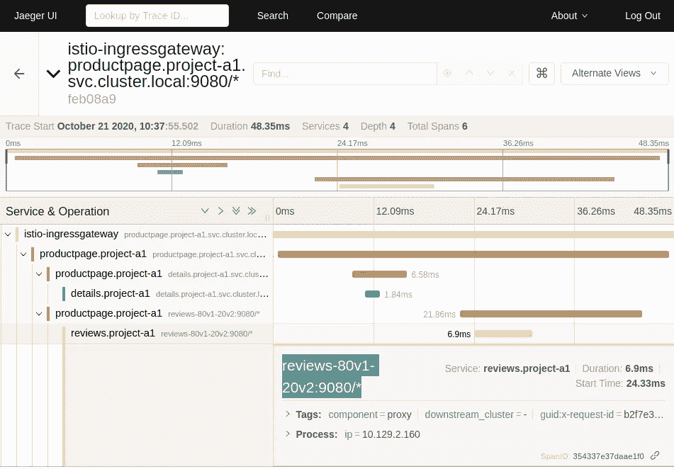

这是实际的部署对象，请注意，我们向 POD 开放了端口 9080，但是为了将应用程序配置为侦听该端口，我们需要包括一些环境变量:

```
apiVersion: apps/v1
kind: Deployment
metadata:
  name: http-https-echo
  labels:
    app: http-https-echo
    version: v1
    app.kubernetes.io/part-of: Mirror
  annotations:
    app.openshift.io/connects-to: productpage-v1
spec:
  replicas: 1
  selector:
    matchLabels:
      app: http-https-echo
  template:
    metadata:
      labels:
        app: http-https-echo
        version: v1
      annotations:
        sidecar.istio.io/inject: "true"
    spec:
      containers:
        - name: http-https-echo
          image: mendhak/http-https-echo
          ports:
            - containerPort: 9080
              protocol: TCP
            - containerPort: 9443
              protocol: TCP
          env:
            - name: HTTP_PORT
              value: '9080'
            - name: HTTPS_PORT
              value: '9443'
```

除了部署之外，我们将像以前一样配置一个 Kubernetes 服务:

```
apiVersion: v1
kind: Service
metadata:
  name: mirror
  labels:
    app: http-https-echo
    service: http-https-echo
spec:
  ports:
  - port: 9080
    name: http
  selector:
    app: http-https-echo
```

服务正在侦听(它不会出现在 Kiali 中，因为没有流量到达该服务)，现在我们需要镜像流量。我们希望检查带有报头的流量，因此我们只需要捕获对 *reviews* version 2 的请求，这是我们配置的在我们作为“Jason”用户登录的情况下需要联系的请求(我们也可以作为其他用户登录并检查 v1)。

我们需要修改 *VirtualService* ，在 *reviews* v2 的 route 语句下添加 mirror 部分:

```
apiVersion: networking.istio.io/v1alpha3
kind: VirtualService
metadata:
  name: reviews-jasonv2
spec:
  hosts:
    - reviews
  http:
  - match:
    - headers:
        end-user:
          exact: jason
    route:
    - destination:
        host: reviews
        subset: v2
 **mirror:
      host: mirror
    mirror_percent: 100**
  - route:
    - destination:
        host: reviews
        subset: v1
```

您可以使用 Kiali 而不是 OpenShift Web 控制台来修改该对象:


然后，在作为“Jason”用户登录时，使用 Web 浏览器向应用程序发送一些请求，流量必须镜像到新的 pod，并保存在日志中:


正如您所看到的，我们能够通过镜像流量来收集内部通信的信息，这不会影响实际的服务，并且我们检查了转发的报头*最终用户*如何包含具有正确用户名的用户变量。

## 管理出口流量

Istio 还允许控制出口流量。我们可以配置如何将流量发送到服务网格之外，例如，如果您的组织对使用专用节点离开服务网格的流量有安全要求，这将非常有用(就像我们在 OpenShift worker nodes 系列的“[安全区域”中对 Openshift 但没有服务网格所做的那样)](/security-zones-in-openshift-worker-nodes-part-i-introduction-4f85762962d7)

有一点使这种配置不同于入口路由。当您为入口配置任何路由规则时，您包括指向*服务*的*虚拟服务*对象，这些服务通过从 Kubernetes 集群获取信息而被发现并自动包括在服务网格服务注册中心中(因为我们创建了一个服务 Kubernetes 对象以便访问应用程序)。当您想要为出口流量配置路由规则时，您没有这样的 Kubernetes 服务(因为这些服务是为您在集群上运行的应用程序创建的),因此服务网格无法继续进行服务发现并更新其自己的服务注册表。

这可以通过使用 [Istio *ServiceEntry* 对象](https://istio.io/latest/docs/reference/config/networking/service-entry/)手动包含条目来解决，这样可以向 Istio 的内部服务注册表添加额外的条目。

但是首先，由于我们的应用程序不需要任何到外部资源的连接，我们将部署一个带有 CentOS 映像的 POD，从这里我们将使用 *curl* 查询 OpenShift 集群之外的内容。

```
apiVersion: v1
kind: Pod
metadata:
  name: egress-test
  annotations:
    sidecar.istio.io/inject: "true"
spec:
  containers:
  - name: example-pod
    command: ["/bin/bash", "-c", "sleep 99999999999"]
    image: centos/tools
```

如果您像我们在上一篇文章中所做的那样测试出口流量，您将会看到它正在使用节点的 IP，但是如果您在创建 ServiceEntry、EgressGateway 和相关的 VirtualService(见下文)之后尝试，您将会看到出口流量开始使用出口网关。

```
apiVersion: networking.istio.io/v1alpha3
kind: ServiceEntry
metadata:
  name: ifconfig
spec:
  hosts:
  - ifconfig.io
  ports:
  - number: 80
    name: http-port
    protocol: HTTP
  - number: 443
    name: https
    protocol: HTTPS
  resolution: DNS---apiVersion: networking.istio.io/v1alpha3
kind: Gateway
metadata:
  name: istio-egressgateway
spec:
  selector:
    istio: egressgateway
  servers:
  - port:
      number: 80
      name: http
      protocol: HTTP
    hosts:
    - ifconfig.io---
apiVersion: networking.istio.io/v1alpha3
kind: VirtualService
metadata:
  name: direct-ifconfig-through-egress-gateway
spec:
  hosts:
  - ifconfig.io
  gateways:
  - istio-egressgateway
  - mesh
  http:
  - match:
    - gateways:
      - mesh
      port: 80
    route:
    - destination:
        host: istio-egressgateway.istio-system.svc.cluster.local
        port:
          number: 80
      weight: 100
  - match:
    - gateways:
      - istio-egressgateway
      port: 80
    route:
    - destination:
        host: ifconfig.io
        port:
          number: 80
      weight: 100
```

下面您可以看到来自 egress-test POD 的出口流量如何首先使用其所在节点的 IP 地址(在我的例子中是 worker1)，但是在创建对象之后，它开始使用出口路由器所在的 IP 地址(在我的例子中是 worker0):


由于现在流量正在通过出口路由器，您现在可以对出口流量应用额外的控制和安全策略(我们将在下一篇文章中了解如何操作)以及出口流量操作，例如，假设您希望确保您的应用程序在端口 443 而不是 80 上使用 ifconfig.io…您可以通过调整 VirtualService 中的目标端口来动态修改从集群到外部服务的请求(在本例中为 ifconfig . io )(查看粗体文本并与之前的 VirtualService 进行比较)

```
apiVersion: networking.istio.io/v1alpha3
kind: VirtualService
metadata:
  name: direct-ifconfig-through-egress-gateway
spec:
  hosts:
  - ifconfig.io
  gateways:
  - istio-egressgateway
  - mesh
  http:
  - match:
    - gateways:
      - mesh
      port: 80
    route:
    - destination:
        host: istio-egressgateway.istio-system.svc.cluster.local
        port:
          number: 80
      weight: 100
  - match:
    - gateways:
      - istio-egressgateway
      port: 80
    route:
 **- destination:
        host: ifconfig.io
        port:
          number: 443**
      weight: 100
```


> 在本系列的下一篇文章中，我们将继续探索 OpenShift 服务网格(Istio)的特性，保持好奇…