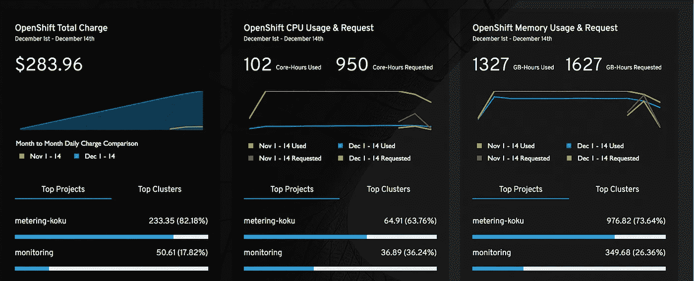
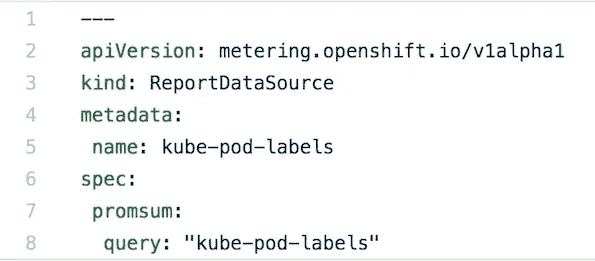
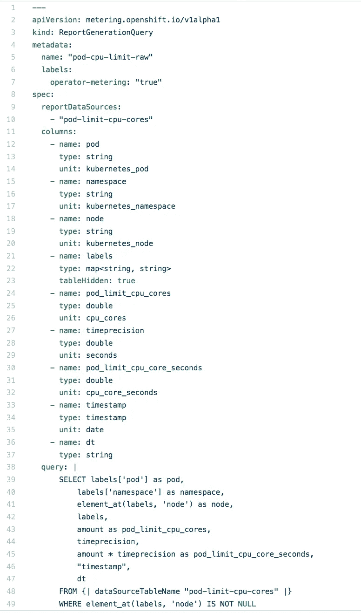
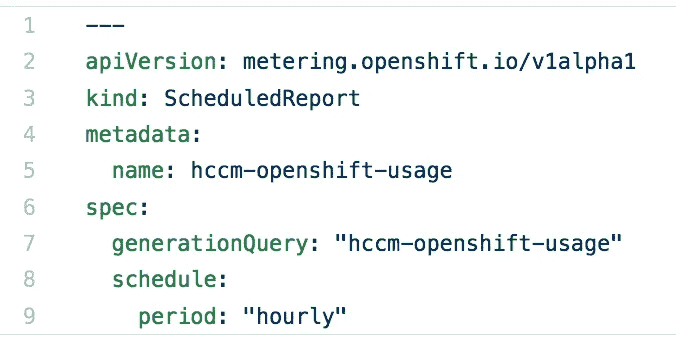
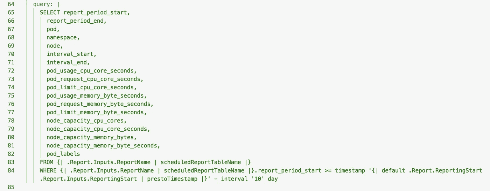

# 运营商计量与回顾:Kubernetes 报告

> 原文：<https://itnext.io/operator-metering-with-look-back-kubernetes-reports-85d6b86b1e3c?source=collection_archive---------0----------------------->

克里斯·利维拉尼在 [Unsplash](https://unsplash.com?utm_source=medium&utm_medium=referral) 上的照片

用于 [Kubernetes](https://kubernetes.io/) 的新[操作符框架](https://www.redhat.com/en/blog/introducing-operator-framework-building-apps-kubernetes)的一个伟大特性是[操作符计量](https://github.com/operator-framework/operator-metering)，该技术在 [OpenShift 3.11](https://docs.openshift.com/container-platform/3.11/release_notes/ocp_3_11_release_notes.html#ocp-311-operators) 中进行了预览。*操作员计量*为 [Prometheus](https://prometheus.io/) 收集的数据带来了 YAML 和 SQL 风格的访问。 *Prometheus* 因其在集装箱运营管理的度量、监控和警报方面的应用而闻名。从运营角度收集的数据通常集中在当前时间窗口；过去一小时、过去 24 小时和/或过去 7 天。然而，这种丰富的数据可用于各种其他情况，这些情况可能需要更长时间的回顾，如预测、异常检测、容量规划或比较(季度与季度、月/年、基于标签)。*操作员计量*能够以简单易用的方式访问这些数据，允许按需和按计划报告。这些报告本质上是将数据存储在 [Hadoop](https://hadoop.apache.org/) 中，并可以通过 API 端点访问，该端点可以返回不同格式的数据，如 CSV 或 JSON。*操作员计量*的特性为 *Kubernetes* 的 *Prometheus* 数据空间带来了类似于[亚马逊网络服务(AWS) Athena](https://aws.amazon.com/athena/) 的力量。如果您对利用此功能的前景感兴趣，那么您可以继续阅读此报告的应用，它有助于为窗口数据提供“操作方法”和有用的提示。

目前，我的开发团队专注于混合云的成本管理。我们正在利用使用指标和定义的费率来呈现一段时间内的成本数据视图。对于 *Kubernetes* ，成本数据在项目、节点、集群和标签之间被分割。

分解轮班成本

为了获得这些信息，我们正在利用*操作员计量*报告每小时收集 pod 的 CPU 和内存使用情况(存储即将推出)。然后，每天和每月汇总提取的使用数据以及定义的相关费率。

# 操作员计量报告的基础

让我们从描述*操作员计量*报告的一些基础知识开始，从数据源到报告生成和计划报告。这些对象都使用 YAML 来表达，并使用 *Kubernetes* 命令行存储为定义。从数据源开始，把它们想象成基于 *Prometheus* 查询定义的表。*操作员计量*附带一些[预定义的报告生成](https://github.com/operator-framework/operator-metering/blob/master/Documentation/report.md#generationquery)，例如“名称空间-CPU-请求”，也可用作数据源。

定义 kube-pod-labels 数据源

如果数据源不存在，您可以定义一个，如我们在示例中看到的，我们正在创建一个 [pod 标签数据源](https://github.com/project-koku/korekuta/blob/master/roles/setup/files/kube-pod-labels_report_data_source.yaml)，它为我们提供对在 *Prometheus* 中找到的 pod 标签的访问。

报告生成本质上是 SQL SELECT 语句，它们将填充您的 CSV 或 JSON 输出。在报告生成中，您定义名称、数据源、具有类型和单位的列，最后是针对已定义数据源的查询，该查询获取具有已定义列的记录。在下面的[示例中，您可以看到报告生成的定义及其名称、列和查询；在这里，您可以看到它如何收集当前时间间隔的 pod、名称空间(或项目)、节点和 CPU 核心限制。](https://github.com/project-koku/korekuta/blob/master/roles/setup/files/pod-limit-cpu-cores_report_generation_query.yaml)

“pod-cpu-limit-raw”的报告生成

现在，我们已经浏览了数据源和报告生成，您可以看到它们是如何相互构建的，但是，我们还没有一个可执行的报告。*操作员计量*支持一次性(或按需)报告和计划报告的概念。

定义每小时计划报告

这些报告可以有一个定义的开始和结束周期，如果您正在定义一个[一次性报告](https://github.com/operator-framework/operator-metering/blob/master/Documentation/using-metering.md#creating-a-report)，您可以指定*" run immediate:true "*，对于[计划报告](https://github.com/project-koku/korekuta/blob/master/roles/setup/files/hccm_openshift_usage_lookback_scheduled_report.yaml)，您可以指定一个[周期](https://github.com/operator-framework/operator-metering/blob/master/Documentation/report.md#period)，如每小时、每天等。在左侧的示例中，您可以看到没有提供开始或结束期间，这意味着该报告将无限期运行。无限期运行报告的概念很有吸引力，但是，不指定开始和结束时间段的缺点是，当[请求报告](https://github.com/operator-framework/operator-metering/blob/master/Documentation/using-metering.md#viewing-reports)的结果时，随着请求的数据大小不断增长，您可能会达到性能极限。

# 合并报表中的数据

如上所述，*操作员计量*简单易用。如果您熟悉 SQL，您可能会直觉地知道如何组合数据。我在上一节中简要提到，一个报告生成可以用作另一个报告生成的数据源；您还可以提供在报告生成中使用的多个数据源。继续从数据源只是一个表的角度来看，那么您可以正确地推断出您可以连接这些表中的数据，这可以在[这个示例报告生成](https://github.com/project-koku/korekuta/blob/master/roles/setup/files/hccm_openshift_usage_report_generation_query.yaml)中看到，它是使用九个先前定义的报告查询构建的。

# 聚合和窗口

有了组合数据的能力，我们可以看到，如果需要每小时收集一次，报告的大小会增长得非常快。数据的增长最终会导致性能问题，对于某些视图，您可能不需要细粒度的每小时数据，但更感兴趣的是平均值或最大值，*操作员计量*支持[汇总报告](https://github.com/operator-framework/operator-metering/blob/master/Documentation/rollup-reports.md)来提供这种功能。

但是，如果您确实需要更细粒度的细节，您最初的方法可能是创建具有定义的开始和结束时间段的报告块，以限制将为报告返回的数据量。使用报告块的方法是可行的，但是，为了访问数据，需要一些命名方案，此外，随着时间的推移，您需要继续创建报告块，这可以是自动化的，但也为错误和丢失数据留下了机会。对于我们的用例，开发团队想到了带有回顾的窗口数据的概念，这带来了额外的性能优势，实质上是在现有的表上构造一个视图。

具有 10 天回顾的查询

正如我们在上面的例子中所看到的，您可以[构建一个报告生成](https://github.com/project-koku/korekuta/blob/master/roles/setup/files/hccm_openshift_usage_lookback_report_generation_query.yaml)窗口来显示返回的数据。链接的报告生成从讨论合并数据的部分获取报告生成，该部分具有[不确定的每小时计划报告](https://github.com/project-koku/korekuta/blob/master/roles/setup/files/hccm_openshift_usage_scheduled_report.yaml)，并选择最近 10 天的数据。根据数据量和查看数据请求所需的响应能力，您可以调整回看的天数。如果需要恢复数据或用于其他用途，您也可以使用相同的技术来提供开始和结束周期，而不是窗口数据。

# 摘要

希望这个故事已经告诉了你一个有用的新工具，*操作员计量，*，并给了你许多潜在用途的想法或你感兴趣收集的报告。我们讨论了*操作计量*及其组件的基础:数据源、报告生成和报告。接下来，我们看了如何组合来自多个数据源的数据，以及与大量数据和计划报告相关的一些缺点。最后，我们讨论了如何使用聚合和窗口数据来提取所需的数据，并限制从无限期计划的报告中访问细粒度数据。