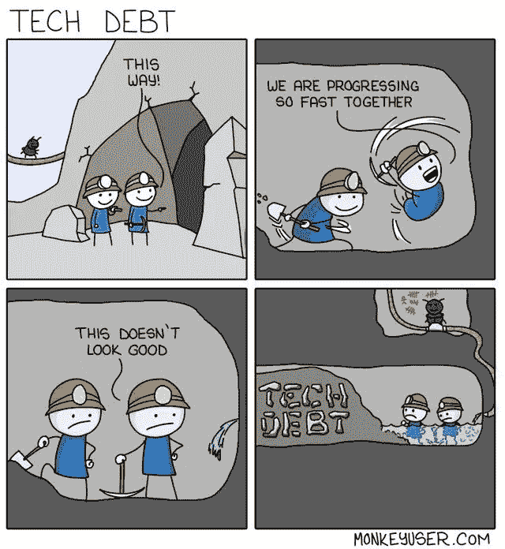
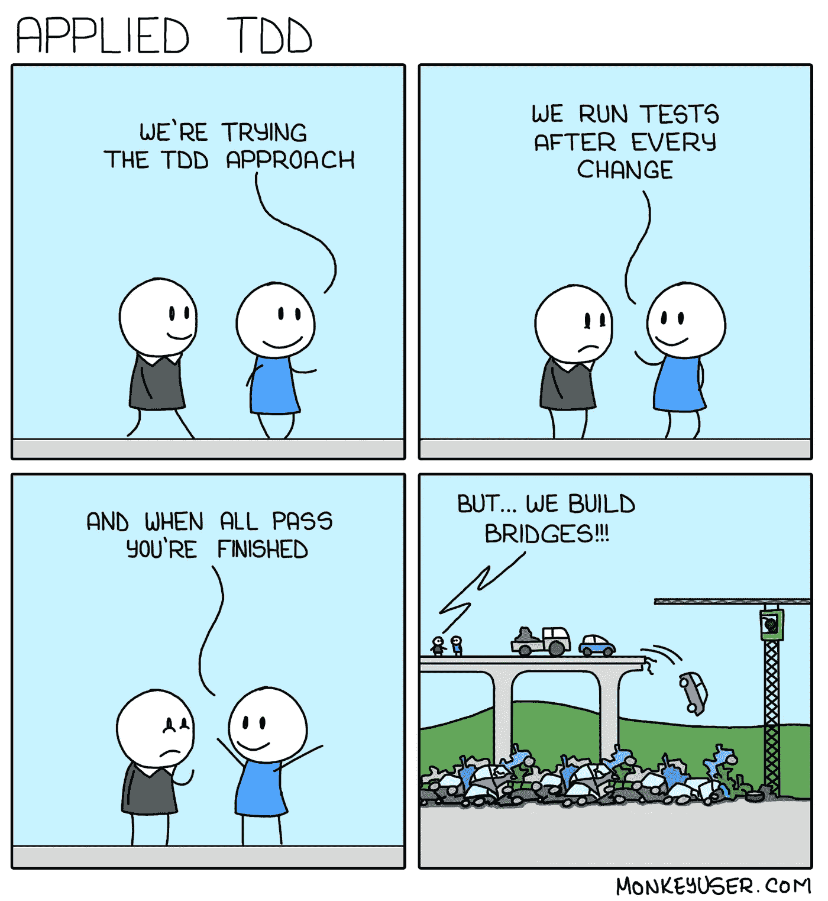
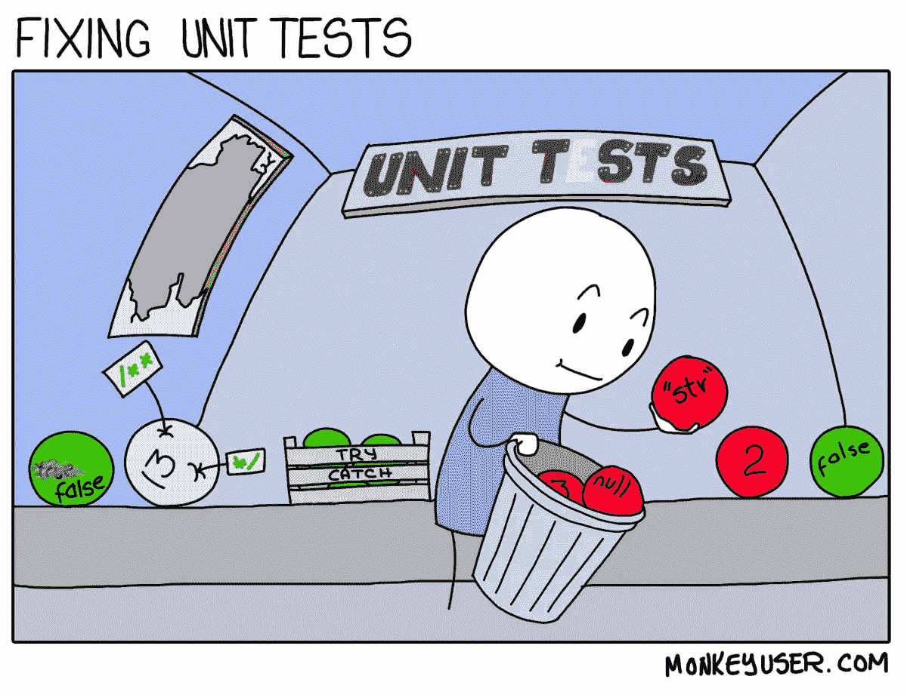

# 机会测试

> 原文：<https://itnext.io/opportunistic-testing-28bfd2ca5572?source=collection_archive---------2----------------------->

软件工程是最年轻的工程学科之一。与其他的相比，它还不够成熟；因此，实践、流程和工具仍在发展。

机会性测试是我几年前受[机会性重构](https://martinfowler.com/bliki/OpportunisticRefactoring.html)方法的启发而创造并信奉的一个概念。

## 技术债务

在我看来，技术债务是加速开发过程以缩短学习周期的预期副作用。

作为开发人员，尽管有技术债务，我们在交付和更快迭代之间的选择处于一个不舒服的境地；或者交付更好的代码，尽管减缓了迭代过程。

在某种程度上，我们需要在利息变得不可持续之前开始偿还技术债务。

## 机会性重构

在一个敏捷的世界里，我们希望交付持续的价值并迭代结果，在大型重构上花费太多时间是不可行的。

机会性重构是指在依赖 scout 规则的开发周期中重构代码。

> 永远要让露营地比你发现的时候干净

在软件开发中，我们可以把它重新表述为:

> 总是让代码比你发现时更干净

这种方法侧重于重构大多数开发人员在特性维护和开发过程中接触到的代码，这是与业务和开发人员更相关的代码。以更有意义的方式帮助减少技术债务和提高代码质量。

然而，良好的测试覆盖对于重构而言是必要的，不会引入破坏性的变化或更多的副作用。

## 测试驱动开发(TDD)

我喜欢 [TDD](https://martinfowler.com/bliki/TestDrivenDevelopment.html) ，因为我们首先关注功能，而不是实现细节。

然而，TDD 依赖于清晰的业务需求和一定的业务知识，以确保我们覆盖正确的场景。

> 开发人员如何知道他们驱动开发的测试是正确的测试？

作为第一种测试方法，TDD 需要评估在早期迭代中不断更新测试和逻辑的成本值，并注意不要影响迭代过程和开发人员的体验。

## 机会测试

测试覆盖率是一个度量标准，可以帮助理解测试了多少代码和功能。期望的覆盖率取决于团队目标，但合理的百分比范围是 70-80%。

然而，很难确保最相关的功能已经被覆盖，在最坏的情况下，它们是剩余的 30–20%的一部分。

*机会测试* 方法是关于调整测试和重构工作，在早期迭代中关注最相关和最清晰的功能。

测试覆盖率低也没关系，比如说 30-50%，重要的是我们覆盖了 80-100%最相关和最重要的功能。

最后，作为开发周期的一部分，我们将在接下来的迭代中继续实践这一点，以增加覆盖率和代码质量以及相关的功能。

> 总是让**代码**和**测试**比你发现的更好

## 利益

*   确保测试覆盖面集中在影响业务的最相关的功能上。
*   启用机会性重构。
*   加速开发周期和迭代过程。
*   避免为不清楚的功能编写测试
*   避免对可以在后续迭代中删除的特性进行详尽的测试(特性实验)

**挑战**

*   找出最相关的功能。
*   实施左移测试，与 QA 工程师合作，以确保相关功能得到很好的识别。

## **最终想法**

您可以在您的团队中试验这种方法，并测量结果。这在我之前的团队中行得通，但是我们的环境可能与你的不同。

感谢阅读！我真的很感激你的想法，请随意评论。