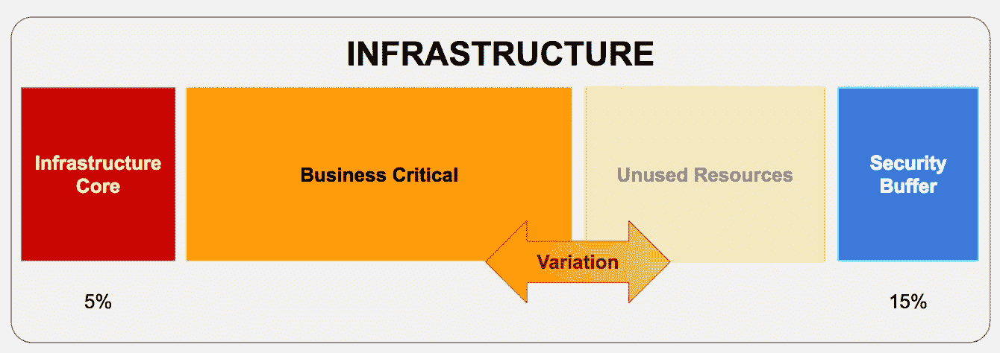
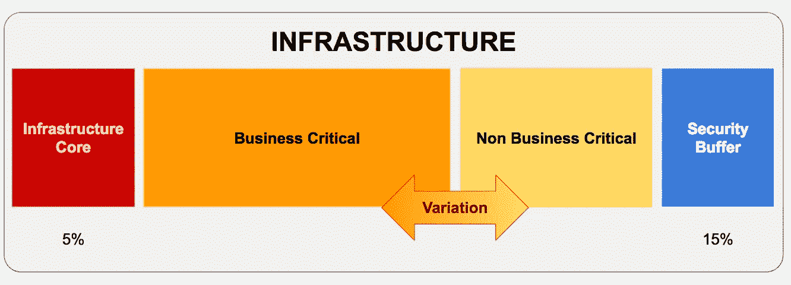
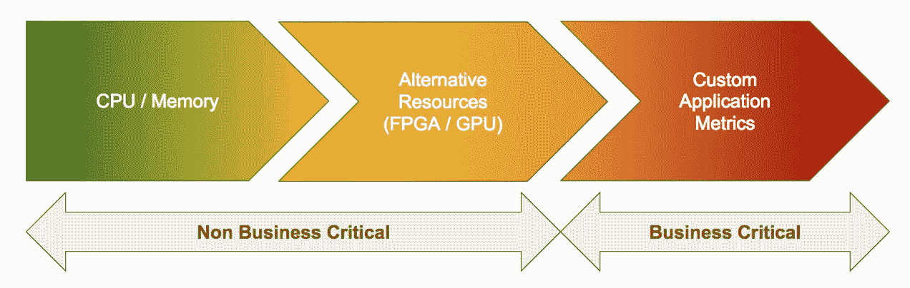
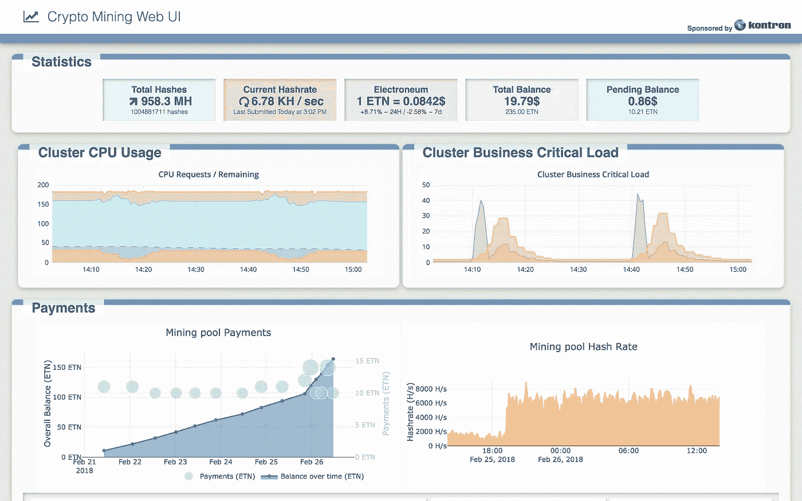
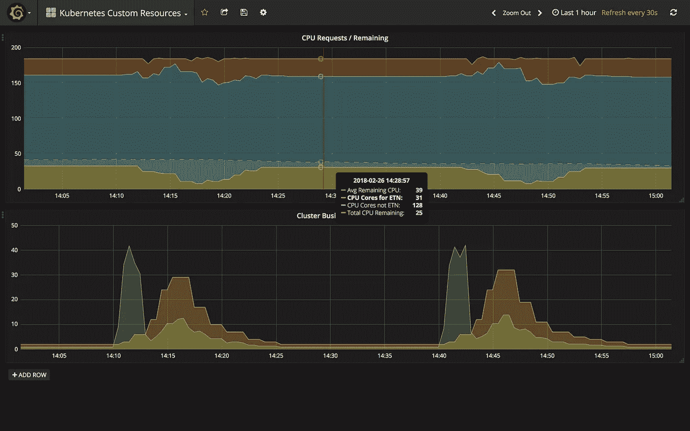
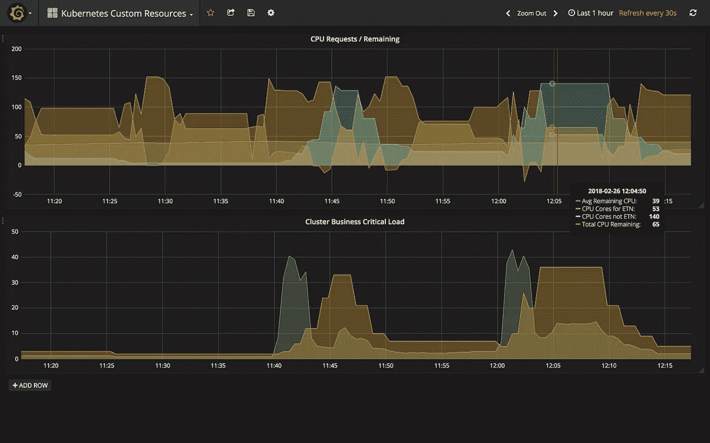

# 用你闲置的硬件印钞票

> 原文：<https://itnext.io/opportunistically-mining-cryptocurrencies-in-kubernetes-94934d095c4d?source=collection_archive---------3----------------------->

让我们假设您运营着一个大型裸机集群，您将其租赁给客户来运行他们的工作负载。

您会注意到，在过去几个月中，该集群实际上平均只使用了 60%。您保留了 15%的空闲容量以应对电涌，并且您需要 5%的群集容量来运行基础架构本身。

基础架构中资源使用的分割

一天中的某些时候会出现负载达到 90%的峰值，但这确实很难预测，因为它们取决于您客户的业务，并不遵循您所拥有的数据模式。总的来说，你总是有大约 20%的未开发能力。

作为服务提供商，或者当您的办公室中有一堆服务器时，您可能会遇到这种情况。不管怎样**，都是浪费**。

如果我们能够充分利用这些资源并善加利用，会怎么样？让我们看看如何！是的[特斯拉汽车](https://medium.com/u/24413768aadb?source=post_page-----94934d095c4d--------------------------------)这是给你的；D

# “机会自动缩放”

## Kubernetes 和自动缩放

从 K8s 的 v1.2 开始，可以使用水平 Pod 自动缩放器根据 CPU 消耗自动缩放一个 app。很酷但非常有限的用例。

从 1.6 版开始，您可以使用自定义指标来自动扩展群集中的应用程序。好多了。这意味着您可以公开 API 的命中次数或其延迟等指标，然后根据该指标而不是默认的 CPU 负载来扩展服务单元。

这难道不意味着我们可以公开集群的剩余容量(20%)，并利用它来自动调整印钞应用程序的规模，从而使集群永远以最佳容量使用吗？

你真正想要的是分裂

## 机会主义

以上行为我称之为“**机会主义自动缩放**”。应用程序利用基础设施未使用容量的能力，可能是 CPU、内存或 GPU。

业务关键型应用将根据其表现来衡量。例如，您的 API 必须总是以低延迟响应。另一方面，你的非商业应用程序只能消耗*剩余部分:*

可用于自动缩放的资源

简而言之，“剩余容量”表现为:

*   如果集群上的“业务关键型”负载增加，剩余的资源就会减少，机会型应用也会随之减少。
*   相反，如果你的有效载荷下降，剩余容量上升，机会主义集装箱的数量应该上升。

目标是让负载在您定义的阈值(在我们的示例中为 80%)附近尽可能保持恒定，从而收集平均 20%的未使用功率并将其货币化。

## 印刷钞票

这可能看起来是一个愚蠢的应用程序，但我可以肯定地告诉你，当办公时间结束时，挖掘池似乎会看到负载增加，这表明(一些)业务资源肯定会在晚上用于挖掘！

在现实生活场景中，加密挖掘有效地向计算网格添加资源，因此它也有超越宣传和乐趣的意义。还有很多其他有趣的用例。除其他外:

*   使用无服务器框架的边缘 Lambda(电信/云运营商)
*   弹性转码(媒体实验室/云):想想宜家在工作站上做了什么，但是是在计算集群中
*   边缘的人工智能(媒体实验室/云)
*   缓存(CDN)
*   您将在评论中分享的酷用例

好了，说够了！让我们完成这项工作，增加收入。

**免责声明**:部署这个相当复杂，涉及多个步骤。因此，这篇文章比通常的文章要长得多，技术性也更强。如果你在这里是因为你喜欢这个用例，但是不希望深入技术细节，你可以直接从现在跳到结论。

# 使用反向自定义指标

在这篇博客中，我们将在裸机上创建一个带有自定义指标 API 的 K8s 集群。

然后，我们创建一个应用程序，该应用程序公开了如下指标

> 剩余 CPU =(群集中请求的 CPU 总量)-(所有应用程序请求的总量)

当集群负载增加时，该指标会降低，当负载减少时，该指标会增加。这将有效地使度量成为服务器上所请求负载的“客户端”。

然后，我们将使用该指标在 Kubernetes 中配置一个水平 Pod 自动缩放器(HPA)。这将使集群中的负载尽可能高。

# 财务事项的充分公布

这篇博客文章是由 [Kontron](https://www.kontron.com/) 赞助的，他很大方地允许我使用他们最新的 [SymKloud 平台](https://symkloud.com)的 6 节点集群，这是一个很棒的硬件，你可以在其中混合和匹配模块来创建集群。有带 GPU、CPU 的模块，有些专用于存储或缓存…每台 2U 服务器可包含多达 9 个“底座”，实际上多达 576 个核心带双 CPU 底座，或多达 9 个 nVidia P4 带 288 个核心。我的集群有 6 个工作人员，其中两个使用 GPU。

此外，我的朋友[罗南·德拉克洛瓦](https://www.linkedin.com/in/ronan-delacroix/)帮我编写了代码，并编写了这个实验所需的所有 python 代码。

这项工作目前在巴塞罗纳 MWC 的 [Kontron 的展台](https://www.mobileworldcongress.com/exhibitor/kontron/)展示。

# 库伯内特星团

碰巧的是，Kontron 与 [Canonical](https://www.ubuntu.com/kubernetes) 合作在 SymKloud 上运行 Kubernetes。你不会感到惊讶，这篇文章是基于 Kubernetes (CDK)的[规范发行版的 1.8 版本。](https://www.ubuntu.com/kubernetes)

如果您需要以某种方式复制它，您将需要一个版本为 1.8 的 K8s 集群，其中 RBAC 是活动的，并且有一个管理员角色。

**重要提示**:我们将在这里使用的 API 非常不稳定，会有很大的变化。我真的建议你阅读 K8s 变更日志来检查它们。

*   例如，在 1.8 中有一个关于 API 名称的[变化。如果您运行 1.7 版本的集群，这将会对您产生影响。](https://github.com/kubernetes/kubernetes/blob/master/CHANGELOG-1.8.md)
*   1.9 也有变化，custon.metrics.k8s.io 从 v1alpha1 移动到 v1beta1。

我们今天将看到的一些配置细节是在 [CDK](https://www.ubuntu.com/kubernetes) 上以某种方式完成的，在自托管集群上可能略有不同。只要有可能，我会尽量提到它们。无论如何，请在 Q & A 中随意提问。

## RBAC 构型

**注意**:这适用于 CDK，并且当 API 聚合与 K8s 1.9 一起正式上市时将适用于 GKE。

在 CDK 和 GKE 上，从 RBAC 的角度来看，默认用户不是真正的管理员，因此您需要更新它，然后才能创建扩展您自己角色的其他集群角色绑定。

首先确保你知道你的身份

*   CDK:你是用户管理员

*   GKE:你的 GCP 用户是管理员

现在授予您自己集群管理员角色:

然后，您可以通过以下方式查看:

## 舵安装

为了让 Helm 在 RBAC 集群中运行，我们还需要将其添加为集群管理员:

好了，我们完成了集群的准备工作

**注意**:默认情况下，Helm 的部署没有资源限制。当试图增加一个集群的负载并最大限度地利用它时，这意味着分蘖将成为荚的一部分，这些荚可能会因为资源耗尽而消失。如果不希望发生这种情况，可以编辑清单并重新应用它:

# 自动缩放:准备集群

## 简介和参考

首先，我建议你看一下关于扩展 Kubernetes 的文档。

然后再看看关于用聚合层扩展 Kubernetes 的文档[。](https://kubernetes.io/docs/concepts/api-extension/apiserver-aggregation/)

最后一个理论文档是关于建立一个 API 服务器的，你可以在这里找到它。

一旦聚合被激活，我们将部署 2 个定制 API:[度量服务器](https://github.com/kubernetes-incubator/metrics-server)和[定制度量适配器](https://github.com/DirectXMan12/k8s-prometheus-adapter)

好了，现在你已经精通了我们需要做的事情，让我们开始吧。

## 配置控制平面

为了激活聚合层，我们必须向 API 服务器添加一些标志:

你会注意到我们没有激活标志

这是因为 CDK 的代理使用的是 Kubeconfig，而不是客户端证书。

但是，我们确实启用了聚合器路由，因为 Kubernetes 的控制平面不是自托管的，我们属于这种情况“如果您没有在运行 API 服务器的主机上运行 kube-proxy，那么您必须确保系统启用了 enable-aggregator-routing 标志”。

我们还添加了 client-ca-file 标志来导出集群中 API 服务器的 ca。

现在，对于控制器管理器，我们必须告诉它使用 HPA，我们的做法是:

请注意，这里的最后两个选项实际上是用于演示，以便快速观察操作的结果。对于您的用例，您可能不需要更改它们(它们默认为 3m 和 5m)。

只是为了确保应用了设置，请使用

这将使 Kubernetes 在 kube-system 名称空间中创建一个名为 extension-API server-authentic ation 的 configmap，它包含我们生成的所有附加标志及其配置。你可以通过

每个 API 服务器现在都需要有一个 RBAC 授权来读取这个配置映射。谢天谢地 K8s 还会自动为它创建一个角色:

最后但同样重要的是，您现在不需要 Heapster，所以请确保它不在那里，方法是:

## 初始 API 状态

在您开始享受 API 服务器之前，请查看您的集群的状态:

在下一节的末尾，您将在这个列表中有 3 个以上的 API:

*   **monitoring.coreos.com/v1**，为普罗米修斯操作员
*   **metrics.k8s.io** ，用于收集 CPU 和内存指标的指标服务器
*   **custom.metrics.k8s.io** ，用于您想要公开的定制指标

# 添加度量服务器 API

这个阶段有 2 个 Metrics API (metrics.k8s.io)的实现:Heapster 和 Metrics Server。在撰写本文时，Metrics Server 有一个简单的部署方法，而 Heapster 需要我做一些工作，我懒得写代码。

我们可以简单地部署它

该清单包含:

*   度量服务器的服务帐户
*   RoleBinding，以便度量服务器可以读取上面的配置图
*   一个 ClusterRoleBinding，以便度量服务器继承 system:auth-delegator cluster role(您可以在这里找到关于那个[的文档。](https://kubernetes.io/docs/admin/authorization/rbac/)
*   度量服务器的部署和集群 IP 服务
*   APIService 对象，它是新 API 在 API 服务器中的注册。

现在再次检查我们的 API:

太棒了…但是真的有用吗？通过 kubectl 查询 API 的端点以确保

干得好，NodeMetrics 和 PodMetrics 都公开了。看看你能从那里得到什么:

和

没什么好惊讶的，**你可以实时访问 CPU 和内存消耗**。有关如何查询 API 的更多详细信息，请参考文档。

# 安装自定义指标管道

就在我们走捷径之前，有一个度量管道可以作为聚合 API 直接公开。不幸的是，在定制指标的情况下，我们必须分两步完成。

首先，我们必须部署自定义指标管道，这将使我们能够收集指标。我们使用 Prometheus 作为 K8s 上度量收集系统的典型例子。

然后，我们将通过特定的 API 服务器公开这些指标。为此，我们将使用 Sully (@DirectXMan12)的作品，可以在这里找到[。](https://github.com/DirectXMan12/k8s-prometheus-adapter)

普罗米修斯有很多安装方法。我个人最喜欢的是[普罗米修斯算子](https://github.com/coreos/prometheus-operator)。使用传统的解决方案来设计一个软件需要付出很多努力。但是，精心制作一个与底层分布式基础设施完美结合的软件模型更接近艺术，而不是其他任何东西。

这就是运营商的本质。操作员模拟应该如何给普罗米修斯一组条件，然后在 Kubernetes 中实现。哇，干得好@CoreOS。

注意，你可以为任何东西创建一个操作符，就我所见，Tensorflow 也将会有类似的东西出现……不管怎样，我们不要分心。

安装 Prometheus 操作器，带有:

这包括:

*   操作员的服务帐户
*   相当广泛的 ClusterRole 和 ClusterRoleBinding，以便操作员可以为 Prometheus(实例)、警报管理器和服务监视器部署自定义资源定义。
*   操作员舱的展开。

这将允许操作员添加监控 API:

现在创建一个普罗米修斯的实例:

RBAC 清单将允许 Prometheus 读取任何对象(pod 或服务)的集群和/指标端点中所需的指标。Prometheus 清单定义了一个实例和一个服务，将其公开为一个节点端口(这样我们就可以看看 UI)。

第二个文件中最重要的部分是:

这实际上是将 Prometheus 实例专用于服务带有该标签(或标签集)的监视器。当我们定义要监控的应用程序以及如何监控时，我们将需要这些信息。

请注意，这是一个简单的部署示例，没有持久存储或任何新奇的东西。如果你打算将它用于更多的产品级用途，你将需要在这上面花费一些时间。

好了，现在您可以在 UI 上进行连接，并检查您是否已经正确部署了所有东西。目前还很空…

# 安装自定义指标适配器

既然我们有能力通过我们的 Prometheus 管道收集指标，我们希望在聚合 API 下公开它们。

首先，你需要一些证书。乔伊。这都记录在[这里](https://github.com/kubernetes-incubator/apiserver-builder/blob/master/docs/concepts/auth.md)。运行以下命令来生成您的 precious:

为了根据 Kubernetes API 服务器认证我们的扩展 API 服务器，我们有几个选项:

*   使用客户端证书
*   使用 Kubeconfig 文件
*   使用基本身份验证或令牌身份验证

在 CDK 添加有证书的用户本身就是一个项目，应该有自己的博客帖子。如果有兴趣，平我的问题，我们可以在 DMs 讨论这个。BasicAuth 和 Tokens 很容易，但它们也需要在所有主机上编辑**/root/CDK/known _ Tokens . CSV**或 **/root/cdk/basic_auth.csv** ，并在各处重新启动 API 服务器守护进程。

所以复杂性最小的解决方案实际上是 Kubeconfig 文件。多亏了 RBAC，我们创建一个新用户所需要的唯一东西就是一个服务帐户，它将使我们能够访问一个认证令牌，然后我们可以将这个令牌放入我们的 kubeconfig。

然后，您可以创建您的。kube/config 文件并编辑用户部分以添加自定义 api 服务器:

不要忘记还要编辑上下文以映射到该用户而不是 admin。

现在为舵图编辑一个 cm-values.yaml 文件:

好了，你现在可以下载并安装图表了

我们检查新的 API 是否在 Kubernetes 中注册:

太好了。现在让我们通过查询 K8s 端点来检查一切是否正常工作:

在我们发展的这一点上，如果我们得到 200 分而不是 404 分，我们就很好，我们有我们的自动扩展&运行。如果你得到一个 404，那么它没有正常工作。

# 摘要

在上面的长部分中，我们已经完成了以下工作

1.  安装新的 Metrics 服务器，并将 metrics.k8s.io API 添加到集群中。这给了我们一个相当于 heapster 的访问，但是在经典 API 下公开了度量。
2.  安装自定义指标管道，以便能够收集任何指标。我们通过 Prometheus 实现了这一点，使用操作符创建一个 Prometheus 实例
3.  通过安装 Prometheus 适配器来安装自定义指标 API custom.metrics.k8s.io。

对于每一步，我们都验证了集群工作正常，符合预期。现在我们需要好好利用它。

# 使用自定义指标

## 演示应用程序:http_requests

首先，我们将使用一个由@luxas 编写的非常简单的应用程序来测试我们的设置，该应用程序公开了/metric 上的 http_request 指标。您可以通过以下方式部署它

该清单包含:

*   部署和服务，以便我们可以查询应用程序
*   一个服务监视器，它将向 prometheus 实例指示它应该废弃应用程序的指标
*   水平 Pod 自动缩放器(HPA)，它将消耗 http_requests 的数量，并使用它来缩放应用程序。

让我们看看自置居所津贴:

如你所见，我们这里有

*   一个目标(我们的部署)，带有一个 minReplicas 和一个 maxReplicas。
*   一个 pod 类型的指标，它试图确保 pod 平均获得 5 亿次查询(略高于 Kubernetes + Prometheus 的标准负载)

因此，这意味着您不需要应用程序依赖自己的指标。您可以将任何应用程序指标作为目标，并使用它们来管理另一个应用程序。非常强有力的原则。

例如，假设您基于解耦调用的原则管理一个应用程序，比如聊天或订单管理解决方案。有一天，您开始在前端收到一个请求高峰，而后端没有跟上。队列填满了，您开始体验请求处理中的延迟。现在，您可以根据前端发出的请求来扩展处理队列的工作线程。您创建了一个在前端监控 http_requests 数量的目标对象，但是 scale 目标可能是您的应用程序。就这么简单。

现在看看自定义 API 对此如何反应(可能需要几分钟才能工作)

然后我们可以查询服务本身:

然后我们看看我们的 HPA:

我们可以看到，仅状态请求就占了每个 pod 的 433m *,比每 400ms 一个请求多一点。现在部署一个 shell 应用程序，这样我们就可以创建一些负载:*

现在准备两个弹壳。在第一个示例中，使用

在第二个例子中，跟踪 HPA

我们已经成功地触发了一个应用的放大和缩小

## 主要应用:优化基础设施

好吧！现在，我们有了一个可以在集群中生成负载并消耗资源的应用程序。现在让我们看看如何利用剩余的资源。

首先，让我们看看罗南编写的指标收集应用程序。它公开了以下指标:

此外，他还创建了一个很好的 UI，可以实时显示这些值。

这需要 Grafana 安装。您可以通过以下方式安装这两个应用程序:

这些清单包含

*   用于收集指标的集群角色和绑定
*   Grafana 和 python 应用程序的部署
*   端口 30505 (app)和 30902 (Grafana)上的节点端口服务
*   配置映射来配置这两者

在此示例中，我们感兴趣的是“cpu_capacity_remaining”。正如简介中提到的，多亏了 Kontron，我可以访问 184 核集群。我决定“保留”30 个内核，或 15%的容量，为负载高峰留出空间。这给了我一个自动缩放器，看起来像:

你会注意到我使用[电子神经](https://electroneum.com/)作为我的密码。这样做的原因是实际的。这是一种非常新的加密货币，目前分配给它的采矿资源有限，这意味着你可以直接衡量你的影响，并看到每日回报，这对演示来说很酷。如果你想知道，因为这种货币需要一个 monero 矿工，这种设置可以很容易地转换成更有利可图的东西指向一个真正的 Monero 池。

要在您自己的机器上复制这个博客，请根据您自己的集群编辑 src/manifest-etn.yaml 文件，然后使用:

该清单包含:

*   矿工的部署
*   如上图所示的水平 Pod 自动缩放器
*   在节点的端口 30500 上公开 UI 的服务。

现在让我们检查一下我们的颐康保障户口:

好了，我们都准备好了！现在我们终于可以检查我们的应用程序如何对负载做出反应了。

# 运动中的机会负载平衡器

为了增强我们的集群，我们重用我们的 shell-demo 应用程序，在 5 分钟内每秒钟在 API 上产生 10 次点击。因为我们预计只有 0.5 次点击，这将很快触发横向扩展:

就这样，我们可以看到新的吊舱进来了。每个新 pod 向群集请求 4 个 CPU 核心。这使得试图通过释放矿工来对抗的 HPA 失去平衡。在 5 分钟内，我们的应用程序将扩展到 17 个副本，因此集群需要 68 个内核，这将从采矿应用程序中释放出来。5 分钟后，负载现在正常，我们看到简单的应用程序从 17 个 pod 缩减到 2 个副本的稳定版本。矿工的 HPA 将做出反应并开始获取产能。

这可以在用户界面的 CPU 容量图上看到

我们现在有了一个应用程序，它可以根据集群*中其他应用程序创建的负载自行调整*。为了更好地了解 HPA 的行为，我们可以直接查看 Grafana:

集群完美地自动适应业务负载

在这里，您可以清楚地看到第二个绿色图表中的负载峰值，以及 HPA 如何通过扩展 API 副本的数量来做出反应。在上面的图中，我们可以看到蓝色区域(业务负载)在上升，在黄线下降后不久(这是机会主义应用程序在缩小)，红色的“剩余 CPU 核心”在波动，而总数(黄色+蓝色+红色)大约是恒定的，代表系统中的核心总数(184)。

我应该分享一个土豆，因为这个帖子真的真的很长。

# 关于颐康保障户口的一些想法

## 保持低的非业务负载

在创建这个博客的时候，我花了很大的力气来配置 HPA，使它稳定和收敛，而不是完全不稳定。人们必须明白，K8s 中的 HPA 到目前为止是相当愚蠢的。这并不完全是从过去中学习，而是系统地重复同样的反应模式，而不管他们在过去失败或成功的事实。

假设自定义指标是其目标值的 150%，那么群集将执行 150%的容量增加。这意味着，如果您的应用程序为 1%的规模增长创造 2%的 HPA 资源价值，您将进入一个湍流区，HPA 被证明无法收敛，因为它总是对环境反应过度。

由于这种行为，如果机会性负载占集群总负载的大部分，您就有产生不断波动的次优 HPA 的风险。下面是一个示例，其中挖掘平台在 15 到 120 个内核(集群的 60%)之间变化，而业务负载仅为大约 20%。在这种情况下，集群需要很长时间才能收敛，实际上，有时永远不会收敛。

处于非收敛状态的集群

长话短说:永远不要使用会发散的 HPA！！试验和学习，保持 HPA 在集群中的合理影响。

## 完全失效

所以这是我无法完全调试的东西。

在上面的最后一个 Grafana 屏幕中，您可以看到在第二次负载浪涌中有一个更长的高负载峰值。实际上，HPA 卡住了，由于某种原因，除非你强迫它，否则它永远不会返回。

根据我的经验，这只会发生在 HPA 大幅波动然后达到最大值的时候。在这一点上，如果这种情况持续太长时间，它将无法缩小规模，从而有效地崩溃。

还是那句话，在搭建 HPA 的时候，做一些实验。测试您的指标，确保它们能够很好地协同工作。

# 结论

我一直梦想建造“*机会主义自动缩放器*”。这是我人生中的第一次，感谢 Ronan，Kontron，以及 Kubernetes 和 Canonical on CDK 社区所做的出色工作，我得以将它们整合在一起。而且“就是管用”！

在文章的开始，我们希望通过降低成本或增加收入来增加价值。根据你的机会主义应用，你可能属于其中一种或两种情况。

当然，在这个月的时间里，我们成功地

*   平均约 25 个空闲 CPU 内核，而 HPA 中的目标是 24 个，每 30 分钟产生一次随机负载。
*   投机性地平均消耗 30 个内核，否则这些内核将会丢失。

开采密码能赚钱吗？不多。测试期间，我们开采了约 1000 颗 ETN，总价值约为 100 美元。比什么都没有多，但不是很多。

但是现在想想无服务器，算一算。30 个内核在任何时候都相当于 1 个系统底座。假设这也转化为相同数量的空闲 RAM:

*   一个底座可以有高达 256GB 的 RAM。
*   对于 Lambda，AWS 收取 0，00001667 美元/GB-s 的费用，外加一点调用费用
*   有 86400x365，25 = 31 557 600 秒/年

soooo… 256 * 0，00001667 * 31 557 600 =**$ 134 672.69**

> 134，672，69 美元是我们刚刚使用的雪橇的商业价值，如果它一直 100%永久运行的话。对于“未使用”的资源来说，这已经不错了。

这给了你一些想法吗？

# 参考

我要特别感谢@Luxas 和@DirectXMan12 激发了我的创作灵感，感谢他们写了这里的[和那里的](https://github.com/luxas/kubeadm-workshop)[这两个精彩的穿越，这在我写作的时候给了我很大的帮助。](https://github.com/DirectXMan12/k8s-prometheus-adapter/blob/master/docs/walkthrough.md)

用户界面的代码在这里:[https://github.com/ronhanson/crypto-miner-webui](https://github.com/ronhanson/crypto-miner-webui)

K8s 的源代码和清单在这里:[https://github . com/madeden/blogposts/tree/master/K8s-auto scaling](https://github.com/madeden/blogposts/tree/master/k8s-autoscaling)

*原载于*[*gist.github.com*](https://gist.github.com/d8142e6cbd72b894d03d12d1f1eb8687)*。*