# Opsgenie:与 AWS RDS 和警报集成

> 原文：<https://itnext.io/opsgenie-integration-with-aws-rds-and-alerting-68fe614ee5d7?source=collection_archive---------2----------------------->

让我们用 AWS RDS 配置 Opsgenie。

这个想法是从 RDS 获得关于事件的通知，并将它们发送到 Opsgenie，ops genie 将它们发送到我们的 Slack。

为此，我们需要配置 [AWS 简单通知服务](https://aws.amazon.com/sns/?whats-new-cards.sort-by=item.additionalFields.postDateTime&whats-new-cards.sort-order=desc)和 [AWS RDS 事件订阅](https://docs.aws.amazon.com/AmazonRDS/latest/UserGuide/USER_Events.html)。

官方文档是[这里> > >](https://docs.opsgenie.com/docs/amazon-rds-integration) 。

# Opsgenie 配置

转到*集成列表*，找到 AWS RDS，激活它:

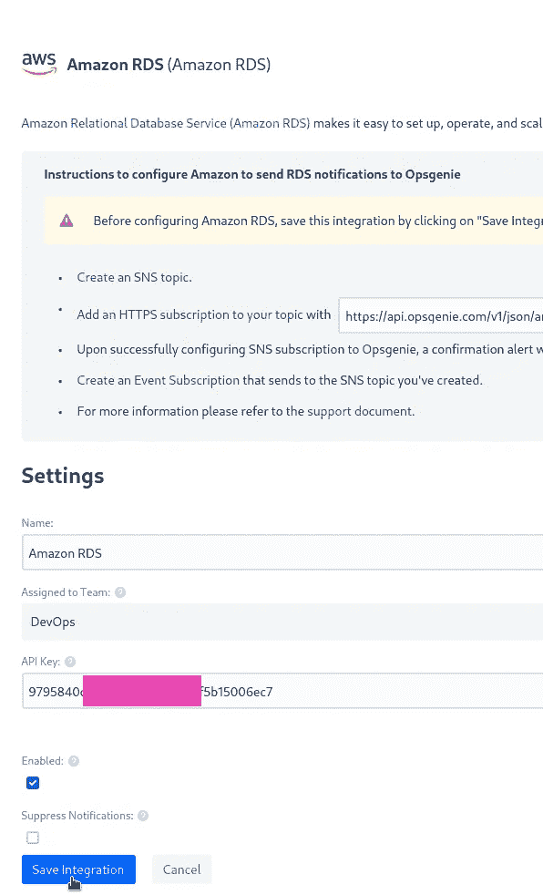

保存“添加 HTTPS 订阅”字段中的 URL，并转到您的 AWS 帐户。

# AWS 配置

## 创建 AWS SNS

这里的文档是[>>>](https://docs.aws.amazon.com/sns/latest/dg/sns-getting-started.html)。

转到 AWS SNS，使用*standard*类型创建一个新主题:

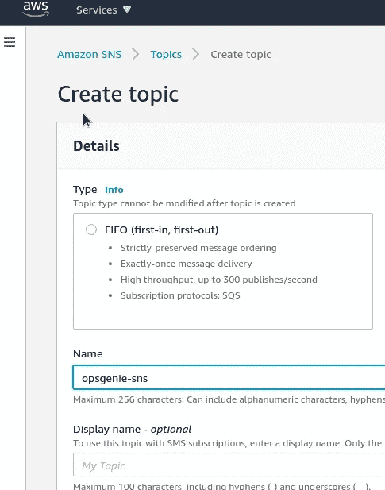

点击*创建订阅*:

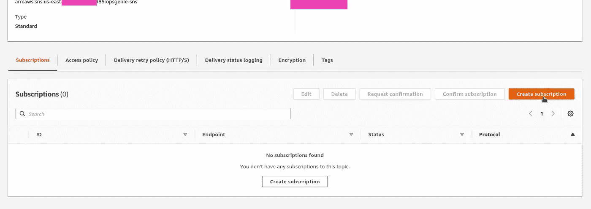

创建 HTTPS 类型的订阅，在*端点*中指定在激活 AWS RDS 集成期间创建的 Opsgenie 的 URL:

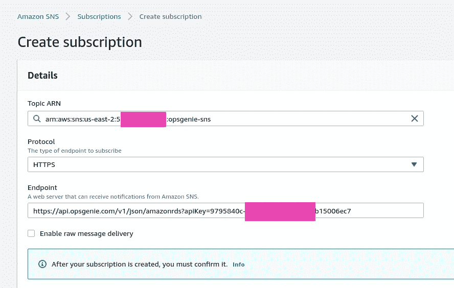

在 Opsgenie 警报中，您必须收到测试通知:

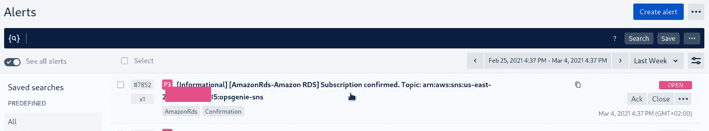

保存并转到 RDS。

## RDS 事件订阅配置

这里的文档是[>>>](https://docs.aws.amazon.com/AmazonRDS/latest/UserGuide/USER_Events.html)。

在这里，您必须决定您感兴趣的活动，以获得通知，请参见 [Amazon RDS 活动类别和活动消息](https://docs.aws.amazon.com/AmazonRDS/latest/UserGuide/USER_Events.html#USER_Events.Messages)页面上的列表。

此外，您还可以查看[事件](https://console.aws.amazon.com/rds/home?region=us-east-1#event-list:)中已经发生的事件。

例如，让我们得到关于*实例的通知:可用性、创建、故障转移、失败、维护、通知、读取副本、恢复*。

点击*创建事件订阅*:

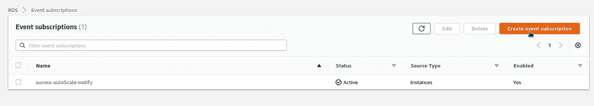

配置字段:

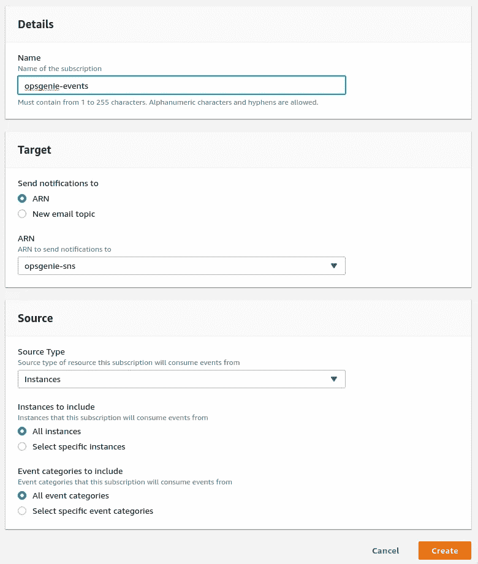

省省吧。

要检查一切是否正常，请重新启动实例:

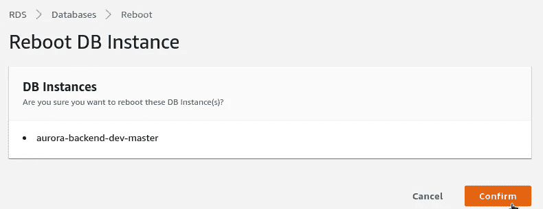

检查 RDS 事件:

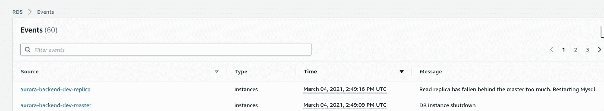

和 Opsgenie 警报:

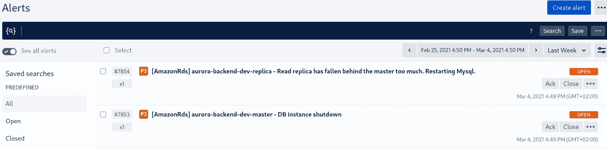

## 高级设置

在 Opsgenie 集成中，您可以点击*高级*进行附加配置。

例如，在这里您可以设置一个规则，如果`sourceId`字段包含一个“ *prod* ”字符串，那么必须创建一个具有*关键*优先级的警报:

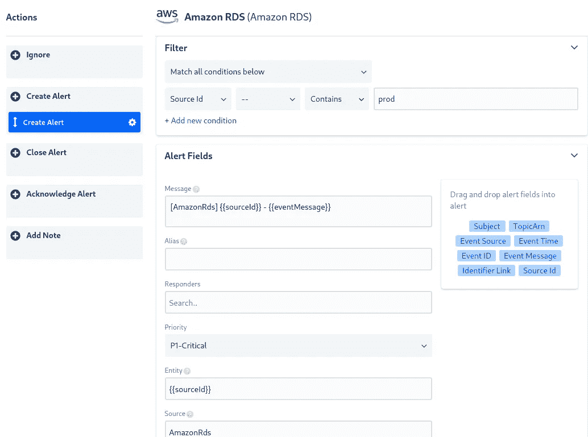

在我们的团队配置中，关键警报不仅会发送给 Slack，而且 Opsgenie bot 会呼叫工程师。

完成了。

*最初发布于* [*RTFM: Linux、DevOps、系统管理*](https://rtfm.co.ua/en/opsgenie-integration-with-aws-rds-and-alerting/) *。*