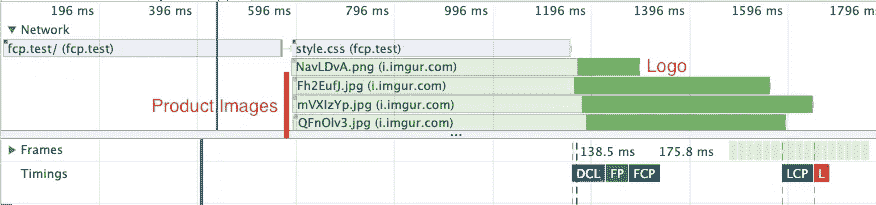
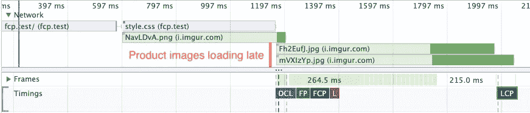
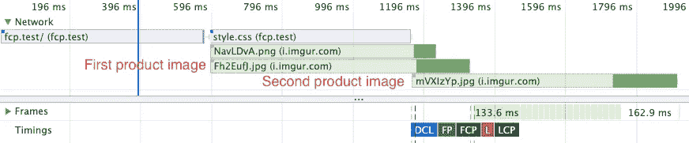
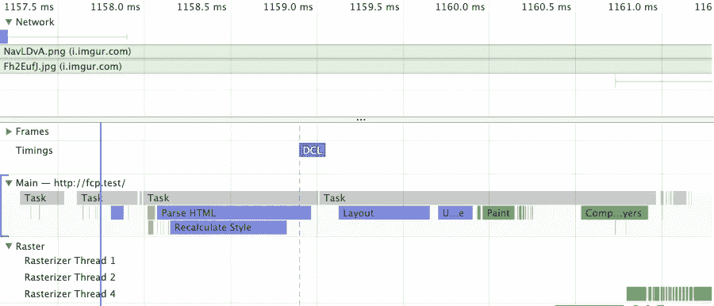
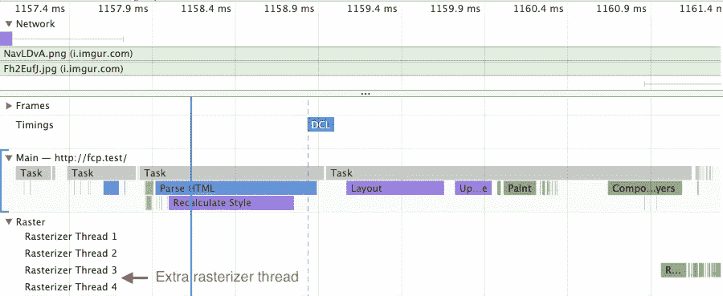
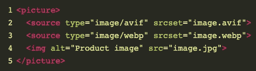
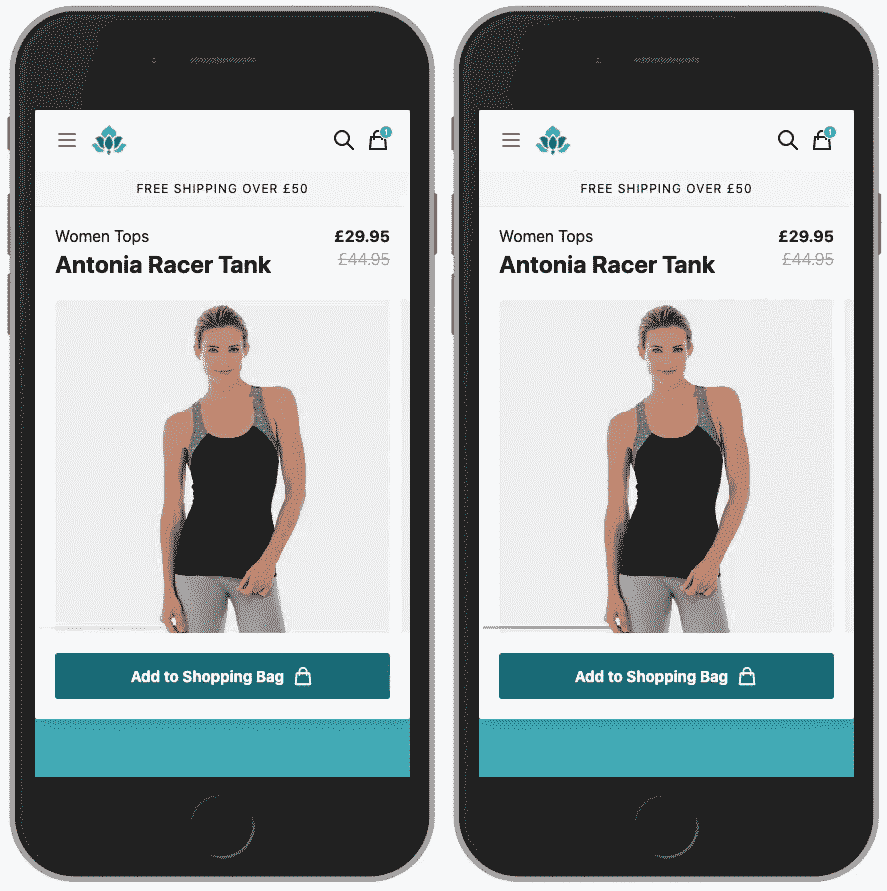
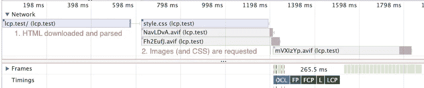
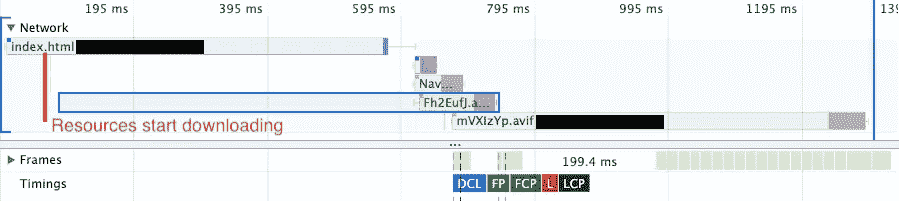
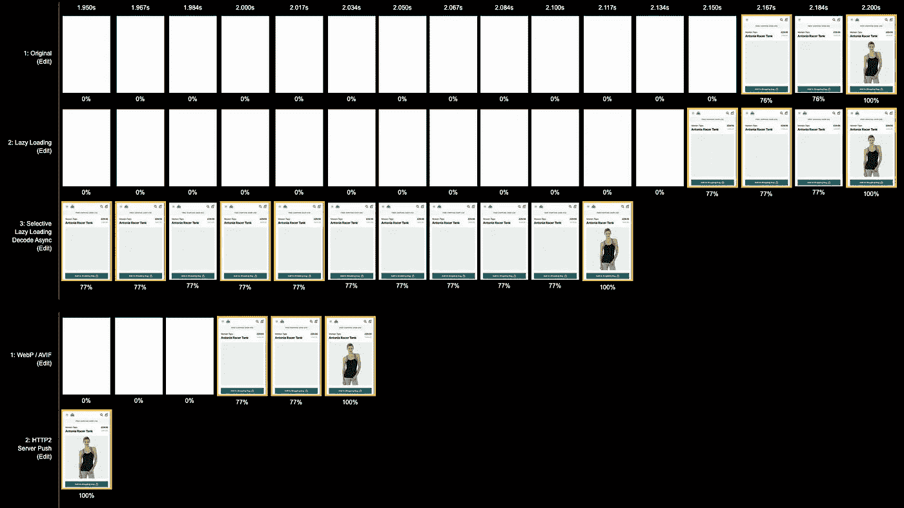

# 优化图像以获得更好的 LCP 网络生命体征评分

> 原文：<https://itnext.io/optimising-images-for-better-lcp-web-vitals-scores-7e9866087973?source=collection_archive---------1----------------------->


照片由 Soragrit Wongsa 拍摄

图像是网络上最常见的内容类型之一，它们经常被用来吸引用户的注意力，通常是屏幕上最大的元素(比如横幅、英雄图像、产品图像等)，所以我们尽最大努力让它们尽快显示出来以保持良好的用户体验是非常重要的。

看看[谷歌的网络要害](https://web.dev/vitals/)有一个重要的指标是图像可以影响的，那就是“**最大内容油漆**”(LCP)，考虑到仅这一项就占了灯塔总分的 **25%** 这是一个我们不能忽视的指标。

> 最大内容绘制(LCP)指标报告视窗内可见的最大[图像或文本块](https://web.dev/lcp/#what-elements-are-considered)的渲染时间。

如果我们文件夹上方最大的元素是一张图片(特别是在电子商务网站上)，那么优化这张图片将会使它渲染得更快，同时提高我们的 Lighthouse 分数。因此，我想分享一些关于如何通过一些性能测量来改进 LCP 的技巧。

# 测试对象

我将使用我的“[Javascript sliders will kill your website performance](/javascript-sliders-will-kill-your-website-performance-5e4925570e2b)”文章中的演示，因为它非常简单，并且显示了电子商务产品页面中常见的布局，所以希望您能够理解。


初始演示

以下是最初的数字，我把“**First Contentful Paint**”(FCP)也包括在内，仅供参考，因为我不想让我对 LCP 的优化对 FCP 产生负面影响:

**FCP:**1.17 秒
**LCP:**1.59 秒
**页面大小** : 67.8kb

> 性能测试是使用 iPhone 8 屏幕模拟 3G 连接(1.6 Mbps/768 Kbps 300 毫秒 RTT)进行的

# 使用适合屏幕尺寸的正确图像

这是一个有时非常明显但经常被忽视的问题，你不会相信有多少网站发布了比它们应该大 3 倍的图片，因为它们只是缩小了桌面大小的图片。

根据经验，尽量不要使用比将要显示的尺寸大两倍以上的图像，如果你不介意在 HiDPI 设备上损失一些质量，你甚至可以使用更小的尺寸。使用`srcset` ``属性或`picture`元素显示适合屏幕尺寸的图像。

在我的演示中，产品图像将以大约**375 像素**的宽度显示，所以我选择使用**750 像素**宽的图像，这样它在视网膜屏幕和现代设备上看起来很好。

让我们看看我们现在的绩效时间表:



初始性能时间表

我们现在加载的图片似乎比我们需要的要多，所以让我们试试下一步的优化。

# 延迟加载图像

这是你经常听到的另一个建议，不常见的是，现在你可以不用任何 javascript，只需在我们的图片中使用`loading="lazy"`属性就可以实现。

> 属性支持非常好，如果你真的需要 IE/Safari 支持，你仍然可以有选择地包含一个基于 javascript 的惰性加载器。

在为我们的图像添加延迟加载支持后，我们的指标如下所示:

**FCP:**1.17 秒
**LCP:**1.98 秒(+24%)
**页面大小:** 50.7kb (-25%)

等等，为什么我们的 LCP 时间差！？页面尺寸减小了，这并不奇怪，因为我们少加载了一个图像，但是让我们看看我们的时间线，以了解 LCP 时间的增加。



延迟加载后的性能时间线

这是延迟加载带来的一个问题:**浏览器会降低延迟加载的图像的优先级**，这对于视图之外的图像来说很好，但是如果它影响到我们的 LCP 元素就不太好了。

这里的解决方案很简单，**如果图像在文件夹之上，避免延迟加载图像**。在这种情况下，我们只需要从第一张产品图片中删除`loading="lazy"`属性。



选择性延迟加载后的性能时间线

通过这样做，我们设法让浏览器更快地加载我们的 LCP 元素，同时仍然保持页面大小的改进:

**FCP:**1.17s
**LCP:**1.33s(-16%)
**页面大小:** 50.7kb (-25%)

# 异步解码图像(可能)

另一个不太为人所知的优化技巧是使用`decode="async"` image 属性，这将告诉浏览器在不阻塞主线程的情况下异步解码图像。

然而，对于这个演示来说，这似乎没有太大的区别，下面是时间线在变化前后的样子:



解码前= "异步"



解码后=“异步”

我没有注意到主线程有任何不同，即使创建了额外的光栅化线程，它似乎仍然在做同样多的工作。可能是因为演示没有加载那么多图像，但我还是想提出来，以防它对其他人有帮助，它不会对我们的指标产生负面影响，所以我选择暂时保留它。

# 使用现代图像格式

到目前为止，我一直在演示中使用 JPEG 来加载产品图像，但我们可以做得更好。通过将图像转换为 WebP，我们可以在没有任何质量损失的情况下大幅减小图像大小，所以让我们先试试。

**FCP:**1.17s
**LCP:**1.26s(-20%)
**页面大小:** 35kb (-48%)

我们的页面大小几乎是原来的一半，我们的 LCP 时间越来越好，但是如果你喜欢生活在边缘，我们可以尝试一种更新的图像格式: **AVIF** 。

> AVIF 是基于 AV1 视频格式的现代图像格式。AVIF 通常比 WebP、JPEG、PNG 和 GIF 有更好的压缩效果，并被设计用来取代它们。

**FCP:**1.17 秒
**LCP:**1.26 秒(-20%)
**页面大小:** 24.2kb (-64%)

我们的 **FCP** 和 **LCP** 时间还是一样的(可能是因为 [TCP 慢启动](https://en.wikipedia.org/wiki/TCP_congestion_control#Slow_start)？)但是我们的页面尺寸要小得多。AVIF 的主要缺点是它还没有得到广泛的支持，但是我们可以使用`<picture>`元素来显示基于浏览器支持的正确图像。



如果不是 JPG，我更喜欢 AVIF 而不是 WEBP

WEBP 和 AVIF 还有另一个缺点，我将并排展示 JPG 版本和 AVIF 版本，看看你是否能发现它们的区别:



**左** : JPEG 版本- **右** : AVIF 版本

以防你没看到，**WEBP 和 AVIF 都不支持渐进式加载**，所以使用 JPEGs，我们可以在加载图像时获得较低质量的预览，而不是一次显示所有图像。

如果你想达到类似的效果，你需要自己显示较低质量的版本，对于演示，我选择使用 [SQIP](https://github.com/axe312ger/sqip) 来显示主图像的较低质量的 SVG 版本作为背景，这样它将在产品图像加载后被覆盖。


“渐进”渲染 AVIF 图像

根据我的测试，这不会影响 LCP 时间，我不确定这是否是故意的，但 **Chrome 仍然会等到图像完全加载后才报告最大的内容元素已加载**，不过这有助于提高“感知”性能，这也是一种良好的用户体验。

和以前一样，它似乎不会对演示中的指标产生负面影响，所以我决定保留它。

# HTTP2 服务器推送

到目前为止，我们已经在前端进行了改进，以减少 LCP 时间，但对于这最后一个技巧，我们需要对服务器响应 HTTP 请求的方式进行一些调整。

在做任何事情之前，让我们先看看目前为止最大的瓶颈:



绩效时间线分析

**首先:**HTML 文档需要从上到下逐行下载并解析，这样浏览器就知道接下来需要下载什么资源以及优先级。**然后，**它发现 CSS、logo 和第一张产品图片需要先加载，所以它去取它们，但只是在第一步完成之后。

HTTP2 服务器推送允许我们在响应头中包含提示浏览器加载哪些资源的提示，这样我们就可以在 HTML 解析之前开始加载它们。

nginx 和 Apache 等现代 web 服务器支持开箱即用，实现略有不同，但一般来说，它们的工作方式是在响应头中添加一个额外的`Link`头，其中包含如下所示的资源列表:

```
Link: </style.css>; as=style; rel=preload, </image.jpg>; as=image; rel=preload
```

在很多情况下，这并不简单，如果资源是相同的，你可以通过硬编码来避免(例如:徽标、通用样式等)，但是如果它们改变了(就像产品图片的情况)，你需要一种方法来准确地知道哪些图片将根据页面被加载。

你可能还会推送已经被浏览器缓存的资源，迫使浏览器再次重新下载这些资源，讽刺的是这会损害网站的性能。

我个人喜欢 [Cloudflare 的 HTTP2 服务器推送服务](https://www.cloudflare.com/website-optimization/http2/serverpush/)，它们有助于处理浏览器缓存的额外复杂性，但你仍然需要通过额外的`Link`头发送资源。我将此添加到演示中，结果令人印象深刻:

**FCP:**0.70 秒(-40%)
**LCP:**0.86 秒(-35%)
**页面大小:** 24.2kb (-64%)



HTTP2 服务器推送后的性能时间线分析

我用 HTTP2 服务器推送预加载了样式、徽标和主要产品图像，正如你所见，它们加载得更快了(甚至我们的 **FCP** 时间也减少了将近一半)。

有时很难欣赏数字本身，因此为了透视起见，这里以幻灯片的形式比较了迄今为止所做的所有优化。



优化的连续画面视图

# 关键要点

1.  最低限度，惰性加载适当大小和格式的图像。
2.  HTTP2 服务器推送可以改善 FCP / LCP 时间，但实现起来可能会很棘手。
3.  测量和描述你所做的每一个改变，你不能改进你没有测量的东西。

我希望这些提示能帮助你提高你的网站性能和灯塔得分，如果你在处理 FCP / LCP 时报时遗漏了什么，请告诉我。👋🏽