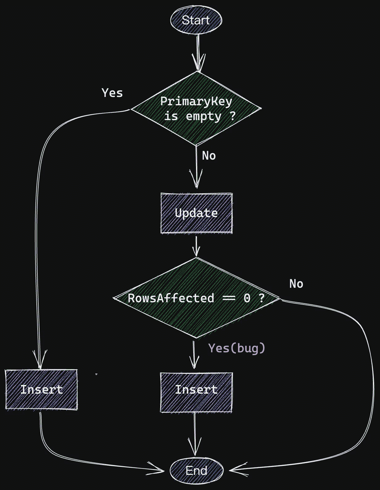

# 轻松实现 GORM 的乐观锁定

> 原文：<https://itnext.io/optimistic-lock-in-gorm-made-easy-19eb90f796bd?source=collection_archive---------0----------------------->

## 关于在 GORM 中实现乐观锁您需要知道的一切。


照片由[保利乌斯·德拉古纳斯](https://unsplash.com/@paulius005?utm_source=unsplash&utm_medium=referral&utm_content=creditCopyText)在 [Unsplash](https://unsplash.com/s/photos/db-lock?utm_source=unsplash&utm_medium=referral&utm_content=creditCopyText) 拍摄

# 什么是乐观锁？

**乐观锁**又称**乐观并发控制** (OCC)，是一种应用于 RDBMS 等事务型系统的并发控制方法。

如[维基百科](https://en.wikipedia.org/wiki/Optimistic_concurrency_control)所述:

> OCC 通常用于低[数据争用](https://en.wikipedia.org/wiki/Block_contention)的环境中。当冲突很少发生时，事务可以完成，而不需要管理锁，也不需要事务等待其他事务的锁被清除，从而比其他并发控制方法具有更高的吞吐量

由于本文的目的是讨论如何在 GORM 中实现 OCC，所以我将忽略对 OCC 本身的详细解释。

为了方便后面的讨论，我先列出一个 OCC 的核心要素:

1.  向表中添加一列，记录该行的版本
2.  在更新该行的任何字段之前，从数据库中读取版本
3.  在更新过程中，调整 SQL 的两个部分:

```
1\. add a condition to WHERE clause to make sure only the data with the same version could be updated: **WHERE … and version = [current version]** 2\. increase version number in SET clause to make sure version will be changed for every update: **UPDATE SET version = version + 1 ...**
```

4.更新后检查受影响的行数，如果它为零(表示更新冲突)，那么我们应该重试更新，直到它不为零。

# 如何在 GORM 中实现乐观锁

上面的逻辑并不复杂，但是每次我们需要 OCC 的时候手动这样做是非常无聊和容易出错的。

众所周知，GORM 有一个基于插件的架构师。如果我们可以用插件实现 OCC，那将是一个优雅的解决方案。

幸运的是，GORM 团队的想法和我们完全一样。事实上，他们已经提供了我们需要的插件:`[go-gorm/optimisticlock](https://github.com/go-gorm/optimisticlock)`。

在这个插件的帮助下，在 GORM 中实现 OCC 变得非常简单。我举个例子来演示一下。

首先，我们向 GORM 模型添加一个版本字段，它的类型是`optimisticlock.Version`

```
import (    
    "**gorm.io/plugin/optimisticlock**" 
)
 ... 
type Blog struct {    
    Id      int  
    Title string  
    Content string     
    // add version column to support optimistic lock  
    **Version optimisticlock.Version** 
}
```

深入挖掘插件的源代码，你会发现`optimisticlock.Version`是`sql.NullInt64`的简单类型别名

```
package **optimisticlock** 
... 
type Version sql.NullInt64
```

添加了版本字段后，GORM 中的更新会自动获得 OCC 容量。

当发生更新冲突时，`RowsAffected`将为零，我们应该向调用者返回一个错误。下面的代码片段显示了如何更新一篇**博客**文章的标题字段:

更新磁贴

在更新冲突的情况下，需要重试。我们使用我的另一篇文章中提到的通用库`samber/lo`:

```
// retry three times in case error
_, err := lo.Attempt(3, func(_ int) error {      
    return UpdateTitle(db, 1, "foo bar")  
})
```

# 有哪些 GORM 方法受到了`the Plugin`的影响？

`go-gorm/optimisticlock`是一个 GORM 插件，所以所有支持插件的方法都会受到影响:

1.  `Update`
2.  `Updates`
3.  `Create`

不支持插件的方法不受影响:

1.  `UpdateColumn`
2.  `UpdateColumns`

# 注意:不要使用 DB。救援

不要用`DB.Save`，因为用`[go-gorm/optimisticlock](https://github.com/go-gorm/optimisticlock)`无法正常工作，虽然支持插件。

下面的代码片段显示了这个问题:

用保存更新全部

发生更新冲突时，`UpdateAll`返回一个错误，并显示消息“**重复键值违反**”，而不是预期的`ErrOptimisticLock.`

仅当主键重复时，才会出现错误“**重复键值违反了“**”。

为什么我们会得到这个错误？答案在`DB.Save`的源代码里:

DB。保存()

下面是`DB.Save`的流程图。从这个图表中，你会发现错误的根本原因是`tx.RowsAffected == 0`



数据库流程图。救援

`tx.RowsAffected`是否将**置零**如果发生更新冲突，这将导致`DB.Save`再次插入。

但是主键不为空，所以返回错误“**重复键值违反了****。**

要解决这个问题，我们需要用`DB.Updates`替换`DB.Save`。

由于`DB.Updates`默认只更新[非零字段](https://gorm.io/docs/update.html#Updates-multiple-columns)，我们还需要在更新前添加`DB.Select(*)`:

全部更新

# 结束语

*   OCC 是控制数据库并发的有用工具。
*   用官方团队的插件在 GORM 中实现 OCC 非常容易
*   避免在这个插件中使用`DB.Save`,因为它们有冲突

感谢您的阅读！