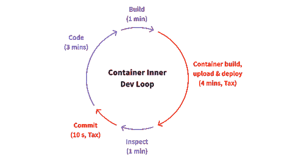

# 使用版本 0 优化 Kubernetes 开发人员体验

> 原文：<https://itnext.io/optimize-the-kubernetes-developer-experience-with-version-0-5b1d03986d1f?source=collection_archive---------7----------------------->

微服务的核心承诺之一是开发团队自治，从理论上讲，这应该转化为更快更好的决策。但有时候，这种理论并不能转化为现实。

为什么会这样呢？

微服务运行不佳的原因有很多。微服务、云原生和 Kubernetes 是一种新的方法和文化转变，应对挑战有许多好方法和坏方法。

成功的关键之一是从第 0 天开始为每个微服务提供一致的开发人员体验，这对于释放团队自主权和开发速度至关重要。

# 引导微服务

创建微服务应该既便宜又容易。这使得应用开发团队能够快速构建和发布新的微服务，以满足特定的业务需求，而不会受到已有代码的阻碍。与此同时，这种敏捷性和灵活性也是有代价的——应用程序变成了分布式的、动态的有机体，更加难以开发、测试和调试。

# 更好的开发者体验=更好的客户体验

在最近的大使播客中，Gene Kim 谈到了优秀的开发者体验对于向客户交付价值是多么的重要。通过创造良好的开发人员体验，开发人员可以发布更多的代码，从而让客户更加满意。

我们已经在成功采用微服务的组织中看到了类似的趋势:对开发人员体验的重视。虽然它可能不是组织中的“战略”计划，但通常公司中有人热衷于创建一个伟大的开发人员工作流，并且能够花时间持续改进该开发人员工作流。

# 微服务开发者体验

对于 monolith，有一个通用的应用程序是开发工作流的目标。有了微服务，不再有单一的通用应用。每一个新的微服务都需要一个开发者工作流。如果没有应有的关注，很容易出现微服务的大杂烩，所有这些都是糟糕的开发人员工作流。在这种情况下，速度实际上*降低了*，因为微服务不能被容易且快速地运送。这首先违背了采用微服务的全部基本原理，并且开发会变慢。

同时，[微服务为改善开发者体验提供了机会](https://blog.getambassador.io/why-it-ticketing-systems-dont-work-with-microservices-18e2be509bf6)。通过优化每个微服务的开发人员体验，团队可以为团队(而不是组织)构建最佳的开发人员体验，并随着应用和团队的发展不断优化这种体验。

# 开发者体验，已定义

开发人员体验是开发人员用来开发、测试、部署和发布软件的工作流程。开发人员体验通常由内部开发循环和外部开发循环组成。[内部开发循环](https://blog.getambassador.io/four-approaches-for-microservice-testing-inner-dev-loops-in-kubernetes-bcf779668179)是一个单一的开发人员工作流程。一个开发人员应该能够建立和使用一个有效的内部开发循环来快速编码和测试变更。内部开发循环通常用于*预提交*变更。外部开发循环是由持续集成系统编排的共享开发人员工作流。外部开发循环用于*提交后*变更，包括自动构建、测试和部署。

设计一个良好的内部和外部开发循环是开发人员获得良好体验和释放微服务潜力的关键。那么，一个工程师如何帮助构建一个伟大的开发者体验呢？

# 版本 0 策略

[版本 0 策略](https://www.getambassador.io/learn/kubernetes-glossary/version-0/)包括交付端到端开发和部署工作流作为第一个里程碑——在任何特性编码之前。对版本 0 里程碑的一个很好的测试是，不同团队的开发人员是否能够独立编码、测试和发布对微服务的更改，而无需咨询原始团队。这意味着版本 0 有一个开发环境，一个部署工作流，以及解释如何开始和发布的文档。有了版本 0，微服务团队就可以开始特性开发，因为他们知道快速迭代和发布的能力已经到位。

版本 0 方法运行良好，原因有很多:

*   代码库非常简单，因此不需要对晦涩的依赖项、猴子补丁或任何其他小精灵进行逆向工程来获得工作环境
*   如果没有特性，那么想要对路线图进行变更和调整的外部团体的压力会更小
*   随着时间的推移，优秀的开发人员体验会带来好处，因此版本 0 最大限度地延长了投资回收期
*   最重要的是，0 版本为微服务定下了基调，那就是开发者体验重要！

# 面向工程师的版本 0

任何工程师都可以采用版本 0 实践(并且应该！).[开发团队应该对微服务](https://www.getambassador.io/resources/enabling-full-cycle-development-kubernetes/)拥有完全的自主权，包括开发时间表和工作流程！因此，从版本 0 开始将有助于团队快速启动微服务。

# 面向经理的版本 0

经理可以通过要求正在创建新微服务的工程团队从版本 0 开始，在整个组织中支持版本 0。随着工程组织的成长，组织可以选择指派专注于开发工作流的平台工程师。这些平台工程师不应该实现版本 0，而是应该向微服务团队提供如何最好地构建版本 0 的工具、模板和最佳实践。网飞工程团队[采用了这种方法](https://netflixtechblog.com/full-cycle-developers-at-netflix-a08c31f83249#0df4)来增强开发人员的能力。

# 摘要

每个工程师都感受过糟糕的开发人员工作流程的痛苦。一个简单的一行程序需要半天才能完成。微服务会加剧这个问题。版本 0 策略是一个简单但功能强大的策略，它将有助于将开发人员的经验整合到您组织的开发工作流程中。