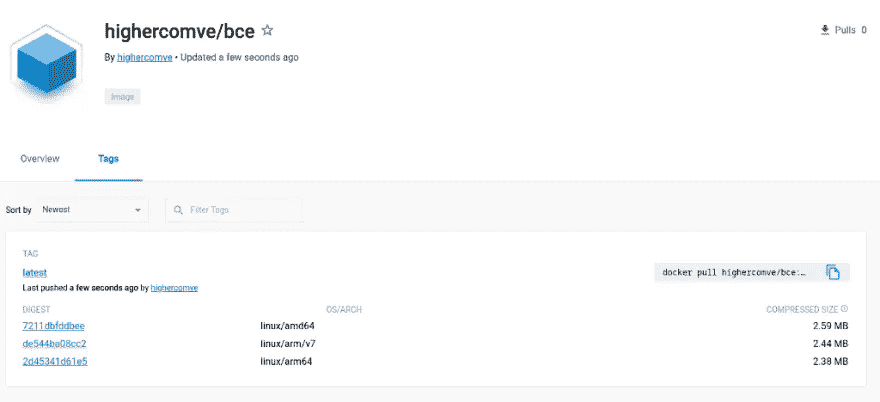
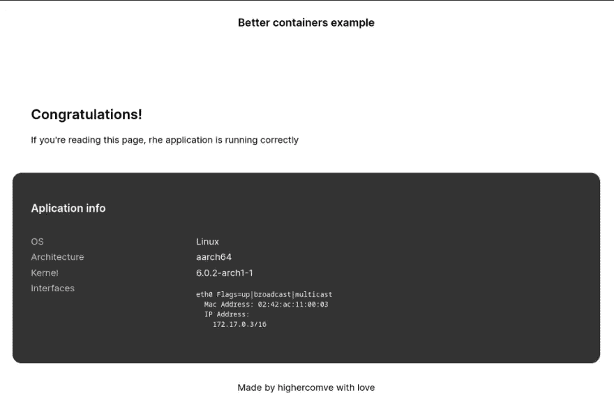

# 优化您的 docker 容器

> 原文：<https://itnext.io/optimize-your-docker-containers-6255545dfa54?source=collection_archive---------1----------------------->

您可能已经构建容器很长时间了，在您以前的所有构建中，安全性和/或容器的大小并不是优先考虑的问题。但是如果你现在来到这里，你会优先考虑这些话题。

现在，我们可以首先关注容器大小，为此，我们在这里讨论几个选项。

-建立在最小的基础映像上。
-使用多阶段构建。
-用静态链接的应用程序创建容器。

# 建立在最小基础图像上

而不是用 ubuntu，debian 等大图。，这可能是一个巨大的图像，我们可以使用一些替代方案，让我们从一个小得多的基础上开始。

```
debian latest d91720f514f7 124MB
ubuntu latest 216c552ea5ba 77.8MBalpine latest 9c6f07244728 5.54MB
gcr.io/distroless/static-debian11 latest 561bdfb51245 2.35MB
```

alpine 和 google distroless 容器比 ubuntu 或 debian 小得多。

在 google distroless 容器的例子中，唯一的问题是该容器的包管理，因为它没有任何包管理器，另一个“缺失”的东西是一个外壳。但是对于几个运行时，它们有大量的基本映像。

```
gcr.io/distroless/static-debian11
gcr.io/distroless/base-debian11
gcr.io/distroless/cc-debian11
gcr.io/distroless/python3-debian11
gcr.io/distroless/java-base-debian11
gcr.io/distroless/java11-debian11
gcr.io/distroless/java17-debian11
gcr.io/distroless/nodejs-debian11
```

另一方面，Alpine 是一个发行版容器。因此，它有一个包管理器和一个外壳，但它足够小，可以使用基本容器。

让我们从一个简单的应用程序开始，你可以在这里看到应用程序[的源代码。默认情况下，应用程序将在端口 5000 中公开一个 web 应用程序，其中包含系统的一般信息。](https://github.com/highercomve/better-container-example)

！【】([https://cdn-images-1 . medium . com/max/1024/1 * QJ 4 qpo 7 l 7 dva 22 cekrcchg . png](https://cdn-images-1.medium.com/max/1024/1*qj4qPO7l7DVa22cekRCcHg.png))

如果我们从构建这个容器的基本方式开始，会是这样的。

```
FROM golang
WORKDIR /app
COPY . /app/
RUN go mod download; \
    CGO_ENABLED=0 go build -ldflags=”-s -w” -o bce -v .
EXPOSE 5000
ENTRYPOINT [“/app/bce”]
```

在此之后，我们可以使用以下命令来构建容器:

```
docker build -t highercomve/bce .
```

在此之后，我们将以 1.02GB 的容器大小结束。

```
highercomve/bce latest 614d597dbfb5 4 seconds ago 1.02GB
```

听起来不太好。现在让我们将基础容器从 **golang** 改为 **golang:alpine** 。

```
FROM golang:alpine
WORKDIR /app
COPY . /app/
RUN go mod download; \
    CGO_ENABLED=0 go build -ldflags=”-s -w” -o bce -v .
EXPOSE 5000
ENTRYPOINT [“/app/bce”]
```

只有这一点改变，我们现在只有 375MB

```
highercomve/bce latest 1fb5114c906e About a minute ago 375MB
```

同样的容器，同样的应用，少了很多空间。

# 使用多阶段构建

现在，我们可以做的第二个优化是使用多阶段构建。为此，我们需要在 FROM 命令中标记 stage 的名称，然后我们使用另一个 base 作为容器的最终运行时。

```
FROM golang:alpine as builder # FIRST STAGE
WORKDIR /app
COPY . /app/
RUN go mod download; \
    CGO_ENABLED=0 go build -ldflags=”-s -w” -o bce -v .FROM gcr.io/distroless/static-debian11
WORKDIR /app
COPY — from=builder /app/bce /app/bce # IMPORT FROM THAT STAGE
COPY static /app/static/
COPY templates /app/templates/
EXPOSE 5000
ENTRYPOINT [“/app/bce”]
```

现在，在这个变化之后，我们可以看到差异将是巨大的，因为最终的图像大小只有 8.73MB。

```
highercomve/bce latest e68c3ebb73e8 About a minute ago 8.73MB
```

# 用静态链接的应用程序创建容器

您可以做的另一件事是使用链接的库构建应用程序，并使用临时基础容器。

```
FROM golang:alpine as builder
WORKDIR /app
COPY . /app/
RUN go mod download; \
 CGO_ENABLED=0 go build -ldflags=”-s -w -extldflags=-static” -o bce -v .FROM scratch
WORKDIR /app
COPY — from=builder /app/bce /app/bce
COPY static /app/static/
COPY templates /app/templates/
EXPOSE 5000
ENTRYPOINT [“/app/bce”]
```

随着这一变化，我们将再减少 2MB 的大小

```
highercomve/bce latest f32c277bf5a6 7 seconds ago 6.39MB
```

现在，作为奖励，我们将添加如何使用这种技术来建立一个多拱建立容器。也许你有同样的应用，但是需要在 arm 或者 riscv 架构下运行。为此我们可以使用 docker[https://github.com/docker/buildx](https://github.com/docker/buildx](https://github.com/docker/buildx).)的 buildx 插件。

对于同一个容器，我将使用两个由 buildx 注入的参数。

```
ARG TARGETPLATFORM
ARG BUILDPLATFORM
```

并允许我们决定如何为 golang 配置环境变量。我将使用这个 build.sh 脚本将 buildx 注入的目标平台变量映射到用于构建的 golang 环境变量。

```
#!/bin/sh
set -eecho "Building for $TARGETPLATFORM" 
export CGO_ENABLED=0case "$TARGETPLATFORM" in
 "linux/arm/v6"*)
  export GOOS=linux GOARCH=arm GOARM=6
  ;;
 "linux/arm/v7"*)
  export GOOS=linux GOARCH=arm GOARM=7
  ;;
 "linux/arm64"*)
  export GOOS=linux GOARCH=arm64 GOARM=7
  ;;
 "linux/386"*)
  export GOOS=linux GOARCH=386
  ;;
 "linux/amd64"*)
  export GOOS=linux GOARCH=amd64
  ;;
 "linux/mips"*)
  export GOOS=linux GOARCH=mips
  ;;
 "linux/mipsle"*)
  export GOOS=linux GOARCH=mipsle
  ;;
 "linux/mips64"*)
  export GOOS=linux GOARCH=mips64
  ;;
 "linux/mips64le"*)
  export GOOS=linux GOARCH=mips64le
  ;;
 "linux/riscv64"*)
  export GOOS=linux GOARCH=riscv64
  ;;
 *)
  echo "Unknown machine type: $machine"
  echo "Building using host architecture"
esacgo mod download
go build -ldflags="-s -w -extldflags=-static" -o bce -v .
```

我们需要确定一件事，编译过程需要在与构建容器的主机相同的架构中运行，否则，我们可能会因为仿真而损失性能。为此，我们可以使用 docker 文件上定义中**的**构建平台**参数。**

类似这样的。

```
FROM — platform=$BUILDPLATFORM golang:alpine as builder
ARG TARGETPLATFORM
ARG BUILDPLATFORM
WORKDIR /app
COPY . /app/
RUN /app/build.shFROM scratch
WORKDIR /app
COPY — from=builder /app/bce /app/bce
COPY static /app/static/
COPY templates /app/templates/
EXPOSE 5000
ENTRYPOINT [“/app/bce”]
```

有了这个新的 Dockerfile 文件，我们可以使用 buildx 插件来构建容器。

```
docker buildx build — platform linux/arm64 -t highercomve/bce — load .
```

这里我们为 build 命令引入 3 个新参数:

- platform:在这里我们可以定义一个由几个架构的 coma 分隔的列表
- load:这个参数配置 docker buildx 在构建过程完成后将映像加载到我们的本地 docker 环境。
- push:这将在构建过程完成后将所有容器映像推送到 docker hub。

您可以在一个命令中构建几个平台，然后推送到 docker hub。

```
docker buildx build — platform linux/arm64,linux/amd64,linux/arm — push -t highercomve/bce .
```



Docker hub 将支持具有多种架构的一个映像，当一些设备使用其中一种架构时，将毫无问题地获得正确的映像。

如果我们想测试运行在一个不同于我们系统的架构上的容器，我们需要加载 qemu 二进制文件。

```
docker run — rm — privileged multiarch/qemu-user-static — reset -p yes
```

然后用我们喜欢的平台运行容器

```
docker run -it -p 5000:5000 — platform linux/arm64 highercomve/bce
```

在这个例子中，网页的输出应该是这样的



我希望这对你有用，并帮助你维护更优化的容器

愿原力与你同在