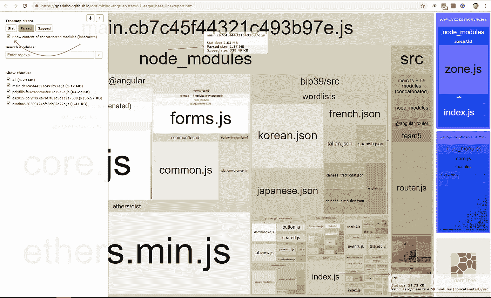
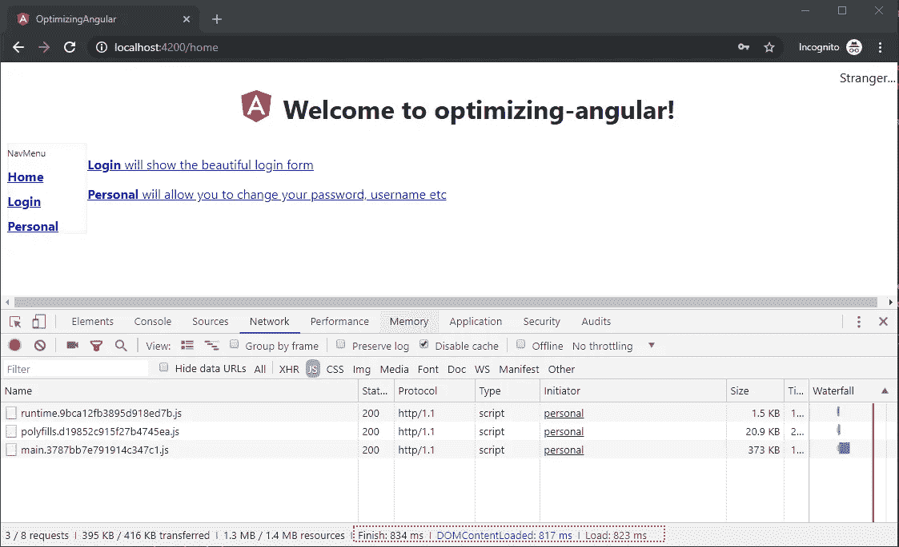
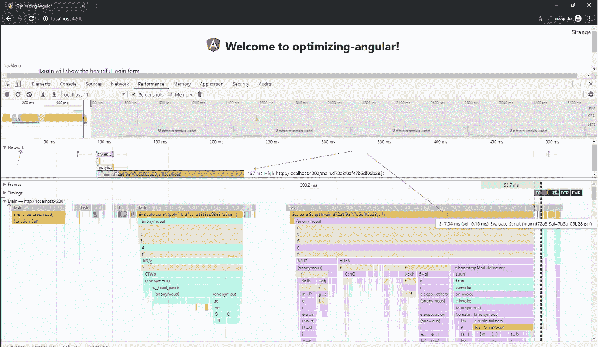
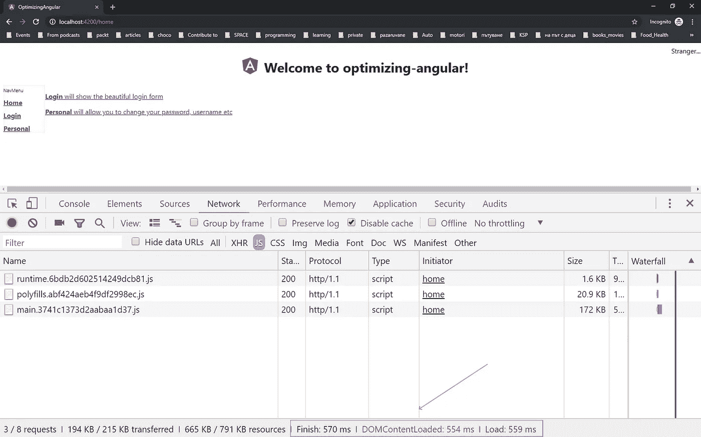
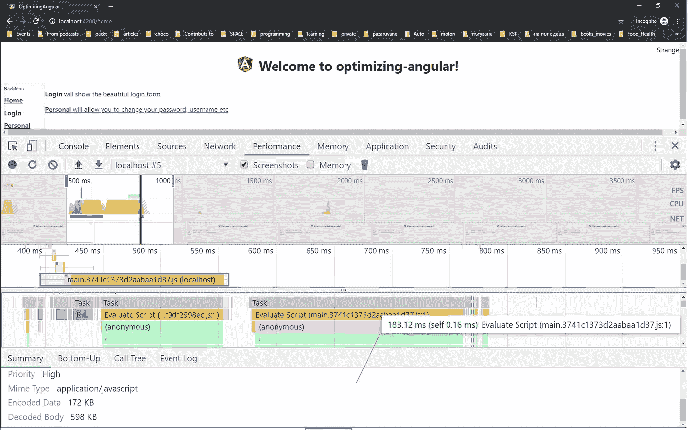
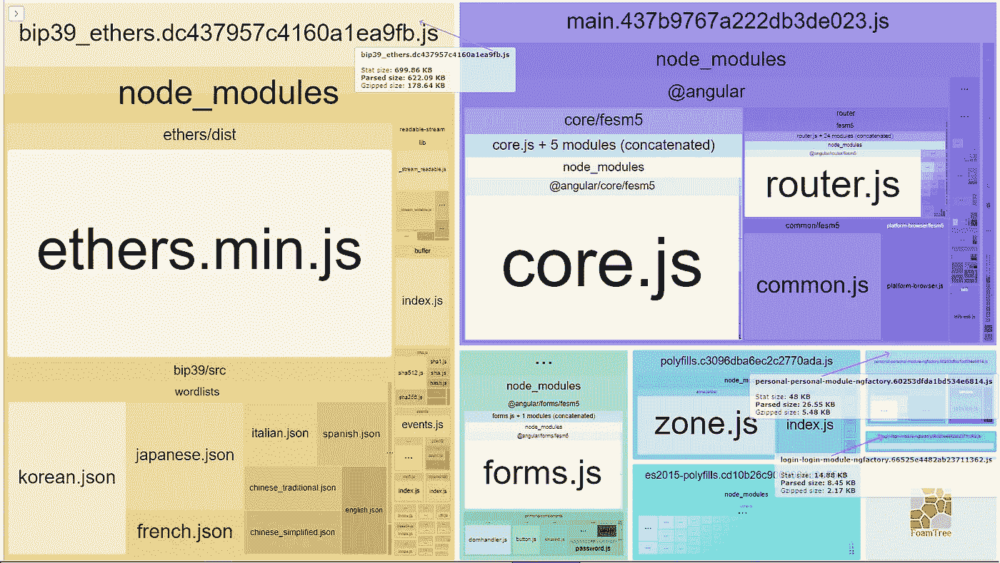
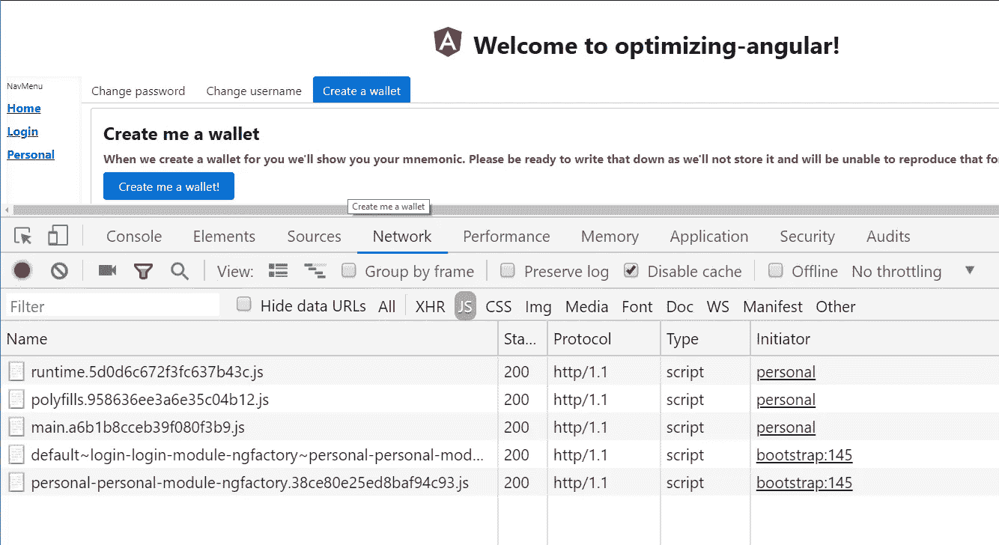
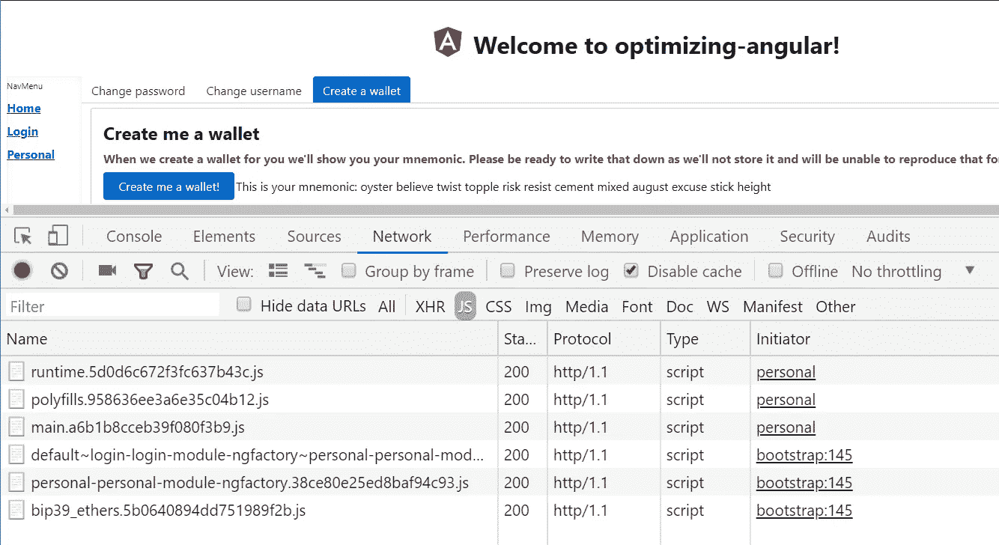

# 懒加载能做到？

> 原文：<https://itnext.io/optimizing-angular-bb330ef88041?source=collection_archive---------5----------------------->

快速棱角分明。

# 优化角度

> **优化**主要是为了快速的用户体验。
> 
> 我们将看看我们可以做什么类型的延迟加载，以及如何在优化角度的同时测量我们的结果。

2019 年 6 月 7 日更新:在[的一个问题和一点研究之后，发现文章的一部分是不正确的。更准确地说，是在文章末尾谈到**共享模块**桶的部分。详见](https://medium.com/u/c03affc1a047?source=post_page-----bb330ef88041--------------------------------)[提问](https://medium.com/@pairedprototype/wouldnt-tree-shaking-help-here-by-dropping-the-unused-components-7a17d0656eb8)和[回应](https://medium.com/@pairedprototype/wouldnt-tree-shaking-help-here-by-dropping-the-unused-components-7a17d0656eb8)。简而言之，有角度的产品构建树去掉了未使用的组件。

我们将对**进行优化**，主要是为了快速的用户体验。这意味着**较小的包**和**不会下载**不需要的**代码。我们希望**向**发送用户**需要的**和**不需要的**字节**。这样，我们的用户将会看到一个快速反应的网站，这正是他们所期待的。

免责声明:**这里不讨论服务器端渲染**。我们将尝试优化在浏览器中交付和评估的 javascript。

我们将看看我们可以做什么类型的延迟加载，以及如何在优化角度的同时测量我们的结果。

计划是这样的:我们先测量。我们会创造假设。然后我们会应用一些优化，衡量，看看假设是否正确。

我已经创建了一个小的示例应用程序来进行优化。在 https://github.com/gparlakov/optimizing-angular 找到它

## 测量:

我们将使用这些工具:

[Webpack 捆绑包分析器](https://www.npmjs.com/package/webpack-bundle-analyzer)。这是一个工具，它从一个`ng build --stats-json`命令，即`dist/stats.json`中获取输出，并在一个非常好的图形界面中呈现出来。我们可以看到我们生产了多少个包，它们的去向和大小(Stat — [raw](https://www.npmjs.com/package/webpack-bundle-analyzer#stat) ，Parsed—[processed](https://www.npmjs.com/package/webpack-bundle-analyzer#stat)[*like after minimization】*和 [Gzipped](https://www.npmjs.com/package/webpack-bundle-analyzer#gzip) )。这里有一个例子:

`ng build --prod --stats-json
webpack-bundle-analyzer dist\stats.json`

webpack-bundle-analyzer 工具报告的屏幕截图。1.左上角—选中了“显示内容…”复选框能够 2。顶部中间—主束。3.右下角—应用程序的组件。

 [## 上面的交互式版本— Webpack Bundle Analyzer 生成的报告。](https://gparlakov.github.io/optimizing-angular/stats/v1_eager_base_line/report.html) 

截图(或者如果你访问上面的链接)你会看到`main`包是迄今为止最大的——解析了 1.17MB(占用了多少磁盘空间)和 328KB Gzipped(估计**)。它包括 angular 运行时和库(@@angular - core.js，forms.js)，`ethers*`和`bip39*`，`primeng/components`——我们的 UI 组件和一堆更小和更大的 js 文件都捆绑在一起——包括我们的应用程序定制代码所在的`src`。这就回答了这个问题——为了绘制我们的应用程序，我们需要向浏览器发送多少 javascript 代码。

这些是用于加密的库。我选择它们是因为我知道它们占地面积很大。它们将有助于展示优化的一个特定方面。

[chrome dev**网**工具:](https://developers.google.com/web/tools/chrome-devtools/network/)

我们希望为最终用户优化加载时间。

它显示了资源(在本例中是 filter to JS——注意上面的 filter 栏中选择的`JS`)加载的数量和速度。似乎这已经是一个快速加载的应用程序。但是考虑到只有三页内容，我认为我们可以做得更好。
* *在`webpack-bundle-analyzer`报告(显示 328KB main)和网络工具(显示 373 KB)之间有些不一致。因为这是由 angular development server ( `ng serve — prod`)提供的，我猜不同版本的 gzip 是原因。无论如何—我们将把报告中看到的**包**的**大小**作为**指示**到**实际字节**被**传输**并考虑到具体实现(nginx、IIS、Apache 等)。)在挤压我们的包时可能会导致尺寸上的微小差异。

[和 chrome dev 工具**性能**工具](https://developers.google.com/web/tools/chrome-devtools/evaluate-performance/):

Chrome 性能工具截图。我们可以看到网络的统计数据(顶部)和我们的主线程正在做什么(底部)。

从上面的表演镜头中，我们可以看到 **main.d72a…js** bundle 占用了网络的大部分空间，并且花费了大量的时间进行评估。

当**测量**时，注意使用**隐姓埋名**窗口(在 Chrome 和其他浏览器中的称呼)，或者禁用任何可能干扰的扩展。在我的例子中，我有两个扩展，增加了大约 700 ms 的测量时间。所以我所有的测量都是匿名的。

所有测量都是在`ng build`或`ng serve`命令中的`--prod`标志设置完成的。否则，我们将得到源地图、未混合的 javascript 和更多的包。

综上所述，这是我们的基线:

## 基线

好了，我们有了我们的基线:
**1.17MB** 大小的**main . js**(328k gzipped)
**830 ms**加载时间。
**217ms** 评测 main.js
现在到了有趣的部分——优化。

## 惰性负载

假设:延迟加载将有助于加快初始引导时间，加快用户体验。

惰性加载是一种技术，只加载需要的模块，其余的留在服务器上，直到需要时再加载。比如我们的 app 有**首页**模块、**登录**模块、**个人**模块。每一个登陆首页的人都需要**首页**模块。但并不是每个人都会登录或使用个人资料页面。因此登录和个人模块将保留在服务器上，直到用户真正请求使用它们。这样，我们可以保持应用程序快速加载，并保存用户的数据计划。(同样，这个示例应用程序很小，有点做作，但相信我，我说得有道理)。

最初，我们在应用程序开始时就急切地加载了所有的模块和组件。因此，构建只创建了一个包——main . js——并将所有东西——供应商代码和我们的定制代码——连接到其中。我们最初的 app-routing.module 和 app.module 如下所示:

请注意我们是如何在 AppModule 中导入 LoginModule 和 PersonalModule 的，在 AppRoutingModule 中我们直接路由到 LoginComponent 和 PersonalComponent。

为了指示我们的捆绑器(Webpack)为`personal`和`login`模块创建单独的捆绑包，我们不需要在我们的`app.module`中导入这些模块，而是使用特殊语法来延迟加载它们*(当然这是@angular/router 的特殊语法，告诉 angular 延迟加载哪些模块)*:

在 app.module 中，我们删除了登录和个人模块的导入。并在 app-routing.module 中添加了特殊语法

这足以导致两个新的包不会在第一个请求时立即加载。如果我们执行`ng build`和`webpack-bundle-analyzer`工具程序，我们会得到:

请注意我们是如何将 main.js 包减半的。互动版:[https://gparlakov . github . io/optimizing-angular/stats/v2 _ lazy/report . html](https://gparlakov.github.io/optimizing-angular/stats/v1_eager_base_line/report.html)

如果我们测量网络，我们会得到:

chrome 网络开发工具的截图，显示了下载的 js 的大小和加载时间。

运行性能工具，我们得到:

js 执行时间为 183 毫秒的截图(每次尝试都会有所不同)

**结果**

**455KB** 大小的**main . js**(126k gzipped)
**~ 600 ms**加载时间。(25%缩减)
**183 毫秒**评估 main.js (~20%)缩减

> 假设:延迟加载有助于加快初始引导时间，加快 UX。

假设被证实。

好吧，我们有进展了。请记住，当我们导航到`/login`和/或`/personal`时，我们必须为网络和 javascript 付出“代价”。尽管如此，在我们的主页上，我们已经大大加快了 UX 的速度。

## 大型依赖关系

接下来，我们可以看看**个人**模块。其中，它允许创建一个加密钱包。因为这就是我们的示例应用程序所处理的——加密！(这看起来可能有点做作，但我实际上不得不在优化一个生产应用程序时处理类似的设置—[https://propy.com](https://propy.com)——在那里用 crypto 购买房地产是一件事。)

**个人**模块依赖于`ethers`和`bip39`及其依赖关系，但仅在用户创建钱包时使用。这种情况通常在用户使用我们的应用程序时发生一次。永远不会。如果我们能指示 Webpack 为它们创建一个单独的包，并且只在需要的时候加载它，那就太好了。事实证明我们可以。简而言之，当使用`import()`来指示 Webpack 将这些模块视为惰性加载模块时，我们可以使用一种语法。我们需要将我们的`tsconfig.json`模块设置为`esNext`(或`commonjs`)以便成功构建 Typescript。

**假设** *:* 我们可以通过将很少使用和非常大的依赖项分离到自己的捆绑包中，来进一步提高我们的应用程序的感知速度。并且仅在需要时加载它们。

注意我们是如何在第 19 行和第 20 行导入 ethers 和 bip39 的(而不是在 ts 导入的第 2 行和第 3 行)。另外，请注意 import()语句中的注释。它通知 Webpack 决定将什么分离到同一个包中。

所以现在在`ng build --prod --stats-json`之后运行我们的`webpack-bundle-analyzer`工具，我们得到:

显示 bip39_ethers 包(大小为 622KB)、个人 ng(大小为 26KB)和登录(大小为 8KB)的屏幕截图。互动版:[https://gparlakov . github . io/optimizing-angular/stats/v3-lazier/report](https://gparlakov.github.io/optimizing-angular/stats/v3-lazier/report)

所以现在我们只在用户决定创建一个新的钱包时才加载这个依赖项。

选择了“创建钱包”选项卡的“`/personal’`页面的屏幕截图。bip39_ethers 包尚未下载。

点击“为我创建一个钱包”按钮后的屏幕截图:“bip39_ethers”捆绑包刚刚下载完毕。

我们没有改变初始 javascript 或页面加载时间的大小，但是我们通过将大量依赖推迟到最后一刻，为大量用户节省了大量数据。

> **假设** *:* 我们可以通过将很少使用和非常大的依赖项分离到它们自己的捆绑包中，来进一步提高我们的应用程序的感知速度。并且仅在需要时加载它们。

假设被证实了。

## **“共享”桶**

2019 年 6 月 7 日更新:以下事实证明是不正确的。参见更新置顶和[对](https://medium.com/@gparlakov/after-a-bit-of-research-heres-the-result-in-this-github-repo-1804df5e8373)[问题](https://medium.com/@pairedprototype/wouldnt-tree-shaking-help-here-by-dropping-the-unused-components-7a17d0656eb8)的回复:

接下来，我想提一下共享模块。这是一个模块，获得所有将在我们的应用程序中共享的组件。为了保持[干燥](https://en.wikipedia.org/wiki/Don%27t_repeat_yourself)(我真的很讨厌这个原则，因为它经常导致灾难)，我们开发人员试图保持所有东西的可重用性。可重用==共享。在共享文件夹中创建新的共享组件。由于它在 **/shared** 文件夹中，所以让我们在 **shared** 模块中声明并导出它。有道理——对吗？

猴子看，猴子做，团队中的每个人都这样做。很明显是共享组件。放入**/共享**模块。在我们的应用程序中，共享模块中有两个组件。我一个人花了几个小时创造了它。其中之一——菜单组件是，它是我们的[根组件的模块](https://github.com/gparlakov/optimizing-angular/blob/19c2687bca586f67d43ac1c32926c0f1615d944b/src/app/app.module.ts#L17)的依赖项。

想象几个月的团队工作。**共享的**模块现在有数百个声明的组件。但是我们的应用程序组件只需要其中的一两个——其余的由特性模块使用。尽管如此，我们的主模块将导入并构建组件，我们的主包将包含所有代码。所以现在如果你想得到香蕉，你得到香蕉和猴子，拿着它和整个丛林！

我们如何避免这种情况？我无法给出简单的答案。我的团队在撰写本文时遇到了这种情况，我们正在处理它:

1.  意识——告诉整个团队这是一个问题，以及为什么这是一个问题。
2.  用自己的**模块**在**/共享文件夹**中创建**新组件**。现在任何需要它们的模块都可以导入它们。
3.  **通过从**共享模块**中取出组件**并将它们移动到它们自己的**模块**中，来修剪**共享模块**的多余部分。一次一个组件。这需要时间，但是值得。

(你是做什么的——在评论里分享。)

这里的假设是，如果团队中的每个人都意识到这个问题，并且我们一起努力，我们会一点一点地找到解决方案。

没有证据证明这一点，除此之外:我看到我的队友尽最大努力改善这种情况，并利用一切机会分离模块。我相信我们会成功的。一次一个模块。

2019 年 6 月 7 日更新:一些困惑似乎源于这样一个事实，即我们使用的这个`shared`模块包含许多服务和组件。他们不会动摇。在这里可以看到一些未使用的服务仍然是大块的一部分[。](https://github.com/gparlakov/tree-shake-angular/blob/7a0be3ce25ca85d1aecd244edb8c76a8d276ee45/dist/0.d59e8e1ca40426dafa22.chunk.js#L86-L91)

## 概括一下:

我们从一个**急切地**加载的应用程序开始，并设法将它分割成惰性加载模块。通过这种方式，我们潜在地提高了应用的感知性能，或者用技术术语来说: **snappyness** 。我们设法查明并进一步分离出很少使用的和大量的依赖项。这样可以保存用户的数据。我们谈了一点关于“共享”模块(水桶，如果你喜欢的话，厨房水槽)，以及为什么它是应用程序的敌人，因为它可以通过干净的依赖树被隔离到懒惰的加载模块。

如果你想尝试一下，一步或更多，你可以。我已经标记了这些步骤:[1-渴望](https://github.com/gparlakov/optimizing-angular/releases/tag/1-eager)，[2-懒惰](https://github.com/gparlakov/optimizing-angular/releases/tag/2-lazy)，[3-懒惰](https://github.com/gparlakov/optimizing-angular/releases/tag/3-lazier)，[4-去沙雷化](https://github.com/gparlakov/optimizing-angular/releases/tag/4-deshareify)。