# 优化 JavaScript 数组中的数据访问

> 原文：<https://itnext.io/optimizing-data-access-in-javascript-arrays-dfd4894a4fc0?source=collection_archive---------3----------------------->


今天，我花了一些时间研究数组，我发现了一些有趣的地方，更具体地说是关于通过唯一键获取项目的最佳方式**。**

# 伪造一些数据

首先，我写了一些实用函数。第一个用于生成一个由只有两个属性 **id** 和**内容**的 *N* 对象组成的数组。我想要这样的东西:

```
[
  {
    id: "key0",
    content: "I ate pizza 0 times"
  },
  {
    id: "key1",
    content: "I ate pizza 1 times"
  },
  {
    id: "key2",
    content: "I ate pizza 2 times"
  },
  ...
]
```

然后我需要另一个数组，这次包含要查找的对象的随机 id，作为测试用例。因此，第二个效用函数用于返回类似于以下内容的结果:

```
["key284", "key958", "key23", "key625", "key83", "key9", ... ]
```

一旦得到了源数组和要得到的物品的随机键，让我们看看谁参与了这个游戏，分析不同的方法。

# 做同一件事的许多方法

我们将看到的每个函数都运行了 **10，000 次迭代**(在 10，000 个对象的数组中找到 10，000 个随机键)。
为了简化，我没有执行任何空检查来查看具有特定 id 的对象是否不存在。在这种情况下，由于我们使用了实用函数来构建模型数据，随机键列表中的每个 id 将总是与源数组中的一个对象相匹配。

我在 node 环境中运行了这些函数(我也在 Chrome 中运行了这些函数，得到了或多或少相同的结果)。为了测量每个块所用的时间，我使用了 [performance.now()](https://nodejs.org/api/perf_hooks.html) 并注册了 **t1** 和 **t2** ，分别在运行函数之前和之后。总时间**毫秒**将由`t2 — t1`给出。

## 本机 for 循环

旧但很金。这种方法包括循环我们的数组，并检查每个元素的 id 是否与我们正在寻找的一致。

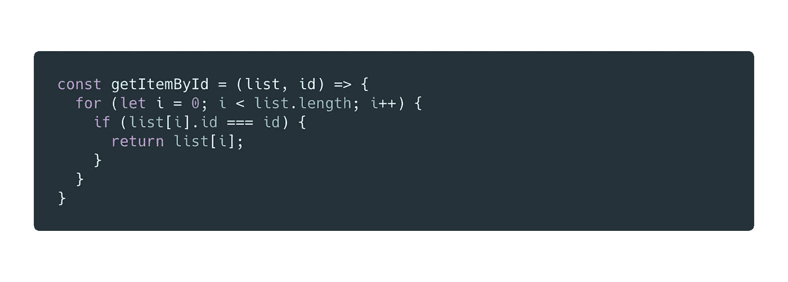

## 本机 while 循环

与之前使用的逻辑相同，但这次是在 while 循环中。

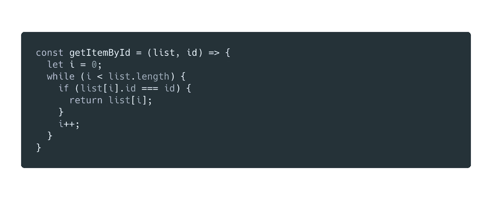

将链接到代码片段

## 为了…在

尽管使用这种语法来迭代数组被认为是不好的，但我还是想涉及到它，我认为它有值得讨论的地方。

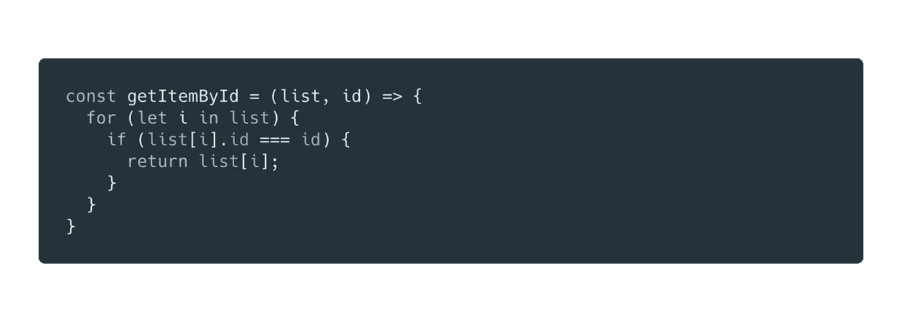

[链接](https://carbon.now.sh/?bg=rgba(171%2C184%2C195%2C0)&t=material&wt=none&l=javascript&ds=false&dsyoff=20px&dsblur=68px&wc=false&wa=false&pv=48px&ph=32px&ln=false&fm=Hack&fs=14px&lh=133%25&si=false&code=const%2520getItemById%2520%253D%2520(list%252C%2520id)%2520%253D%253E%2520%257B%250A%2520%2520for%2520(let%2520i%2520in%2520list)%2520%257B%250A%2520%2520%2520%2520if%2520(list%255Bi%255D.id%2520%253D%253D%253D%2520id)%2520%257B%250A%2520%2520%2520%2520%2520%2520return%2520list%255Bi%255D%253B%250A%2520%2520%2520%2520%257D%250A%2520%2520%257D%250A%257D&es=2x&wm=false&ts=false)到片段

## 为了…的

这只是迭代数组元素。此外，它的语法简洁明了。我个人真的很喜欢。

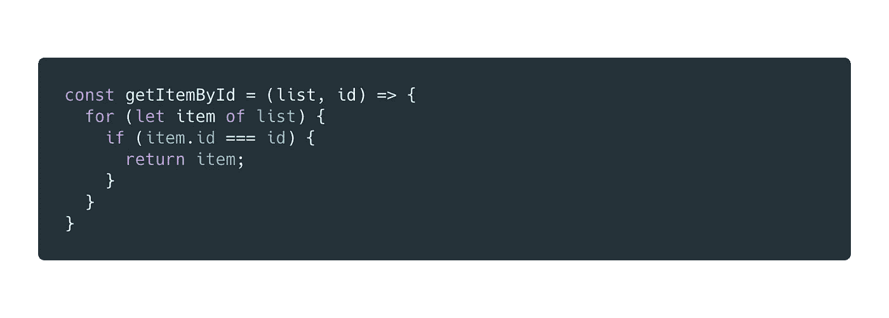

[链接](https://carbon.now.sh/?bg=rgba(171%2C184%2C195%2C0)&t=material&wt=none&l=javascript&ds=false&dsyoff=20px&dsblur=68px&wc=false&wa=false&pv=48px&ph=32px&ln=false&fm=Hack&fs=14px&lh=133%25&si=false&code=const%2520getItemById%2520%253D%2520(list%252C%2520id)%2520%253D%253E%2520%257B%250A%2520%2520for%2520(let%2520item%2520of%2520list)%2520%257B%250A%2520%2520%2520%2520if%2520(item.id%2520%253D%253D%253D%2520id)%2520%257B%250A%2520%2520%2520%2520%2520%2520return%2520item%253B%250A%2520%2520%2520%2520%257D%250A%2520%2520%257D%250A%257D&es=2x&wm=false&ts=false)到片段

## 。forEach()

同样在这里，我们检查每个元素的[，看它是否有我们要找的 id。当它出现时，我们把它赋给一个变量，最后我们返回这个变量。
*注:*](https://developer.mozilla.org/en-US/docs/Web/JavaScript/Reference/Global_Objects/Array/forEach) [*看为什么*](https://stackoverflow.com/questions/2641347/short-circuit-array-foreach-like-calling-break) *我们不像在 for 循环中那样，提前返回一次找到的项。*

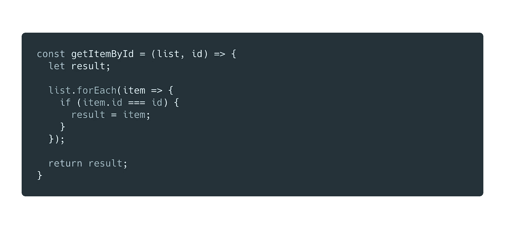

[将](https://carbon.now.sh/?bg=rgba(171%2C184%2C195%2C0)&t=material&wt=none&l=javascript&ds=false&dsyoff=20px&dsblur=68px&wc=false&wa=false&pv=48px&ph=32px&ln=false&fm=Hack&fs=14px&lh=133%25&si=false&code=const%2520getItemById%2520%253D%2520(list%252C%2520id)%2520%253D%253E%2520%257B%250A%2520%2520let%2520result%253B%2520%250A%2520%2520%250A%2520%2520list.forEach(item%2520%253D%253E%2520%257B%250A%2520%2520%2520%2520if%2520(item.id%2520%253D%253D%253D%2520id)%2520%257B%250A%2520%2520%2520%2520%2520%2520result%2520%253D%2520item%253B%250A%2520%2520%2520%2520%257D%250A%2520%2520%257D)%253B%250A%2520%2520%250A%2520%2520return%2520result%253B%250A%257D&es=2x&wm=false&ts=false)链接到片段

## 。map()和。索引 Of()

用[。map()](https://developer.mozilla.org/en-US/docs/Web/JavaScript/Reference/Global_Objects/Array/map) 我们首先将源数组转换成字符串 id 数组，然后使用[。indexOf()](https://developer.mozilla.org/en-US/docs/Web/JavaScript/Reference/Global_Objects/Array/indexOf) 来查找我们正在寻找的 id 的索引。因为源数组中的项和转换后的数组中的 id 具有相同的顺序，所以我们可以使用那个索引来访问我们的项。

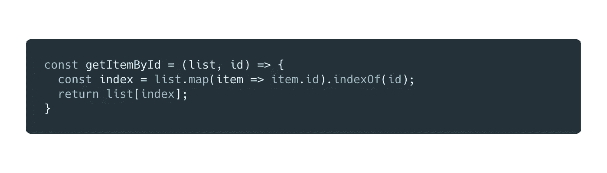

[将](https://carbon.now.sh/?bg=rgba(171%2C184%2C195%2C0)&t=material&wt=none&l=javascript&ds=false&dsyoff=20px&dsblur=68px&wc=false&wa=false&pv=48px&ph=32px&ln=false&fm=Hack&fs=14px&lh=133%25&si=false&code=const%2520getItemById%2520%253D%2520(list%252C%2520id)%2520%253D%253E%2520%257B%250A%2520%2520const%2520index%2520%253D%2520list.map(item%2520%253D%253E%2520item.id).indexOf(id)%253B%250A%2520%2520return%2520list%255Bindex%255D%253B%250A%257D&es=2x&wm=false&ts=false)链接到片段

## 。filter()和 get first

这里我们用[。filter()](https://developer.mozilla.org/en-US/docs/Web/JavaScript/Reference/Global_Objects/Array/filter) 使数组只包含与条件`item.id === id`匹配的项目。然后，我们只返回第一个匹配的元素，使用 0 作为索引来访问它。

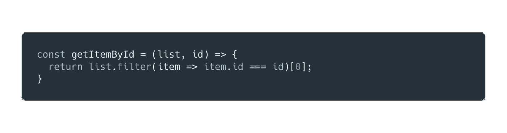

[将](https://carbon.now.sh/?bg=rgba(171%2C184%2C195%2C0)&t=material&wt=none&l=javascript&ds=false&dsyoff=20px&dsblur=68px&wc=false&wa=false&pv=48px&ph=32px&ln=false&fm=Hack&fs=14px&lh=133%25&si=false&code=const%2520getItemById%2520%253D%2520(list%252C%2520id)%2520%253D%253E%2520%257B%250A%2520%2520return%2520list.filter(item%2520%253D%253E%2520item.id%2520%253D%253D%253D%2520id)%255B0%255D%253B%250A%257D&es=2x&wm=false&ts=false)链接到片段

## 。查找()

[这个方法](https://developer.mozilla.org/en-US/docs/Web/JavaScript/Reference/Global_Objects/Array/find)将一个函数作为输入，我们可以在这里设置一个条件，就像我们对。filter()，它返回与之匹配的第一个元素。这是我们可以用来达到目的的最短的语法。

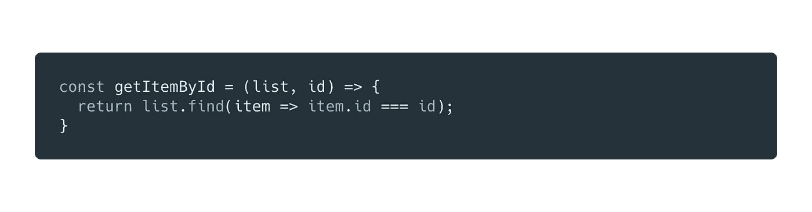

[链接](https://carbon.now.sh/?bg=rgba(171%2C184%2C195%2C0)&t=material&wt=none&l=javascript&ds=false&dsyoff=20px&dsblur=68px&wc=false&wa=false&pv=48px&ph=32px&ln=false&fm=Hack&fs=14px&lh=133%25&si=false&code=const%2520getItemById%2520%253D%2520(list%252C%2520id)%2520%253D%253E%2520%257B%250A%2520%2520return%2520list.find(item%2520%253D%253E%2520item.id%2520%253D%253D%253D%2520id)%253B%250A%257D&es=2x&wm=false&ts=false)到片段

## 。findIndex()

与上面的非常相似，但是[它](https://developer.mozilla.org/en-US/docs/Web/JavaScript/Reference/Global_Objects/Array/findIndex)返回匹配元素的索引。然后，我们可以使用该索引来访问我们的项目。

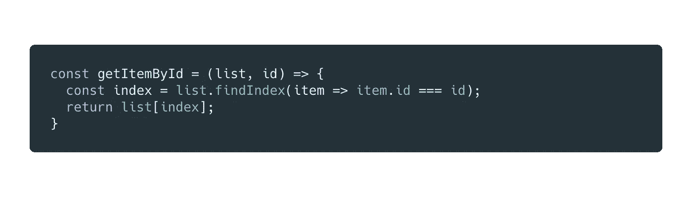

[将](https://carbon.now.sh/?bg=rgba(171%2C184%2C195%2C0)&t=material&wt=none&l=javascript&ds=false&dsyoff=20px&dsblur=68px&wc=false&wa=false&pv=48px&ph=32px&ln=false&fm=Hack&fs=14px&lh=133%25&si=false&code=const%2520getItemById%2520%253D%2520(list%252C%2520id)%2520%253D%253E%2520%257B%250A%2520%2520const%2520index%2520%253D%2520list.findIndex(item%2520%253D%253E%2520item.id%2520%253D%253D%253D%2520id)%253B%250A%2520%2520return%2520list%255Bindex%255D%253B%250A%257D&es=2x&wm=false&ts=false)链接到片段

# 谁花的时间少？

该图显示了我在测试用例中运行的每个函数所用的时间，单位为毫秒。

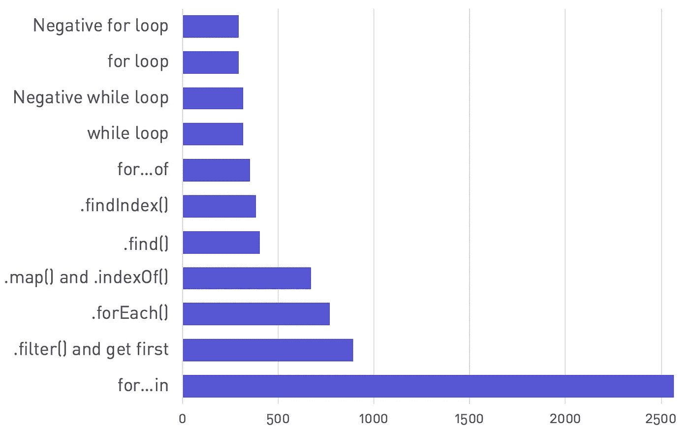

我增加了两个选项，负 for 和 while 循环。基本上，我们不是递增循环控制变量，而是从数组的长度开始递减，直到它达到零。[这似乎*略微*加快了迭代](https://stackoverflow.com/questions/3520688/javascript-loop-performance-why-is-to-decrement-the-iterator-toward-0-faster-t)的速度。

一件让我们眼前一亮的事情是 for…in 语法慢得令人难以置信。在我的测试中，对于循环，它几乎比普通的*慢 9 倍。为什么？嗯，语法中的**for…是第一个能够迭代对象键的 JavaScript 语句。在对象键(`{}`)上循环不同于在数组(`[]`)上循环，因为[引擎做了一些额外的工作来跟踪已经被迭代的属性](https://stackoverflow.com/questions/13488751/why-is-for-in-slow-in-javascript)。当我们在数组上使用这种语法时，左边表达式中的变量被赋予数组索引。***

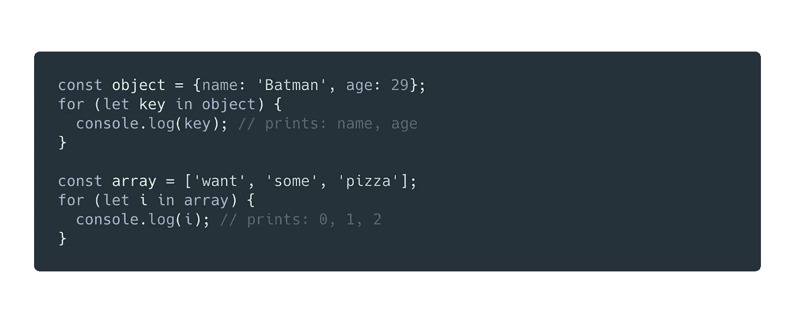

但是，for…in 在这两种情况下使用相同的算法。希望有人在读完这篇文章后会运行来删除他们代码中的那些语句。这是个不错的主意。

# 改变游戏规则的人

尽管我们有很多方法可以通过惟一键从数组中获取条目，但我推荐另一种方法，如果我们在应用程序中不止一次地访问同一个数组，这种方法会非常有用。

让我们考虑下面的对象数组:

```
[
  {
    "key": "4PXEVKq__II",
    "name": "Undertow"
  },
  {
    "key": "yCXrgASzf50",
    "name": "Aenima"
  },
  {
    "key": "6-uNyUmP9TA",
    "name": "Lateralus"
  },
  {
    "key": "wzmgWtl53Vs",
    "name": "10,000 days"
  }
]
```

通常情况下，如果我们需要快速获得这些对象中的一个，我们会使用`array.find(o => o.key === myKey)`。

然而如果我们发现。find()ing 几次，我们宁愿**在一个键值对象**中转换数组，其中*键*实际上是唯一键，值是对象本身。
然后，我们将不再使用`.find()`来获取一个条目，而只使用`arrayObj[key]`，其中`arrayObj`的结构如下:

```
{
  "4PXEVKq__II": {
    "key": "4PXEVKq__II",
    "name": "Undertow"
  },
  "yCXrgASzf50": {
    "key": "yCXrgASzf50",
    "name": "Aenima"
  },
  "6-uNyUmP9TA": {
    "key": "6-uNyUmP9TA",
    "name": "Lateralus"
  },
  "wzmgWtl53Vs": {
    "key": "wzmgWtl53Vs",
    "name": "10,000 days"
  }
}
```

自然，这个想法是**不要在每次**我们需要得到一个物品的时候执行转换，而是在使用它很多次之前执行转换。一个好的做法是总是在某个地方保存一个键值对象，以及我们的源数组。下面的例子展示了如何在 Redux 场景中做到这一点。

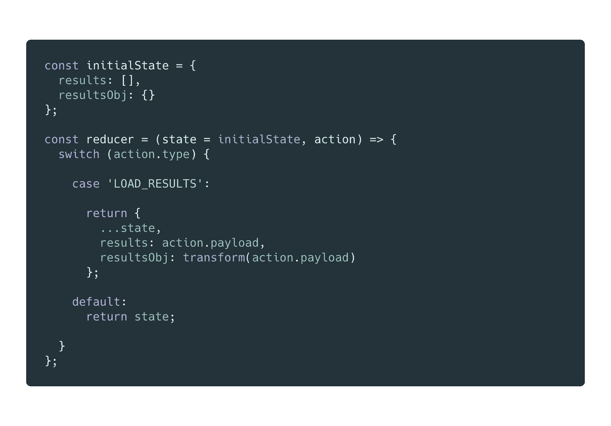

[链接](https://carbon.now.sh/?bg=rgba(171%2C184%2C195%2C0)&t=material&wt=none&l=javascript&ds=false&dsyoff=20px&dsblur=68px&wc=false&wa=false&pv=48px&ph=32px&ln=false&fm=Hack&fs=14px&lh=133%25&si=false&code=const%2520initialState%2520%253D%2520%257B%250A%2520%2520results%253A%2520%255B%255D%252C%250A%2520%2520resultsObj%253A%2520%257B%257D%250A%257D%253B%250A%250Aconst%2520reducer%2520%253D%2520(state%2520%253D%2520initialState%252C%2520action)%2520%253D%253E%2520%257B%250A%2520%2520switch%2520(action.type)%2520%257B%250A%250A%2520%2520%2520%2520case%2520%27LOAD_RESULTS%27%253A%250A%250A%2520%2520%2520%2520%2520%2520return%2520%257B%250A%2520%2520%2520%2520%2520%2520%2520%2520...state%252C%250A%2520%2520%2520%2520%2520%2520%2520%2520results%253A%2520action.payload%252C%250A%2520%2520%2520%2520%2520%2520%2520%2520resultsObj%253A%2520transform(action.payload)%250A%2520%2520%2520%2520%2520%2520%257D%253B%250A%250A%2520%2520%2520%2520default%253A%250A%2520%2520%2520%2520%2520%2520return%2520state%253B%250A%250A%2520%2520%257D%250A%257D%253B&es=2x&wm=false&ts=false)到片段

上面代码片段中的函数`transform()`的实现如下:

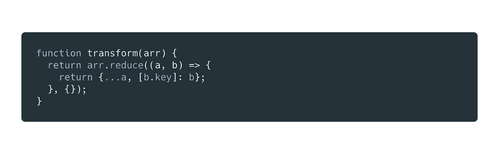

[链接](https://carbon.now.sh/?bg=rgba(171%2C184%2C195%2C0)&t=material&wt=none&l=javascript&ds=false&dsyoff=20px&dsblur=68px&wc=false&wa=false&pv=48px&ph=32px&ln=false&fm=Hack&fs=14px&lh=133%25&si=false&code=function%2520transform(arr)%2520%257B%250A%2520%2520return%2520arr.reduce((a%252C%2520b)%2520%253D%253E%2520%257B%250A%2520%2520%2520%2520return%2520%257B...a%252C%2520%255Bb.key%255D%253A%2520b%257D%253B%250A%2520%2520%257D%252C%2520%257B%257D)%253B%250A%257D&es=2x&wm=false&ts=false)到片段

准备好转换后的数据后，在我的测试案例中，使用`object[key]`获得一个随机项目 10，000 次只需要 **2 毫秒**。