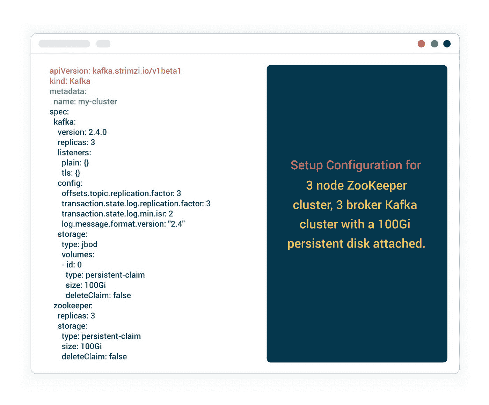
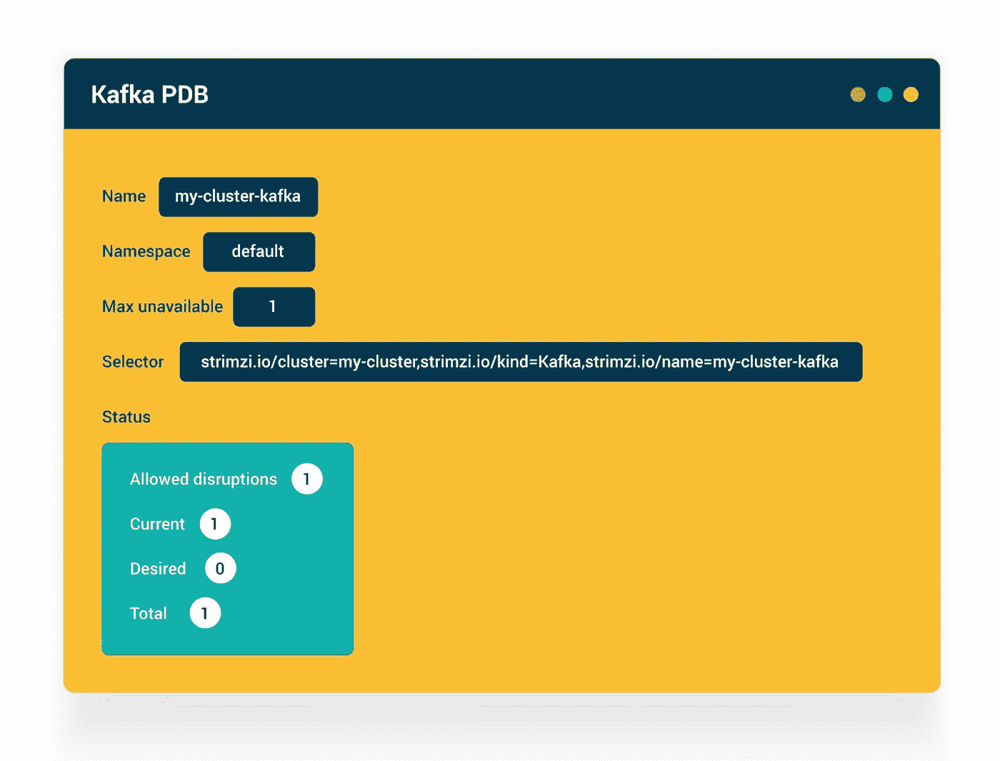
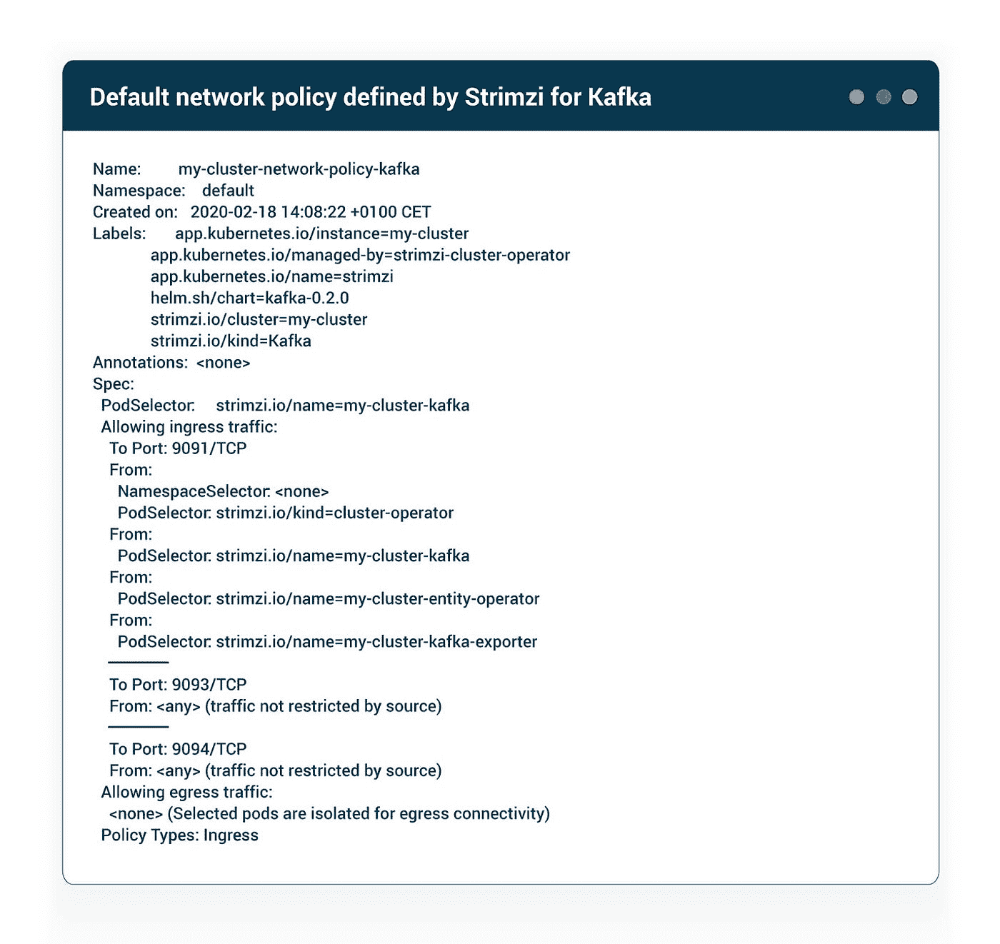
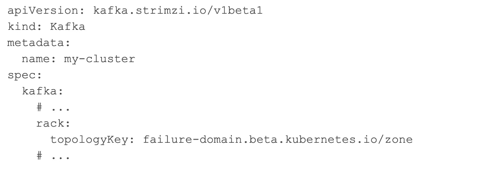
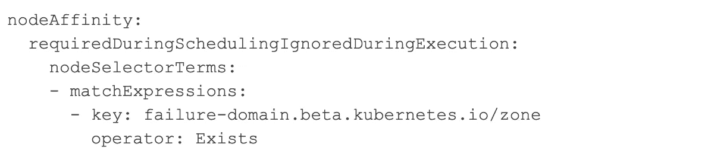
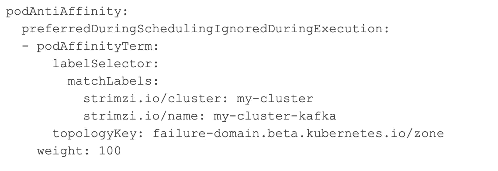
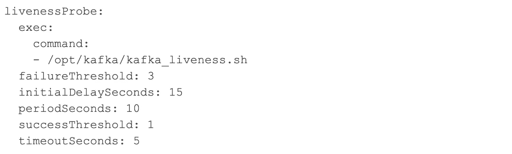
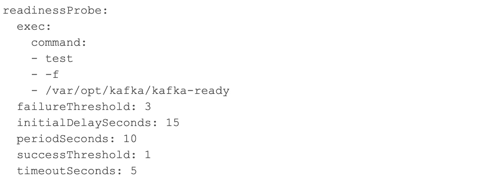

# 优化 Kubernetes 中的 Kafka 集群部署

> 原文：<https://itnext.io/optimizing-kafka-cluster-deployments-in-kubernetes-ceda3f95c157?source=collection_archive---------3----------------------->

我们，在 [Axual](https://axual.com/) ，以 SaaS 服务(Axual Cloud)的形式为银行和能源等各种领域的企业运行大容量、任务关键型 Apache Kafka 集群而自豪。为了花更少的时间管理基础设施，花更多的时间为我们的客户构建更酷的新功能，我们决定将我们的堆栈转移到 Kubernetes。本文解释了如果您有合适的工具和信息，在 Kubernetes 中运行 Apache Kafka 并不困难。

在过去的几年里，Kubernetes 的受欢迎程度大幅上升，正如谷歌趋势图所示。不仅仅是创业公司和小公司，就连企业现在也在慢慢向 Kubernetes 或其企业版转移。这种增长很大程度上归功于 Docker 的容器化和微服务的流行。

最基本的，Kubernetes 是一个调度器。它非常擅长以最优的方式调度容器，以允许有效地使用 VM 资源。Kubernetes 无疑已经证明了自己是无状态应用程序的首选编制者。采用途径也已确立:

1.  编译和构建工件。
2.  根据 12 因素建议进行更改。
3.  用 Docker 把它包在一个容器里
4.  让 Kubernetes 编排和安排您的容器。

但是当涉及到有状态应用程序时，情况就大不相同了。

# 有状态应用程序

如果您的应用程序不仅仅是一个 web 应用程序，那么您可能必须处理运行时状态。然而，应用程序什么时候变成有状态的呢？问自己这样一个问题:我能用另一个实例替换我的应用程序的一个实例吗？我能否针对应用程序的多个副本对请求进行负载平衡，而不会出错？在回答“是”之前，请仔细考虑您的应用程序在内存或磁盘上存储了什么。数据在运行时会改变吗？如果这些数据在被另一个实例替换时丢失，您的应用程序会崩溃吗？如果是这样，您就有了一个有状态的应用程序。

为了正确编排有状态应用程序，Kubernetes 在 2016 年末的 1.5 版本中提出了一个新的资源定义 **StatefulSet** (之前称为 PetSet)。如果使用正确，StatefulSet 可以用来在 Kubernetes 中运行有状态的应用程序。在本帖中，我们将尝试理解在 Kubernetes 中运行 Apache Kafka(一个有状态的应用程序)需要什么。

# Apache Kafka 作为有状态应用程序

Apache Kafka 是一个实时流解决方案，是一个复杂的有状态应用程序。它有

*   有身份的经纪人。更换经纪人不像更换 pod 那么简单。
*   对 ZooKeeper 的依赖——另一个支持 Kafka 分布式行为的有状态应用。
*   持久存储。由于复制，可能会丢失这些数据并进行恢复，但不应将其视为标准操作，尤其是在处理大量数据时。

如果你正在考虑 2020 年在 Kubernetes 运行 Apache Kafka，那就不需要自己设置了！有像 Strimzi 这样的可用选项。让我们来看看 Strimzi Kafka Operator 是如何让在 Kubernetes 中运行 Kafka 变得简单的。

# Strimzi 算子

Strimzi 是 Kubernetes 部署 Kafka 集群的操作员。它定义了一个名为“Kafka”的自定义资源定义(CRD ),代表了 ZooKeeper 和 Kafka Cluster 的组合。Kafka 在 Kubernetes 部署的一个非常简单的例子如下:

上述配置将设置一个 3 节点 ZooKeeper 集群、3 broker Kafka 集群以及一个 100Gi 持久性磁盘。这有效地转化为 Kafka 和 ZooKeeper 的 StatefulSets，headless 服务能够直接访问各个代理(而不是负载平衡)。

# 生效第 2 天操作

如您所见，在 Kubernetes 中部署 Kafka 集群非常容易。但是，当需要在 Kafka 集群上进行升级和维护时，如何保证稳定性和弹性呢？

Kubernetes 提供了许多资源，可以用来以更灵活的方式部署任何应用程序。让我们看看 Strimzi 是如何利用它们的。

# Pod 中断预算

任何被视为关键且不能接受停机(计划内或其他)的应用程序都必须定义 Pod 中断预算(PDB)。PDB 告诉 Kubernetes 这个应用程序允许中断多少个 pod。当 Kubernetes 集群管理员执行节点清空(kubectl drain)之类的维护操作时，该操作将考虑所有已配置的 pdb，并且仅在中断预算允许的情况下移除 pod。

Strimzi 为 ZooKeeper 和 Kafka 各添加了两个 pdb。让我们来看看卡夫卡式的 PDB:

上面的 PDB 指出，在卡夫卡的所有代理人中，只有一个在任何给定的时间是不可用的。因此，如果您在 3 个不同的节点上有 3 个 Kafka brokers，任何消耗 1 个以上节点的尝试都将被阻止，因为这违背了定义的 PDB。对于大型 Kafka 集群，这可以定制为更高的值。

# 网络策略

网络策略可用于描述规则，这些规则确定哪些应用程序被允许在更高的抽象级别上连接到其他应用程序。Strimzi 为 ZooKeeper(只能由 Kafka 访问)和 Kafka(不同的实体可以访问不同的侦听器端口)定义了网络策略。

下面是 Strimzi 为 Kafka 定义的默认网络策略:

复制端口 9091 只能由 Strimzi 中定义的其他 Kafka 代理和操作员访问，以执行管理任务。纯文本端口 9093 和 TLS 端口 9094 不限于任何应用程序。

注意 Kubernetes 只提供了一个网络策略接口。实现工作留给了集群的管理员。例如，您可以安装一个像 Calico 这样的 CNI 插件来实现集群中的网络策略。如果没有这样的插件，这些网络政策将不起作用！

# 机架感知

由于多种原因，在 Kafka 中正确配置 rack 非常重要。Kafka 使用机架配置来确定分区副本的最终位置。例如，如果您有 6 个 Kafka 代理，平均分布在 3 个不同的可用性区域(或机架)(每个区域 2 个)。当创建复制因子为 3 的主题时，Kafka 将选择位于不同区域的经纪人。在这种情况下，它将确保任何区域都不会有超过 1 个副本。这确保了最大的可用性。

Strimzi 允许在 Kafka brokers 中配置机架，如下所示:

topologyKey 是一个标签，必须存在于 Kubernetes 集群的所有节点上。默认情况下，大多数云管理集群，如 EKS、AKS 和 GKE，都提供这种功能。在 EKS 的情况下，传递给 Kafka broker 的机架值将类似于 eu-central-1a。

Strimzi 使用上述机架配置来确保每个 Kafka broker pod 也分布在所有可用性区域中。它使用了 Kubernetes 的一个叫做亲和力的概念。让我们看看那个。

# 吸引力

作为一名指挥，Kubernetes 做调度。调度程序处理基本问题:“在哪里运行 pod？”。有时，您希望某些 pod 与另一个应用程序 pod 位于相同(或不同)的机器上。例如，传递大量数据的两个应用程序可以位于同一个节点上，以使流量保持在本地。或者您希望一个应用程序窗格位于具有更高 CPU 和内存的特定节点上。这样的场景可以在 Kubernetes 中使用 Affinity 来处理。

有两种相似性:**节点相似性** —用于回答问题“在哪个节点上运行这个 pod？”和 **PodAffinity(或 PodAntiAffinity)** —用于回答“此 pod 是否应该与此*其他* pod 运行在相同/不同的节点中？”两者都决定了 pod 将在哪个节点上运行，但规则是基于前者中的节点和后者中的 pod。

如果启用了机架配置，Strimzi 将定义节点和机架关联。下面是 NodeAffinity 的一个示例:

上面的配置可能看起来很复杂，但很容易做到。它告诉 Kubernetes 调度程序，Kafka broker pods *必须*被调度到带有关键字**failure-domain.beta.kubernetes.io/zone.**标签的节点上，因此您的 worker 节点必须有这个标签。对于像 EKS、AKS 和 GKE 这样的托管集群，这已经可用。

超长的配置项**requiredduringschedulingignoredduringeexecution**意味着，在调度新的 Kafka broker pods(*requiredDuringScheduling)*时，应该**严格执行该规则，但对于在不满足该标准的节点上发现的任何已经运行的 Kafka broker pods(*ignored during execution)*则可以放宽。**

下面是启用 rack 时 Strimzi 定义的 PodAntiAffinity 示例:

为了解释这种配置，我们来看一下调度 3 个 Kafka broker pods:

1.  当调度代理 1 时，调度器将尝试在可用性区域 AZ1 中的节点上运行 pod。上面的亲缘性配置说检查在这个节点上是否已经有 Kafka broker pod 在运行(基于 strimzi.io 标签),如果这样的 pod 是*而不是*在运行(反亲缘性),那么在 AZ1 上调度 broker1，它将成功，
2.  下一个调度程序尝试在节点 AZ1 上调度代理 2，但这次它发现代理 1 pod 已经在运行。因此，跳过该节点，找到不同的节点 AZ2，调度代理 2。
3.  对于要在 AZ3 上调度的代理 3，重复步骤 2。

如果您有第四个经纪人也要安排，会怎么样？它会在哪个节点上结束？这里，配置项**在 schedulingignoredduringeexecution**中变得很重要。这意味着相似性规则是*首选的*，但不是强制性的。因此，当调度第 4 个代理时，将不会满足规则(假设只有 3 个唯一的 az ),但无论如何都会在某个节点上进行调度。

# 健康检查

如果没有配置适当的健康检查，Kubernetes 中的任何应用程序部署都不能被视为生产就绪。Kubernetes 允许您配置两种检查——活性探测和就绪探测。

活性探测用于确定何时重启 pod。常见的探测解决方案是 TCP 端口检查或 HTTP GET 调用。如果 pod 在一定时间间隔内没有响应，将会重新启动。

准备就绪探测用于确定 pod 应该何时开始接收流量。这是通过将负责流量的 pod 添加到这些 pod 的服务后端来实现的。

在卡夫卡的例子中，活性探针和准备就绪探针之间的区别是很重要的。卡夫卡启动了听众，但这并不意味着它已经准备好为客户服务。这可能是由于不同步的副本需要赶上其他代理。如果代理管理数千个分区，这个同步过程可能需要几分钟。因此，正确设置 Kafka 的就绪探针是很重要的。请记住，必须设置活动和就绪探测器。

## 活性探针

Strimzi 使用一个定制的 bash 脚本，通过 netstat 测试复制端口(9091)上的监听器。当这个活性探测成功时，它表明 Kafka 已经正确启动，并且复制侦听器被激活。

## 就绪探测

为卡夫卡建立一个准备就绪的探测器是很棘手的。卡夫卡经纪人什么时候准备好服务客户？当代理启动时，它执行许多操作，如从 ZooKeeper 获取集群元数据，与控制器同步，日志健全性检查，获得分区的领导权，同步副本以加入分区的 ISR 列表等等。这些活动大多数发生在监听器启动之后，因此虽然代理是“活动的”，但它还没有“准备好”。

当代理最终准备好服务来自客户端的请求时，它通过 JMX 度量 kafka.server:type=KafkaServer，name=BrokerState 报告这一情况。Strimzi 在就绪探测中检查该指标，以确定 Kafka broker 何时准备好接收流量。这是在一个 Java 代理中完成的，该代理轮询这个指标，一旦达到所需的状态，就将一个文件写入磁盘，然后由就绪探测器检查该文件是否存在。

拥有正确的探针设置可以确保 Kafka 代理的滚动升级不会出现停机时间。

# 结论

在这篇文章中，我们看到了在 Kubernetes 中运行像 Kafka 这样的有状态应用程序是一项挑战。让我们回顾一下我们所学的内容。

1.  在 Kubernetes 中运行 Kafka 时使用 Strimzi 这样的操作符
2.  不要低估在 Kubernetes 中维护和运行有状态应用程序的重要性。
3.  有效利用 Kubernetes 的资源，如 Pod-disruption 预算、网络策略、亲缘关系和健康检查。

正确理解 Kubernetes 的各种结构，就有可能安全可靠地运行 Kafka。祝你好运！

# 关于

阿比纳夫声纳，软件工程师@ [Axual](https://medium.com/u/64a0ec88f168?source=post_page-----ceda3f95c157--------------------------------)

本文由 Axual 团队成员[阿比纳夫·松卡尔](https://www.linkedin.com/in/abhinavsonkar/)撰写。

我们是一个对技术充满热情的爱好者俱乐部。每一天，我们都在挑战自己，拓展我们的职业和质量。

Axual 就是这样被创造出来的。从简化流媒体的目的出发。通过 Axual，我们将每家公司都置于数据驱动之下。我们的软件支持整个组织的情境感知。

我们很高兴通过这些博客带你了解我们学习、创新、失败和改进的过程。

想了解更多？阅读我们的博客或访问 www.axual.com 的

