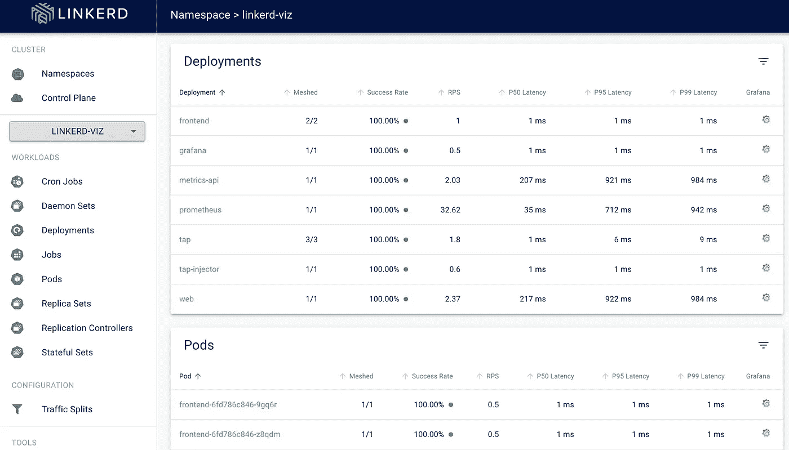
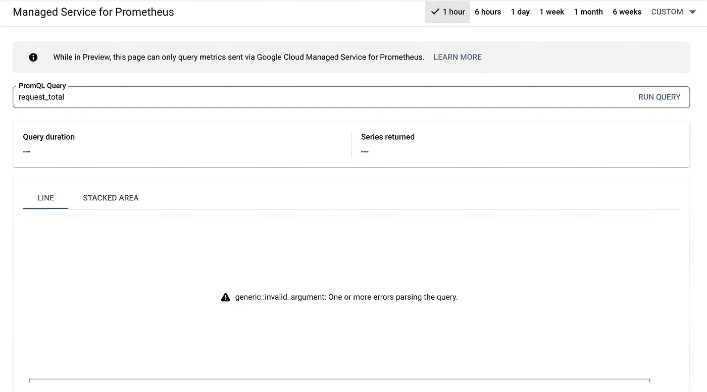
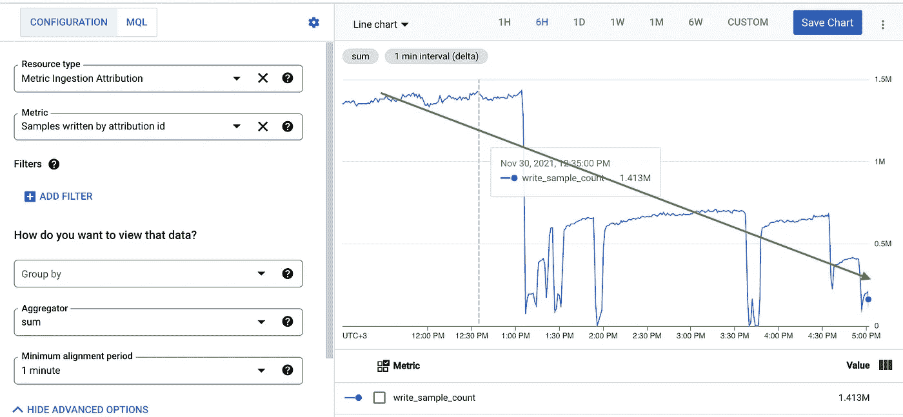
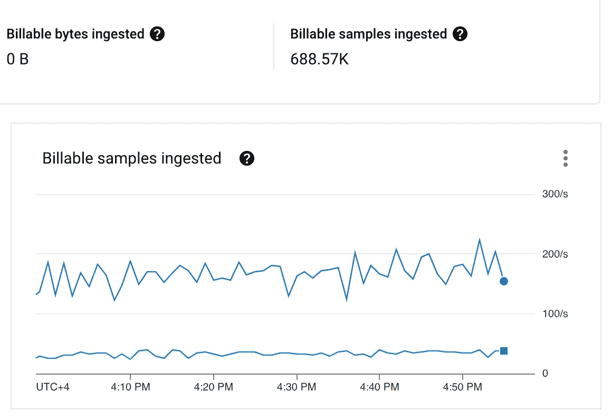

# 优化 Prometheus 中的 Linkerd 指标

> 原文：<https://itnext.io/optimizing-linkerd-metrics-in-prometheus-de607ec10f6b?source=collection_archive---------2----------------------->


这篇文章的演员阵容

Linkerd 是一个服务网格解决方案，其理念是“做得更少，但做到最好”它有 Viz 扩展，提供自己的仪表板来呈现实时画面，还有 Grafana，提供预配置的仪表板来分析历史数据。所有仪表板都使用 Prometheus 作为后端来收集、保存和查询指标。

默认情况下，Viz 扩展为用户提供了一个启动包，包括 Prometheus、Grafana 和所有必要的配置。只需安装舵图并使用它。这是我们的第一选择，因为它节省了你开始的时间。



Viz 仪表盘

在使用 Linkerd 的一年中，我们的测试和生产环境中的工作负载数量稳步增长，在某个时刻， ***我们开始意识到仪表板工作缓慢*** 。此外， ***我们保留了最后一个小时的指标值，只是因为普罗米修斯*** 消耗了大量内存(对于 500 多个网格工作负载，大约 11GB)。因此，我们开始思考如何使仪表板更快，花费更少的资源，并保留数据至少几天。

# 第一次尝试

有趣的是，我们的第一个愿望是长期保存数据，并在统计上使用它。半年前，谷歌推出了他们的产品 [Monarch](https://cloud.google.com/stackdriver/docs/managed-prometheus) 作为管理式普罗米修斯解决方案。到那时，我们已经使用其他 GCP 产品，如 Stackdriver 来保持来自 Linkerd 的痕迹。尝试一种新的方法来用熟悉的工具存储和分析时间序列数据是合理的。

后端的替换很容易。出于测试目的，我们更改了容器映像名称，并添加了向 Monarch 发送样本的适当权限。而且……它起作用了！

美中不足的是。我们面临两个主要问题。首先，我们无法获取一些指标:



度量的误差

我们与 Google 支持团队一起解决了这个问题。该错误的原因是该指标的标签数量。 ***托管解决方案的上限为 55 个标签。解决这个问题的唯一选择是减少标签数量，然后重新创建指标。***

我们可以快速解决刮擦配置修改的第一个问题:

```
**# remove this action to remove unused pod labels**
- action: labelmap        
  regex: __meta_kubernetes_pod_label_(.+)        
  replacement: __tmp_pod_label_$1
```

第二个问题更棘手。默认情况下， ***存储来自 Linkerd 的所有指标需要大约 150 万个样本，每月花费大约 9K 美元*** 。这对我们来说是一个重要的数字，我们试图减少样本的数量。

正如您在下面的截图中看到的，我们在减少摄入样本量方面取得了一些成功:



摄取度量图形

为此，我们开始**只导出三个关键指标**并且**将抓取时间**从 10 秒增加到 20 秒:

```
**# flag to export only some metrics to Monarch**
--export.match='{__name__=~"response_.+"}'
```

它将样本数量从 150 万急剧减少到 25 万。然而， ***这样的变化让我们失去了很大一部分指标*** 。我们不能用 Monarch 完全取代默认的 Prometheus 安装。

> 顺便说一句，如果你有额外的钱花，那么君主将是正确的选择。

# 深入了解指标内部

过了一会儿，我们进行了第二次尝试来提高仪表板的性能。在那时，我们已经知道了很多度量标准的标签，并且已经解决了一些问题。

从逻辑上讲，我们的下一步是找出缓慢的本质。首先要做的是理解指标的基数，因为我们假设**高基数会显著影响性能**。

毫不奇怪，Linkerd 指标(其中一些指标比其他指标更高)具有很高的基数。原因很简单。大多数 Linkerd 代理指标系列提供了由两个 POD 名称组成的边缘，当 POD 重新创建时，这些名称会发生变化。豆荚和它们之间的连接越多，基数就越大。

为了找到最基数的指标，我们可以使用简单的查询 Prometheus:

```
topk(10, count by (__name__)({__name__=~".+"}))
```

该查询返回的领导者是超过 250K 系列的**response _ latency _ ms _ bucket**度量。这是一个巨大的基数，我们应该找到一种方法来减少它。

因为它是直方图指标，所以我们观察到了很多桶。标准，如 **+INF、**和**1/10/100/10000/10000**ms，以及用于更精确计算的附加，如 **2/3/4/5…/40000/50000。**附加值有助于在分位数图中获得更准确的结果，但是多个 pod 到 pod 的边要计算 25 次。大量的这种边缘和这种乘数会显著影响 Linkerd 仪表板的性能和稳定性。

解决方案是从指标中移除额外的桶:

```
metric_relabel_configs:
  - action: drop
    source_labels: [le]
    regex: "2.*|3.*|4.*|5.*"
```

**它帮助我们将最高基数从 250K 降低到 60K！**

## 其他调整

我们使用的默认普罗米修斯(是的，我们已经知道了[的缺点](https://linkerd.io/2.12/tasks/external-prometheus/))抓取了很多 Viz 仪表板没有使用的指标(标准 k8、容器、Grafana 和它自己的)。 ***我们通过修改普罗米修斯*** 的配置删除了所有这些擦伤。它帮助我们减少了度量数据量，Prometheus 开始感觉好些了。

尽管有这些变化，性能仍然一般，我们开始寻找如何改进它。

因为这些指标具有很高的基数，我们发现有些文章 [Victoria Metrics](https://victoriametrics.com/) 在这种情况下表现更好。好消息是 Victoria Metrics 与 PromQL 兼容，并支持 Prometheus scrape 配置:

```
- args:
  - -promscrape.config.strictParse=false
  **- -promscrape.config=/etc/prometheus/prometheus.yml**
  - -promscrape.maxScrapeSize=256MB
  - -storageDataPath=/data
  - -retentionPeriod=30d
  **- -httpListenAddr=:9090**
  - -search.maxSeries=100000
  - -search.maxUniqueTimeseries=1000000
```

为了修复配置的严格解析，我们删除了不支持的属性:

```
global:
  **evaluation_interval: 10s****rule_files:
  - /etc/prometheus/*_rules.yml
  - /etc/prometheus/*_rules.yaml**
```

借助 Victoria Metrics，我们实现了相同价格(CPU/MEM 消耗)下的每月保留期，而不是几个小时，并且 Viz dashboard 的**性能显著提高。**

完整的刮擦配置:

# 回到君主

好了，现在我们有了操作数据，但我们应该考虑历史数据。没有必要将具有所有可能的度量和边缘的所有数据长期保存。

我们决定，有两个主要指标我们希望尽可能长地保持:**response _ latency _ ms _ bucket**和 **response_total** ，分别用于计算延迟和成功率。

对于长期存储，我们选择了 Monarch(在文章的第一部分中介绍过),因为我们计划显著减少样本的数量，并消除其使用的高价格。

我们的第一个目标是去除高基数标签，所以我们选择创建规则来仅聚合具有有价值标签的数据:

我们不能使用托管版本，因为在使用联合的情况下缺少**类型**的[问题](https://cloud.google.com/stackdriver/docs/managed-prometheus/troubleshooting#unknown-double-written.)，所以我们部署了自部署版本，如文档中所述:[https://cloud . Google . com/stack driver/docs/managed-Prometheus/setup-unmanaged](https://cloud.google.com/stackdriver/docs/managed-prometheus/setup-unmanaged)。

因此，我们通过 Victoria Metrics 的联合设置了所需的收集指标:

如你所见，我们使用长的刮擦间隔来减少系列的数量。为了仅导出聚合指标，我们根据文档对其进行限制，并使用尽可能短的保留时间:

```
containers:
  - args:
    - --config.file=/etc/prometheus/prometheus.yml
    - --storage.tsdb.path=/prometheus/data
   ** - --storage.tsdb.retention.time=1h**
    - --web.enable-lifecycle
    - --storage.tsdb.no-lockfile
    - --web.route-prefix=/
    **- --export.match={__name__=~"job:response.+:sum"}**
```

所有这些都有助于我们发送和长期保存有价值的数据，并且只需支付很少的费用。



现在摄入了多少样本

正如你在上面的图片中看到的，目前，我们每小时摄取不到 100 万个样本，每月花费不到 100 美元。

# 结论

在最终解决方案中，我们为 Linkerd 指标划分了 Prometheus 指标存储:

*   由 Victoria Metrics 支持的 Viz dashboard 和标准 Linkerd Grafana dashboards 的短期存储，可保存一个月的数据
*   由 Monarch 支持的历史数据长期存储(GCE 管理的 Prometheus)

Victoria Metrics 帮助我们**有效地处理许多高基数指标**，并提高 Linkerd 可观察性工具的稳定性和性能。Monarch 帮助我们**以合理的价格将有价值的数据长期**保存下来，没有任何麻烦。

结束了。我希望这篇文章能帮助或给你一些想法、见解和乐趣。