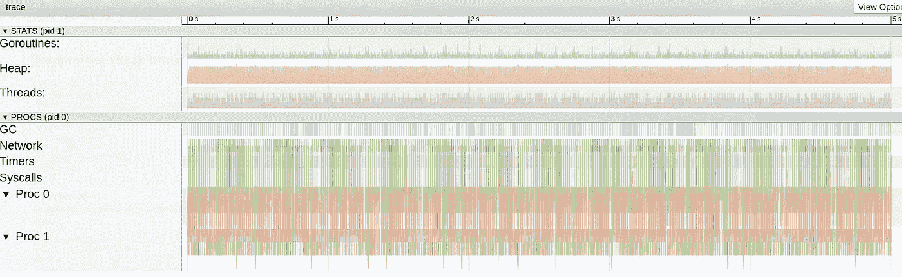
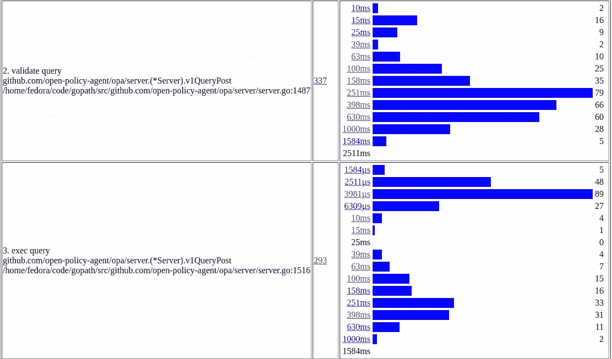
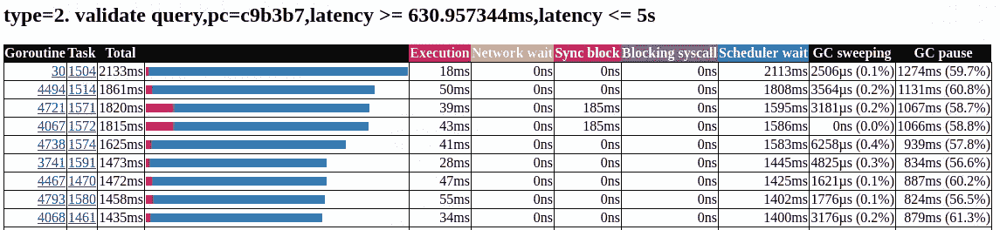
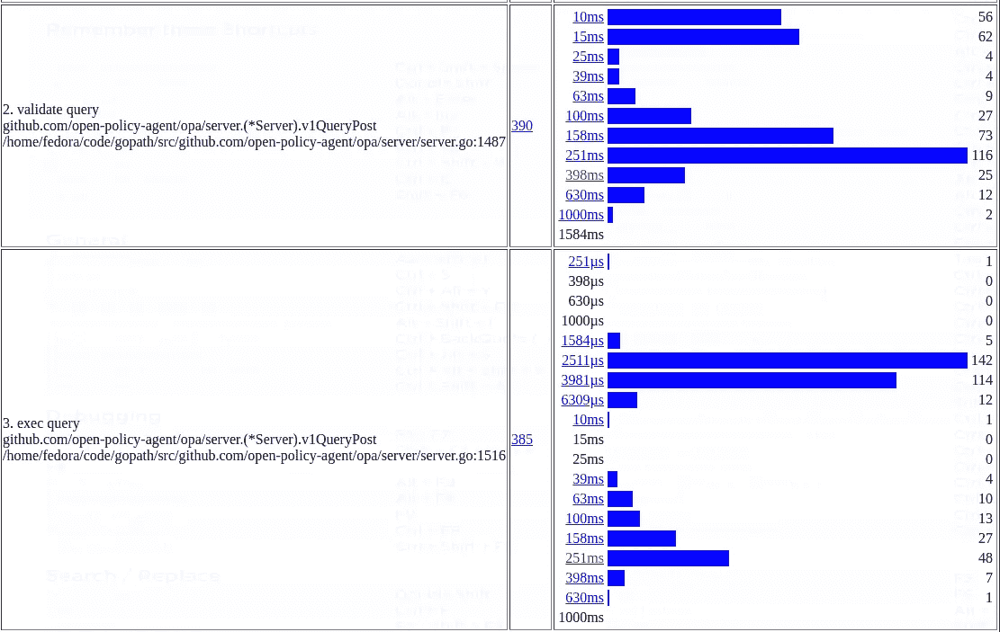
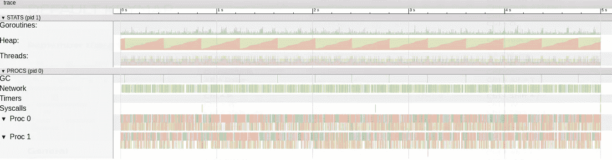
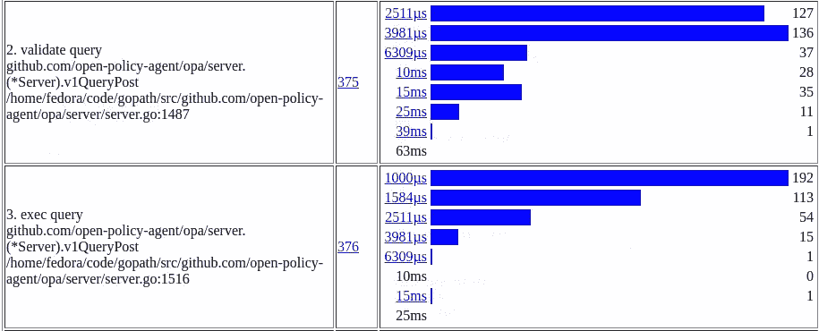

# 通过 Go Execution Tracer 优化基于开放策略代理的 Kubernetes 授权

> 原文：<https://itnext.io/optimizing-open-policy-agent-based-kubernetes-authorization-via-go-execution-tracer-7b439bb5dc5b?source=collection_archive---------5----------------------->

如 [Kubernetes 通过开放策略代理](/kubernetes-authorization-via-open-policy-agent-a9455d9d5ceb)授权所述，OPA 可用于在 Kubernetes 中实施授权和准入策略。不幸的是，根据您的工作负载，在生产中使用时有一些注意事项。这篇博客文章解释了 OPA 和 [Kubernetes 策略控制器](https://github.com/open-policy-agent/gatekeeper)(最近被重命名为 Gatekeeper)如何针对生产用途进行微调。这个博客基于 OPA 0.10.3 和我们的[分叉 Kubernetes 策略控制器](https://github.com/c445/kubernetes-policy-controller)(我们还没有迁移到 Gatekeeper)。

# 概述

如下图所示，Kubernetes 策略控制器(以及 OPA)由 Kubernetes API 服务器在以下情况下调用:

*   对于对 Kubernetes API 服务器的每个授权请求，即几乎每个请求
*   可能针对资源上的每次创建/更新/删除，这取决于如何配置变异 Webhook

概述面向 Kubernetes 授权和准入的 OPA 集成

因此，很明显，如果操作不当，很有可能会引入延迟。以下部分展示了我们如何优化集群的性能。

# 基线群集

在我们的基线集群中，对 Kubernetes API 服务器的许多请求来自一个通过 CRDs 管理舵图部署的运营商。因此会有稳定的请求流，比如创建名称空间、更新服务/部署/状态集，当然还有修改 CRDs 本身。我将通过[贝吉塔](https://github.com/tsenart/vegeta)和以下混合请求再现这个用例:

*   75%仅授权请求，例如:列表窗格、获取服务和观察命名空间
*   25%的准入请求，例如:更新 CRDs、删除部署和更新服务(准入请求在发送到变异 Webhook 之前也经过授权)

使用`GO_MAX_PROCS=2`运行开放策略代理。贝吉塔用于以下设置:

*   60 秒持续时间
*   20 个并发连接
*   每秒 75 个请求

从贝吉塔直接调用 OPA 时测得的基线延迟为:

*   平均值:7.24 秒
*   分位数 50，95，99，最大值:4.79 秒，24.01 秒，29.13 秒，31.54 秒
*   大约 13%的请求超时

# 只将请求发送到实际上应该被验证的 MutatingWebhook

显然 OPA 运行的不是很好。我们发现的第一个问题是，通过 MutatingWebhook 验证每个对象实际上是不可行的。

因此，我们将我们的 MutatingWebhook 限制为只验证我们的 OPA 策略中实际提到的对象:

我们并不想验证对象的删除，所以现在我们只验证`CREATE`和`UPDATE`请求。所有其他列出的资源实际上都通过我们的政策进行了验证。一个巨大的性能提升是我们不再需要验证像配置映射这样的资源。通常，许多配置是通过 ConfigMaps 存储的，当开放策略代理解析所有这些资源时，这会带来巨大的性能损失。特别是，因为 OPA 为每个查询构建了一个抽象语法树。

所以在改变了变异的 WebhookConfiguration 之后，我们现在收到的请求越来越少。这些优化的延迟现在是:

*   平均值:3.22 秒
*   分位数 50，95，99，最大值:1.04 秒，11.29 秒，13.32 秒，16.19 秒
*   我们仍然会遇到超时，但只是针对大约 0.23%的请求

# 不要在更新许可请求时发送旧资源

下一个优化处理 Kubernetes 策略控制器。它向 OPA 发送如下请求:

每次更新请求时，资源基本上被发送两次给 MutatingWebhook。旧版本在`oldObject`字段，新版本为`object`。因为我们的策略只适用于新的资源，我们从请求中删除了`oldObject`。这导致了另一个性能提升，因为我们显著减小了查询大小:

*   平均值:790 毫秒
*   分位数 50，95，99，最大值:13 毫秒，3.21 秒，3.92 秒，4.78 秒
*   没有超时

# 去收垃圾

为了找出某些请求缓慢的原因，OPA 中添加了跟踪 pprof 端点的[,我们通过](https://golang.org/pkg/net/http/pprof/) [Go 执行跟踪器](https://blog.gopheracademy.com/advent-2017/go-execution-tracer/)来查看跟踪。

去追踪 GOGC=100

值得注意的是，有许多垃圾收集只释放了大约 2-5mb 的内存。这些大多是从 AST 解析器内部触发的。当然这需要花费大量的 CPU 时间。我们还添加了一些[追踪区域](https://medium.com/observability/debugging-latency-in-go-1-11-9f97a7910d68)。最重要的代码区域是[验证](https://github.com/open-policy-agent/opa/blob/v0.10.3/server/server.go#L1462-L1463)和[执行](https://github.com/open-policy-agent/opa/blob/v0.10.3/server/server.go#L1489)查询。直方图提供了一些关于实际花费和损失时间的见解。

GOGC=100 的关键代码区域直方图

当深入研究运行缓慢的 validate query 时，很明显大部分时间都花在了等待调度上:

验证查询的最慢执行时间表

结论是这一切可能是由非常频繁的 GC 运行造成的。为了减少 GC 周期的数量，我们设置了`GOGC=1000`。以下是使用新的`GOGC`设置运行 OPA 时的轨迹:

去追踪 GOGC=1000

明显的区别是，我们现在的 GC 周期少了很多，它们释放了大约 30-40mb 的内存。我认为在太少的 GC 周期导致内存使用增加和太多的 GC 周期降低应用程序速度之间找到平衡点是很重要的。如果`GOGC`值设置得太高，那么 GC 运行的频率就会降低，GC 持续时间也会增加，因为有更多的内存可以释放。当 GC 最终运行时，这可能会导致延迟高峰。验证和执行查询所花费的时间也有所减少:

GOGC=1000 的关键代码区域直方图

请注意，尽管`GOGC=1000`对我们来说似乎是一个不错的值，但这在很大程度上取决于您的工作负载/查询。

延迟时间缩短至:

*   平均值:15 毫秒
*   分位数 50，95，99，最大值:13 毫秒，26 毫秒，41 毫秒，175 毫秒

# 优化授权查询格式

尽管我们优化了 GC，但是仍然有一些请求花费了太多的时间。我们仔细研究了授权查询，因为到目前为止，它们代表了我们对 OPA 的大多数请求:

最初选择这种格式是为了与准入请求具有一致的查询格式。显然，大多数像`resourceAttributes`或`user`和`group`这样的字段都需要做出有用的授权决策。但是也有很多开销，比如深度嵌套结构或者`status`和`metadata`字段。所以我们把格式精简到最低限度:

OPA 现在应该能够比以前更快地解析这种格式。

使用 GOGC=1000 进行追踪&优化授权查询

显著的区别是:

*   GC 周期比以前少了，因为我们消耗了更少的内存。GC 周期之间的时间从 250 毫秒增加到 400 毫秒
*   Goroutines 不像以前那样需要等待很长时间才能得到预定。高峰可运行的 Goroutines 从 68 个下降到 3 个，因为我们的大多数请求可以得到更快的处理。

如果我们看一下直方图，我们会看到巨大的改进:

GOGC=1000 的关键代码区域直方图&优化的授权查询

延迟改善到:

*   平均值:9 毫秒
*   分位数 50，95，99，最大值:6 毫秒，24 毫秒，42 毫秒，90 毫秒

# 未来优化:服务器端应用

目前，`kubectl apply`实现了这样的逻辑，即只有在当前资源和新资源版本之间存在差异时，才应用资源。因为我们在我们的操作符中直接使用了`client-go`,并且没有为此实现优化，所以即使没有变化，也会应用大量的资源。所有这些请求都必须通过我们的 MutatingWebhook 进行验证。一旦[服务器端应用](https://github.com/kubernetes/enhancements/issues/555)在 Kubernetes 中实现，我们希望这些请求不再被发送到变异的 Webhook，这将有助于进一步降低延迟。

# **结论**

最后，我们获得了将基于 OPA 的授权投入生产所需的性能。下表显示了优化步骤的概述:

根据您使用 Kubernetes 的方式，这种优化可能会在 Kubernetes API 服务器延迟方面提供巨大的性能改进。

感谢我的团队在几天的性能调试中对我的包容:)。对 Go execution tracer 的所有贡献者来说，这是一个调查 Go 性能的无价工具。感谢开放策略代理和 Kubernetes 策略控制器/看门人的所有贡献者。