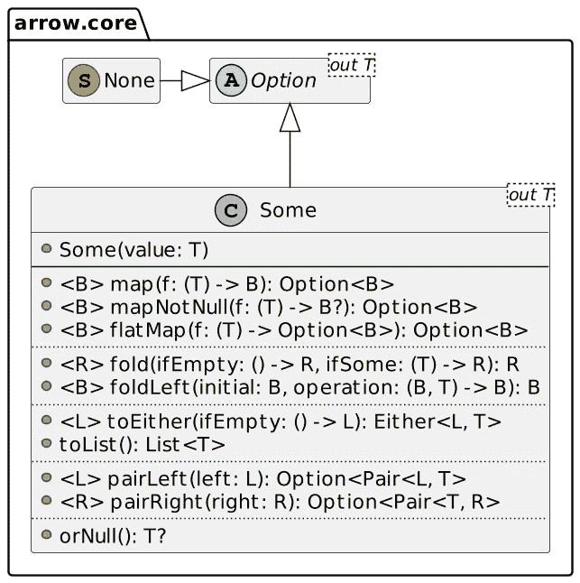

# 处理 null:可选类型和可空类型

> 原文：<https://itnext.io/optional-and-nullable-type-b0e58338aeec?source=collection_archive---------3----------------------->


Java 一直因其`NullPointerException`而声名狼藉。NPE 的原因是调用方法或访问尚未初始化的**对象的属性**。

```
var value = foo.getBar().getBaz().toLowerCase();
```

运行此代码片段可能会产生如下结果:

```
Exception in thread "main" java.lang.NullPointerException
  at ch.frankel.blog.NpeSample.main(NpeSample.java:10)
```

此时，您还不知道调用链中的`null`是哪个部分:`foo`，还是`getBar()`或`getBaz()`返回的值？

在 JVM 的最新版本中，语言设计者改善了这种情况。在 JVM 14 上，您可以用`-XX:+ShowCodeDetailsInExceptionMessages`标志激活“有用的”npe。运行相同的代码片段显示哪个部分是`null`:

```
Exception in thread "main" java.lang.NullPointerException: 
  Cannot invoke "String.toLowerCase()" because the return value of 
"ch.frankel.blog.Bar.getBaz()" is null
  at  ch.frankel.blog.NpeSample.main(NpeSample.java:10)
```

在 JVM 15 上，它成为默认行为:您不需要特定的标志。

# 处理 NullPointerException

在上面的代码片段中，开发人员假设每个部分都已经初始化。显示`null`部分有助于调试和揭穿错误的假设。然而，这并没有解决根本原因:我们需要以某种方式处理`null`值。

为此，我们需要求助于防御性编程:

```
String value = null;
if (foo != null) {
    var bar = foo.getBar();
    if (bar != null) {
        baz = bar.getBaz()
        if (baz != null) {
            value = baz.toLowerCase();
        }
    }
}
```

它修复了问题，但远非最佳开发人员体验——至少可以这么说:

1.  开发人员需要小心他们的编码实践
2.  这种模式使得代码更难阅读。

# 选项包装类型

在 JVM 上，Scala 的`Option`是我所知的第一次尝试 sane 的`null`处理方法，即使这个概念已经融入了函数式编程的基础。`Option`背后的概念确实很简单:它是一个包装器，包装一个可能是`null`的值。

您可以在包装器内部的对象上调用类型相关的方法，包装器将充当过滤器。因为`Option`有它的方法，我们需要一个作用于包装类型的传递函数:这个函数在 Scala 中被称为`map()`(在其他几种语言中也是如此)。它在代码中翻译为:

```
def map[B](f: A => B): Option[B] = if (isEmpty) None else Some(f(this.get))
```

如果包装器为空，*即*包含一个`null`值，则返回一个空包装器；如果不是，调用底层值上的传递函数并返回包装结果的包装器。

从 Java 8 开始，JDK 提供了一个名为`Optional`的包装器类型。有了它，我们可以将上面的空检查代码重写为:

```
var option = Optional.ofNullable(foo)
    .map(Foo::getBar)
    .map(Bar::getBaz)
    .map(String::toLowerCase);
```

如果调用链中的任何一个值是`null`，那么`option`就是`null`。否则，它返回计算值。无论如何，非公有制经济已经不复存在了。

# 可空类型

不考虑语言，选项类型的主要问题是它的先有鸡还是先有蛋的特性。要使用一个*选项*，你首先需要确定它不是`null`。考虑以下方法:

```
void print(Optional<String> optional) {
    optional.ifPresent(str -> System.out.println(str));
}
```

如果我们执行这段代码会发生什么？

```
Optional<String> optional = null;
print(optional);                       // 1
```

1.  哎呀，回到我们熟悉的 NPE

此时，迷恋于*选项*类型的开发人员会告诉你这不应该发生，你不应该这样写代码，等等。这可能是准确的，但不幸的是，这并不能解决问题。为了 100%避免 npe，我们需要回到防御性编程:

```
void print(Optional<String> optional) {
    if (optional != null) {
        optional.ifPresent(str -> System.out.println(str));
    }
}
```

Kotlin 选择了另一条路线，使用了**可空**类型及其对应的非可空类型。在科特林，每种类型的`T`都有两种口味，尾随的`?`暗示它可以是`null`。

```
var nullable: String?          // 1
var nonNullable: String        // 2
```

1.  `nullable`可以是`null`
2.  `nonNullable`不能

Kotlin 编译器知道这一点，并阻止您直接调用引用上的函数，该引用可能是`null`。

```
val nullable: String? = "FooBar"
nullable.toLowerCase()
```

上面的代码片段在*编译时*抛出异常，因为编译器无法断言`nullable`不是`null`:

```
Only safe (?.) or non-null asserted (!!.) calls are allowed on a nullable receiver of type String?
```

空安全操作符*即*、`?.`与`map`非常相似:如果对象是`null`，停止并保持`null`；如果没有，继续函数调用。让我们将代码迁移到 Kotlin，用一个空的安全调用替换`Optional`:

```
val value = foo?.bar?.baz?.lowercase()
```

# 选项还是可空类型？

如果你正在使用一种编译器不强制空安全的语言，你别无选择。这个问题只在这样的语言范围内提出，*如*，科特林。Kotlin 的标准库不提供选项类型。然而，[箭头](https://arrow-kt.io/docs/apidocs/arrow-core/arrow.core/-option/)库可以。或者，你仍然可以使用 Java 的`Optional`。

但是问题仍然存在:如果可以选择，您应该使用可选类型还是可空类型？第一种选择更详细一些:

```
val optional: Foo? = Optional.ofNullable(foo)   // 1
                             .map(Foo::bar)
                             .map(Bar::baz)
                             .map(String::lowercase)
                             .orElse(null)val option = Some(foo).map(Foo::bar)            // 2
                      .map(Bar::baz)
                      .map(String::lowercase)
                      .orNull()
```

1.  Java API 返回平台类型；您需要设置正确的类型，该类型可以为空
2.  箭头正确地推断出可空的`Foo?`类型

除了推断正确的类型，Arrow 的`Option`还提供:

*   上面看到的`map()`功能
*   传统上与单子相关的其他标准函数，*，例如*、`flatMap()`和`fold()`
*   附加功能



例如，`fold()`允许提供两个 lambdas，一个在`Option`为`Some`时运行，另一个在`None`时运行:

```
val option = Some(foo).map(Foo::bar)
                      .map(Bar::baz)
                      .map(String::lowercase)
                      .fold(
                        { println("Nothing to print") },
                        { println("Result is $it") }
                      )
```

# 结论

如果`null`是一个百万美元的错误，现代工程实践和语言可以处理它。在 Kotlin 中发现的编译器强制空安全是一个很好的开始。然而，为了充分利用函数式编程的强大功能，我们需要一个符合 FP 标准的 Option 实现。在这种情况下，问题是强制传递的选项对象永远不要是`null`。

Kotlin 的编译器在本地完成这项工作，而 Arrow 库提供了一个选项实现来满足 FP 程序员的需求。

**更进一步:**

*   [图片中的函子、应用程序和单子](https://adit.io/posts/2013-04-17-functors,_applicatives,_and_monads_in_pictures.html)
*   [科特林的零安全](https://kotlinlang.org/docs/null-safety.html)
*   [为什么使用 Arrow 的选项而不是 Kotlin nullable](https://stackoverflow.com/questions/48895103/why-use-arrows-options-instead-of-kotlin-nullable)

*原载于* [*一个 Java 怪胎*](https://blog.frankel.ch/optional-nullable-type/)*2022 年 4 月 2 日*