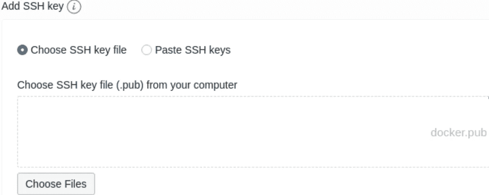
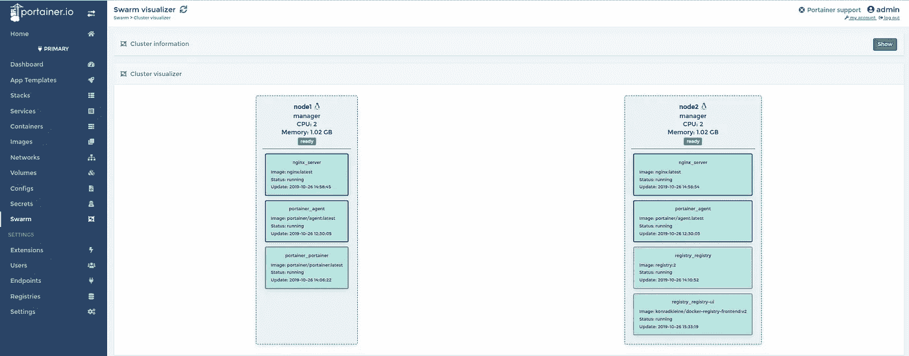
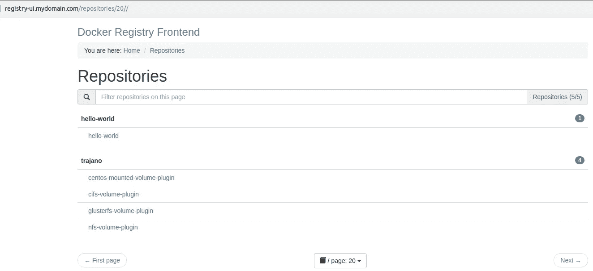

# Oracle 始终在高可用性配置中释放云实例

> 原文：<https://itnext.io/oracle-always-free-cloud-instances-in-ha-configuration-e1d3dd59d3b1?source=collection_archive---------4----------------------->

Oracle 云始终免费提供，是部署最少应用程序或作为开发环境的绝佳资源。

在本文中，我们将展示如何部署具有高可用性功能的极简双节点 Docker Swarm 集群。对于此解决方案，我选择了以下组件:

*   Oracle-Linux-7.7–2019 . 09 . 25–0
*   [面向 Oracle Linux 的 Gluster 存储](https://docs.oracle.com/en/operating-systems/oracle-linux/gluster-storage/gluster-intro.html)
*   码头工人群

始终免费的云服务包括:

*   2 架 ***VM。标准. E2.1 .微型*T5 形状**

> 1Gb 内存
> 
> 48 Gb 引导磁盘
> 
> 2 核 AMD EPYC 7551 32 核处理器

*   100 的块卷(如果启动上述实例，将消耗 96)
*   2 自治数据库
*   一个用于 OLTP，包括:

> 1 个 OCPU(两个内核)
> 
> 20Gb 数据
> 
> 自动每日备份
> 
> 无自动缩放

*   一个用于 DW:

> 1 个 OCPU(两个内核)
> 
> 20Gb 数据
> 
> 没有后援
> 
> 无自动缩放

*   一个负载均衡器—***10 Mbps—微型***

面对这种情况，我们能做什么？，嗯很多！！。下图显示了我的部署


让我们来看更多细节:

***计算- >实例- >创建实例*** 步骤:


实例名称和形状选择


检查始终免费合格


显示形状、网络和存储选项->使用 ssh 启用公共 IP 访问



从您的笔记本中选择一个 ssh 公钥

重复以上创建 node2 的步骤，几分钟后您将开始运行计算实例:


安装后脚本(为 Oracle Linux 添加 [Gluster 存储](https://docs.oracle.com/en/operating-systems/oracle-linux/gluster-storage/gluster-intro.html))，节点 1 步骤作为根:

```
# cat /etc/hosts
127.0.0.1   localhost localhost.localdomain localhost4 localhost4.localdomain4
::1         localhost localhost.localdomain localhost6 localhost6.localdomain6
10.0.1.16 node2 remote
# firewall-cmd --permanent --zone=public --add-port=24007-24008/tcp
# firewall-cmd --permanent --zone=public --add-port=24007-24008/udp
# firewall-cmd --permanent --zone=public --add-port=49152-49156/tcp
# firewall-cmd --permanent --zone=public --add-port=49152-49156/udp
# firewall-cmd --reload
# cd /home/
# yum -y update
# yum install -y oracle-gluster-release-el7
# yum-config-manager --enable ol7_gluster5 ol7_addons ol7_latest ol7_optional_latest ol7_UEKR5
# dd if=/dev/zero of=fs.img count=0 bs=1 seek=20G
# mkfs.xfs -f -i size=512 -L glusterfs fs.img
# mkdir -p /data/glusterfs/myvolume/mybrick
# echo '/home/fs.img /data/glusterfs/myvolume/mybrick xfs defaults  0 0' >> /etc/fstab
# mount -a && df
# yum install -y glusterfs-server
# systemctl enable --now glusterd
```

> 由于卷磁盘使用的限制，我们削减了 20Gb 的引导卷，并将其专用于使用 Gluster FS 的共享镜像存储。

在 node2 上执行类似的步骤，除了/etc/hosts，如下所示:

```
# cat /etc/hosts
127.0.0.1   localhost localhost.localdomain localhost4 localhost4.localdomain4
::1         localhost localhost.localdomain localhost6 localhost6.localdomain6
10.0.1.15 node1 remote
```

在 Oracle 云上配置软件定义的防火墙
网络- >虚拟云网络- >虚拟云网络详细信息- >安全列表(入口规则)


允许启用 Docker Swarm 和 GlusterFS 的端口

准备 ***Gluster FS*** 集群，以节点 1 为根:

```
# gluster peer probe node2
# gluster peer status
# gluster pool list
UUID     Hostname  State
c1b9cfd0-6e2f-425a-b3da-46803c6312c7 node2     Connected 
54746d21-d1e2-4030-b58c-54a45f22fa3c localhost Connected 
# gluster volume create myvolume replica 2 node{1,2}:/data/glusterfs/myvolume/mybrick/brick
# gluster volume start myvolume
# gluster volume info
```

在节点 1 和节点 2 上装载复制的存储:

```
# mkdir /gluster-storage
# echo "localhost:/myvolume /gluster-storage glusterfs defaults,_netdev 0 0" >> /etc/fstab
# mount /gluster-storage && df -h
```

在节点 1 和节点 2 上安装 Docker Swarm 集群:

```
# yum install docker-engine
# systemctl enable --now docker
# firewall-cmd --permanent --zone=public --add-port=2377/tcp
# firewall-cmd --reload
# docker swarm init --advertise-addr ens3
```

初始化节点 1 上的群集群:

```
# docker swarm init --advertise-addr ens3
# docker swarm join-token manager
```

在节点 node2 上使用加入令牌:

```
# docker swarm join --token SWMTKN-1-3ud0gg60omt194qnu5fxht9qnuhz7zs6v0wt1pcmj3h1cxcacl-d6536ldpb7ijzx7j9iqly8vlv 10.0.1.15:2377
```

***Gluster FS***over***XFS***基本性能测试本地、读写、并行或顺序。


使用带有直接标志的 dd 的单位(MB/s)

请注意，在进行并行写入时，两个节点都在复制的目录上写入，这可能是因为写入了一些额外的元数据，使两个目录同步。

通过上述配置，我们可以部署多个应用程序，并提供高可用性支持，例如，让 Docker 群节点处于耗尽状态进行维护，我们的应用程序将保持运行。

下一篇文章将提供在上述集群中部署多个服务的示例，包括，请参见屏幕截图:


服务启动并运行 nginx(复制)portainer 和带有 UI 的私有注册中心



使用 Portainer 进行集群 UI 管理。超正析象管(Image Orthicon)



带有用户界面和复制存储的专用 docker 注册表