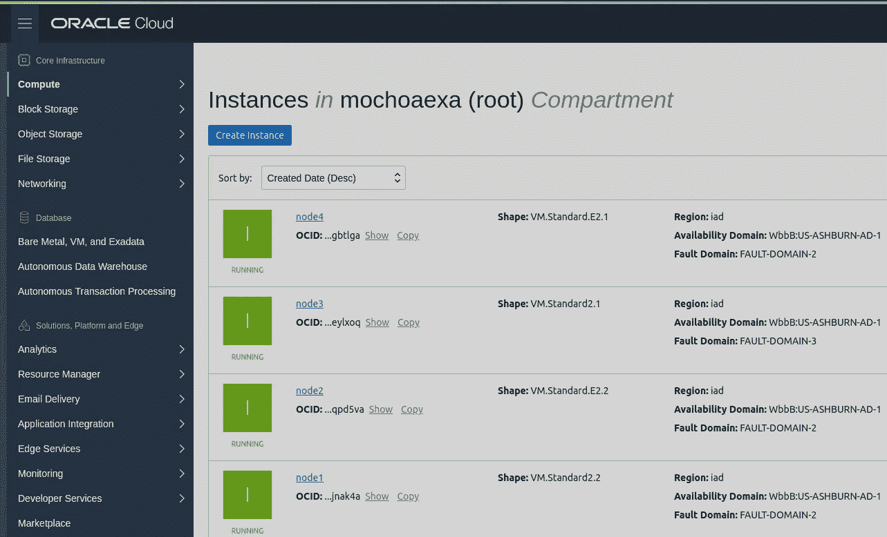
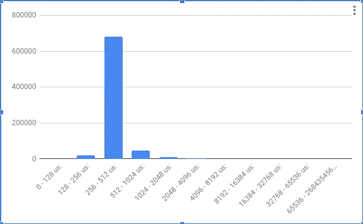
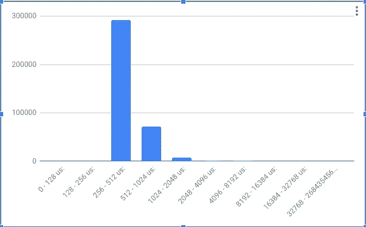
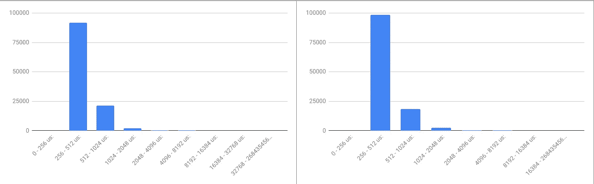
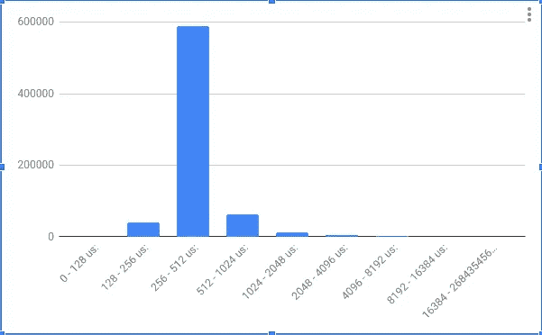
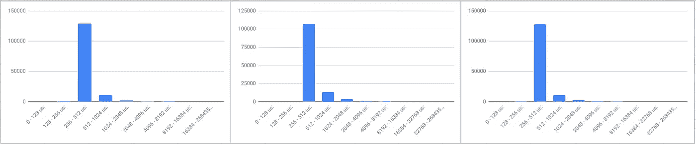

# 使用 Docker (Storidge)分布式存储的 Oracle 云 IO 测试

> 原文：<https://itnext.io/oracle-cloud-io-test-using-a-distributed-storage-for-docker-storidge-d41c6555f63f?source=collection_archive---------2----------------------->

当迁移到云时，第一个问题(忘记成本)是我如何预测我的 IO 性能？这是因为当您创建计算实例时，没有人知道在幕后使用了哪个硬件。



Oracle 云控制台

查看来自 CPU 的信息很容易知道处理器的性能，例如使用 shape ***VM 创建的实例。标准。e 2.1*T3 将有两个核心类型:**

```
ubuntu@node1:~$ cat /proc/cpuinfo |grep "model name"
model name : AMD EPYC 7551 32-Core Processor
model name : AMD EPYC 7551 32-Core Processor
ubuntu@node1:~$ cat /proc/cpuinfo |grep "cpu MHz"
cpu MHz  : 1996.243
cpu MHz  : 1996.243
```

但是磁盘呢，引导还是附带**T5【iSCSI】T6**卷，没人知道什么是没有硬件信息的**半虚拟化 磁盘，请看:**

```
root@node1:/srv/nfs4# hdparm -i /dev/sda/dev/sda:
SG_IO: bad/missing sense data, sb[]:  70 00 05 00 00 00 00 0a 00 00 00 00 20 00 00 00 00 00 00 00 00 00 00 00 00 00 00 00 00 00 00 00
 HDIO_GET_IDENTITY failed: Invalid argument
root@node1:/srv/nfs4# hdparm -i /dev/sdb/dev/sdb:
SG_IO: bad/missing sense data, sb[]:  70 00 05 00 00 00 00 0a 00 00 00 00 20 00 00 00 00 00 00 00 00 00 00 00 00 00 00 00 00 00 00 00
 HDIO_GET_IDENTITY failed: Invalid argument
```

好了，有了以上信息，我决定测试 Oracle 云基础设施的性能，在两个可能的场景中使用 Docker Swarm 集群，***【NFS】***共享存储和分布式使用***CIO***from[***Storidge***](https://storidge.com/)，为我的 Docker 实例存储持久数据的两个选项。

为了进行测试，我使用了一个云实例，类似于我在上一篇文章[中使用的在 Oracle Cloud 上部署 Docker Swarm 和 Oracle Linux 7](https://medium.com/@marcelo.ochoa/deploy-docker-swarm-at-oracle-cloud-with-oracle-linux-7-168746f6d9f4) ，但在这种情况下，使用 Ubuntu 来方便安装 ***Storidge*** 。在这种情况下，使用 4 个节点进行分布式存储，一个节点作为*NFS 服务器，在所有使用高 IO 块存储/延迟的情况下，可能会使用 ***SSD*** 。*

# *使用 dd 的第一个原始测试*

*一个非常简单的 IO 测试是用 dd 做的，我们可以检查引导分区和块存储分区(ext4 格式化的)，这里的引导磁盘:*

```
*root@de866e:/tmp# dd if=/dev/zero of=test4.img  bs=1G count=1 oflag=dsync
1+0 records in
1+0 records out
1073741824 bytes (1.1 GB) copied, 13.9244 s, ***77.1 MB/s***
root@de866e:/tmp# dd if=test4.img of=/dev/null oflag=dsync
2097152+0 records in
2097152+0 records out
1073741824 bytes (1.1 GB) copied, 2.06966 s, ***519 MB/s****
```

*这里是存储/延迟磁盘上的数据磁盘:*

```
*root@de866e:/srv/nfs4# dd if=/dev/zero of=test4.img  bs=1G count=1 oflag=dsync
1+0 records in
1+0 records out
1073741824 bytes (1.1 GB) copied, 1.70058 s, ***631 MB/s***
root@de866e:/srv/nfs4# dd if=test4.img of=/dev/null oflag=dsync
2097152+0 records in
2097152+0 records out
1073741824 bytes (1.1 GB) copied, 2.06904 s, ***519 MB/s****
```

*请注意不同之处，引导磁盘似乎针对读取性能进行了优化(519 MB/s，与其他磁盘相当),但写入性能较低(77 MB/s ),存储/延迟具有更好的写入性能(631 MB/s ), DD 命令中的 ***dsync*** 标志可避免内核缓存，并意味着立即同步到磁盘。*

*但对于常规服务器来说，这意味着什么？这里是与使用英特尔 i7 CPU 和 SATA SSD 磁盘(最大传输容量为 6 GB)的示例服务器的比较，首次测试使用非 SSD/非 RAID SATA 磁盘:*

```
*root@vmsvr10-slab:/tmp# dd if=/dev/zero of=test4.img  bs=1G count=1 oflag=dsync
1+0 records in
1+0 records out
1073741824 bytes (1,1 GB) copied, 6,99693 s, ***153 MB/s***
root@vmsvr10-slab:/tmp# dd if=test4.img of=/dev/null oflag=dsync
2097152+0 records in
2097152+0 records out
1073741824 bytes (1,1 GB) copied, 1,29753 s, ***828 MB/s****
```

*第二个测试在 RAID0 模式下使用两个 SSD (KINGSTON 480.1 GB)磁盘:*

```
*root@vmsvr10-slab:/home/VMs# dd if=/dev/zero of=test4.img  bs=1G count=1 oflag=dsync
1+0 records in
1+0 records out
1073741824 bytes (1,1 GB) copied, 2,02704 s, ***530 MB/s***
root@vmsvr10-slab:/home/VMs# dd if=test4.img of=/dev/null oflag=dsync
2097152+0 records in
2097152+0 records out
1073741824 bytes (1,1 GB) copied, 1,29408 s, ***830 MB/s****
```

*通过使用 ***SSD*** 和 ***RAID0*** 配置，我们拥有与常规硬件类似的写入性能，但这是一个本地磁盘(裸机服务器)，不受网络延迟的影响，在云环境中，您有一个虚拟机，而网络延迟导致的磁盘通常位于其他隔间中。这对于您的云规划部署来说是一个好消息，因为无论您的块存储位于何处，您都拥有比常规裸机服务器更好的写入性能。*

# *NFS 与本地存储测试*

*正如我在上面所说的，这个想法是使用集群的一个节点作为存储服务器，将 ***存储/延迟*** 优化的磁盘目录导出为 ***NFS V4*** 导出并将其作为 Docker 实例中的一个卷进行挂载，为了进行这个测试，我使用了打包为 Docker 映像的 Oracle Orion 工具，正如我在上一篇文章[中描述的那样，在您的云部署中估计 IO 吞吐量](https://medium.com/@marcelo.ochoa/estimating-your-io-throughput-at-your-cloud-deployment-626a644d6e98)。首先，使用本地装载测试一台客户机，作为以后比较远程装载性能的参考:*

```
*root@a37709:/srv/nfs4# docker run -ti --rm -v local:/home --name test-local oracle/orion-official:12.2.0.1 /usr/lib/oracle/12.2/client64/bin/orion -run simple -testname firsttest -hugenotneeded
ORION: ORacle IO Numbers -- Version 12.2.0.1.0
firsttest_20180913_0034
Calibration will take approximately 9 minutes.
Using a large value for -cache_size may take longer.Maximum Large ***MBPS=867.73*** @ Small=0 and Large=2Maximum Small ***IOPS=12679*** @ Small=5 and Large=0
Small Read Latency: avg=392.499 us, min=198.667 us, max=38147.308 us, std dev=425.804 us @ Small=5 and Large=0Minimum Small Latency=392.499 usecs @ Small=5 and Large=0
Small Read Latency: avg=392.499 us, min=198.667 us, max=38147.308 us, std dev=425.804 us @ Small=5 and Large=0*
```

**

*小读取延迟直方图(小=5，大=0)*

*从本地存储装载 Docker 卷时，我们的读取性能为*867 MBPs，大约*12679 IOPs，主要是 IO 请求，范围为 256-512 us。如直方图所示。***

***现在从远程节点测试一个 ***NFS*** 挂载:***

```
**root@a4f1ee:~# docker volume create --driver local --opt type=nfs --opt o=addr=192.168.0.6,rw,intr,hard,timeo=600,wsize=32768,rsize=32768,tcp --opt device=:/srv/nfs4 nfs_test
root@a37709:~# docker run -ti --rm -v nfs_test:/home --name test-high oracle/orion-official:12.2.0.1 /usr/lib/oracle/12.2/client64/bin/orion -run simple -testname firsttest -hugenotneeded
ORION: ORacle IO Numbers -- Version 12.2.0.1.0
firsttest_20181004_1102
Calibration will take approximately 16 minutes.
Using a large value for -cache_size may take longer.Maximum Large ***MBPS=427.37*** @ Small=0 and Large=3Maximum Small ***IOPS=13185*** @ Small=10 and Large=0
Small Read Latency: avg=756.598 us, min=288.397 us, max=14976.572 us, std dev=511.523 us @ Small=10 and Large=0Minimum Small Latency=480.544 usecs @ Small=3 and Large=0
Small Read Latency: avg=480.544 us, min=255.911 us, max=22302.739 us, std dev=367.564 us @ Small=3 and Large=0**
```

****

**小读取延迟直方图(小=3，大=0)**

**通过读取延迟直方图和 ***IOPs*** 显示的类似值，读取性能降低至 ***427 MBPs*** ，肯定是由于 ***NFS*** 协议栈的开销导致读取性能降低。**

# **两个客户并行的 NFS**

**显然，我们推断，当两个客户端试图访问同一个 NFS 存储服务器时，会在服务器的网络端口或磁盘管道中产生瓶颈，结果如下:**

```
**root@d54224:~# docker volume create --driver local --opt type=nfs --opt o=addr=192.168.0.6,rw,intr,hard,timeo=600,wsize=32768,rsize=32768,tcp --opt device=:/srv/nfs4 nfs_test
root@a4f1ee:~# docker volume create --driver local --opt type=nfs --opt o=addr=192.168.0.6,rw,intr,hard,timeo=600,wsize=32768,rsize=32768,tcp --opt device=:/srv/nfs4 nfs_testdocker run -ti --rm -v nfs_test:/home --name test-high oracle/orion-official:12.2.0.1 /usr/lib/oracle/12.2/client64/bin/orion -run simple -testname firsttest1 -hugenotneeded
Maximum Large ***MBPS=330.20*** @ Small=0 and Large=2
Maximum Small ***IOPS=8181*** @ Small=5 and Large=0docker run -ti --rm -v nfs_test:/home --name test-high oracle/orion-official:12.2.0.1 /usr/lib/oracle/12.2/client64/bin/orion -run simple -testname firsttest2 -hugenotneeded
Maximum Large ***MBPS=328.63*** @ Small=0 and Large=2
Maximum Small ***IOPS=8618*** @ Small=5 and Large=0**
```

**这里是延迟直方图:**

****

**读取延迟直方图客户端 1/客户端 2**

**毫不奇怪， ***MBPs*** 之和(330.20+328.63=658.83)高于一个客户端但不高于本地存储，***IOPs***(8181+8618 = 16799)与之类似，但这里的总 IO 吞吐量高于本地存储。**

# **使用 Storidge CIO 的分布式存储**

**[Storidge](https://storidge.com/) 分布式存储是实现 Docker 容器持久存储的一个很好的选择，遵循指南[安装 cio](https://guide.storidge.com/getting_started/install.html) 您可以安装四个节点，但在开始使用该指南之前，您必须用 linux-image-aws 替换 instance 的内核，抱歉，Oracle 的伙计们，但 Storidge 的团队没有在安装程序选择中包括该内核，请执行以下操作:**

```
**root@node1:~# apt-get install linux-image-aws
...
root@node1:~# apt-get remove linux-image-*oracle
...
root@node1:~# update-grub;reboot**
```

**或者，您可以使用 Centos 7 映像，无需任何更改，只要我使用配置文件 [HighIO](https://guide.storidge.com/getting_started/why_profiles.html) 对 Storidge 集群进行启动和运行测试:**

```
**root@a37709:~# cio cat SUPERIO 
---
capacity: 20
directory: /cio/volumes
iops:
  min: 1000
  max: 15000
level: 2
local: no
provision: thin
type: ssd
service:
  compression: no
  dedupe: no
  encryption:
    enabled: no
  replication:
    enabled: no
    destination: none
    interval: 120
    type: synchronous
  snapshot:
    enabled: no
    interval: 60
    max: 10**
```

**请注意 iops(最小值/最大值)和级别参数，这意味着实际上对 IOPs 和一个复制副本没有限制。**

# **一个客户的存储**

**让我们测试存储在我们的集群范围存储中的一个客户端卷:**

```
**root@a37709:~# docker volume create --driver cio --name highio1 --opt profile=SUPERIO
root@a37709:~# docker run -ti --rm -v highio1:/home --name test-high oracle/orion-official:12.2.0.1 /usr/lib/oracle/12.2/client64/bin/orion -run simple -testname firsttest -hugenotneeded
ORION: ORacle IO Numbers -- Version 12.2.0.1.0
firsttest_20181004_1236
Calibration will take approximately 9 minutes.
Using a large value for -cache_size may take longer.Maximum Large ***MBPS=297.31*** @ Small=0 and Large=1Maximum Small ***IOPS=11863*** @ Small=5 and Large=0
Small Read Latency: avg=419.660 us, min=185.907 us, max=15414.395 us, std dev=448.024 us @ Small=5 and Large=0Minimum Small Latency=419.660 usecs @ Small=5 and Large=0
Small Read Latency: avg=419.660 us, min=185.907 us, max=15414.395 us, std dev=448.024 us @ Small=5 and Large=0**
```

**读取吞吐量大幅下降 ***297.31 MBPs*** 相比***【NFS】***的 427.37 MBPs 快了 45%。就 ***而言，IOPS*** 只相差 10%。就延迟而言，这是直方图:**

****

**小读取延迟直方图**

**看起来相似，大部分响应时间在 256-512 us 范围内，但比其他产品更稳定。**

# **有三个客户的仓库**

**让我们与更多的客户端一起摇滚，因为是分布式存储:**

```
**root@a37709:~# docker run -ti --rm -v highio1:/home --name test-high oracle/orion-official:12.2.0.1 /usr/lib/oracle/12.2/client64/bin/orion -run simple -testname firsttest -hugenotneeded
Maximum Large ***MBPS=296.15*** @ Small=0 and Large=1
Maximum Small ***IOPS=11508*** @ Small=5 and Large=0root@d54224:~# docker run -ti --rm -v highio2:/home --name test-high oracle/orion-official:12.2.0.1 /usr/lib/oracle/12.2/client64/bin/orion -run simple -testname firsttest -hugenotneeded
Maximum Large ***MBPS=314.14*** @ Small=0 and Large=2
Maximum Small ***IOPS=9795*** @ Small=5 and Large=0root@b8ef30:~# docker run -ti --rm -v highio3:/home --name test-high oracle/orion-official:12.2.0.1 /usr/lib/oracle/12.2/client64/bin/orion -run simple -testname firsttest -hugenotneeded
Maximum Large ***MBPS=292.21*** @ Small=0 and Large=1
Maximum Small ***IOPS=11061*** @ Small=5 and Large=0**
```

**现在情况不同了，我的聚合吞吐量为 ***902，5******MPBPs***(296，15+314，14+292，21)，比有一个客户端的 NFS 多一倍，也比本地存储高(867.73)，为什么呢？因为 Storidge 是一种分布式实施，然后您可以聚合本地 IO 带宽和网络端口的总和。类似的还有 IOPS 的***32364***！！！而本地存储只有 12679 个。因此，很明显，为您的持久 Docker 群服务使用分布式存储解决方案是一个不错的选择。这里是延迟直方图:**

****

**三客户端延迟直方图**

**下一篇关于[bee GFS . io](https://www.beegfs.io/)Oracle Cloud 分布式存储的文章。**