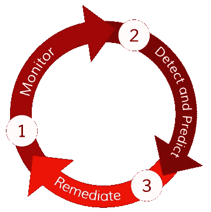

# Oracle 身份云服务随 Palerra 一起扩展

> 原文：<https://itnext.io/oracle-identity-cloud-service-expands-with-palerra-b990238b9b4e?source=collection_archive---------0----------------------->

甲骨文收购了云平台安全提供商 [Palerra](http://palerra.com/) ，以扩展其身份云服务。 [Oracle 身份云服务](https://www.oracle.com/cloud/paas/identity-cloud-service.html) (IDCS)是一个基于云的安全和身份管理平台，为应用程序提供一套混合身份特性。

Palerra 的 SaaS[LORIC](http://palerra.com/platform/)，是一个[云访问安全代理](http://blogs.gartner.com/it-glossary/cloud-access-security-brokers-casbs/) (CASB)，它将三个关键特性整合到一个平台中:

*   威胁检测
*   预测分析
*   和安全配置管理。

LORIC 部署在云中，并使用上下文机器学习和监督学习模式来自动化事件响应和补救。

*LORIC 解决了重大的云安全挑战，包括可见性、监控、配置、数据安全、威胁防护和事件响应。本图改编自* [*帕勒拉平台*](http://palerra.com/platform/) *。*

甲骨文[在官方声明中写道](https://www.oracle.com/corporate/acquisitions/palerra/index.html)“通过提供全面的身份和安全云服务，甲骨文和 Palerra 将共同帮助安全地加速云的采用。“Oracle 身份云服务(IDaaS)和 Palerra CASB 解决方案的结合计划为用户、应用程序和 API、数据以及基础架构提供全面的保护，以确保客户采用云。”

Palerra 成立于 2013 年，是一家由 Norwest Venture Partners 和 Wing Venture Partners 支持的私人控股公司。它为整个云体系提供安全性，包括基础架构即服务(IaaS)、软件即服务(SaaS)和平台即服务(PaaS)。

Palerra 的联合创始人兼首席执行官 Rohit Gupta 在博客文章中写道[“随着云技术在企业中的迅猛发展，云安全已经成为企业的重中之重。”](http://palerra.com/palerra-and-oracle-exciting-news/)

收购 Palerra 对甲骨文来说具有重要的战略意义，因为云行业的其他大公司也在进行类似的收购。

2016 年 6 月，[赛门铁克收购了 Blue Coat systems](https://www.symantec.com/about/newsroom/press-releases/2016/symantec_0612_01) ，该公司收购了两家云访问安全经纪公司( [Perspecsys](https://www.bluecoat.com/company/press-releases/blue-coat-acquires-perspecsys-effectively-make-public-cloud-applications) 和[橡皮筋公司](https://www.bluecoat.com/company/press-releases/blue-coat-acquires-elastica))，并将其 CASB 能力与其 Web gateway 安全技术相结合。同月，思科还宣布了收购 CloudLock 的计划，CloudLock 是一家总部位于马萨诸塞州沃尔瑟姆的私人云安全公司。

去年，[微软收购了 Adallom](https://blogs.microsoft.com/blog/2015/09/08/microsoft-acquires-adallom-to-advance-identity-and-security-in-the-cloud/#sm.0001s5vuar180tf3lpzeod81q5zyi) ，并将其 CASB 整合到其[云应用安全](https://www.microsoft.com/en-us/cloud-platform/cloud-app-security)中，这项服务[将于 2016 年 4 月](https://blogs.microsoft.com/microsoftsecure/2016/04/06/microsoft-cloud-app-security-is-generally-available/)推出。企业安全公司 Palo Alto Networks 也因其 SaaS 安全技术收购了 CirroSecure。

2014 年，Imperva 收购了 Skyfence，并创建了 [Imperva Skyfence 云网关](https://www.imperva.com/products/skyfence)，这是一款 CASB，可提供对经批准和未经批准的云应用的可见性和控制。