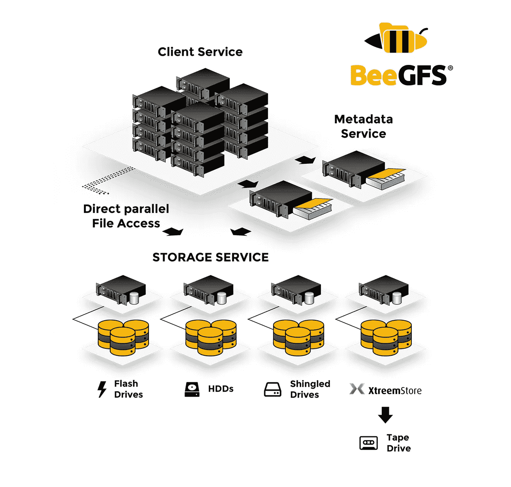
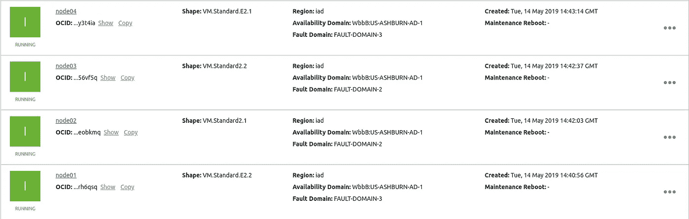
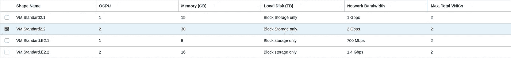
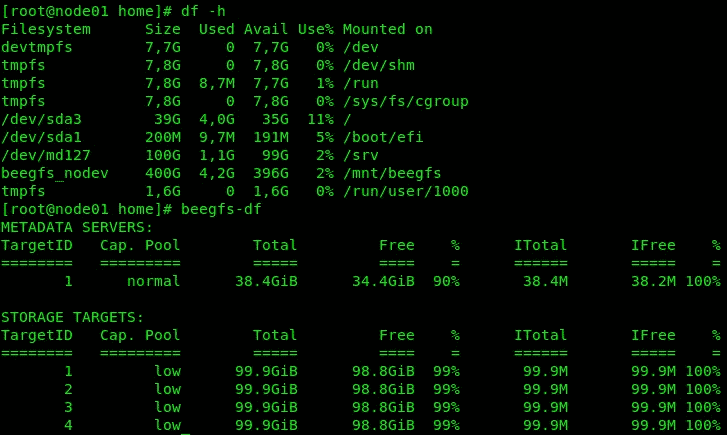
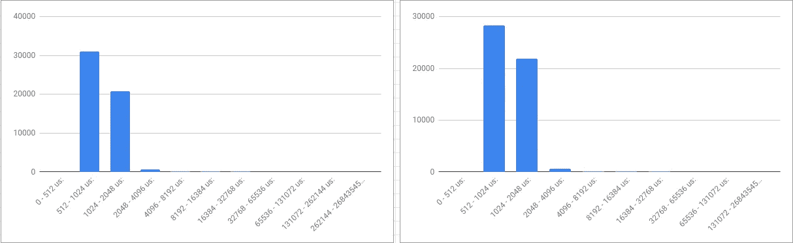
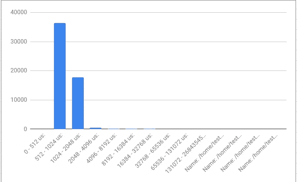
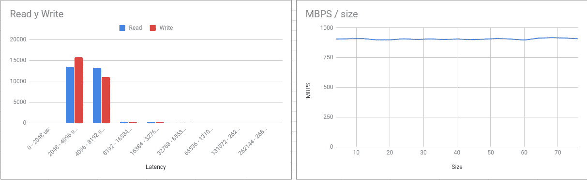

# Oracle 云中的 Oracle Linux 和 BeeGFS 分布式存储

> 原文：<https://itnext.io/oracle-linux-and-beegfs-distributed-storage-at-oracle-cloud-c7eb5c9b4f8?source=collection_archive---------8----------------------->

与我的上一篇文章[相关，Oracle Cloud IO 测试使用 Docker 的分布式存储(Storidge)](/oracle-cloud-io-test-using-a-distributed-storage-for-docker-storidge-d41c6555f63f?source=friends_link&sk=4932dd2baa495de61d418fd7a51cc595) 我决定测试另一个支持 Docker 的分布式存储。现在开源项目 [BeeGFS](https://www.beegfs.io/content/) 。



并行集群文件系统

***BeeGFS*** 的概念与[***Storidge***](https://storidge.com/)不同，但它作为 Docker Swarm 持久数据的集群存储。

为了测试这个分布式集群文件系统，我在 Oracle 云基础设施上使用了 Oracle Linux。

现在， [Oracle Cloud](https://cloud.oracle.com/home) 上的免费帐户与我之前的帖子相比有了不同的硬件规格，主要是它不包括存储/延迟磁盘支持和网络连接中有限的带宽，但足以创建一个测试场景，遵循此[安装命令演练(快速入门指南)](https://www.beegfs.io/wiki/ManualInstallWalkThrough)，唯一不包括的节点是监控节点。这是部署实例的图片:



作为 Oracle 云实例的四节点部署

使用默认 Oracle Linux 7 映像部署的所有实例


Oracle Linux 7.6 映像



免费云帐户上的可用硬件配置

我们有 ***node01*** 作为 ***VM。标配. e 2.2***(4 CPU/16GB RAM/1.4 Gbps 网络带宽) ***node02*** 为 ***VM。Standard2.1*** 等等，每个镜像有两个额外的 ***半虚拟化*** 磁盘在 ***Raid0*** 中工作。

由于连接的磁盘是 ***半虚拟化*** 和远程的，实例网络带宽会影响其上的 IO 性能，例如在***node 04***shape VM 中。标准。E2.1 (2 个 CPU/8GB RAM/700 Mbps)它返回的基本吞吐量为:

```
[root@node04 home]# dd if=/dev/zero of=test4.img  bs=1G count=1 oflag=dsync
1+0 records in
1+0 records out
1073741824 bytes (1,1 GB) copied, 19,277 s, ***55,7 MB/s***
```

# 节点准备和软件安装

基本上安装所有需要的软件包，额外的 repos 和防火墙配置:

```
[root@node01 ~]# firewall-cmd --permanent --zone=public --add-port=***8000-8008/tcp***
[root@node01 ~]# firewall-cmd --permanent --zone=public --add-port=***8000-8008/udp***
[root@node01 ~]# firewall-cmd --reload
sed  -i "s|SELINUX=enforcing|***SELINUX=disabled***|" /etc/selinux/config 
[root@node01 ~]# cat /etc/hosts
127.0.0.1   localhost localhost.localdomain localhost4 localhost4.localdomain4
::1         localhost localhost.localdomain localhost6 localhost6.localdomain6
10.0.0.20   node01
10.0.0.21   node02
10.0.0.22   node03
10.0.0.23   node04[root@node01 ~]# yum install -y ***kernel-uek-devel.x86_64 elfutils-libelf-devel*** [root@node01 ~]# rpm --import [https://www.beegfs.io/release/latest-stable/gpg/RPM-GPG-KEY-beegfs](https://www.beegfs.io/release/latest-stable/gpg/RPM-GPG-KEY-beegfs)
[root@node01 ~]# cd /etc/yum.repos.d/
[root@node01 ~]# wget [https://www.beegfs.io/release/latest-stable/dists/***beegfs-rhel7.repo***](https://www.beegfs.io/release/latest-stable/dists/beegfs-rhel7.repo)[root@node01 ~]# mdadm --create --verbose /dev/md127 --level=0 --raid-devices=2 /dev/sdb /dev/sdc
[root@node01 ~]# mkfs.xfs /dev/md127 -L beegfs -f
[root@node01 ~]# blkid|grep md127
/dev/md127: LABEL="beegfs" UUID="***d02f5895-4adb-4ba9-acd2-5a6423b378f6***" TYPE="xfs"
[root@node01 ~]# echo "UUID=***d02f5895-4adb-4ba9-acd2-5a6423b378f6*** ***/srv***                    xfs     noatime,nodiratime,logbufs=8,logbsize=256k,largeio,inode64,swalloc,allocsize=131072k,nobarrier,_netdev,_netdev 0 0" >> /etc/fstab
[root@node01 ~]# mount ***/srv***
[root@node01 ~]# reboot
```

# 节点安装

***节点 01*** 存储/管理/客户端

```
[root@node01 ~]# yum install -y beegfs-mgmtd
[root@node01 ~]# mkdir -p /data/beegfs/beegfs_mgmtd
[root@node01 ~]# /opt/beegfs/sbin/beegfs-setup-mgmtd -p /data/beegfs/beegfs_mgmtd
[root@node01 ~]# systemctl start beegfs-mgmtd
[root@node01 ~]# yum install -y beegfs-storage libbeegfs-ib
/opt/beegfs/sbin/beegfs-setup-storage -p /srv -s 1 -i 101 -m node01
[root@node01 ~]# systemctl start beegfs-storage
[root@node01 ~]# yum install -y beegfs-client beegfs-helperd beegfs-utils
[root@node01 ~]# /etc/init.d/beegfs-client rebuild
/opt/beegfs/sbin/beegfs-setup-client -m node01
[root@node01 ~]# systemctl start beegfs-helperd
[root@node01 ~]# systemctl start beegfs-client
```

**节点 02** 存储/元/客户端

```
[root@node02 ~]# yum install -y beegfs-meta libbeegfs-ib
[root@node02 ~]# mkdir -p/data/beegfs/beegfs_meta
[root@node02 ~]# /opt/beegfs/sbin/beegfs-setup-meta -p /data/beegfs/beegfs_meta -s 2 -m node01
[root@node02 ~]# systemctl start beegfs-meta
[root@node02 ~]# yum install -y beegfs-storage
[root@node02 ~]# /opt/beegfs/sbin/beegfs-setup-storage -p /srv -s 2 -i 201 -m node01
[root@node02 ~]# systemctl start beegfs-storage
[root@node02 ~]# yum install -y beegfs-client beegfs-helperd beegfs-utils
[root@node02 ~]# /etc/init.d/beegfs-client rebuild
[root@node02 ~]# /opt/beegfs/sbin/beegfs-setup-client -m node01
[root@node02 ~]# systemctl start beegfs-helperd
[root@node02 ~]# systemctl start beegfs-client
```

***node 03***/***node 04***存储/客户端

```
[root@node03 ~]# yum install -y beegfs-***storage*** libbeegfs-ib
[root@node03 ~]# /opt/beegfs/sbin/beegfs-setup-storage -p /srv -s 3 -i 301 -m node01
[root@node03 ~]# systemctl start beegfs-storage
[root@node03 ~]# yum install -y beegfs-***client*** beegfs-helperd beegfs-utils
[root@node03 ~]# /etc/init.d/beegfs-client rebuild
[root@node03 ~]# /opt/beegfs/sbin/beegfs-setup-client -m node01
[root@node03 ~]# systemctl start beegfs-helperd
[root@node03 ~]# systemctl start beegfs-client[root@node04 ~]# yum install -y beegfs-***storage*** libbeegfs-ib
[root@node04 ~]# /opt/beegfs/sbin/beegfs-setup-storage -p /srv -s 4 -i 401 -m node01
[root@node04 ~]# systemctl start beegfs-storage
[root@node04 ~]# yum install -y beegfs-***client*** beegfs-helperd beegfs-utils
[root@node04 ~]# /etc/init.d/beegfs-client rebuild
[root@node04 ~]# /opt/beegfs/sbin/beegfs-setup-client -m node01
[root@node04 ~]# systemctl start beegfs-helperd
[root@node04 ~]# systemctl start beegfs-client
```

[高可用性镜像](https://www.beegfs.io/wiki/AboutMirroring)

```
[root@node01 home]# beegfs-ctl --addmirrorgroup --automatic --nodetype=storage --force
[root@node01 home]# beegfs-ctl --listmirrorgroups --nodetype=storage
     BuddyGroupID   PrimaryTargetID SecondaryTargetID
     ============   =============== =================
                1                 1                 2
                2                 3                 4
```

完成前面的所有步骤后，您将在节点上获得一个目录/mnt/beegfs，该目录具有从 beegfs 分布式存储装载的 400Gb 空间，如该屏幕截图所示



安装的分区和可用空间

# 测试，测试，测试…

一个客户端，使用 Orion 工具的本地存储与分布式存储

```
[root@node01 home]# dd if=/dev/zero of=test1.img  bs=1G count=1 oflag=dsync
1+0 records in
1+0 records out
1073741824 bytes (1,1 GB) copied, 20,0922 s, ***53,4 MB/s***
[root@node01 home]# docker run --rm -v /home:/home registry.exa.unicen.edu.ar:443/oracle/orion:12.2.0.1 /usr/lib/oracle/12.2/client64/bin/orion -run simple -testname test1 -hugenotneeded
Maximum Large ***MBPS=50.07*** @ Small=0 and Large=1
......
[root@node01 home]# docker run --rm -v /mnt/beegfs:/home registry.exa.unicen.edu.ar:443/oracle/orion:12.2.0.1 /usr/lib/oracle/12.2/client64/bin/orion -run simple -testname test1 -hugenotneeded
Maximum Large ***MBPS=129.35*** @ Small=0 and Large=2
```



小读取延迟直方图—左侧本地存储—右侧 BeeGFS

以上信息看起来真的很酷， ***BeeGFS*** 挂载是本地 dd 或者本地挂载点的两倍。注意， ***网卡*** 连接的聚合带宽达到最大值。

# 四磁盘 Orion 读取测试

这个测试比前一个测试好，因为所有四个节点都在协作读取磁盘信息(每个 1gb 的文件被分成两个节点)

```
[root@node01 home]# docker run --rm -v /mnt/beegfs:/home registry.exa.unicen.edu.ar:443/oracle/orion:12.2.0.1 /usr/lib/oracle/12.2/client64/bin/orion -run simple -testname test1-4 ***-num_disks 4*** -hugenotneeded
Name: /home/test1.img Size: 1073741824
Name: /home/test2.img Size: 1073741824
Name: /home/test3.img Size: 1073741824
Name: /home/test4.img Size: 1073741824
4 files found.Maximum Large ***MBPS=155.63*** @ Small=0 and Large=7
```



小读取延迟直方图四磁盘模拟

# 用四个磁盘进行读写测试

这里是一个模拟并行 IO (OLTP)的压力测试，使用四个磁盘和 50%的写操作。

```
[root@node01 home]# docker run --rm -v /mnt/beegfs:/home registry.exa.unicen.edu.ar:443/oracle/orion:12.2.0.1 /usr/lib/oracle/12.2/client64/bin/orion -run oltp -write 50  -testname test1-4 -num_disks 4 -hugenotneeded
Maximum Small IOPS=918 @ Small=68 and Large=0
Small Read Latency: avg=74069.660 us, min=62642.274 us, max=180620.254 us, std dev=12263.553 us @ Small=68 and Large=0
Small Write Latency: avg=73935.104 us, min=62631.574 us, max=187240.852 us, std dev=12174.669 us @ Small=68 and Large=0Minimum Small Latency=4409.929 usecs @ Small=4 and Large=0
Small Read Latency: avg=4455.933 us, min=2947.072 us, max=126228.454 us, std dev=2760.667 us @ Small=4 and Large=0
Small Write Latency: avg=4363.848 us, min=2608.965 us, max=137914.519 us, std dev=3499.135 us @ Small=4 and Large=0
```



最后，即使我们无法将这一结果与我之前使用 [Storidge](https://storidge.com/) 软件进行的测试进行比较， [BeeGFS](https://www.beegfs.io/content/) 受免费帐户的网络限制，性能良好，但优于本地存储，并在所有节点上获得镜像和透明的数据位置。另一方面，当重启所有节点并再次启动时，我遇到了一些问题，丢失了镜像之间的同步或丢失了副本，这是由于我对该软件的经验不足。