# Oracle SQLDeveloper Docker 扩展

> 原文：<https://itnext.io/oracle-sqldeveloper-docker-extension-1678c3bdf27c?source=collection_archive---------2----------------------->

继续讲述新扩展的故事，以增加 Docker Desktop 对开发人员可用的生态系统的重要性，我决定为 Oracle SQLDeveloper Web 工具构建一个新的扩展，它与我以前为 OracleXE 开发的扩展成对工作。

这一扩展背后的想法是拥有一个强大的开发工具来连接 Oracle XE 21c 或任何其他 RDBMS 实例，包括基于云的部署。这个扩展看起来像这样:

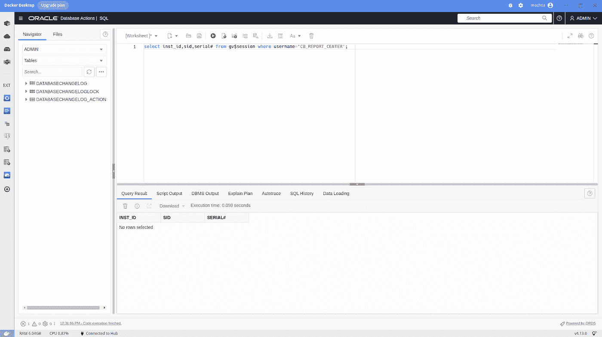

SQLDeveloper Docker 扩展

# 为什么我需要一个 SQDeveloper Docker 桌面扩展

SQL 客户端工具 SQLDeveloper 可以在任何操作系统上下载和安装，但需要几个步骤:下载，解压缩，安装 JDK，最后创建快捷方式图标。

使用 Docker Desktop 作为开发环境的基础，只需点击几下鼠标，SQLDeveloper 就可以投入使用，不需要在计算机中安装库或额外的 JDK。只需安装，您将获得如下所示的 SQLDeveloper 欢迎屏幕(在 amd64/arm64 架构中为原生):

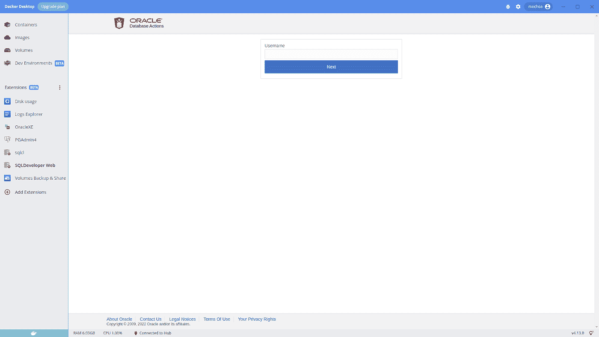

SQLDeveloper Docker 扩展登录页

# 手动安装

在 Docker 扩展中心准备好该扩展之前，您只需执行以下命令即可安装:

```
$ docker extension install [***mochoa/sdw-docker-extension:22.2.1***](https://hub.docker.com/repository/docker/mochoa/sdw-docker-extension) Extensions can install binaries, invoke commands and access files on your machine. 
Are you sure you want to continue? [y/N] y
Installing new extension "***mochoa/sdw-docker-extension:22.2.1***"
Installing service in Desktop VM...
Setting additional compose attributes
VM service started
Installing Desktop extension UI for tab "SQLDeveloper Web"...
Extension UI tab "SQLDeveloper Web" added.
Extension "Oracle SQLDeveloper Web client tool" installed successfully
```

# 使用 SQLDeveloper Docker 扩展

一旦扩展被安装，一个新的扩展被列在 Docker 桌面的面板扩展(Beta)中。

通过单击 SQLDeveloper Web 图标，扩展主窗口将显示这个扩展加载过程，显示一个进度条和几秒钟的日志预览指示器

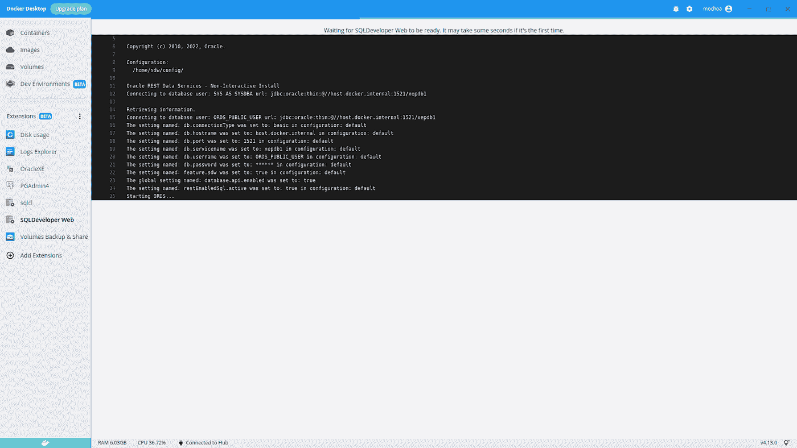

SQLDeveloper 进度条和日志指示器

安装程序进程假设一个 [OracleXE](https://hub.docker.com/repository/docker/mochoa/oraclexe-docker-extension) 作为 Docker 扩展运行，默认启动使用这个预定义的连接字符串:

*   主机名/地址:host.docker.internal
*   端口:1521
*   PDB: xepdb1
*   用户名:ORDS 公共用户
*   密码:Oracle_2022

一旦加载了 SQLDeveloper，您必须执行一些 SQL 命令来准备几乎一个 ADMIN 用户，例如使用 [SQLcl](https://hub.docker.com/repository/docker/mochoa/sqlcl-docker-extension) 扩展 execute:

```
SQL> create user admin identified by Oracle_2022
     default tablespace sysaux
     temporary tablespace temp;
SQL> grant connect,dba to ADMIN;
SQL> grant execute on dbms_soda_admin to admin;
SQL> BEGIN
        ords_admin.enable_schema(
        p_enabled => TRUE,
        p_schema => 'ADMIN',
        p_url_mapping_type => 'BASE_PATH',
        p_url_mapping_pattern => 'admin',
        p_auto_rest_auth => TRUE
      );
      commit;
    END;
/
```

启用上述模式后，ORDs/SQLDeveloper 用户在登录屏幕上输入 ADMIN/Oracle_2022 作为用户名和密码，如下所示:

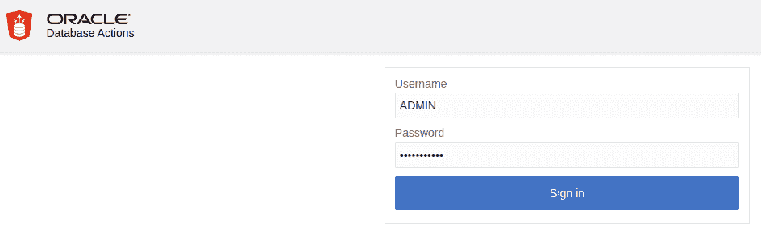

SQLDeveloper 登录框

您将看到一个欢迎页面:

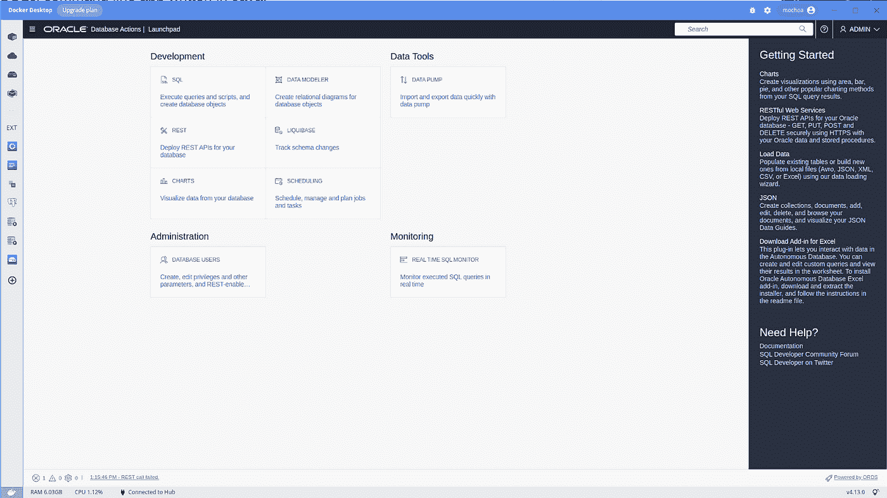

SQLDeveloper 初始页面

该扩展为 Oracle 开发人员/DBA 提供了一整套工具:

*   SQL，执行查询和脚本，并创建数据库对象
*   数据建模器，为数据库对象创建关系图
*   为您的数据库部署 REST APIs
*   LIQUIBASE，跟踪模式更改
*   图表，可视化数据库中的数据
*   调度，安排，管理和计划工作和任务
*   数据泵，使用数据泵快速导入和导出数据
*   数据库用户，创建、编辑权限和其他参数，以及启用 REST 的数据库用户
*   实时 SQL 监视器，实时监视执行的 SQL 查询

# 体系结构

在引擎盖下，这个 Docker 扩展启动了一个具有两个主要进程的容器，一个是与 Docker 桌面上运行的 UI 进行对话的 ***服务*** 应用程序(Ract 应用程序)，另一个是由 shell script /home/sdw.sh 启动的 Java 应用程序，它是 Oracle REST 数据服务 Java Web 应用程序。

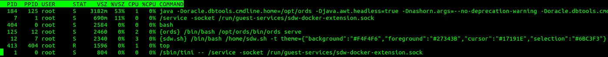

扩展运行过程

sh 对带有配置标志的启动命令(第一次启动)和下一次启动执行一些检查。

# 配置 SQLDeveloper 以连接其他 RDBMs 实例

如果您想要重新配置 SQLDeveloper Web 实例以连接到其他 RDBMS 实例而不是 Oracle XE Docker 扩展，您可以执行与 sdw.sh 脚本自动为您执行的步骤相同的步骤，首先启用对 Docker 扩展容器的访问(设置->扩展->显示扩展系统容器，应用并重新启动):

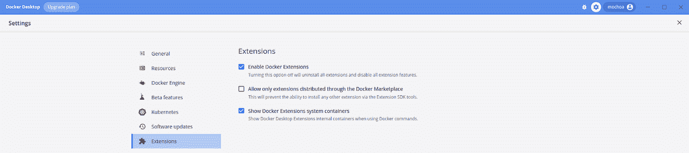

显示扩展系统容器

然后转到容器窗格，查找 sdw-docker-extension-desktop-extension 容器:

重新启动使用


并使用 CLI 选项卡进行连接

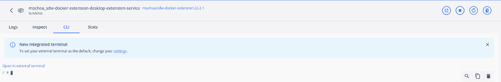

Docker 桌面 CLI 工具

首先编辑/home/sdw/default.pwd 根据您的需要，这个密码是一个具有 DBA 角色的帐户的密码(在两行中输入相同的值)

```
/ # cat /home/sdw/default.pwd
Oracle_2022
Oracle_2022
```

删除以前的订单配置:

```
/ # rm -rf /home/sdw/config/*
/ # rm -f /tmp/ords.*
```

使用新的配置设置进行配置，例如:

```
/ # /opt/ords/bin/ords install \
  --admin-user ***SYS*** \
  --db-hostname ***host.docker.internal*** \
  --db-port ***1521*** \
  --db-servicename ***xepdb1*** \
  --feature-db-api true \
  --feature-rest-enabled-sql true \
  --feature-sdw true \
  --proxy-user \
  --password-stdin < /home/sdw/default.pwd >> /tmp/ords.out 2>> /tmp/ords.err
```

最后，再次返回到 SQLDeveloper Web extension 窗格，如果这个新数据库没有具有 ORDs enable schema 的 ADMIN 用户，请按照上面的说明进行操作。

# 允许 scott 用户使用 SQLDeveloper Web/ORDs

默认情况下，Oracle XE Docker 扩展安装启用了传统 Oracle 模式 scott，如果要启用此模式以使用 SQLDeveloper Web/ORDs 功能，请使用 ADMIN 执行以下命令:

```
BEGIN
  ords_admin.enable_schema(
   p_enabled => TRUE,
   p_schema => 'SCOTT',
   p_url_mapping_type => 'BASE_PATH',
   p_url_mapping_pattern => 'scott',
   p_auto_rest_auth => TRUE
  );
  commit;
END;
GRANT SODA_APP,CREATE VIEW to scott;
```

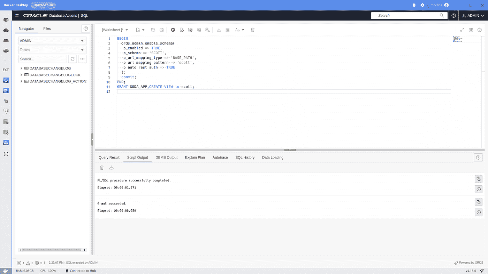

执行 PLSQL/SQL 脚本

启用 scott 模式以使用 SQLDeveloper Web 界面后，您可以使用 scott 的密码继续登录屏幕。

# 将 SQLDeveloper Web 连接到自治数据库

最新的 SQLDeveloper Web 通过提供一个 Wallet.zip 文件，允许快速配置到运行在 Oracle Cloud 上的自治数据库实例的默认连接，下面是一个示例说明:

```
docker cp /home/mochoa/Downloads/***Wallet_DB.zip*** mochoa_sdw-docker-extension-desktop-extension-service:***/home/sdw/Wallet.zip***
docker exec -ti mochoa_sdw-docker-extension-desktop-extension-service bash
bash-5.1# vi /home/sdw/adb.pwd
bash-5.1# cat /home/sdw/adb.pwd
bash-5.1# rm -rf /home/sdw/config/*
bash-5.1# rm -rf /tmp/ords/*
bash-5.1# mv /home/sdw/sdw.sh /home/sdw/sdw.sh.old
bash-5.1# cp /home/sdw/adb.sh /home/sdw/sdw.sh
bash-5.1# exit
docker restart mochoa_sdw-docker-extension-desktop-extension-service
```

> 请注意,/home/sdw/adb.pwd 文件的第一行包含您的 adb 实例中的 ***admin*** 用户的密码，接下来的两行(相同值)是根据 Oracle Cloud security guidelines 为***ORDS _ 公共 _ 用户 2*** 设置的强密码。

# 在 Docker 桌面外使用 SQLDeveloper Web

作为另一个扩展，您可以使用浏览器从 Docker 桌面环境之外打开 SQLDeveloper Web，这在您需要并行时尤其有用，例如，SQLcl 和 SQLDeveloper Web，这样做的 url 是[http://localhost:9891/ords/SQL-developer](http://localhost:9891/ords/sql-developer)

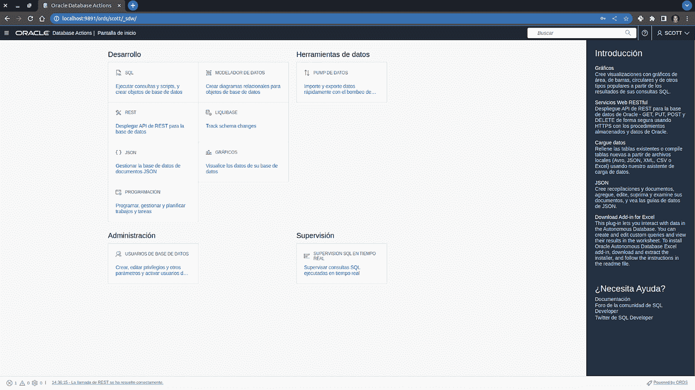

# 知道注意事项

SQLDeveloper Web 有黑暗模式支持，但到目前为止，我还没有 Docker 桌面改变时如何自动同步这个设置的信息，就像 [PGAdmin4 Extension](https://hub.docker.com/repository/docker/mochoa/pgadmin4-docker-extension) 那样。我来调查一下，你可以通过使用用户设置- >首选项- >代码编辑器来更改暗/亮模式:

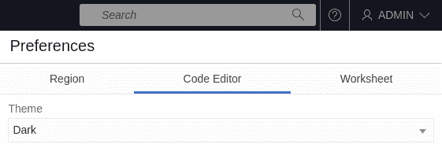

SQLDeveloper Web 启用代码编辑器黑暗模式

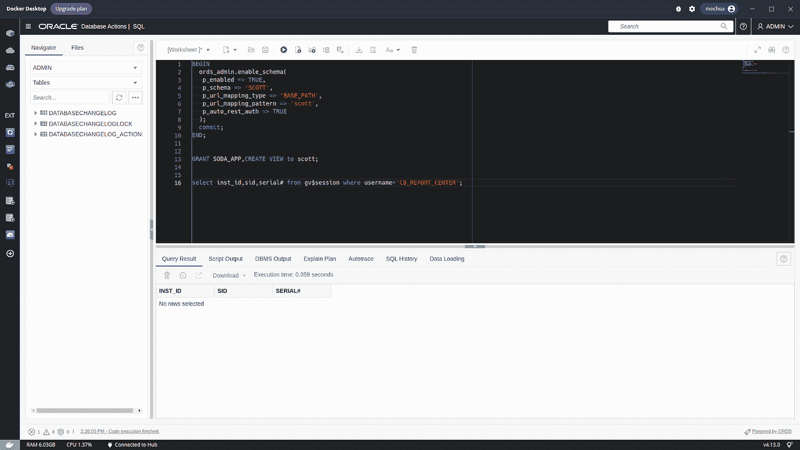

黑暗模式下的编辑器

# 来源

像往常一样，这个扩展的代码在 [GitHub](https://github.com/marcelo-ochoa/sdw-docker-extension) 上，请随意提出修改建议并做出贡献，请注意，我是 React 和 TypeScript 的初级开发人员，因此欢迎为改善这个 UI 做出贡献。