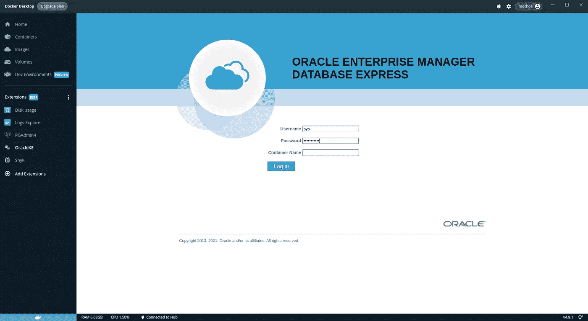
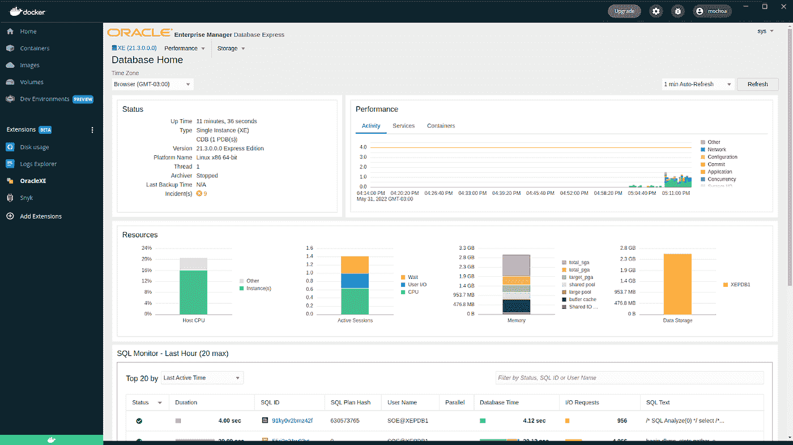
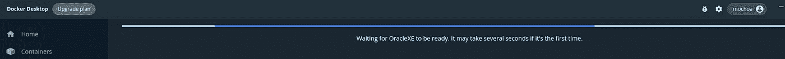
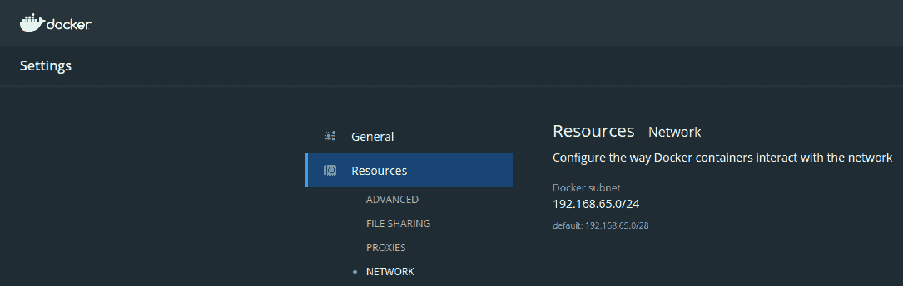
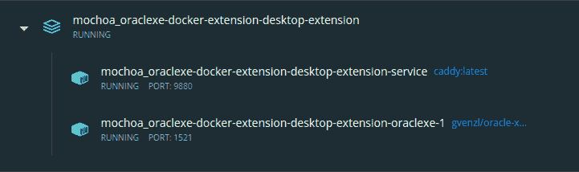

# OracleXE 21c Docker 桌面扩展

> 原文：<https://itnext.io/oraclexe-21c-docker-extension-95c25bec0f31?source=collection_archive---------3----------------------->

使用 OracleXE 21c 的新 [Docker 桌面扩展已经准备就绪！！！](https://hub.docker.com/repository/docker/mochoa/oraclexe-docker-extension)

在我解释了通过 Docker 扩展为开发者提供的生态系统的重要性之后，我决定为 Oracle XE 构建一个新的生态系统。

与 [PGAdmn4 扩展](https://hub.docker.com/repository/docker/mochoa/pgadmin4-docker-extension)不同，这一扩展背后的想法是只需点击一下鼠标，就可以使用本地 Oracle XE 21c 开发数据库。这个扩展看起来像:



OracleXE Docker 扩展 EM Express 登录屏幕

# 为什么我需要 OracleXE Docker 桌面扩展

因为许多开发栈使用 Oracle 作为后端数据库，这些栈可能是 PHP/Laravel、Java Spring Boot、NodeJs 和许多其他栈，所以开发人员通常需要一个 DB 来连接他们的开发环境进行测试。

Oracle DB 不是一个容易安装的 RDBMS，即使使用 Docker 技术，Oracle XE 也可以使用[Gerald Venzl Oracle XE 21 . 3 . 0-full](https://hub.docker.com/r/gvenzl/oracle-xe)优化映像下载并安装。

除上述段落外，Oracle XE 还包括 EM Express，可轻松监控和诊断您的数据库，集成到 Docker Desktop 中的 EM Express 如下所示:



OracleXE EM Express 欢迎页面

使用 EM Express，您可以在开发过程中使用一个工具来分析您的查询的影响，并在投入生产之前预测这些问题:)

# 手动安装

在 Docker 扩展中心准备好该扩展之前，您只需执行以下命令即可安装:

```
$ docker extension install [mochoa/oraclexe-docker-extension:21.3.0](https://hub.docker.com/repository/docker/mochoa/oraclexe-docker-extension)
Extensions can install binaries, invoke commands and access files on your machine. 
Are you sure you want to continue? [y/N] y
Installing new extension "mochoa/oraclexe-docker-extension:21.3.0"
Installing service in Desktop VM...
Setting additional compose attributes
VM service started
Installing Desktop extension UI for tab "OracleXE"...
Extension UI tab "OracleXE" added.
Extension "OracleXE" installed successfully
```

```
$ docker pull gvenzl/oracle-xe:21.3.0-full
```

## **注意:需要 Docker 扩展 CLI 来执行上述命令，请按照[扩展 SDK(测试版)——>先决条件](https://docs.docker.com/desktop/extensions-sdk/#prerequisites)页面上的说明来添加它。**

# **使用 OracleXE Docker 扩展**

**一旦扩展被安装，一个新的扩展被列在 Docker 桌面的面板扩展(Beta)中。**

**通过单击 OracleXE 图标，扩展主窗口将显示该扩展的运行情况**

****

**第一次启动需要几秒钟，具体取决于您的硬件，这是因为 OracelXE 正在启动并创建数据库，进度指示栏将一直等到 RDBMS 准备就绪:**

****

**进度条指示器**

**显示 OracleXE DB 尚未就绪，当 RDBMS 就绪时，将自动加载 EM 登录屏幕。**

****

**OracleXE EM Express 登录屏幕**

**登录屏幕会要求您输入 ***sys*** 密码(默认为 ***Oracle_2022*** )**

**要从外部 Docker 容器连接，我指的是不作为容器运行的应用程序，您可以使用 ***localhost:1521*** 如快速启动页面中所述，如果您想从 Docker 桌面上运行的另一个容器连接，您必须使用 OracleXE 的内部 IP，这可以在菜单中找到，设置- >资源- >网络- > Docker 子网， 在我的例子中是 192.168.65.0/24，因此从 Docker Desktop 中运行的容器访问 OracleXE 的内部 IP 将是 192.168.65.2，还有一个解析上述 IP 的内部 DNS 名称 host.docker.internal。**

****

**Docker 桌面网络 IP 范围**

**快速入门页面中的 Java 示例:**

```
OracleDataSource ods = new OracleDataSource();
ods.setURL("***jdbc:oracle:thin:@//localhost:1521/XEPDB1***"); // jdbc:oracle:thin@//[hostname]:[port]/[DB service name]
ods.setUser("***scott***");
ods.setPassword("***tiger***");
Connection conn = ods.getConnection();PreparedStatement stmt = conn.prepareStatement("SELECT 'Hello World!' FROM dual");
ResultSet rslt = stmt.executeQuery();
while (rslt.next()) {
 System.out.println(rslt.getString(1));
}
```

**作为 Docker 容器运行的 Java 应用程序的方法:**

```
OracleDataSource ods = new OracleDataSource();
ods.setURL("***jdbc:oracle:thin:@//host.docker.internal:1521/XEPDB1***"); // jdbc:oracle:thin@//[hostname]:[port]/[DB service name]
ods.setUser("***scott***");
ods.setPassword("***tiger***");
Connection conn = ods.getConnection();PreparedStatement stmt = conn.prepareStatement("SELECT 'Hello World!' FROM dual");
ResultSet rslt = stmt.executeQuery();
while (rslt.next()) {
 System.out.println(rslt.getString(1));
}
```

**如您所见，我使用的是历史用户 ***scott*** ，密码为 ***tiger*** ，该用户是在 OracleXE 首次启动时创建的。**

# **体系结构**

**这个 Docker 扩展启动了两个容器，显然是 OracleXE 数据库和 Caddy 反向代理:**

****

**码头集装箱运行**

**Caddy 是一个轻量级反向代理，用于以普通 http 与 Oracle EM Express 对话，Oracle EM Express 使用 https 和 Docker Desktop 不支持的自签名证书，OracleXE 可以配置为以普通 http 侦听，但比部署 Caddy 更复杂。**

# **来源**

**像往常一样，这个扩展的代码在 [GitHub](https://github.com/marcelo-ochoa/oraclexe-docker-extension) 上，请随意提出修改建议并做出贡献，请注意，我是 React 和 TypeScript 的初级开发人员，因此欢迎为改进这个 UI 做出贡献。**