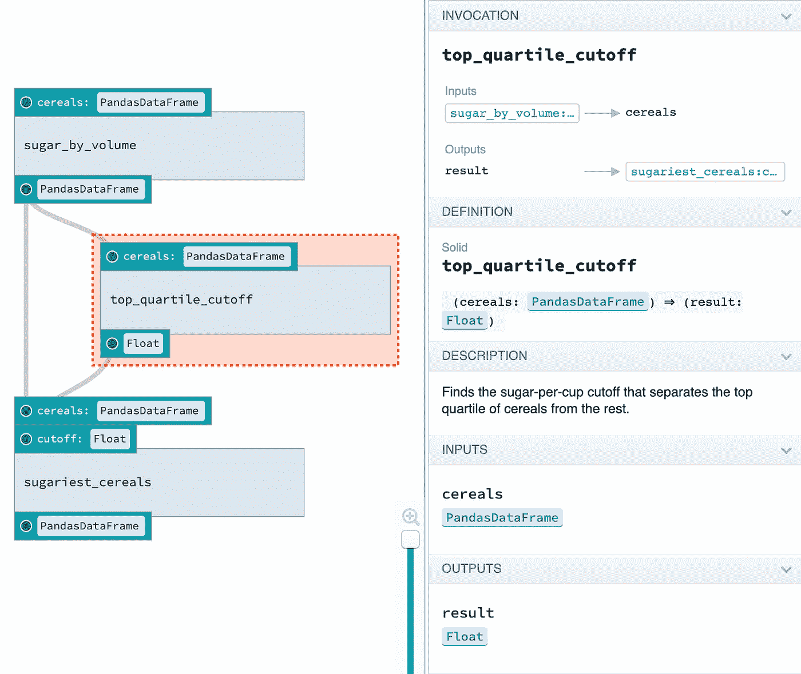

# 大数据的编排框架

> 原文：<https://itnext.io/orchestration-frameworks-for-big-data-cfb9d3af6e7e?source=collection_archive---------1----------------------->

[沃尔夫冈·罗特曼](https://unsplash.com/@quadratmedia?utm_source=medium&utm_medium=referral)在 [Unsplash](https://unsplash.com?utm_source=medium&utm_medium=referral) 上拍照

# 介绍

**大数据很复杂**，我已经 [**写了**](/big-data-pipeline-recipe-c416c1782908) 相当多关于庞大的生态系统和广泛的可用选项。一个经常被忽视但却至关重要的方面是管理大数据管道不同步骤的执行。通常框架的决定或执行过程的设计被推迟到后期，导致项目的许多问题和延迟。

您应该在早期设计管道编排，以避免部署阶段出现问题。编排应该像任何其他可交付成果一样对待；它应该由所有利益相关者计划、实施、**测试和审查。**

编排框架经常被忽视，许多公司最终为他们的管道实施**定制解决方案**。这不仅成本高，而且效率低，因为定制编排解决方案往往面临开箱即用的框架已经解决的相同问题；造成了长时间的反复试验。

在本文中，我将介绍一些最常见的开源编排框架。

# 管道编排

数据管道**编排**是一个**交叉过程**，它管理你的管道任务之间的依赖关系，调度作业等等。如果您使用流处理，您需要协调每个流应用程序的依赖关系，对于批处理，您需要调度和协调作业。

请记住，任务和应用程序可能会失败，因此您需要一种方法来**调度**，重新调度，**重放**，**监控**，**重试**，并以统一的方式调试您的整个数据管道。

编排框架提供的一些功能有:

*   作业调度
*   依赖性管理
*   错误管理和重试
*   作业参数化
*   SLA 跟踪、警报和通知
*   带有甘特图和图形等仪表板的用户界面
*   历史和审计
*   元数据的数据存储
*   日志聚合

让我们回顾一些选项…

## [**阿帕奇 Oozie**](https://oozie.apache.org/)

[**Apache oo zie**](https://oozie.apache.org/)**这是 Hadoop 的一个**调度器**，作业被创建为 Dag，可以由基于 cron 的调度或数据可用性触发。Oozie 是一个可伸缩、可靠和可扩展的系统，作为 Java web 应用程序运行。它集成了摄取工具，如 [Sqoop](https://sqoop.apache.org/) 和处理框架，如 Spark。**

**Oozie 工作流定义是用 hPDL(XML)编写的。工作流包含控制流节点和操作节点。**控制流节点**定义工作流的开始和结束(开始、结束和失败节点)，并提供控制工作流执行路径的机制(决策、分叉和连接节点)*【1】*。**

****动作节点**是工作流触发任务执行的机制。Oozie 支持不同类型的动作(map-reduce、Pig、SSH、HTTP、eMail……)，并且可以扩展以支持其他类型的动作*【1】*。**

**此外，工作流可以参数化，几个相同的工作流作业可以并发。**

**它是 Hadoop 的第一个调度器，非常受欢迎，但已经有点过时**，如果你完全依赖 Hadoop 平台，它仍然是一个很好的选择。****

## ****[**阿帕奇气流**](https://airflow.apache.org/)****

****Airflow 是一个允许**调度、运行和监控工作流**的平台。由于易用性和创新的工作流代码方法，dag 以 Python 代码定义，可以作为任何其他软件交付进行测试，因此它已成为最著名的大数据管道协调器。****

****它使用 Dag 来创建复杂的工作流。图中的每个节点都是一个任务，边定义了任务之间的依赖关系。任务属于两个**类别**:****

*   ******操作器**:执行一些操作。****
*   ******传感器**:检查进程或数据结构的状态。****

****Airflow scheduler 在一组工作线程上执行您的任务，同时遵循您描述的指定依赖关系。它有一个模块化的架构，使用一个消息队列来协调任意数量的工作者，并且可以**将**扩展到无限*【2】*。****

****它为您生成 DAG，最大化**并行度**。Dag 是用 **Python** 编写的，所以你可以在本地运行它们，对它们进行单元测试，并将它们集成到你的开发工作流程中。当工作流被定义为代码时，它们变得更易于维护、版本化、可测试和协作*【2】*。****

****丰富的用户界面使得可视化生产中运行的管道、监控进度以及在需要时解决问题变得容易*【2】*。它速度快，易于使用，非常有用。它有几个视图和许多解决问题的方法。它会保存您的跑步记录，以供日后参考。****

********

****气流 UI*【2】*:[https://airflow.apache.org/docs/stable/](https://airflow.apache.org/docs/stable/)****

****安装非常简单。你只需要 **Python** 。它有两个进程，独立运行的 **UI** 和**调度器**。****

******原则***【2】***:******

*   ******动态**:气流管道配置为代码(Python)，允许动态管道生成。这允许编写动态实例化管道的代码。****
*   ******可扩展的**:轻松定义你自己的操作符、执行器，并扩展库，使其符合适合你的环境的抽象层次。****
*   ******优雅**:气流管道精干，显而易见。使用强大的 **Jinja** 模板引擎将您的脚本参数化内置到 Airflow 中。****
*   ******可扩展******

****虽然气流被写成代码，但气流**不是**一个数据流解决方案*【2】*。此外，工作流预计大部分是静态的或缓慢变化的，对于非常小的动态作业，我们将在后面讨论其他选项。****

****它是**简单的**和**无状态的**，尽管 [**XCOM**](https://airflow.apache.org/docs/stable/_modules/airflow/models/xcom.html) 功能用于在任务之间传递经常需要的小元数据，例如当你需要某种关联 ID 时。它还支持变量和**参数化** **作业**。最后，它还支持**SLA 和警报。**它可以与随叫随到的监控工具集成。****

****[**Luigi**](https://github.com/spotify/luigi) 是具有类似功能的气流的替代产品，但气流比 Luigi 具有更多功能，并且扩展能力更强。****

## ****[T5【达格斯特】T6](https://docs.dagster.io/)****

****[**Dagster**](https://docs.dagster.io/)**是机器学习、分析和 ETL*【3】*的较新编排器。主要区别在于，你可以跟踪数据的输入和输出，类似于[**Apache NiFi**](https://nifi.apache.org/)**，**创建数据流解决方案。这意味着它跟踪执行状态，并可以将值具体化为执行步骤的一部分。借助数据管道和资产的统一视图，您可以在本地测试，也可以在任何地方运行。它支持任何云环境。******

****Dagster 在您的编排图中的步骤之间建立数据依赖关系模型，并处理它们之间的数据传递。可选的输入和输出有助于尽早发现错误。管道由共享的、可重用的、可配置的数据处理和基础设施组件构建而成。Dagster 的网络用户界面可以让任何人检查这些物品，并发现如何使用它们。****

********

****达格斯特 UI[4]:[https://docs.dagster.io/](https://docs.dagster.io/)****

****它还可以并行运行多个作业，易于添加参数，易于测试，提供简单的版本控制、强大的日志记录、故障排除功能等等。它的**功能比 Airflow** 更加丰富，但它仍然有点**不成熟**，由于它需要跟踪数据，因此可能很难扩展，这是 NiFi 由于状态性质而面临的一个问题。此外，它在很大程度上基于 Python 生态系统。****

## ****[**提督**](https://docs.prefect.io/)****

****[**提督**](https://docs.prefect.io/) 类似于 Dagster，提供本地测试、版本控制、参数管理等等。它也基于 Python。****

****提督与众不同的地方在于，旨在克服气流 的 [**限制的执行引擎如改进的调度器、参数化的工作流、动态工作流、**版本化**和改进的测试。对于许多面向 DevOps 的组织来说，版本控制是必须的，但是气流仍然不支持它，而 Prefect 支持它。**](https://medium.com/the-prefect-blog/why-not-airflow-4cfa423299c4)****

**它有一个核心的开源工作流管理系统和一个完全不需要设置的云产品。**perfect Cloud**由 GraphQL、Dask 和 Kubernetes 提供支持，因此它已经为任何事情做好了准备*【4】*。UI 仅在云产品中可用。**

## **[**阿帕奇尼菲**](https://nifi.apache.org/)**

**[**Apache NiFi**](https://nifi.apache.org/)**I**s 不是一个编排框架而是一个更广泛的**数据流**解决方案**。NiFi 还可以安排作业、监控、路由数据、警报等等。它侧重于数据流，但您也可以处理批处理。****

**它不需要任何类型的编程，并提供了一个拖放 UI。它非常易于使用，您可以使用它来轻松完成中型作业，没有任何问题，但对于大型作业，它往往会有可扩展性问题。**

**它运行在 Hadoop 之外，但可以触发 Spark 作业并连接到 HDFS/S3。**

****

**尼菲 UI[5]:[https://nifi.apache.org/](https://nifi.apache.org/)**

# **用例**

**让我们看一些例子…**

*   **我有一个传统的 Hadoop 集群，带有缓慢移动的 Spark 批处理作业，您的团队是 Scala 开发人员的 conform，您的 DAG 不太复杂。在这种情况下， **Ozzie** 是一个不错的选择，因为它提供了一种简单的调度 Spark 作业的方法。**
*   **我有许多具有复杂依赖关系的缓慢移动的 Spark 作业，您需要能够测试依赖关系并最大化并行性，您需要一个易于部署并提供大量故障排除功能的解决方案。在这种情况下，**气流**是你最好的选择。**
*   **我需要从许多来源实时获取数据，您需要跟踪数据谱系、路由数据、丰富数据并能够调试任何问题。这是您的 BAs 所需的实时数据流管道，您的 BAs 没有太多编程知识。在这种情况下， **Apache NiFi** 是您的最佳选择，因为它提供了所需的所有特性，而不需要 Python 技能。如果你的团队摆出 Python 技能，考虑 **Dagster** 。**
*   **我希望在云中创建实时和批处理管道，而不必担心维护服务器或配置系统。我需要一个快速、强大的解决方案来支持我基于 Python 的分析团队。在这种情况下，使用**提督云**。**
*   **我的工作时间很短，移动速度很快，需要处理我想要跟踪的复杂数据，我需要一种方法来解决问题并在生产中快速做出改变。在这种情况下，考虑 **Dagster** 。**
*   **我处理数百万亿字节的数据，我有一个复杂的依赖关系，我想自动化我的工作流测试。在这种情况下，使用气流，因为它可以扩展，与许多系统交互，且可以进行单元测试。Dagster 或 Prefect 可能在这种规模的数据方面存在规模问题。**
*   **我不确定我需要什么。在这种情况下，从**气流**开始，因为它是最受欢迎的选择。**

# **结论**

**我们已经看到了一些最常见的编排框架。正如你所看到的，他们中的大多数使用**Dag 作为代码**，因此你可以**本地测试**，调试管道并在将新的工作流投入生产之前正确地测试它们。考虑本文中讨论的所有特性，并选择最适合这项工作的工具。**

**简而言之，如果你的需求只是编排不需要共享数据的独立任务，和/或你的工作很慢，和/或你不使用 Python，那么使用 **Airflow** 或 Ozzie。对于需要数据沿袭和跟踪的数据流应用程序，对非开发人员使用**NiFi**；或者 **Dagster** 或者**提督**为 **Python** 开发者。**

**如果可能的话，尽量保持作业简单，并在 orchestrator 之外管理数据依赖关系，这在 Spark 中很常见，您将数据保存到深层存储，而不是四处传递。在这种情况下，Airflow 是一个很好的选择，因为它不需要跟踪数据流，并且您仍然可以使用 XCOM 传递小的元数据，如数据的位置。对于更小、移动更快、基于 python 的作业或更动态的数据集，您可能希望在 orchestrator 中跟踪数据相关性，并使用 Dagster 等工具。**

## **参考**

******

*****【2】*****

******【3】*[*https://docs.dagster.io/*](https://docs.dagster.io/)*****

*****【4】*[【https://docs.prefect.io/】T21](https://docs.prefect.io/)****

*****[*https://nifi.apache.org/*](https://nifi.apache.org/)*****

****我希望你喜欢这篇文章。欢迎发表评论或分享这篇文章。跟随[***me***](https://twitter.com/JavierRamosRod)**进行未来岗位。******