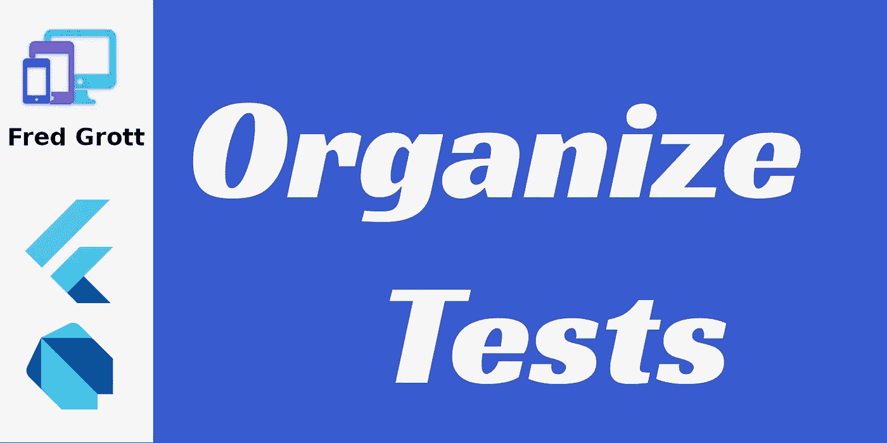

# 组织您的测试

> 原文：<https://itnext.io/organize-your-tests-96a7b9639999?source=collection_archive---------2----------------------->



为什么要组织你的测试？那么，如果测试没有条理，你如何获得正确的反馈呢？

我今年创作了至少两本 flutter 应用程序开发书籍，其中一部分工作就是确保每个学习 flutter 的开发者都能完成两项任务:

1.学习扑得快

2.能够在三个月的代码冲刺中推出一个中等大小的应用。

因此，我浏览了所有的 flutter 文档和 dart 文档，并分析了哪些地方出了问题，以使作为开发者的你能够成功完成上述两项任务。

这一次我将向你展示一些真正好的测试组织习惯和一些关于测试的秘密。而且，因为集成测试和小部件测试使用相同的测试 api，所以集成和小部件测试都可以使用。

# **背景**

首先，让我们从最初创建 flutter 项目时创建的原始小部件测试代码开始:

```
import 'package:flutter/material.dart';import 'package:flutter_test/flutter_test.dart';import 'package:link_like_a_boss/main.dart';void main() {testWidgets('Counter increments smoke test', (WidgetTester tester) *async* {*// Build our app and trigger a frame.**await* tester.pumpWidget(MyApp());*// Verify that our counter starts at 0.*expect(find.text('0'), findsOneWidget);expect(find.text('1'), findsNothing);*// Tap the '+' icon and trigger a frame.**await* tester.tap(find.byIcon(Icons.add));*await* tester.pump();*// Verify that our counter has incremented.*expect(find.text('0'), findsNothing);expect(find.text('1'), findsOneWidget);});}
```

这并不坏，但是在向你展示初级开发人员如何组织测试方面，这又是一个糟糕的工作。让我告诉你一个更好的方法。

# **我组织测试的方式**

最好的方法是展示代码，这样你就可以看到不同之处，然后我会解释代码的不同之处:

```
import 'package:flutter/material.dart';import 'package:flutter_test/flutter_test.dart';import 'package:karma/main.dart';@TestOn("android")@TestOn("ios")void main() {setUpAll(() *async* {});tearDownAll(() *async* {});tearDown(() *async*{});group('Basic Simple Unit Test', (){*// use runAsync when yu have calls to such things as Future.delayed in the testWidgets*testWidgets("Counter increments smoke test", (WidgetTester tester) *async* {*// Build our app and trigger a frame.**await* tester.pumpWidget(MyApp());*// Verify that our counter starts at 0.*expect(find.text('0'), findsOneWidget);expect(find.text('1'), findsNothing);*// Tap the '+' icon and trigger a frame.**// notice we cannot do a find.byType(FlatButton) because class _FlatButtonWithIcon is hiddne**// so either this or**// final iconedFlatBtnFinder = find.ancestor(of: find.byIcon(Icons.add),**// matching: find.byWidgetPredicate((widget) => widget is FlatButton));**//**// this happens to be more effectice in less code lines**await* tester.tap(find.byIcon(Icons.add));*// only use pumpAndSettle() when you really do not know how many frames**// otherwise use tester.pump() and define the number of microseconds**await* tester.pumpAndSettle();*// Verify that our counter has incremented.*expect(find.text('0'), findsNothing);expect(find.text('1'), findsOneWidget);});});}
```

**TestOn 注解**

@TestOn 注释告诉 flutter 在 android 和 ios 平台上运行这些测试。这不是必需的，但我添加它作为测试和应用程序在什么平台上有效的文档

**setUpAll、setUp、tearDownAll 和 tearDown**

这些函数可以在组块之外，也可以在组块之内，告诉 flutter 在测试设置和测试拆除期间执行什么。让我给你看一个集成测试的例子:

```
setUpAll(() *async* {IntegrationTestWidgetsFlutterBinding.ensureInitialized();});
```

这确保了在设置测试时和执行测试之前，integrationtestwidgetsfutterbinding 被初始化。

**异步 vs 运行异步**

一些你在最初的文件中找不到的东西。颤振测试同步运行，而不是异步运行。要异步执行它，你必须使用 runAsync。

**tester . pump vs tester . pumpandsettle**

如果您正在使用 Future.delayed 或者您正在注入依赖项来呈现列表，那么您应该将 tester.pump 更改为 tester.pumpAndSettle，因为您将无法确定将 tester.pump 设置为多少帧(毫秒)。

**使用群组**

我们通过组块建立测试套件，这样我们可以得到一个很好的有组织的测试套件文件。例如，在集成测试中，我可以直接在 dart 中设置行为测试，而不使用小黄瓜，这意味着不必用另一种语言编写 BDD。

# **结论**

这听起来不多，但当你有数百个测试时，你会感谢我的。此外，让像你这样的初级开发人员从一开始就养成这种好习惯，会让你更容易从第一次编写代码开始就使用测试驱动开发来获得颤振概念。

# **资源**

一般资源:

扑社区资源【https://flutter.dev/community 

https://flutter.dev/docs/get-started/install 飘起 SDK

Android Studio IDE[https://developer.android.com/studio](https://developer.android.com/studio)

MS 的 Visual Studio 代码[https://code.visualstudio.com/](https://code.visualstudio.com/)

扑单据[https://flutter.dev/docs](https://flutter.dev/docs)

dart Docs[https://dart.dev/guides](https://dart.dev/guides)

谷歌 Firebase 移动设备测试实验室[https://firebase.google.com/docs/test-lab](https://firebase.google.com/docs/test-lab)

**商标公告**

Google LLC 拥有以下商标:飞镖，颤振，机器人，机器人，诺托。苹果公司拥有 iOS、MacOSX、Swift 和 ObjectiveC 商标。苹果公司拥有 SF Pro、Sf Compact、SF mono 和 New York 字体的商标。JetBeans Inc .拥有 JetBeans、IntelliJ 和 Kotlin 的商标。甲骨文公司拥有 Java 商标。微软公司拥有微软视窗操作系统和 Powershell 的商标。Gradle 是 Gradle Inc .的商标。Git 项目拥有 Git 的商标。Linux 基金会拥有 Linux 的商标。智能手机 OME 自己的商标到他们的手机产品名称。尽我所能，我遵守上述商标的品牌和使用指南。

# **关于弗雷德·格罗特**

我是一个疯狂的 SOB，作为一名前 android 移动开发者，我开始写关于 flutter 移动应用程序开发、设计和生活的文章(见 [Eff COVID 和](https://fredgrott.medium.com/eff-covid-and-the-gop-e912db0548b8)[GOP](https://fredgrott.medium.com/eff-covid-and-the-gop-e912db0548b8).))。我会达到关键的每月 100 万观众大关吗？静观其变。在这些社交平台上找到我:

[https://www.xing.com/profile/Fred_Grott/cv](https://www.xing.com/profile/Fred_Grott/cv)

[https://www . LinkedIn . com/in/fredgrottstartupfluttermobileappdesigner/](https://www.linkedin.com/in/fredgrottstartupfluttermobileappdesigner/)

https://keybase.io/fredgrott

【https://twitter.com/fredgrott 