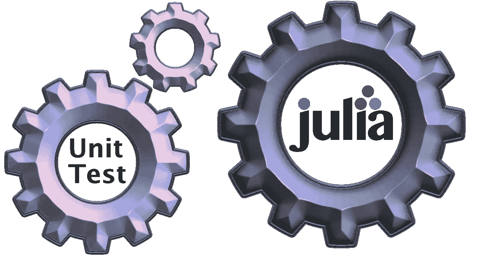

# 在 Julia 中组织测试

> 原文：<https://itnext.io/organizing-tests-in-julia-c3de1e43d6ab?source=collection_archive---------1----------------------->

## Julia 测试框架与 Python、Go 和 Java 中流行的测试框架的比较



M AYBE 你已经熟悉了 Python、Java、Go 等其他语言的测试框架。现在，您希望加快 Julia 中的测试速度。在这个故事中，我们将探索测试与您可能已经习惯的测试有何相似和不同之处。

在讨论 Julia 中的测试之前，我将快速概述一些主流编程语言的流行测试框架中的测试。我们将与 Julia 捆绑的测试框架进行对比，它基于嵌套测试集的概念。这是一种非常灵活的方法，但如果您以前从未遇到过，可能会感到困惑。

请继续阅读这个故事:[埃里克探索了](https://erikexplores.substack.com/p/julia-test-organizing)

# pytest——Python 中的单元测试

[Pytest](https://docs.pytest.org/en/7.1.x/) 是 Python 常用的测试框架。这里，我们只需在代表测试的函数前面加上`test_`，如下所示:

```
# Python - capitalize.py file
def capital_case(x):
    return x.capitalize()

def test_capital_case():
    assert capital_case('semaphore') == 'Semaphore'

# intentionally not working
def test_defective():
    assert "hello".upper() == "heLLO"
```

我故意让一个测试失败，所以你可以看到失败的测试是如何显示的。我们可以在一个有多个测试文件的目录中运行`pytest`或者直接指定一个文件进行测试，就像这个例子中一样。

```
❯ pytest capitalize.py
===================== test session starts =====================
platform darwin -- Python 3.8.12, pytest-7.1.2, pluggy-1.0.0
rootdir: /Users/erikengheim/Development/Python/example
collected 2 items

capitalize.py .F                                        [100%]

========================== FAILURES ===========================
_______________________ test_defective ________________________

    def test_defective():
>       assert "hello".upper() == "heLLO"
E       AssertionError: assert 'HELLO' == 'heLLO'
E         - heLLO
E         + HELLO

capitalize.py:9: AssertionError
=================== short test summary info ===================
FAILED capitalize.py::test_defective - AssertionError: asser...
================= 1 failed, 1 passed in 0.11s =================
```

# Go 中的单元测试

你可以找到很多主流语言的单元测试，但是我关注的是众所周知的简单框架，所以对于 Go，我们来看看内置的单元测试框架，它在 Go 开发者中仍然非常流行。

它基于将每个测试函数命名为`TestXXX(t *testing.T)`的简单思想，其中`XXX`被替换为您想要测试的任何东西。您需要接受一个类型为`*testing.T`的参数来与测试框架通信。

```
// Go - foobar_test.go file
package main

import "testing"

func TestCapitalize(t *testing.T) {
    total := Sum(5, 5)
    if total != 10 {
       t.Errorf("Sum was incorrect, got: %d, want: %d.", total, 10)
    }
}

// deliberately made to fail
func TestDefective(t *testing.T) {
    total := Sum(5, 5)
    if total != 10 {
       t.Errorf("Sum was incorrect, got: %d, want: %d.", total, 10)
    }
}
```

对于 Go 测试，你把它们放在一个以`_test`结尾的文件中，比如`foobar_test.go`。我们让最后一个测试失败了，所以你可以看到 Go 的输出。

```
❯ go test
--- FAIL: TestDefective (0.00s)
    foobar_test.go:23: Uppercase incorrect, got: HELLO, want: heLLO.
FAIL
exit status 1
FAIL	github.com/ordovician/dummy	0.120s
```

这将查找以`_test.go`结尾的文件，并以`Test`前缀对待每个函数，以`testing.T`类型参数作为测试。

# JUnit——Java 中的单元测试

[JUnit](https://junit.org/junit4/) 在 Java 世界占据统治地位。每个测试都存储在测试类的方法中。注意这与 Python 和 Go 有什么不同，Python 和 Go 使用免费函数而不是测试类。

```
// Java - MyTests.java file
public class MyTests {

    @Test
    public void multiplicationOfZeroIntegersShouldReturnZero() {
        MyClass tester = new MyClass(); // MyClass is tested

        // assert statements
        assertEquals(0, tester.multiply(10, 0), "10 x 0 must be 0");
        assertEquals(0, tester.multiply(0, 10), "0 x 10 must be 0");
        assertEquals(0, tester.multiply(0, 0), "0 x 0 must be 0");
    }
}
```

然后这些类被放入一个测试套件中；因此，您可以避免创建大量的测试类:

```
// Java - JUnit test suite
@RunWith(Suite.class)
@SuiteClasses({
        MyClassTest.class,
        MySecondClassTest.class })

public class AllTests {

}
```

# 使用 Julia 测试集进行测试

在 Julia 中，我们摒弃了测试方法、测试类和测试套件之间的人为分离。相反，所有的东西都被融合到一个叫做`testset`的概念中。这些比你在其他框架中发现的更灵活，这就是为什么来自其他框架的开发人员可能会对 Julia 中松散得多的组织感到不舒服。

在朱丽亚，一切都自由得多。您可以根据自己的偏好和风格定制测试框架。这是可能的，因为测试集可以嵌套。

这里有一个来自我的[小人电脑(LMC)汇编器](https://github.com/ordovician/LittleManComputer.jl)的例子，你可以在 [Github](https://github.com/ordovician/LittleManComputer.jl) 上找到它来更详细地查看测试。

```
@testset "Disassembler tests" begin

    @testset "Without operands" begin
        @test disassemble(901) == "INP"
        @test disassemble(902) == "OUT"
        @test disassemble(000) == "HLT"                                     
    end

    @testset "With operands" begin
        @test disassemble(105) == "ADD 5"
        @test disassemble(112) == "ADD 12"
        @test disassemble(243) == "SUB 43"
        @test disassemble(399) == "STA 99"
        @test disassemble(510) == "LDA 10"
        @test disassemble(600) == "BRA 0"
        @test disassemble(645) == "BRA 45"
        @test disassemble(782) == "BRZ 82"                                        
    end   
end
```

对于每个主要的软件组件，我定义了一个测试集。让我举一些例子:汇编器、反汇编器和模拟器都由不同的测试集表示。这些测试集中的每一个都有测试该组件各个方面的子测试集。

因此，Julia `@testset`对应于一个测试函数和一个测试类，以及一个测试套件。

## 在测试集中放什么

对于单元测试中应该包含什么有不同的想法。许多人坚信每次测试只测试一个特定的东西的原则。测试集的 Julia 惯例是每个测试集都有一个相关测试的集合。只需查看 Julia 标准库中的真实测试就能很好地理解这一点。

我在这里作为例子展示的测试集将会被我缩短一些，因为展示每个测试的完整长度并没有什么特别的价值。

```
# Julia - abstractarray.jl tests

A = rand(5,4,3)
@testset "Bounds checking" begin
    @test checkbounds(Bool, A, 1, 1, 1) == true
    @test checkbounds(Bool, A, 5, 4, 3) == true
    @test checkbounds(Bool, A, 0, 1, 1) == false
    @test checkbounds(Bool, A, 1, 0, 1) == false
    @test checkbounds(Bool, A, 1, 1, 0) == false
end

@testset "vector indices" begin
    @test checkbounds(Bool, A, 1:5, 1:4, 1:3) == true
    @test checkbounds(Bool, A, 0:5, 1:4, 1:3) == false
    @test checkbounds(Bool, A, 1:5, 0:4, 1:3) == false
    @test checkbounds(Bool, A, 1:5, 1:4, 0:3) == false
end
```

注意，为`abstractarray.jl`定义的测试旨在检查几个相关的事情。此外，没有固定装置。我们简单地将被反复测试的数组`A`放在测试集之外。这使得它在每个测试中都可用。我们将在以后探索固定装置的替代品。

让我们再举一个例子，看看对由`Char`类型代表的单个字符的测试。

```
# Julia - char.jl tests
@testset "basic properties" begin

    @test typemin(Char) == Char(0)
    @test ndims(Char) == 0
    @test getindex('a', 1) == 'a'
    @test_throws BoundsError getindex('a', 2)
    # This is current behavior, but it seems questionable
    @test getindex('a', 1, 1, 1) == 'a'
    @test_throws BoundsError getindex('a', 1, 1, 2)

    @test 'b' + 1 == 'c'
    @test typeof('b' + 1) == Char
    @test 1 + 'b' == 'c'
    @test typeof(1 + 'b') == Char
    @test 'b' - 1 == 'a'
    @test typeof('b' - 1) == Char

    @test widen('a') === 'a'
    # just check this works
    @test_throws Base.CodePointError Base.code_point_err(UInt32(1))
end

@testset "issue #14573" begin
    array = ['a', 'b', 'c'] + [1, 2, 3]
    @test array == ['b', 'd', 'f']
    @test eltype(array) == Char

    array = [1, 2, 3] + ['a', 'b', 'c']
    @test array == ['b', 'd', 'f']
    @test eltype(array) == Char

    array = ['a', 'b', 'c'] - [0, 1, 2]
    @test array == ['a', 'a', 'a']
    @test eltype(array) == Char
end
```

同样，您可以观察到相关的测试被分组到测试集中。我添加了第二个测试集，以证明 Julia 开发人员遵循了关于 bug 修复的流行建议:每当修复一个 bug 时，创建一个单元测试，它可以捕捉任何重新引入该 bug 的代码修改。有了这样的实践，我们可以更容易地避免代码质量的退化。

## 嵌套测试集

包含您正在测试的代码的测试集也可以包含其他测试集。这里有一个测试中的例子，测试中使用了`Dict`类型来表示 Julia 中的一个字典。

```
# Julia - dict.jl tests

@testset "Dict" begin
    h = Dict()
    for i=1:10000
        h[i] = i+1
    end
    for i=1:10000
        @test (h[i] == i+1)
    end
    for i=1:2:10000
        delete!(h, i)
    end

    h = Dict{Any,Any}("a" => 3)
    @test h["a"] == 3
    h["a","b"] = 4
    @test h["a","b"] == h[("a","b")] == 4
    h["a","b","c"] = 4
    @test h["a","b","c"] == h[("a","b","c")] == 4

    @testset "eltype, keytype and valtype" begin
        @test eltype(h) == Pair{Any,Any}
        @test keytype(h) == Any
        @test valtype(h) == Any

        td = Dict{AbstractString,Float64}()
        @test eltype(td) == Pair{AbstractString,Float64}
        @test keytype(td) == AbstractString
        @test valtype(td) == Float64
        @test keytype(Dict{AbstractString,Float64}) === AbstractString
        @test valtype(Dict{AbstractString,Float64}) === Float64
    end
end
```

代码显示，在内部测试集中测试的名为`h`的字典实际上是在外部测试集中首先定义的。

## 使用 For 循环重复测试

在 Julia 中，使用循环对不同类型的数据重复测试是很容易的。

```
let x = Dict(3=>3, 5=>5, 8=>8, 6=>6)
    pop!(x, 5)
    for k in keys(x)
        Dict{Int,Int}(x)
        @test k in [3, 8, 6]
    end
end
```

我们甚至可以循环整个测试集本身。这里，我们对`==`和`isequal`函数运行相同的测试:

```
@testset "equality" for eq in (isequal, ==)
    @test  eq(Dict(), Dict())
    @test  eq(Dict(1 => 1), Dict(1 => 1))
    @test !eq(Dict(1 => 1), Dict())
    @test !eq(Dict(1 => 1), Dict(1 => 2))
    @test !eq(Dict(1 => 1), Dict(2 => 1))
end
```

# 如何在 Julia 中编写 Fixtures

人工测试框架有夹具的概念。Fixtures 表示我们希望在多个测试中重复使用的初始化数据。Julia 的开发人员认为，仅仅为了处理这个特殊的用例而创造一个独特的概念是过度工程化的。相反，Julia 开发人员相信明确地创建可重用数据。许多支持夹具的测试框架以隐含的方式创建这些夹具。

## 创建不可变夹具

如果您从来没有修改过您的 fixture，那么您可以简单地将 fixture 创建为一个对象，在使用该 fixture 的所有测试之外。在这种情况下，`A`数组是不可变的(它不会改变),我们在边界检查测试和向量索引测试中都使用了它。

```
A = rand(5,4,3)
@testset "Bounds checking" begin
    @test checkbounds(Bool, A, 1, 1, 1) == true
    @test checkbounds(Bool, A, 5, 4, 3) == true
end

@testset "vector indices" begin
    @test checkbounds(Bool, A, 1:5, 1:4, 1:3) == true
    @test checkbounds(Bool, A, 0:5, 1:4, 1:3) == false
end
```

## 创建可变装置

有时我们测试的功能需要改变一个对象。在这种情况下，我们不能在多个测试中重用同一个对象，因为每个测试都可能修改 fixture 对象，并使其在下一个测试中处于未知状态。在这种情况下，我们定义一个函数来创建 fixture 对象。使用夹具的每个测试都将调用创建夹具的函数。在本例中，`test_array`是一个创建夹具的函数。

```
test_array() = rand(5,4,3)

@testset "Bounds checking" begin
      A = test_array()
    @test checkbounds(Bool, A, 1, 1, 1) == true
    @test checkbounds(Bool, A, 5, 4, 3) == true
end

@testset "vector indices" begin
      A = test_array()
    @test checkbounds(Bool, A, 1:5, 1:4, 1:3) == true
    @test checkbounds(Bool, A, 0:5, 1:4, 1:3) == false
end
```

# 更进一步

想在 Julia 中了解更多关于测试的知识吗？阅读 Julia 关于测试的官方文档:[单元测试](https://docs.julialang.org/en/v1/stdlib/Test/)。

有许多我没有介绍的特性可能值得进一步探讨:

*   [中断测试](https://docs.julialang.org/en/v1/stdlib/Test/) `@test_broken` -将测试标记为持续中断。
*   [AbstractTestSet](https://docs.julialang.org/en/v1/stdlib/Test/#Creating-Custom-AbstractTestSet-Types)type——定制测试记录的方式。