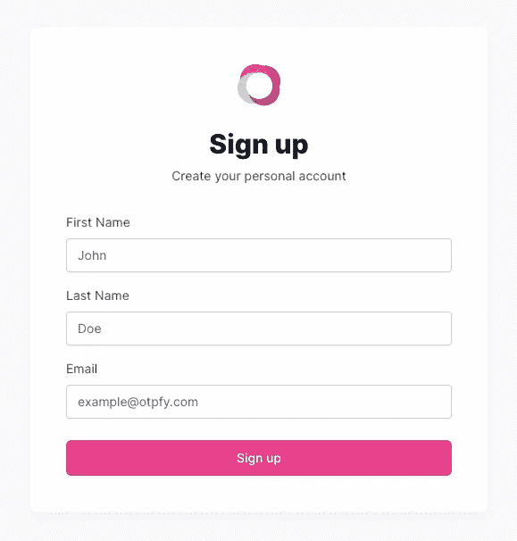
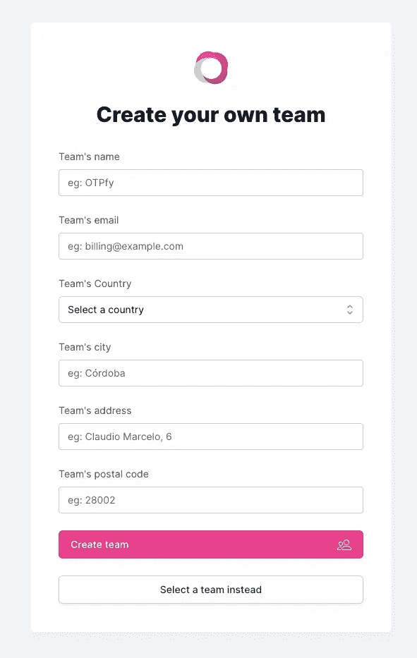
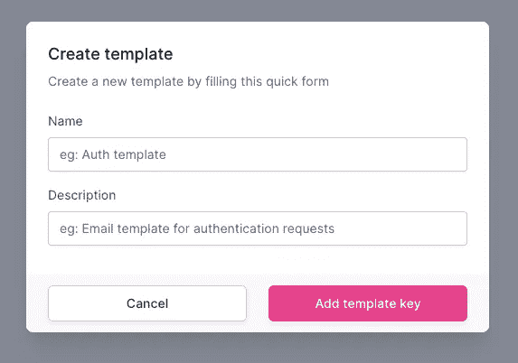
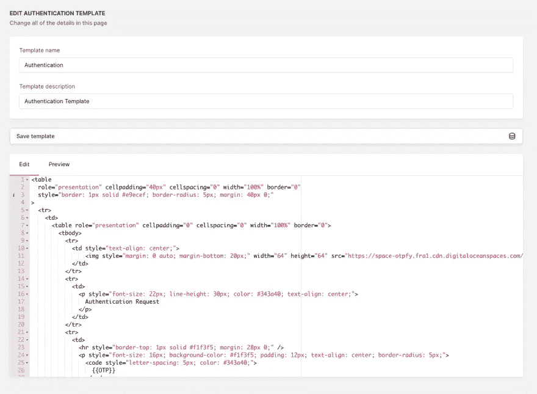
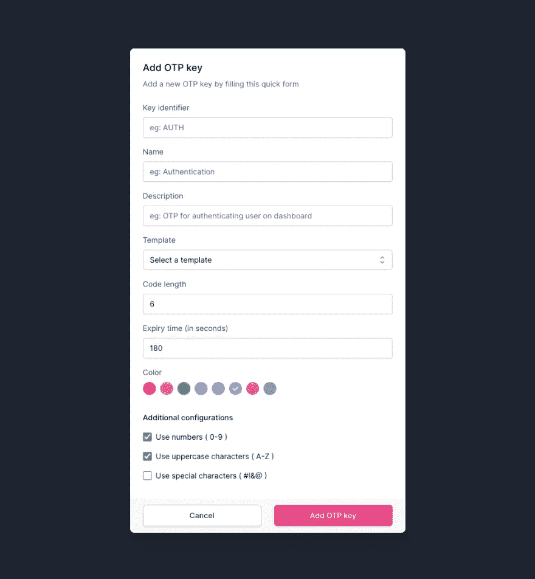
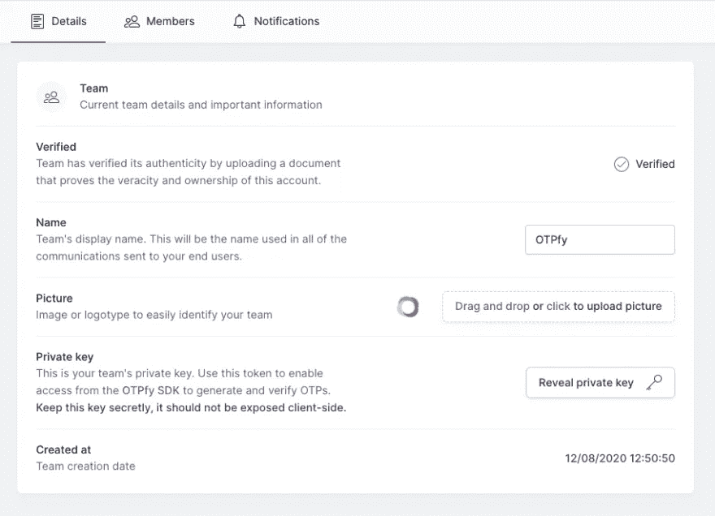
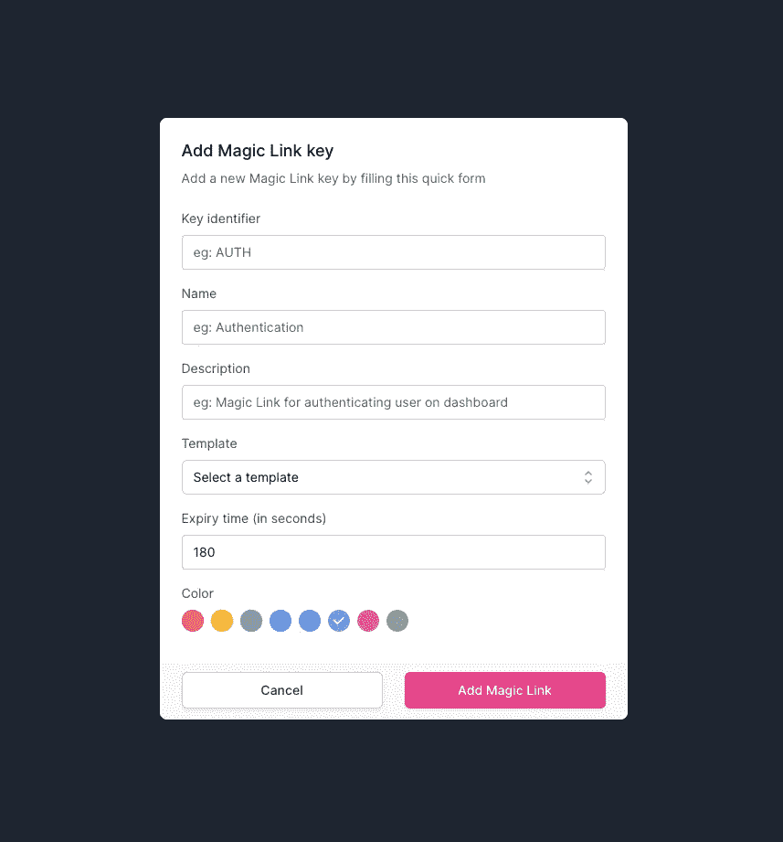

# OTPfy —保护应用程序

> 原文：<https://itnext.io/otpfy-securing-applications-6dd249444338?source=collection_archive---------4----------------------->


[OTPfy](https://otpfy.com/) 是最近才出来的全新产品。一个软件即服务平台，您将能够生成一次性密码和神奇的链接，以保护您的应用程序流。工程时间是宝贵的，保护您的应用程序流可能既具有挑战性又非常耗时。使用 OTPfy，您可以轻松保护应用程序的任何部分，而不会浪费更多的时间和资源。

在这篇文章中，我将指导您完成使用 [OTPfy](https://otpfy.com/) 保护您的应用程序的步骤，在文章结束时，您将熟悉 OTP 密钥、Magic Link 密钥和 [OTPfy SDK](https://otpfy.com/docs/node) ，我们将通过 Node.js 使用它们。

# 步骤 1:在 [OTPfy](https://otpfy.com/) 中创建一个团队


进入[https://otpfy.com](https://otpfy.com/)，然后点击右上角的`sign up`按钮。这将带您进入注册表单以创建个人帐户。



让我们填写表格，用您的个人数据创建一个帐户。

填写表格后，您的个人帐户将被创建，我们可以继续创建 OTPfy 团队。点击右上角的`Create team`粉色按钮，它会带你到这个表格，在这里你会被提示填写你的公司数据。如果您决定以后使用付费许可证，所有这些数据都将用于计费。OTPfy 中的所有团队都有一个`Free`许可证，这个许可证足以开始开发您的应用程序，并在开发时保护您的流程。稍后，您可以根据需要使用付费许可来增加团队的限制。



填写完表格后，您的团队将准备就绪，并会将您重定向到您的仪表板，您可以开始使用 [OTPfy](https://otpfy.com/) 进行工作。让我们看看您团队在第 2 步中的仪表盘。

# 第 2 步:仪表板概述


这是您团队的仪表板。在这里，您可以获得关于您的 OTP 和 Magic Links 如何运行的概述，以及团队许可证使用情况的快速概述。

让我们从左到右描述导航菜单:

*   **仪表板**:获取您团队的概览&见解。
*   **团队**:在这个页面中，您可以更新您的团队详细信息，添加和删除团队成员以及您的个人通知。在 OTPfy 中，通知是在每个团队的基础上处理的，这意味着您可以独立地定制每个团队的通知。
*   **密钥**:这是您将生成 OTP 密钥和魔法链接密钥的页面。这些密钥是 OTPfy 的基石，通过这些密钥，您可以为您的用户、应用程序和流程生成 OTP 代码和神奇链接。
*   **模板**:在这里您将能够生成和配置模板，这些模板将被发送给请求 OTP 或神奇链接的用户。模板是完全可定制的 HTML，你可以使用默认的或得到创造性的。
*   **许可证**:这个页面会显示你当前团队的许可证(免费&无限制)，你可以升级到任何付费许可证:`PRO`、`STARTUP`或`BUSINESS`。订阅后，您可以在期限结束时取消您的许可证，或者如果您已经取消了它，请重新启用它。请记住，所有年度许可证都有 20%的折扣！此外，在此页面上，您将能够查看您生成的发票或支付到期发票。
*   **付款详情**:在这里您可以更新您的付款详情，以防您因信用卡过期或其他相关原因而需要。

个人资料下拉导航

*   **账户设置**:更新您的个人信息，如图片、名字、姓氏和电话。
*   **改变团队**:选择一个不同的团队和你一起工作。
*   **支持**:访问支持系统来报告你可能遇到的任何问题(希望你不用用这么多！)
*   **登出**:关闭您在 OTPfy 的会话。

# 步骤 3:为 OTP 密钥创建模板。

您需要做的第一件事是创建一个模板。让我们开始吧！转到`Templates`页面，点击出现在页面右侧的`Create template`粉色按钮，这将显示一个模式窗口，其中包含以下要填写的字段:



创建过程完成后，您将被带到`Template Edition`页面，在这里您可以更新之前的详细信息并访问 HTML 模板编辑器。你也可以预览你的 HTML 模板将会是什么样子！



# 步骤 4:创建 OTP 密钥

接下来要做的事情是创建一个 OTP 密钥，这个密钥将允许您使用在这个密钥上设置的配置来生成一个用于保护流的 OTP。点击`Keys`导航菜单进入`Keys`页面，在这里您可以大致了解`OTPs`和`Magic Links`按键的操作情况。点击`OTP`二级导航元素。您将看到一个带有精美插图空白页面，告诉您还没有创建任何 OTP 密钥。让我们点击页面右侧的`Add OTP key`粉色按钮。此操作将显示一个模式窗口，其中有一个表单，您可以在其中配置此 OTP 密钥的行为方式:



让我们详细了解一下配置:

*   **密钥标识符**:这个密钥标识符是您将在 [OTPfy SDK](https://otpfy.com/docs/node) 上使用的，以告知将使用哪个 OTP 密钥，它将从。
*   **名称**:仪表板上用于识别的按键名称。
*   **描述**:仪表板上用于识别的关键描述。
*   **模板**:在这里您将选择我们之前在步骤 3 中创建的模板。
*   **码长**:该码的字符长度，可以输入 6 到 24 之间的任意数字。
*   **到期时间(秒)**:动态口令生成后有效的秒数，可以输入 60 到 300 之间的任意秒数。
*   **颜色**:仪表板上用于识别的关键颜色。
*   **附加配置**:
*   **使用数字**:该设置将告诉 OTPfy 在生成的 OTP 上包含数字。
*   **使用大写字符**:该设置将告诉 OTPfy 在生成的 OTP 中包含大写字符。
*   **使用特殊字符**:该设置将告诉 OTPfy 在生成的 OTP 中包含特殊字符。

完成数据设置后，点击`Add OTP key`按钮生成该密钥，并能够通过 [OTPfy SDK](https://otpfy.com/docs/node) 使用它。

如果你很好奇，你可以点击你的全新`OTP key`的`More details`按钮，以获得关于这个`OTP key`如何表现的具体细节。

# 步骤 5:获取您团队的私钥



如果您导航到您的`Team`页面并访问`Details`选项卡，您将在详细信息的底部看到一个写有`Private key`的部分。要显示您的私人密钥，请单击该行右侧的`Reveal private key`白色按钮，这将显示您唯一的团队私人密钥，如果您再次单击该按钮，它将自动复制到您的剪贴板。

# 步骤 6:安装 [OTPfy SDK](https://otpfy.com/docs/node)

下一步是在 Node.js 应用程序中安装 [OTPfy SDK](https://otpfy.com/docs/node) (目前我们只发布了 Node SDK，但我们正在努力为任何后端语言发布更多 SDK！).

通过控制台访问您的项目，并键入:

```
yarn add @otpfy/sdk
```

这将在您的后端应用程序中安装 [OTPfy SDK](https://otpfy.com/docs/node) 。该模块需要使用`node-fetch`作为依赖项，但它没有与 SDK 捆绑在一起，以避免增加捆绑包的大小。这意味着您将不得不单独安装`node-fetch`作为后端项目的依赖项。

# 步骤 7: SDK 初始化

为了成功初始化，您的团队私有密钥需要作为唯一的参数传递给初始化函数。确保这个私钥总是安全可靠的，这样就没有人能够代表您的团队提出请求。

```
import sdk from '@otpfy/sdk';const otpfy = sdk('TEAM_PRIVATE_KEY');
```

# 步骤 8:动态口令生成

访问您希望生成动态口令的应用程序的任何流程，并粘贴下面的代码，您将对其进行一些修改。

```
const generateResponse = await otpfy.generateOTP({
  email: 'me@gmail.com',
  external_identifier: '978c324ab78dd92',
  key: 'AUTH'
});
```

该代码将告诉 [OTPfy](https://otpfy.com/) 使用以下配置生成一个 OTP:

*   **email** :将要生成的 OTP 的收件人邮箱。
*   **external_identifier** :您必须提供的惟一 ID，以便为特定用户或流惟一地标识这个 OTP。通常，按照这个例子，这将是在您的数据库上生成的用户标识符。
*   **密钥**:您之前在生成 OTP 密钥时使用的*密钥标识符*。这将采用您之前设置的所有配置。

`generateResponse`变量将是一个具有以下形状的对象:

```
type GenerateResponse = {
  status: number;
  code: string;
  identifier: string;
  message?: string;
};
```

`status`属性将包含操作的状态代码，如果成功是`OK`或`400`到`500`，则可能是 200，这取决于发生的错误。
`code`属性将包含一个消息表单 OTPfy，告诉发生了什么，如果一切正常，可能包含一个类似于`SUCCESS`的消息，或者包含一个类似于`BAD_REQUEST`或`UNEXPECTED_ERROR`的消息，这取决于是什么导致了它。
`identifier`属性是您必须存储的内容，以便稍后验证您刚刚生成的 OTP。
如果状态不是 200，就会出现`message`属性，它会告诉你更多关于错误原因的信息。

# 步骤 9:动态口令验证

对您的应用程序的任何流的访问，您想要检查的 OTP 是从您的用户处接收的，并粘贴下面的代码，您将对其进行一些修改。

```
const verifyResponse = await otpfy.verifyOTP({
  code: '45$6AFd65',
  external_identifier: '978c324ab78dd92',
  key: 'AUTH',
  identifier: '123cb8945bd0943'
});
```

该代码将告诉 [OTPfy](https://otpfy.com/) 使用以下配置验证 OTP:

*   **代码**:用户通过邮件收到的代码。
*   **external_identifier** :你方提供的唯一标识符，用于标识此神奇链接。通常这可能是您的用户 ID 或一些唯一的标识符。
*   **密钥**:您之前在生成 OTP 密钥时使用的*密钥标识符*。这将采用您之前设置的所有配置。
*   **标识符**:从`otpfy.generateOTP`函数返回的标识符。

`verifyResponse`变量将是一个具有以下形状的对象:

```
type VerifyResponse = {
  status: number;
  code: string;
  message?: string;
};
```

`status`属性将包含操作的状态代码，如果成功是`OK`或`400`到`500`则可能是 200，这取决于发生的错误。
`code`属性将包含一个消息表单 OTPfy，告知发生了什么，如果一切正常，可能包含一个类似于`SUCCESS`的消息，或者包含一个类似于`BAD_REQUEST`或`UNEXPECTED_ERROR`的消息，这取决于是什么导致了它。
如果状态不同于 200，则`message`属性将会出现，并告诉您关于导致错误的原因的更多信息。

如果`verifyResponse.status`等于`200`将意味着用户和代码的真实性，并且该过程是成功的，您可以授予该人访问他们试图安全访问的任何内容的权限。

# 步骤 10.1:创建神奇链接密钥(可选)

Magic Link key 密钥将允许您生成一个 Magic Link，以便使用您在此密钥上设置的配置来保护流。点击`Keys`导航菜单进入`Keys`页面，在这里你可以大致了解`OTPs`和`Magic Links`按键的操作情况。点击`MAgic Link`二级导航元素。您将看到一个带有精美插图空白页面，告诉您还没有创建任何 Magic Link key。让我们点击本页右侧的`Add Magic Link`粉色按钮。此操作将显示一个模式窗口，其中有一个表单，您可以在其中配置此神奇链接键的行为方式:



让我们详细了解一下配置:

*   **密钥标识符**:这个密钥标识符是您将在 [OTPfy SDK](https://otpfy.com/docs/node) 上使用的，以告知将使用哪个 Magic Link 密钥，它将从。
*   **名称**:仪表板上用于识别的按键名称。
*   **描述**:仪表板上用于识别的关键描述。
*   **模板**:在这里你将选择我们之前在步骤 3 中创建的模板。
*   **到期时间(秒)**:魔法链接生成后有效的秒数，可以输入 60 到 300 之间的任意秒数。
*   **颜色**:仪表板上用于识别的关键颜色。

完成数据设置后，单击`Add Magic Link`按钮生成该密钥，并能够通过 [OTPfy SDK](https://otpfy.com/docs/node) 使用它。

如果你很好奇，你可以点击你的全新`Magic Link key`的`More details`按钮，以获得关于这个`Magic Link key`如何表现的具体细节。

# 步骤 10.2:神奇链接生成(可选)

为了生成一个新的保护特定流的神奇链接，您需要导入 [OTPfy SDK](https://otpfy.com/docs/node) ，初始化它，然后调用`optfy.generateMagicLink`方法。

```
import sdk from '@otpfy/sdk';const otpfy = sdk('TEAM_PRIVATE_KEY');const generateResponse = await otpfy.generateMagicLink({
  email: 'me@gmail.com',
  external_identifier: '978c324ab78dd92',
  key: 'AUTH',
  callbacks: {
    success: 'https://myapp.com/authentication/success?id=123123123'
    error: 'https://myapp.com/authentication/error?id=123123123'
  }
});
```

这段代码将告诉 [OTPfy](https://otpfy.com/) 使用以下配置生成一个神奇的链接:

*   **电子邮件**:根据您在 OTPfy 仪表板上创建和选择的模板，将向该目标电子邮件发送一封电子邮件，其中包含生成的神奇链接。
*   **external_identifier** :你方提供的唯一标识符，用于标识此神奇链接。通常这可能是您的用户 ID 或一些唯一的标识符。
*   **密钥**:您之前在 Magic Link 密钥生成中使用的*密钥标识符*。这将采用您之前设置的所有配置。
*   **回调**:如果验证成功或失败，这两个属性将用于将用户重定向到应用程序的特定部分。
*   **成功**:如果魔术链接验证成功，用户将被重定向到的 URL。
*   **错误**:如果魔法链接验证错误，用户将被重定向到的 URL。

使用 [OTPfy](https://otpfy.com/) 生成神奇的链接非常简单，您甚至可以定制回调来传递您在重定向用户时需要的任何数据(比如试图验证的用户 id 或其他任何东西)。

# 步骤 11:使用 SDK 检查您团队的许可证(可选)

您可以使用 OTPfy SDK 中的这个简便方法来检查您团队的当前许可状态。

```
const licenseStatus = await otpfy.checkLicense();
```

`licenseStatus`将保存具有以下任何值和含义的字符串文字:

*   `VALID_LICENSE`:您当前的许可证是有效的，您可以使用并访问任何 [OTPfy](https://otpfy.com/) 服务。
*   `UNAUTHORIZED`SDK 初始化时提供的团队私钥无效，因此您无权检查许可证状态。
*   `TEAM_BLOCKED`:由于一张过期未付的发票，您的团队目前被禁止使用 [OTPfy](https://otpfy.com/) 服务。请访问您在[https://otpfy.com/license](https://otpfy.com/license)的仪表盘，继续支付发票款项，以便解锁许可证并继续使用 [OTPfy](https://otpfy.com/) 服务。

我希望大家喜欢这篇文章，并开始使用 [OTPfy](https://otpfy.com/) 保护您的应用程序流！