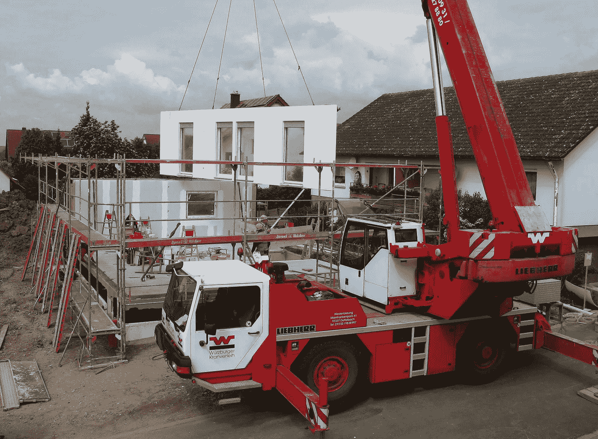
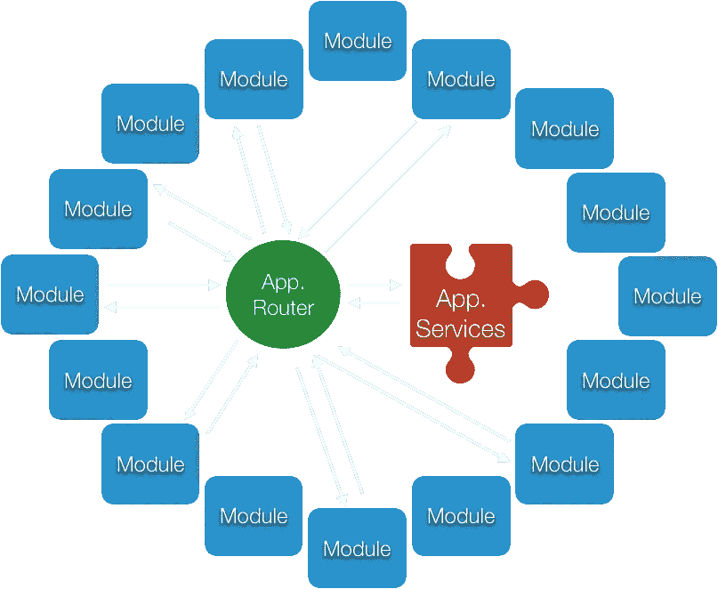
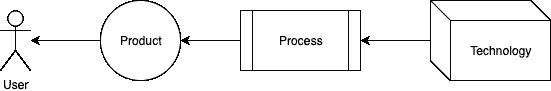

# 我们的房子在街道中间

> 原文：<https://itnext.io/our-house-in-the-middle-of-the-street-7f6fba4dfd30?source=collection_archive---------3----------------------->

杰西·罗伯特在 [Unsplash](https://unsplash.com?utm_source=medium&utm_medium=referral) 上拍摄的《白天的白色和棕色房子》

房子？不，我们的应用，我们的代码！我们的代码遵循我们的用户需求，通过仍然太复杂的敏捷(或者更好地说:所谓的敏捷)过程，由 Scrum 教练促进，由故事阐明，由一群产品经理拥有。这一切都可能发生得很快！

不，等等…！我刚刚在上面写的可以很容易地成为建造房子的一个设置！你知道，敏捷和 Scrum 不仅仅是软件开发领域。

# 一个房子和一个应用程序有什么区别呢？😁

***House 提供住宿服务，我们的软件提供一些特定的信息驱动服务*** ，其中许多服务取决于软件的用途。这里没有太大的区别。但是不同之处在于，正如上面定义的，服务是如何随着时间的推移而发展的。

在房子的整个寿命期间，它的主要用途不会改变。因此，房子的地基、墙壁、窗户和屋顶即使有变化，也不会改变太多。

人们会偶尔重新粉刷它，从里到外，比如改变你的应用程序的颜色。人们也喜欢改变家具或厨房，但这只是一个小小的努力。家具和厨房仍将用于同样的目的，只是我们使用和使用它们的方式会有所改变，它们可能会给我们一种美感的提升。

就像在应用程序中，当我们通过添加和改变一些控件来改变一个视图时。我们仍然将它用作相同功能的接口。或多或少。

# 一些更大的改变和改编怎么样？

[诺兰·伊萨克](https://unsplash.com/@nolanissac?utm_source=medium&utm_medium=referral)在 [Unsplash](https://unsplash.com?utm_source=medium&utm_medium=referral) 上的“灰色混凝土墙与破碎的地板”

嗯，很贵。但是有可能，只要房子的地基是牢固的，最初的构想是好的。我们可以拆掉这堵墙，再建一个，增加一个故事，增加一个翅膀…

此外，我们的应用程序可以彻底改变。它可以对其功能进行彻底的检查，并获得许多新功能。前提是初始架构能够承受。事实上，与房子相比，我们可以更频繁、更容易地使用应用程序来实现这一点，因为房子的“实时”版本不像 Appstore 上的应用程序那样存在，而我们会在“开发”和“测试”版本上添加新功能。😁。只有一栋房子。当我们进行任何重大改编时，我们就是不能使用它。听起来很贵。

# 如果变革需要的不仅仅是基础所能承受的呢？

简单:我们拆毁一栋房子。我们从头开始构建一个应用程序。这款应用还有一个小小的优势:在构建新应用的同时，旧应用仍然可以工作。对于一栋房子，我们至少需要一块新的土地才能达到类似的水平。

**但是……**

> House 提供住宿服务。应用程序在数字市场上提供服务，与房子相比，后者可以在很短的时间内发生巨大变化。这些变化将不可避免地需要新的基础，不管它们有多好和多坚实，因为需求的变化将超出它们所能处理的，它们所能携带的，它们本该做的。这就是房屋建筑变得容易的地方，因为与房屋相比，它很少发生。

# 预制屋如何融入这个故事？

Pixabay 提供

预制房屋提供两件东西:

*   交货速度
*   轻松版本控制
*   降低成本

简单的版本控制可能与给应用贴上白色标签有关。但这是它的终点。除非…

**……除非我们也像预制模块一样构建软件！**

但是，我们不是已经试过了，而且一直失败吗？是的。在[面向模块的架构(MOA)](/module-oriented-architecture-4b54c8976415) 中描述和评估的原因和解决方案很好地回答了这个问题，但我们不会在此详述。

# 面向模块的体系结构是如何工作的？

在最近的一次面试中，一位应聘者问了我这个问题。虽然这个想法的简单性给他留下了深刻的印象，但他不确定这种开销是否值得。

嗯，我说我实际上没有看到任何开销。恰恰相反:这个想法在技术上非常简单，不仅可行，而且实现起来也非常简单，甚至对于初级开发人员来说也是如此。

**但是……回家来了吗？这就是为什么:**

## 模块要足够小，以变得非常简单

书中最老的绝招:**分而治之！把你的问题分成小问题，再把小问题分成更小的问题。重复这个循环，直到问题变得微不足道，可以解决并测试它的解决方案。**然后从较小的解决方案中构建最终解决方案。在这样做的时候，你可能混淆了顺序。这不是错误:这只是另一个最终解决方案！****

***装配式房屋类比:*** *将其零件切割成大小块，便于建造、运输，并以不同的组合进行组装，交付不同类型的房屋。*

## “架构”的整个思想是编排模块，而不是规定如何编写它们，没有强烈的意见，没有强烈的要求，没有单一的实现路径

> 大多数概念的失败并不是因为它们在解决问题上的野心过大或设计过度，而是因为它们只有一条路可走。瑞士刀。现实是，不是每一个问题，即使是一个小问题，都可以用同样的方式解决。
> 
> 因此，最好的架构是尽可能少的架构！作为一个概念，架构应该找到一种方法，如何在独立模块和它们的编排器之间进行连接和协调。

像这样:

AppRouter:建筑；应用服务:Orchestrator

**AppRouter:建筑；应用服务:Orchestrator**

***活动板房比喻:*** *积木就是模块，建筑就是上图中的装配车，指挥者就是装配工。*

## 所有模块都使用相同的通信接口(URL 和 HTTP ),这使得它们易于替换

***装配式房屋类比:*** *所有的砌块都有相同的合页和电缆接头要捆绑在一起。*

## 模块完成工作，而不是思考

模块只包含执行逻辑，决策逻辑包含在应用服务中。因此用另一个块替换该块，以不同的方式执行相同的动作。

# 但是，为什么 MOA 可以解决许多问题呢？

这次先把技术原因放一边。他们在大局中无足轻重，这就是大局:

整个想法非常简单:用户使用产品，产品是由技术支持的过程的输出。

> **架构概念不仅仅是为了简化开发过程，因为这本身就是更大的图景的一部分，更好地说:我们为谁而存在:向我们的客户/用户交付价值。**

面向模块的架构(MOA)在设计时就考虑到了用户，简化了流程，具体做法如下:

*   使问题的单一解决方案足够小，容易解决
*   不需要训练有素的高级工程师来处理
*   易于维护，易于更换
*   易于满足特定用户的需求
*   易于测试每一个行为，从而使其坚如磐石的稳定
*   向回归套件中轻松添加测试
*   易于构建到新闻解决方案中
*   易于更改应用程序如何与相同的构建块/模块一起工作的逻辑
*   逻辑不是执行的一部分，因此它可以在应用程序之外动态改变！
*   新技术可以通过通用接口无缝地、逐步地添加进来，而不需要任何权衡。
*   不同的技术可以从任何地方连接到它，无论是从设备功能、网页、电子邮件…你能想到的！
*   这么多“讨厌的”单词重构可以从我们的词汇表中删除了。从现在开始只是“零件更换”。部分是独立写的。

想象一下，这一切开始变得有意义了:

*   故事很容易写，也很容易拆分
*   故事不会和冲刺重叠
*   bug 很少，很容易被隔离，因此总是在 sprint 中被修复
*   功能易于开启和关闭
*   新功能，甚至无需更改代码
*   代码库之外的工作流更改
*   回归测试代码使得基于主干的开发成为可能，这使得在任何时间点交付应用成为可能！这是敏捷过程的关键目标。
*   招聘可以更加容易和快捷
*   ….

我可以在这里写更多，但是通过产品负责人、Scrum Masters 和管理层以及最终用户的笑脸，我们可以真正地看到，技术需要实现这个过程！

# 你还和我们在一起吗？

无论是[我们在街道中间的房子](https://www.youtube.com/watch?v=rXuvdeEC5y8)还是[我们在 Appstore 中间的一个应用](https://itunes.apple.com/de/app/gmx/id417352269?mt=8)，原理都是相同或非常相同的。

> 正如这个[简介](/module-oriented-architecture-4b54c8976415)中所描述的，软件开发和房屋建筑不是一门艺术，它们都遵循着定义技术/工程和用户之间关系的相同原则，所以找到相似之处很容易，也很有趣。

这也是本文的目的:通过自我反省获得一点乐趣，并从中吸取一两个教训。

所以，如果你厌倦了软件，就去盖房子吧。你已经走了一半了😉。