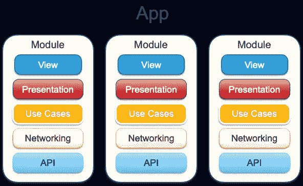
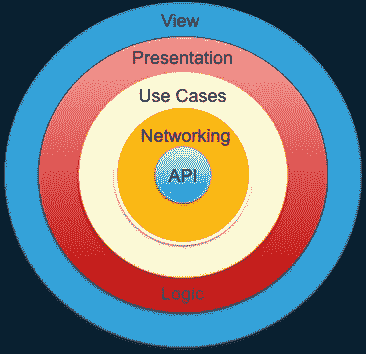

# 从外向里还是从内向外？伦敦还是芝加哥学校？—第 1 部分:绿地项目

> 原文：<https://itnext.io/outside-in-or-inside-out-london-or-chicago-school-part-1-greenfield-projects-d324390a0dbd?source=collection_archive---------6----------------------->

查尔斯·波斯蒂奥在 [Unsplash](https://unsplash.com?utm_source=medium&utm_medium=referral) 上的照片

虽然标题可能有点误导，但本文并不是要解释软件开发中的这两种方法，而是一组来自创建大型应用程序或大型重构的经验的观点。如果你有兴趣重温一下关于**伦敦**和**经典(芝加哥)**学校的知识，你可以在这里找到一些有用的信息和链接:[https://software engineering . stack exchange . com/questions/166409/TDD-outside-in-vs-inside-out](https://softwareengineering.stackexchange.com/questions/166409/tdd-outside-in-vs-inside-out)

# 一款全新的应用

我将向你展示，在构建一个应用程序时，你如何应用 London 和 Classic 两个原则，并指出两者的优缺点。虽然这将显示在应用程序的一个比例上，但它并没有描述以一种均匀分层的方式编写整个应用程序的原理。这个概念假设你理解模块化的方法，并且你理解从 API 到视图层或者相反的场景、组件、epic 的构建原理。

我们将讨论构建模块的原则。我的首选方法是一如既往的 [**面向模块的架构(MOA)**](/module-oriented-architecture-4b54c8976415) 。

我们将开始一段旅程，从内部和外部开始，浏览应用程序的相同**干净层:**

# 从里到外

了解了你的**域逻辑**和**域模型**，你可能总会被诱惑从内部的**开始。当公司希望利用现有的后端服务来数字化他们的业务时，这是常见的情况，这些后端服务与定制的客户端或有时与他们现有的网络存在一起工作。**

## 好人

*   **从**开始非常清晰简单，了解后端通信层后，您可以从通用网络层(如果需要)开始，应用 TDD 以及存根 API 响应
*   **递增复杂性**，易于遵循
*   您能够从开发的非常早期阶段测试集成

## 坏事

*   在**用例**和**视图**之间的某个地方，你将开始捕捉并试图解决从**领域逻辑**和**视图** (UX)返回的概念差异，在那里产品所有者占主导地位。
*   因为底层将总是准备、测试和工作的，所以你不会总是为它们创建模拟，从而维护任何更高的组件的独立可测试性，这将特别影响这种潜在行为测试。因此，**你可能不得不调试所有层，而不是在实际层上捕捉问题**
*   很多时候，变化会变得很深，很多时候，整个概念也必须改变。**当较低层发生变化时，它们将需要一堆接口的变化直到顶层**，导致同一层中许多痛苦的横向变化
*   将变更的实施转移到底层和备份可能**严重影响预期的交付进度和成本**
*   **每一次重构之旅都会无意中降低代码的质量**
*   你可能会得到一些根本不需要的代码( **YAGNI** )

## 丑陋的

*   你可能很晚才发现，如果没有巨大的努力和成本，用户特性是不可实现的

# 由外向内

当你从 UX、从与用户相关的商业规则、从产品的角度出发时，从外部、从下往上开始是很自然的。

## 好人

*   你将从用户需求开始，也就是说，从产品开始，从应用程序应该如何工作开始
*   沿着这些层，你总是能够向下模仿松耦合连接，从而**保持每一层都处于完全可测试的状态**并且保持高度的模块化，这意味着组件级的可维护性和可变性
*   TDD 将会像由内向外的方法一样流畅，但是**在它之上，你将能够从一开始就应用所有层的完整 BDD**
*   随着 API 的每一步发展，你会更容易、更快地发现是否需要改变。这给了 API 更多的时间来适应(或被另一个通常来自中间件的 API 所取代),并且 API 的改变不需要任何代码的改变，就像从内向外改变一样
*   因此，将不会有太多的上下摆动层的变化
*   开发人员将改善用户需求和 API 功能之间的联系，如果已经存在的话
*   **API 可以根据产品需求进行定制，而不是相反**

## 坏事

*   任何一层的最终变化都不可能完全避免
*   尽管深入各层会花费大量的时间，但是开发人员仍然需要根据现有的 API 评估用户需求，并在需要时引入潜在的变化
*   **通常需要更好的开发人员，在 TDD、BDD 和应用模拟方面非常熟练**

## 丑陋的

*   如果你自己想到了什么，请告诉我…

# 判决？

首先，我会说答案很简单:Outside-In 是一个强有力的赢家。但是你真的需要它的所有这些优点吗？有没有这样的例子，在不太需要技能的情况下，由内向外也能做得很好？无论如何，这里肯定有一些:

*   项目相对较小
*   项目由领域逻辑决定
*   你需要从头开始重构

尽管如此，我相信实际的项目和案例研究可以给出更好的答案，也许可以提供一个不能简单地用一句话来概括的结论。

# 现有项目怎么样？

绝对的！我们可能并不总是拥有从头开始应用的奢侈。事实上，对于大多数工程师来说，他们会加入一个团队，这个团队开发一个应用程序，并且已经维护它很多年了。

让我们在 [**第二部分**](https://medium.com/@poksi/outside-in-or-inside-out-part-2-refactoring-existing-projects-dcf7f2ef4d2a) 中了解一下这种情况下的方法和做法。