# 从外向里还是从内向外？—第 2 部分:重构现有项目

> 原文：<https://itnext.io/outside-in-or-inside-out-part-2-refactoring-existing-projects-dcf7f2ef4d2a?source=collection_archive---------7----------------------->

斯蒂芬·卡萨拉在 [Unsplash](https://unsplash.com?utm_source=medium&utm_medium=referral) 上的照片

在 [**第一部分**](https://medium.com/@poksi/outside-in-or-inside-out-london-or-chicago-school-part-1-greenfield-projects-d324390a0dbd) 中，当我们从头开始编写一个新的应用程序时，我们能够在使用**伦敦**或**芝加哥**方法时读到一些发现和建议。这已经成为大多数开发者的奢望。

> **通常，我们加入的团队都是已经老化的应用，充满了破坏质量和可维护性的架构问题。更糟糕的是，除了定期发布包括所有新功能在内的应用程序之外，没有人期待其他任何东西！**

让我们看看，伦敦和芝加哥如何在这里申请。

# 伦敦又赢了！

想象一下，你有一个旧的应用程序，用非常旧的概念编写非常旧的代码。简而言之，你有一个**斑点**:

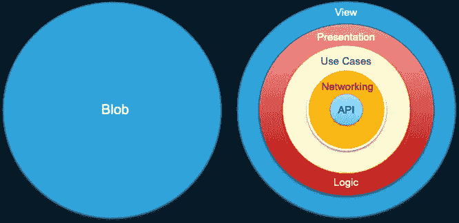

图片 1:我们拥有的(左边的斑点)和我们想要去的地方(右边)

当然，正如在 [**第一部分**](https://medium.com/@poksi/outside-in-or-inside-out-london-or-chicago-school-part-1-greenfield-projects-d324390a0dbd) 中已经提到的，实际的 App 是由许多交错互连的 Blobs 组成的，因为它应该是后来理想地由许多 ***解耦模块*** 构建的:

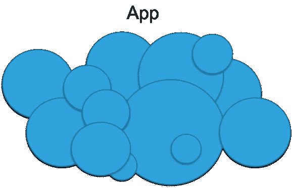

图 2:现在

图 3:进球

最符合逻辑的方式似乎是伦敦学派，并开始从下往上解耦或松散耦合:

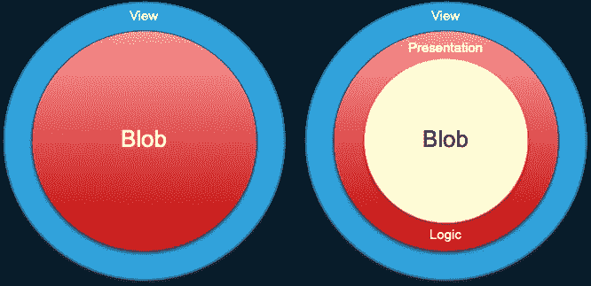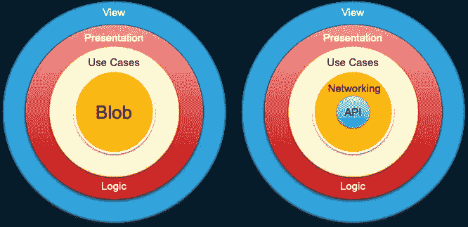

图 4:一条漂亮的向下的伦敦路

这看起来几乎就像从头开始编写伦敦学校应用程序！这几乎好得不像是真的，这也很好，因为这是不可能的。😉至少不像图片显示的那样。blobs 中的代码非常复杂，以至于根本不可能按层清晰地划分步骤。很可能我们会有这样的事情:

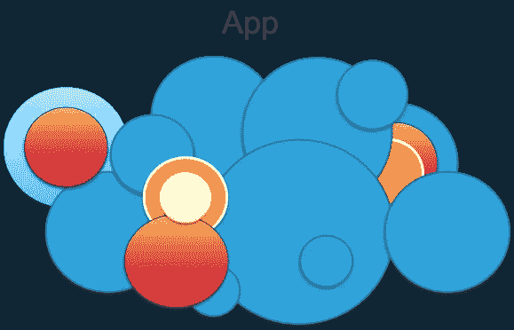

图 5:现实的挤压

…上下左右地斗争，试图找到并定义某一组功能，并开始通过各种方法隔离它们。嗯，准确地说，我们应该能够毫不费力地完成**至少伦敦的第一步，即将视图从其余部分中分离出来**，然后在视图层下面的图片中消除泡沫。

# 那真的是伦敦吗？

这是由外向内的方法。但不像理论上所说的那么干净。我们深入各层，同时遵循两种主要方法进行重构:

## 各个击破

*   机会主义地试图找到**最简单最小的*功能*** ，我们可以从其他代码中分离出来。这可以是类似于**有界上下文**根据**埃文斯**中的[**域驱动设计**](https://www.amazon.com/Domain-Driven-Design-Tackling-Complexity-Software/dp/0321125215) 的东西，但不要被他的定义所限制
*   我们试图在代码中找到这个 ***功能*** 的界限，每一个大概都在不同的地方
*   在我们找到这些界限之后，我们开始将它们从代码库的其余部分中分离出来

## 扼杀代码

*   我们开始将**有界的上下文，或者将**解耦的功能放到某种**封装的容器**中。我们可以为它使用不同的模式，要么**外观，代理**或我最喜欢的:**中介**

> 当你在较低层次上的功能不能通过使遗留代码和新代码一起工作时，中介器可能是一个很好的选择。在这种情况下， **Mediator 可用作新旧世界之间的开关**，**使应用程序在两种环境下均可测试。**

*   扼杀代码到这样一个地步，你要么扼杀所有的遗留代码，要么直到你只能用旧的或新的代码工作的开关。

> 经常发生的情况是，你不能简单地将代码扼杀在最后。想象一下许多基本概念完全改变的情况，比如领域模型和持久性。如果并行使用它们存在限制，那么在某个时候切换就变得必不可少。

# 我的大重构项目

去年，我领导了一个相当大的重构项目，其总体目标是**用最简单的话来说，模块化应用**，从而使其长期可维护和可持续扩展。同样，这似乎也不是什么特别的任务，就像上面一篇文章中描述的事情一样。然而，魔鬼却在下面的细节中:

*   由于在通信、同步和本地数据持久性方面不可管理的竞争条件的某些长期问题，**底层需要尽快重构，首先，实际上是**
*   我们有**非常低的 UI 自动化测试覆盖率**，大约是已知案例的 10%
*   由于非技术原因，我们缺乏测试资源，包括手工测试人员和测试自动化工程师
*   当我们重构(重写是更精确的描述)时，我们**需要保持我们的应用在正常的 2 周冲刺周期**中可发布
*   不幸的是，我们还必须从根本上改变同步和持久化的工作方式，因为持久化会占用大量内存，而且由于其他一些原因，在同一个或共享模型上扼杀代码实际上是不可能的，**在这种程度上进行切换是绝对必要的……**

> 前景不容乐观。似乎一切都与项目的成功完成背道而驰，没有任何简化或神奇的公式可以简单地通过遵循伦敦或芝加哥的一套规则来实现这一点，也没有纽约的版本…

但我们还是做了。怎么会？没有魔杖，而是用 ***将我们所知道的一切，每一个原则、模式、经验和建筑技巧以最务实的方式融入一个灵活的概念中，以最有效的方式在小或大的部分中使用上述一切。慢慢地，马赛克开始形成一个新平台的图片，用于应用程序的长期和可持续维护。***

> **这个项目的有趣之处在于，我们在整个应用的规模上应用了由外向内和由内向外的方法。**

## 出发点

我们的应用程序是大量相互依赖的 NSOperation 对象和大量上下文对象的网格，同时充当参数和结果的容器，严重滥用继承**而无视所有坚实的原则**。除此之外，如果想象各种各样的物体在这个回旋中占据了它们的位置，它们本身也在很大程度上打破了坚实的原则。所有这些都带有非常低的单元测试覆盖率。**App 逻辑和领域逻辑分散在操作和视图周围，这样的逻辑无处可寻:**

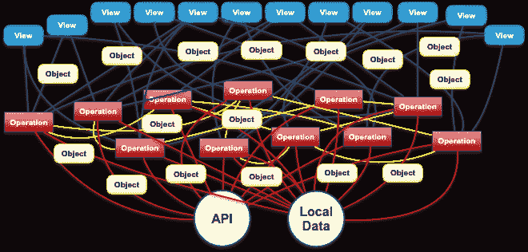

图 6:我们开始的地方

## 第一步:调解人

*   通过拦截对操作和其他对象的直接调用，并把它们分组到一些中介对象中，开始把视图从其他事物中分离出来
*   中介对象还可以在遗留和新实现之间进行部分或全局切换，这些实现将分散在切换之外

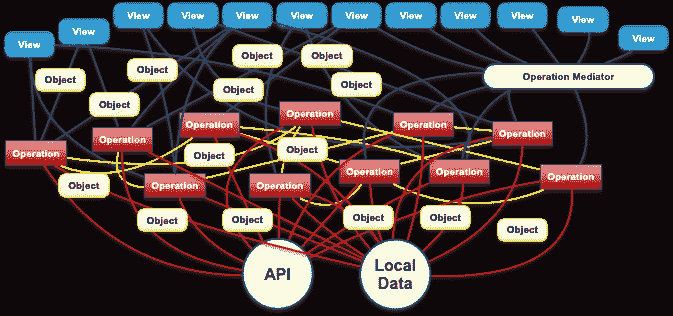

图 7:第一步后

## 第二步:Synk 和 MailSync——芝加哥方式

*   我们首先开发了一个通用框架来同步 URLResponses 和本地持久性存储( **Synk** )
*   然后我们开发一个特定于应用的数据同步层，它包含特定的域模型逻辑，来自后端 API(**MailSync**)
*   MailSync 还被注入了一个本地持久存储模型，从而以一种非常通用的方式使用 Synk
*   虽然这两个组件看起来都很简单，但它们都显示了由内向外方法的最大弱点: ***在项目的下一个阶段，我们不断地需要改变它们，有时会重写数百行代码*** ，包括它们的单元测试，当我们将它与应用程序的其余部分集成，并发现需求不匹配，并删除未使用的代码时
*   这项工作的优点是它与代码库的其余部分分开完成，因此得到了适当的测试覆盖，应用了所有好的 TDD 原则

## 步骤 3:使用 MOA 进行模块化

我们的原则和最终目标过去是，现在仍然是，不仅要分离应用程序的组件，还要彻底改造它，根据我们的 [**面向模块的架构(MOA)**](/module-oriented-architecture-4b54c8976415) 对它进行模块化，这实现了类似于 [**微前端**](https://micro-frontends.org) 的原则，但适用于本机应用程序。

*   横向或纵向模块化整个应用程序是不可能的，也不在项目范围内。
*   我们首先模块化交互层，即数据层，应用程序的更高层访问数据持久性的层
*   我们首先创建了 **MOA 组件和类**，比如 [**模块和服务**](/module-oriented-architecture-part-2-routing-and-modules-2437e6a292e7)

## 第 4 步:将所有内容放在一起:演示者

第一次大规模重构的最后一件大事是提取所有的逻辑:表示、线框、应用程序，放在一组 Presenter 对象中，这些对象至少允许进一步的分解和解耦，并在可能的情况下提供至少一些单元测试覆盖。有两种主持人被创造出来并放在开关后面:

*   **遗留呈现器，**包含连接到遗留对象网格的遗留逻辑的负载
*   **新的展示者**，它混合了现有的逻辑、新的逻辑，尤其是与 MOA 对象的联系

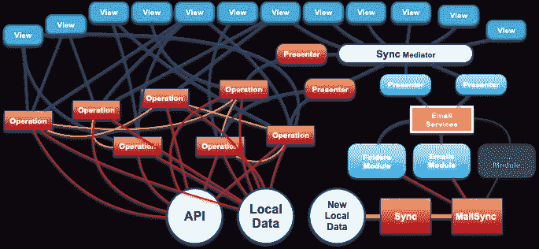

图 8:我们发布了什么？

上图是代码经过多轮重构后的状态:

*   **应用程序的部分内容保持不变**，不属于项目的一部分，其中一些连接到新的中介，一些没有
*   该应用的部分，所有与数据持久性有关的**都获得了新的数据库和全新的数据层**，这也是根据 [**MOA**](/module-oriented-architecture-part-1-coupling-and-decoupling-4443dd7f598a) 模块化的。
*   旧的演示者没有得到特别的新测试覆盖面,因为他们根本不在测试的范围内…
*   新的主持人，因为仍然是一个所有事情的网，得到了一些预期行为的部分行为测试，这是可以测试的。尽管如此，这并没有使它们成为未来无缺陷或可靠的组件。
*   **两位演讲者都被故意写成了短期解决方案**

## 步骤 5:集成和功能测试

正如开始提到的，从数量和可用资源的角度来看，当前 **UI 自动化测试的状态非常糟糕**。我们意识到最终测试和发布将是一个痛苦的过程，因此我们试图通过以下措施来改善这种情况:

*   **完整的回归测试包得到了一个精简版本，叫做发布包**，它包含了大约四分之一的测试用例，但是仍然比简单的**冒烟测试包**大得多
*   **发布包包含了最常见的用户场景**，包括一些边缘情况，但它没有涵盖应用程序中不被认为是关键的部分的所有场景。这是一个艰难但非常必要的权衡
*   **当我们通过 Mediator 连接第一批新的演示者时，我们开始应用发布测试**，这是一个持续数月的过程，直到所有新的计划功能的完全发布和最后的[切换](https://www.youtube.com/watch?v=DWKcJwuZnzE)😉😃
*   我们继续用我们所拥有的稀缺资源添加新的 UI 测试自动化测试
*   **全手工回归测试包在开发分支上执行了两次，开关指向新代码**

## 扩展:UI 测试覆盖率增加

*   我们开发了新的简单的存根注入和截屏技术概念，并组织了一个**为期 3 天的 UI 测试黑客马拉松**，以在最终发布前增加覆盖率，并减轻发布后稳定阶段的手动测试负担
*   这一技术概念的要点不仅是帮助发布本身，而且使先决条件**能够使未来的 UI 测试可靠、可靠、总是同步执行**

## 第六步:释放

最有可能的是，发布本身引发了一个错误高峰，但考虑到我们改变了大约一半的应用程序，这不是一个巨大的错误。

> A ***ll 技术和产品相关目标全部实现！***

## 未来:表示层的模块化

我们已经提供了一个新的，主要的额外持久性的应用程序，模块化的数据层。**下一个合乎逻辑的步骤是根据 MOA** 进一步模块化，以实现以下目标:

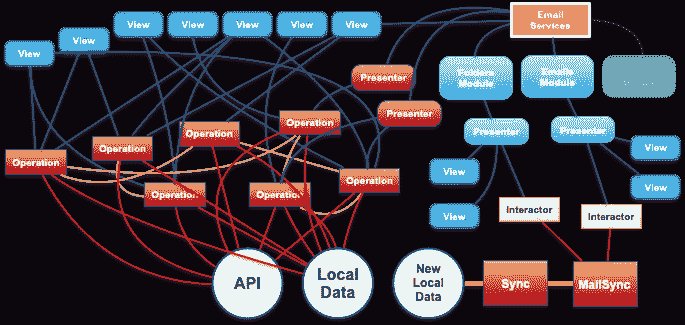

图 9:当前状态

与我们首先交付的内容相比，该模式显示了一些非常重要的差异:

*   一个特定服务(在我们的例子中是电子邮件服务)的所有功能和代码现在都被安全地封装、解耦和隔离在各自的模块中
*   应用程序的其他部分只能通过一个通信点与新部分通信:服务
*   应用程序的其他部分现在与最关键的部分(电子邮件持久性)隔离开来，可以根据相同的 **MOA** 架构、**Divide&convert**和**stranger**原则按照业务和团队的步调进行重构，与最终目标背道而驰:

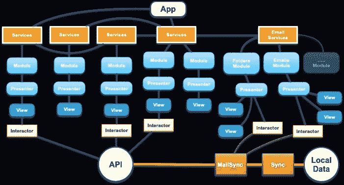

图 10:基于面向模块架构(MOA)的应用程序

> 最终目标是应用程序，高级 UX 流和决策逻辑由服务对象编排，服务对象利用模块处理执行逻辑。这样的应用程序是前所未有的，它收集了关于最重要的技术 KPI 的所有可能的优点，例如

*   可维护性
*   膨胀性
*   可变性和
*   易测性

# 我们的测试策略到底是什么？

后者可以通过下面的图表很容易地理解，其中我们可以看到哪些组件通过哪些测试方法和策略进行了测试:

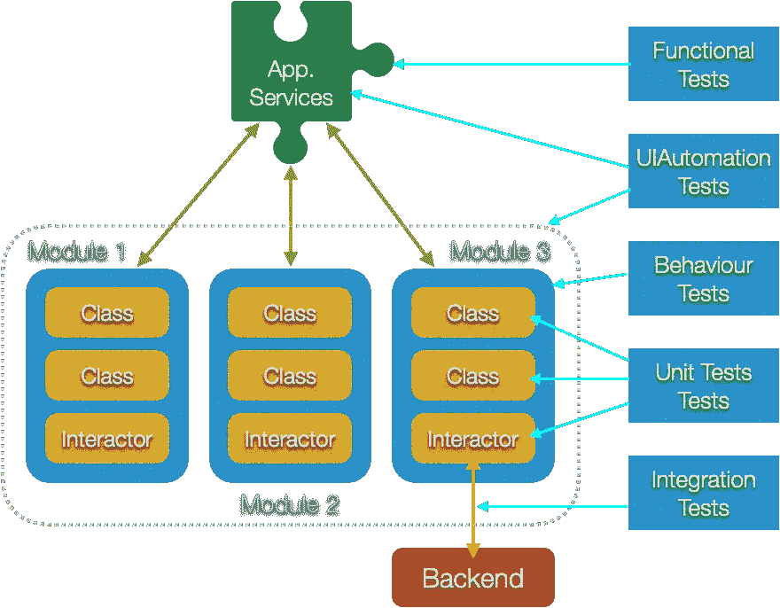

图 11:测试焦点和划分

正如你之前在上面读到的，我们以前的情况几乎是绝望的:我们重写了应用程序的较低层，因此触及了几乎所有的应用程序功能，但所有关键的功能，然而我们的 UI 测试覆盖率低得可笑，这将是我们唯一的安全网，考虑到我们的手动测试资源也非常稀缺。但是，未来看起来是光明的，因为从图片 9 到图片 10 的**将以相同的、可预测的方式为每个确定的用户场景**完成，并在

## **未来第一步:**

1.  **定义**一个或多个(但不要太多)**服务**，它们代表用户场景的 UX 流程中的最高步骤
2.  **编写 UI 自动化测试**(如果还没有的话)来覆盖整个场景，因此包括所有相关的案例
3.  **为带有模拟模块的服务**编写功能测试
4.  **将服务的逻辑拆分成所需模块的定义**它们有各自的输入和输出，基本上通过模块方法定义它们的签名
5.  **为每个模块编写行为测试方法(能力)**我们将实现、模仿和阻止响应，并继续进行
6.  **将现有的演示者放在模块**的后面，可能将他们分成许多部分，使他们的逻辑与模块接口相对应

这第一轮已经创建了相对非常改进的代码库和非常可靠的代码库。预期的用户功能将从用户交互点向下通过几个步骤进行测试:

*   **UI 自动化测试测试场景**
*   **功能测试测试服务实现场景**
*   **行为测试测试实现服务的模块**

如图 11 所示。这已经是一个点了，单用户场景中的重构可能会停止(在大多数情况下可能会停止)，我们将转移到另一个场景。

为什么？因为我们可以！

> **通过测试从 UI 到模块的功能，我们将保证功能正确运行，无论模块内的代码状态如何。我们不要忘记，UI 测试将在 URL 调用点注入 API 存根，这意味着，它们将测试整个客户端开发的堆栈，因此也包括所有单元测试覆盖率低的代码！**
> 
> 因此，未来的第一步将意味着:通过应用程序水平模块化，涵盖所有场景。

## **未来第二步:**

1.  **回到一个特定的模块并重构它的内部**(演示者，交互者)应用标准的 TDD 并交付高代码覆盖率
2.  **创建集成测试**，从而测试**客户端域逻辑**与**企业域逻辑**(后端 API)的兼容性

步骤 2 将实现最后两个重要目标:

*   *****让 app 容易调试，维护到更细粒度的层次，让模块不再是质量保证的黑匣子。*****

**由于许多原因，许多现代策略会建议不要使用步骤 2，但主要是因为单元测试相对于行为测试的成本。然而，我仍然要说，如果没有最低层次的单元测试和 TDD，代码库的质量将会大大降低。尽管如此，仍有许多人会声称这段代码无关紧要，因为它变化如此之快，老实说，由于应用了上述 MOA 和测试策略，这一层的错误很难到达生产环境…**

# **摘要**

## **从外向里还是从内向外？**

**如果我们忽略我们在基本通信和持久层中遇到的特定问题，因此被迫从两方面着手，我的结论非常简单:**

> **这是从外到内，这是伦敦学校。**

> ****唯一的方法，如何正确处理所有的风险，从而定期交付实时应用程序，总是从预期的用户功能(场景)向下，直到你到达应用程序的最后一个组件、最后一个类和最后一个功能。这意味着您的测试策略遵循相同的规则，从 UI 测试开始，一直到单元测试。****

**所有其他想法或策略，不管我们是在谈论绿地还是现有项目。在质量和开发成本方面的风险都在增加，特别是要保持控制，不要写你不需要的东西或者写错。如果你应用了像 **MOA** 这样的好的模块化架构，并且如果你了解你的 API 或者你交付新 API 的能力，你就可以安全地走在伦敦的路上…**