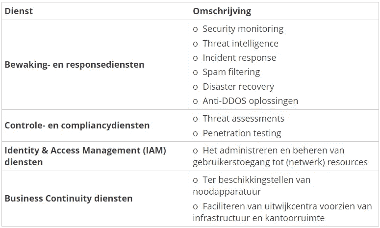
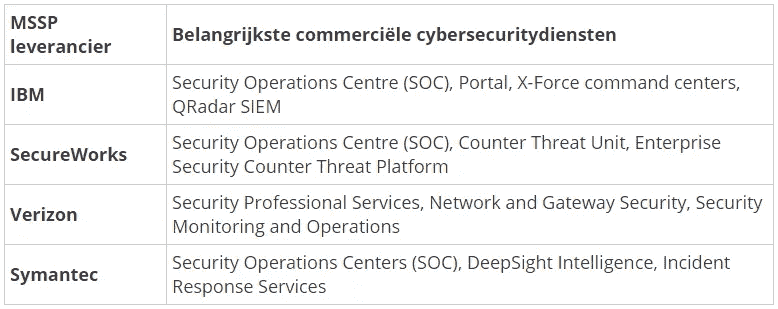
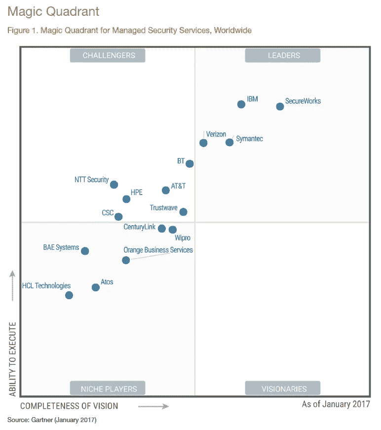

# 网络安全外包

> 原文：<https://itnext.io/outsourcing-van-cybersecurity-f4ad9e20b267?source=collection_archive---------5----------------------->

据估计，在 2019 年，全球[150 万](http://cybersecurityventures.com/jobs/)网络安全路径无法实现。因此，企业越来越多地选择外包网络安全领域，而不是增加新的空缺。这个解决方案是天生的还是天生的？本文试图通过分解利弊来回答这个问题。

# 节/MSSP

网络安全服务通常用两个术语来表示；安全即服务(secaas)和托管安全服务提供商(MSSP)。此类服务的一些示例包括:

# 市场领导者

根据 Gartner 四位市场领导者的“T2”【神奇象限】T3，MSSP 的列表是无限的:

右上方是市场领导者，左边是最重要的挑战者。“小生玩家”框显示尝试进入市场但尚未成功的初创玩家和/或专业玩家。

# 好处是

除了上述针对网络安全专业人员日益短缺的解决方案之外，选择外包网络安全服务还有几个重要原因:

*   **网络安全是一项全天候的活动，**对网络安全事件进行持续的独立监控和预测，对于许多企业来说，会带来内部工作能力的巨大变化。
*   **不断变化的网络犯罪威胁**许多企业都知道最新的网络犯罪威胁是不礼貌的，更不用说建立必要的知识了。借助高级工具(AI)和多年的经验，MSSP 的网络安全风险管理能力远胜于单独的企业。
*   **硬件和软件投资不多**要在自身管理中实施充分的证券化策略，就需要对高级硬件和软件进行结构性实质性投资。

# 缺点是

除了上述优点之外，网路安全套件的委外作业也有一些主要缺点:

*   **不在“控制范围内”**对昂贵和机密业务数据的控制让许多公司非常担心。此外，对 MSSP 的依赖引入了新的风险。
*   **无业务知识:d**mssp 对企业没有深入的业务知识，无法总是很好地估计哪些“王冠珠宝”需要保护。这有时会导致 MSSP 无法正确估计安全事件的严重程度。
*   **这些通用:** MSSP 按照定义提供通用网络安全服务。对于某些组织而言，这些服务并不充分，因此需要定制。
*   **不提供 100%的保证:**网络安全外包不提供 100%的保证，使企业免受网络犯罪事件的影响。风险只能被降低，但不能被消除。

# 你的建议

我们建议你不要在一夜之间就去冰上选一个 MSSP 因为你会选一个好搭档几年。选取时，请注意以下 10 个方面:

1.  查阅参考资料，寻求类似公司的经验。
2.  确保 MSP 服务与企业业务、成长及任何收购计划相关联。
3.  请确保 MSSP 已通过 NIST、SANS 和 ISO 安全框架等行业标准的认证。
4.  选择一家全球性的服务供应商，就能在当地享有全球各地的知识与经验。
5.  遵守明确、严格的保密、隐私和责任条款，并终止任何编辑协议。确保 MSSP 可控制并负责
6.  选择使用“行为和智能”软件的 MSSP。
7.  确定 MSSP 服务的法律和框架。
8.  建立具有专有网络安全知识的联盟，该联盟可以从自己的组织中准确地估计 MSSP 的方向。
9.  选择可扩展服务和成本的 MSP。
10.  不要一次夺走所有必需的外包服务，而要一次夺走一项服务。

# 结论是

相比之下，随着外包服务的减少，企业目前还经常面临着冷战的威胁，[研究](http://www.thepaypers.com/digital-identity-security-online-fraud/global-cybersecurity-spend-to-reach-usd-135-bln-in-2022/768710-26/abstract)预测 2022 年将有 135 亿美元的网络安全支出。大部分(25%)都是由外包完成的。

总而言之，对于中小型企业来说，网络安全领域的外包是一个正确的战略选择。由于缺乏资金和专业知识，这是一个非常重要的捕捉，一个更安全的环境。因此，网络犯罪威胁之间的“老鼠竞赛”已经不再是许多公司的强项。

*原载于*[*www . linkit . nl*](https://www.linkit.nl/knowledge-base/284/Outsourcing_van_cybersecurity)*。*