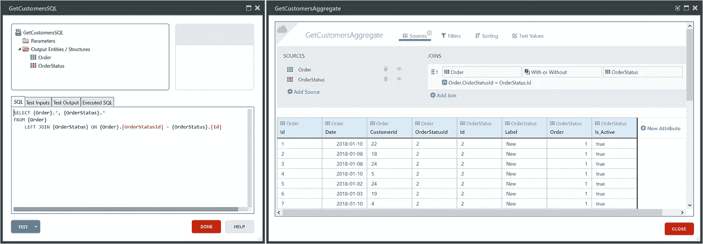
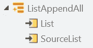
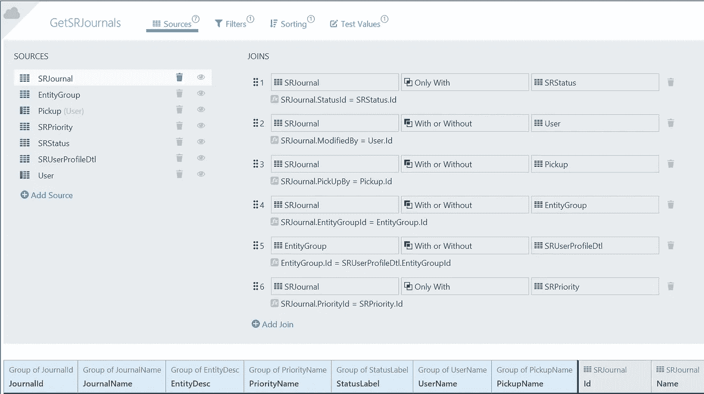
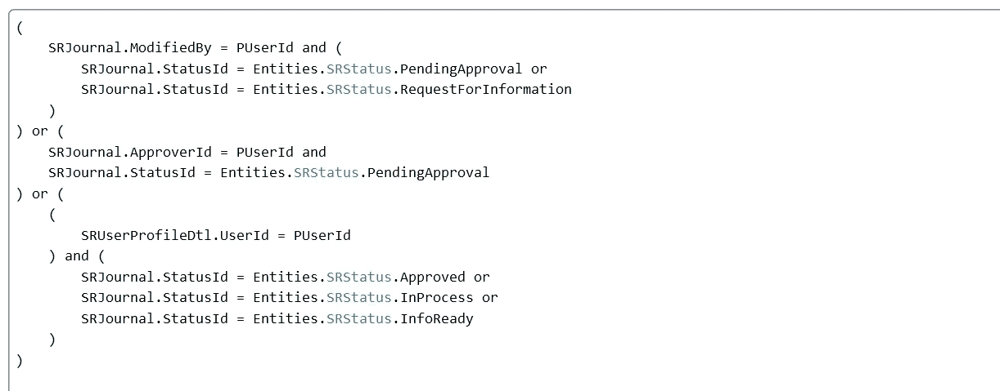

# OutSystems 101:聚合与 SQL 查询

> 原文：<https://itnext.io/outsystems-101-aggregates-vs-sql-queries-ec7223f4c496?source=collection_archive---------0----------------------->

当浏览 [OutSystems 论坛](https://www.outsystems.com/forums/)时，你会看到几个关于同一主题的问题。在本文中，我将描述**如何将一个大的 SQL 查询转换成一个相当简单的集合**。但首先，让我解释一下不同之处。



左:SQL 查询，右:聚合

在 OutSystems 中，有两种方法可以编写一个[查询](https://success.outsystems.com/Documentation/10/Reference/Data/Handling_Data/Queries)，通过聚合或者通过 SQL 查询。

聚合是首选选项，因为它正在被平台优化。当代码中不需要某个属性时，它不会被添加到聚合的输出中。请允许我提醒您，当在服务器操作中使用聚合时，聚合的输出被分配给操作的输出。优化只是将集合的属性与输出结构进行比较，系统不会检查您最终将在屏幕中使用输出结构的哪些属性。

在 SQL 查询中，您必须自己进行这类验证，如果您不是 SQL 专家，这可能会导致性能问题。

[](https://www.linkit.nl/vacatures?search=outsystems&utm_source=itnext&utm_medium=Medium.com&utm_campaign=article_banner)

# 什么时候需要使用聚合查询或 SQL 查询？

**聚合**:当您创建一个选择查询来获取一个列表，并且不需要 SQL 操作符‘IN’、‘EXISTS’、‘ANY’或‘ALL’时。

**SQL 查询**:当你创建一个批量操作或者当你需要一个上面提到的 SQL 操作符时。

有些人会说，UNION 也是不能在聚合中使用的运算符之一，但是仔细想想，UNION 只不过是一种将两个或更多查询的结果组合成一个结果集的方法。



在 OutSystems 中，您可以使用动作[lisappendall](https://success.outsystems.com/Documentation/10/Reference/OutSystems_APIs/System_Actions#ListAppendAll)来组合两个聚合，这使得 UNION 变得过时。

我在论坛上找到的一个例子

以下问题是[在论坛](https://www.outsystems.com/forums/discussion/33581/union-in-aggregate/)上发布的。我将解释将该查询转换为聚合所需的步骤。

```
-- open by me
SELECT
   {SRJournal}.* ,
   {EntityGroup}.[EntityDesc],
   {SRPriority}.[PriorityName],
   {SRStatus}.[Label],
   {User}.[Name],
   Pickup.[Name]
FROM {SRJournal}
   inner join {SRStatus} on {SRStatus}.[Id]={SRJournal}.[StatusId] and {SRStatus}.[Label] in (‘Pending Approval’,’Request For Info’)
   inner join {User} on {User}.[Id]={SRJournal}.[ModifiedBy]
   inner join {User} Pickup on Pickup.[Id]={SRJournal}.[PickUpBy]
   inner join {EntityGroup} on {EntityGroup}.[Id]={SRJournal}.[EntityGroupId]
   inner join {SRPriority} on {SRPriority}.[Id]={SRJournal}.[PriorityId]
where
   {SRJournal}.[ModifiedBy]=@PUserIdunion
-- Pending my approval
SELECT 
   {SRJournal}.* ,
   {EntityGroup}.[EntityDesc],
   {SRPriority}.[PriorityName],
   {SRStatus}.[Label],
   {User}.[Name],
   Pickup.[Name]
FROM {SRJournal}
   inner join {SRStatus} on {SRStatus}.[Id]={SRJournal}.[StatusId]
and {SRStatus}.[Label] in (‘Pending Approval’)
   inner join {User} on {User}.[Id]={SRJournal}.[ModifiedBy]
   inner join {User} Pickup on Pickup.[Id]={SRJournal}.[PickUpBy]
   inner join {EntityGroup} on {EntityGroup}.[Id]={SRJournal}.[EntityGroupId]
   inner join {SRPriority} on {SRPriority}.[Id]={SRJournal}.[PriorityId]
where
   {SRJournal}.[ApproverId]=@PUserIdunion
-- pending for my process
SELECT
   {SRJournal}.* ,
   {EntityGroup}.[EntityDesc],
   {SRPriority}.[PriorityName],
   {SRStatus}.[Label],
   {User}.[Name],
   Pickup.[Name]
from {SRJournal}
   inner join {SRStatus} on {SRStatus}.[Id]={SRJournal}.[StatusId]
and {SRStatus}.[Label] in (‘Approved’,’In Process’,’Info Ready’)
   inner join {User} on {User}.[Id]={SRJournal}.[ModifiedBy]
   inner join {User} Pickup on Pickup.[Id]={SRJournal}.[PickUpBy]
   inner join {SRPriority} on {SRPriority}.[Id]={SRJournal}.[PriorityId]
   inner join {EntityGroup} on {EntityGroup}.[Id]={SRJournal}.[EntityGroupId]
where
   {SRJournal}.[EntityGroupId] in (
      select {SRUserProfileDtl}.[EntityGroupId]
      from {SRUserProfileDtl} 
      where {SRUserProfileDtl}.[UserId]=@PUserId
   )
```

我看到的第一个问题是使用了注释`-- comment`而不是`/* comment */`。在这种情况下，问题是 OutSystems 将查询转换成一行代码，这将当前使用的注释转换成一个完整的注释查询，而不是三个标识不同查询的小注释。此问题仅在编译后发生，测试查询功能将只返回结果集。

第二个问题是这个查询很容易被清理和重写，因为这三个查询几乎是相似的。

第三个问题是“IN”运算符。在这种情况下，可以使用“or”运算符将运算符从查询中删除。

我看到的第四个问题是`{SRStatus}.[Label]`与硬编码的值相匹配。需要将其更改为`{SRJournal}.[StatusId]`，并且应该与静态实体 SRStatus 中的标识符相匹配。

第五个阻碍查询转换为聚合的问题是`IN (SELECT x.y FROM x WHERE x.y = z)`。最后一个问题可以通过将`{SRUserProfileDtl}`添加到连接列表中，并将“GROUP BY”操作符添加到“SELECT”中的所有列来解决。由于`{SRUserProfileDtl}`上的“左连接”操作符，这样可以避免添加重复项。

解决这些问题后，查询将变成:

```
SELECT 
 {SRJournal}.* ,
 {EntityGroup}.[EntityDesc],
 {SRPriority}.[PriorityName],
 {SRStatus}.[Label],
 {User}.[Name],
 Pickup.[Name]FROM {SRJournal}
 INNER JOIN {SRStatus} ON {SRStatus}.[Id] = {SRJournal}.[StatusId]
 INNER JOIN {User} ON {User}.[Id] = {SRJournal}.[ModifiedBy]
 INNER JOIN {User} Pickup ON Pickup.[Id] = {SRJournal}.[PickUpBy]
 INNER JOIN {EntityGroup} ON {EntityGroup}.[Id] = {SRJournal}.[EntityGroupId]
 INNER JOIN {SRPriority} ON {SRPriority}.[Id] = {SRJournal}.[PriorityId]
 LEFT JOIN {SRUserProfileDtl} ON {SRUserProfileDtl}.[EntityGroupId] = {EntityGroup}.[Id]
WHERE 
(
 /* OPEN BY ME */
 {SRJournal}.[ModifiedBy] = @PUserId AND (
  {SRJournal}.[StatusId] = @PendingApprovalId OR 
  {SRJournal}.[StatusId] = @RequestForInformationId
 )
) OR (
 /* PENDING MY APPROVAL */
 {SRJournal}.[ApproverId] = @PUserId AND 
 {SRJournal}.[StatusId] = @PendingApprovalId
) OR (
 /* PENDING FOR MY PROCESS */
 (
  {SRUserProfileDtl}.[UserId] = @PUserId
 ) AND (
  {SRJournal}.[StatusId] = @ApprovedId OR 
  {SRJournal}.[StatusId] = @InProcessId OR 
  {SRJournal}.[StatusId] = @InfoReadyId
 )
)
GROUP BY
 {SRJournal}.* ,
 {EntityGroup}.[EntityDesc],
 {SRPriority}.[PriorityName],
 {SRStatus}.[Label],
 {User}.[Name],
 Pickup.[Name]
```

既然已经清理并重写了查询，那么将 SQL 查询转换成聚合就容易多了。

聚合将类似于以下内容:



“源”标签



筛选器选项卡表达式

我希望这个简短的解释有助于系统开发人员更经常地使用集合。