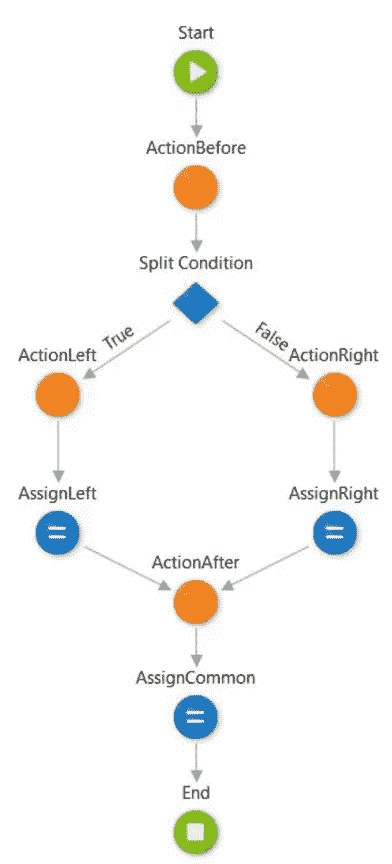
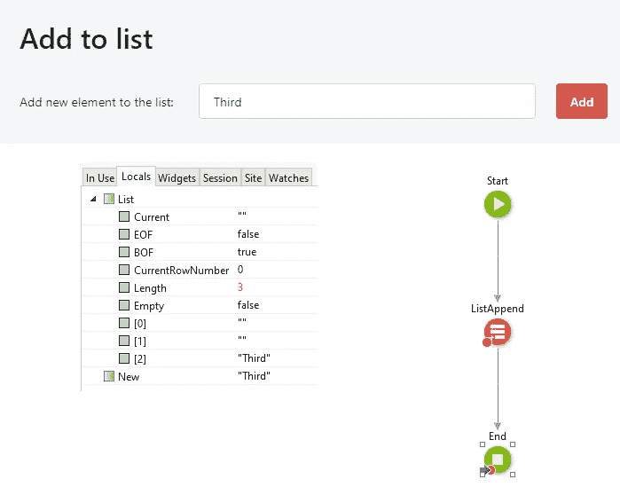
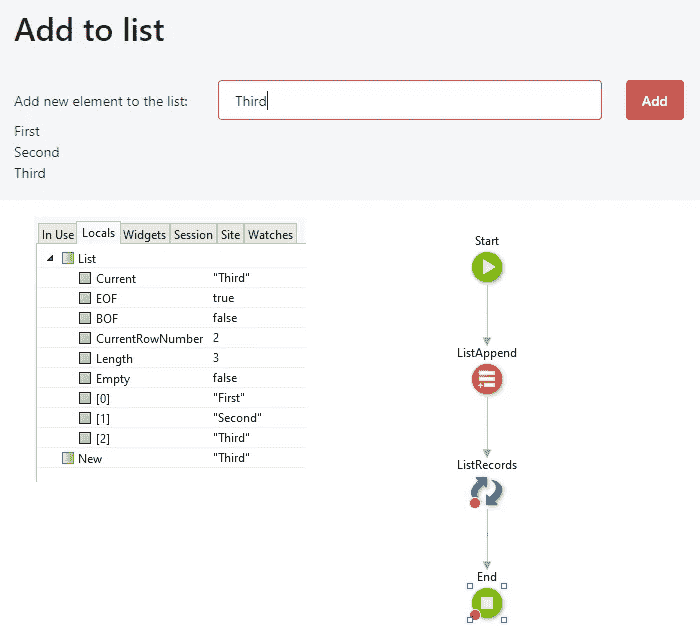
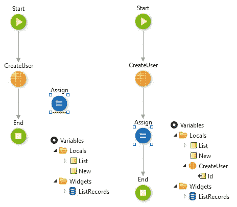
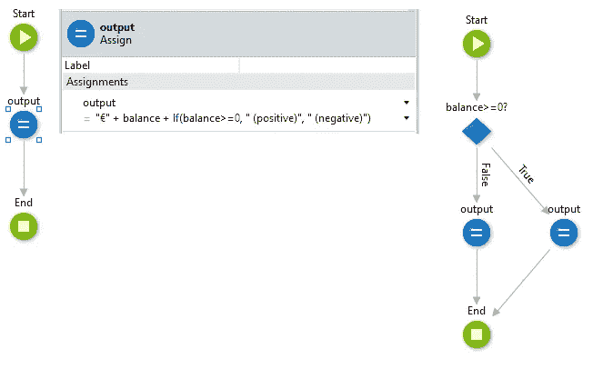

# OutSystems 101:分流！

> 原文：<https://itnext.io/outsystems-101-splitting-the-flow-c2a0afb0e60f?source=collection_archive---------4----------------------->

# 你觉得这种流动奇怪吗？

当人们在这个令人敬畏的外部系统世界中迈出第一步时，一个常见的情况是试图使用超出范围的数据。

在这篇文章中，我们将探讨一些你可能得不到你想要的结果的情况！

# #1 分离和聚合

你可以看到这种情况的一个例子，如左图所示。

如果所有可能的路线都从*起始节点*开始，那么它们都需要经过之前的*动作。该操作的输出将在整个流程中可用。*

但是如果你试图使用 *ActionLeft* 或 *ActionRight* 节点的输出，在流汇聚到 *ActionAfter* 之后，你将无法使用它。原因很简单:我们不知道这些数据是否可用。

如果你来自左分支，然后在 *AssignCommon* 中你有" *var = ActionRight。Out* "，assign 试图获取一个可能为空的值，我们不希望在我们的操作中出现类似的模糊情况。

在*准备*时牢记这一点尤为重要。如果您拆分*准备*流程，在那里添加一个 *SQL 查询*或一个*聚合*，然后尝试在一个小部件上使用该数据源，两者都可用，但是结果可能再次为空。

# #2 不使用数据进行调试

我们试图使用 *ListAppend* 来填充一个列表，但是使用 *debug，*我们看到列表前面的元素被设置为默认值，只有最后一个被保留。

其实一切都很好。如果这个*列表变量*没有在任何地方被使用，那么*调试器*不需要担心这些数据。这叫做**优化**。在像 OutSystems 这样庞大的平台中，it 需要了解哪些数据是重要的，需要在哪些数据上花费资源。

不要被*调试器*:)欺骗

# #3 外部流程->外部范围

如果节点不在流的特定位置，您可能找不到一些可用的数据。

在本例中，如果*分配*节点不在*创建用户*之后，您将无法访问它的输出。

确保首先将节点放在正确的位置！

# #4 不要害羞

害羞流是隐藏逻辑的流。

一个*赋值*应该只做一件事，结果可能是一样的，但是你的*动作*会更容易读懂！

有很多原因让你得到你想要的不同结果。保持冷静，调试，不要害怕重做一些东西。

不要害怕使用 Outsystems 社区页面中的论坛。在那里你可能会得到一个 ITUp 的 MVP 的回复，我们有四个:)

## 这篇文章最初发表在 ITUp 的博客上。

*来源:*

【T2*https://www . out systems . com/learn/lesson/1829/logic-and-exception-handling*

[*https://journal . highland solutions . com/tips-and-tricks-for-out systems-documentation-422 c51c 87159*](https://journal.highlandsolutions.com/tips-and-tricks-for-outsystems-documentation-422c51c87159)