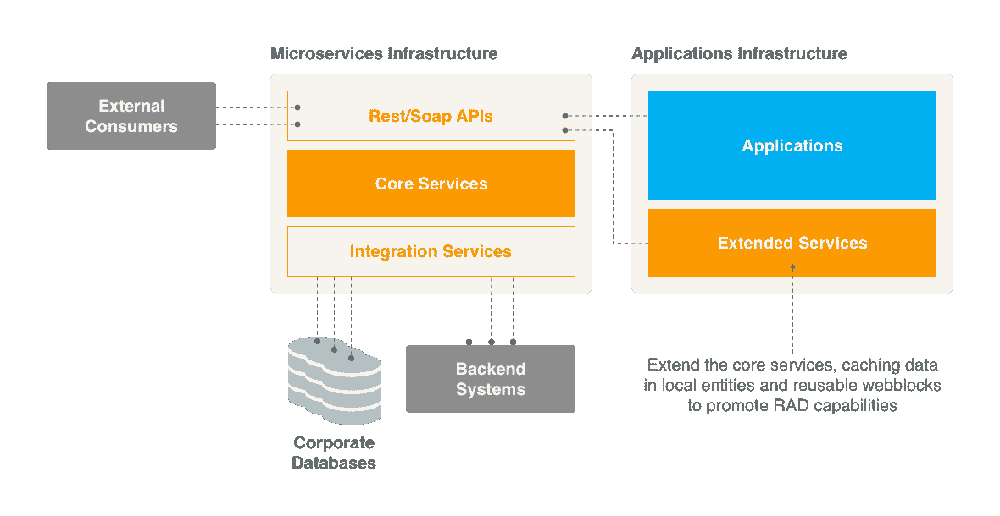
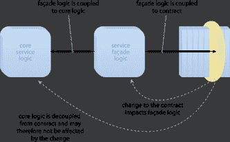
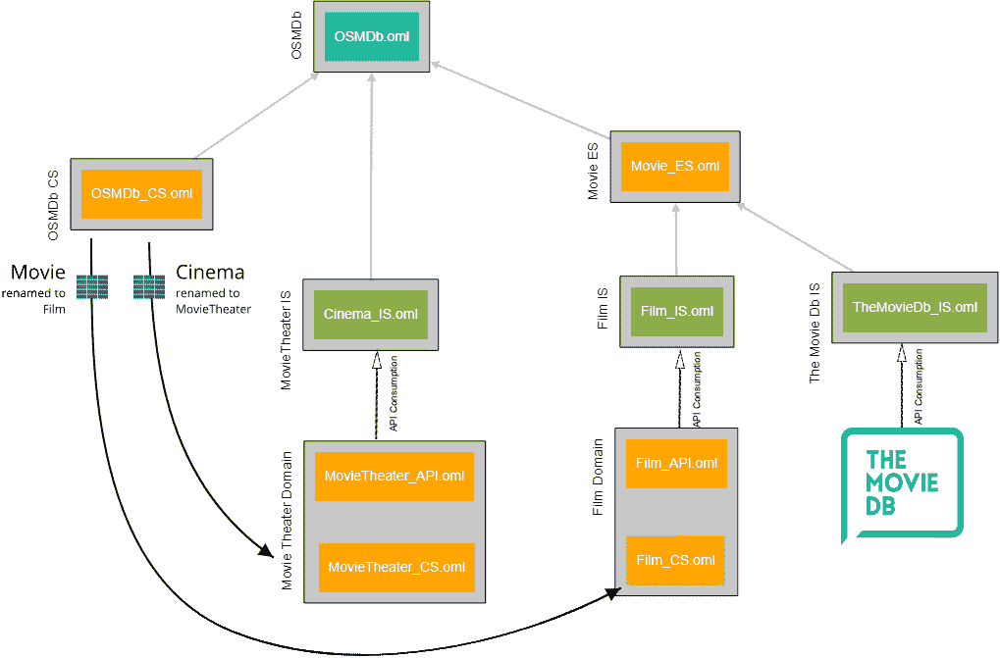
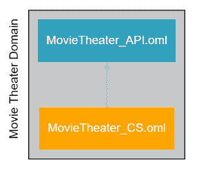
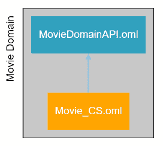
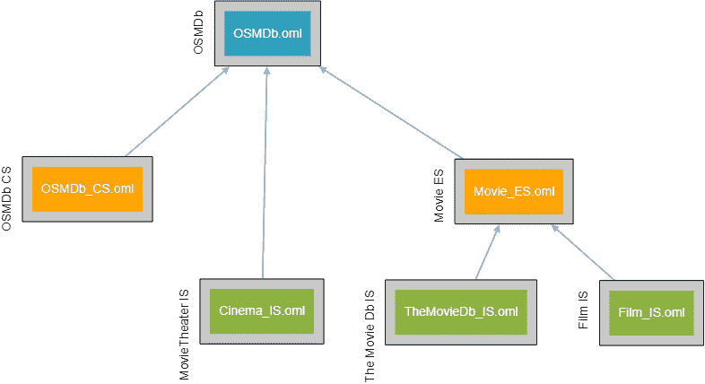
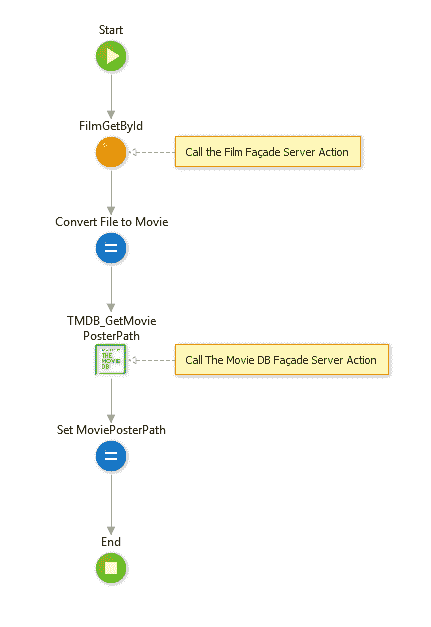
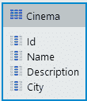
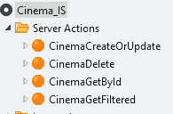
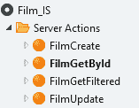

# 实践中的外部系统和微服务

> 原文：<https://itnext.io/outsystems-and-microservices-in-practice-9b8038e58cb4?source=collection_archive---------2----------------------->

保罗·施密德斯摄影

*如何在复杂环境中创建松耦合架构*

# 介绍

当参与一个大型外部系统项目来替换一个具有数百(300+)空间和许多扩展以与数百个表集成的定制构建 ERP 类系统时，您必须以这样一种方式组织您的架构，以使更改库模块(空间或扩展)的影响最小化。接下来应用 [4 层画布](https://success.outsystems.com/Support/Enterprise_Customers/Maintenance_and_Operations/Designing_the_architecture_of_your_OutSystems_applications/01_The_4_Layer_Canvas)并在每层的功能组件中分组模块，可以应用微服务架构。

在微服务架构中，终端用户应用程序(前端)与集成服务(后端)松散耦合，集成服务提供与企业数据库和外部服务的集成。这种松散耦合最小化了后端变化的影响。

本文通过一个例子详细阐述了服务架构。讨论了使用扩展和服务来集成系统，以及微服务架构的利与弊。

# 体系结构

微服务架构由两个基础设施组成，一个是通过 rest API 公开企业功能的**微服务基础设施**，另一个是提供使用 rest API 的终端用户应用的**应用基础设施**。

# 微服务基础设施

## 外部 API 级别

这一层是向外部消费者公开服务的 API 的组合。

它仅仅是在**核心服务层**实现的真实服务的技术包装。这个层次将这些服务翻译成提供给外部系统的 API

## 核心服务水平

这一层实现服务，包括所有的业务规则和核心实体

## 集成服务

Integration services 使用扩展或消费 API 连接到后端系统和企业数据库。

# 应用基础设施

## 应用程序或最终用户层

外部系统应用程序使用由核心和库服务层提供的服务和 web 块。

## 扩展服务

扩展核心服务，在本地实体和可重用 Web 块中缓存数据，以提升 RAD 功能。

## 集成服务

这是我添加到模型中的一个额外的层，由扩展服务使用。它使用微服务或外部系统提供的 API，并提供外观服务器动作。使用外观可以确保外观服务器动作的消费者独立于所消费的服务契约。从而降低版本升级或切换到全新服务的影响。

## 服务立面

服务外观将核心服务逻辑从服务契约中分离出来，从而实现松散耦合。外观组件的引入引入了设计工作和性能开销。

# OSMDb 示例

对于这个例子，我们修改了 OutSystems 电影数据库应用程序来实现这个架构。

*   Cinema 实体从 OSMDb 核心中移除，并由单独的 movie heater 核心层(MovieTheater _ CS)中的 movie heater 实体代替
*   电影实体被重命名为 Film，并被移动到 Film_CS 中，由 Film_API 公开
*   对 TheMovieDb api 的使用被移动到 TheMovieDb_IS 空间。
*   应用程序被重构以实现微服务架构

这些修改的目标是说明如何通过将核心层和集成服务层从前端层中分离出来来创建一个松散耦合的架构。从而最小化对这些较低层的改变的影响。

下图显示了由此产生的应用前景，我们将在接下来的部分中进行描述。

# 电影院领域

## 电影水 API

MovieTheater API 定义了契约，并公开了 MovieTheater _ CS 的服务。这确保了与核心服务的实现细节的分离。

*   MovieTheater _ API 提供电影院 crud 服务
*   创建—创建电影票房记录
*   删除—删除具有给定 id 的电影院。
*   GetById —按 Id 返回电影的结尾
*   GetFiltered —返回符合搜索关键字的电影标题列表，包括名称、描述或城市
*   更新—更新电影票房记录

# 电影领域

## MovieDomainAPI

MovieDomain API 定义了契约，并公开了 Movie_CS 的服务。这确保了与核心服务的实现细节的分离。

*   提供电影院 crud 服务的 MovieDomain API
*   创建—创建电影记录
*   删除—删除具有给定 id 的电影。
*   GetById —按 Id 返回电影
*   GetFiltered —返回符合过滤条件的电影列表
*   更新—更新电影记录

# OSMDb 域

## OSMDb

外部系统电影数据库应用程序。参见[开发外部系统网络应用](https://www.outsystems.com/learn/courses/15/developing-outsystems-web-applications/)练习，了解应用概述。

对于这个版本，电影院和电影实体没有被缓存。因此，所有电影院和电影集合都被相应的服务器动作所取代。缺点是我们失去了分页和列排序。这可以通过在 API 中添加分页和自定义排序来解决。然而，大多数用例不需要分页，只需要更精确的搜索动作。

## OSMDB_CS

这是没有电影院实体的原始 OSMDb 核心服务层。

## 电影 _ES

电影扩展服务结合了电影域 API 和 MovieDb API 的结果。

## 实体

*   电影

电影实体以只读方式公开，并用作虚拟实体。此实体中不保存任何数据。通过使用实体而不是结构，我们能够添加缓存机制。当应用缓存时，我们还可以从平台的查询优化中受益。缓存机制将在以后的文章中详细阐述。

## 服务器操作

*   MovieCreateOrUpdate
*   电影删除
*   MovieGetById
*   电影过滤

例如，MovieGetById 服务器操作调用 FimlGetById 和 TMDB _ getmoviepostpath 外观操作来提供增强的电影记录。

## 电影院 _ 是

使用 OSMDb 公司数据模型 Cinema 结构消费 MovieTheater _ APIs 并公开门面服务器操作。

## 实体

## 服务器操作

*   CinemaCreateOrUpdate
*   影院删除
*   CinemaGetById
*   电影过滤

## 电影 _ 是

使用 Film_API 服务并公开外观服务器动作

## 结构

CDM _ Film 独立于 API 结构的规范化结构

## 服务器操作

*   电影创作
*   FilmGetById
*   FilmGetFiltered
*   电影更新

## 电影 _ 是

使用 MovieDB API 并公开外观服务器操作。

*   TMDB _ getmoviepostpath—调用电影数据库 rest api 并返回检索到的电影海报路径

# 优点和缺点

应用微服务架构有利有弊，在决定是否实施该架构时，应该正确权衡利弊。在接下来的部分，我将列出优点和缺点。

## 优势

*   通过松散耦合减少变化的影响
*   独立于数据源的规范化数据定义
*   来自扩展或消费的 api 的外部数据定义隐藏在外观服务中。
*   通过服务版本控制逐步实现变更
*   支持从企业数据库到外部系统本机数据库的迁移
*   当使用规范化实体而不是结构时，可以应用缓存和同步模式。参见关于[核心服务抽象](https://success.outsystems.com/Support/Enterprise_Customers/Maintenance_and_Operations/Designing_the_architecture_of_your_OutSystems_applications/05_Service_architecture_patterns/01_Core_Service_abstraction)的文章，了解模式的描述。

## 不足之处

*   更多开发工作
*   调用 rest 服务而不是直接调用可能会降低性能。
*   使用结构时，脚手架等加速器的损耗
*   使用规范化实体时，必须实现同步模式