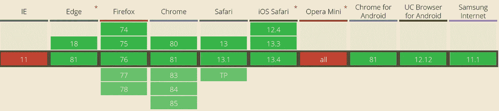
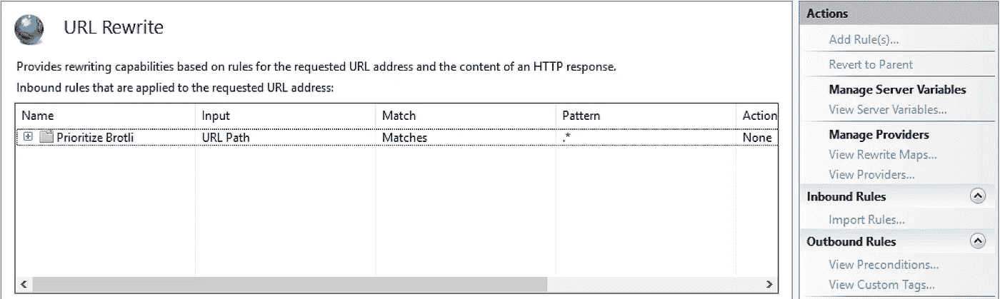
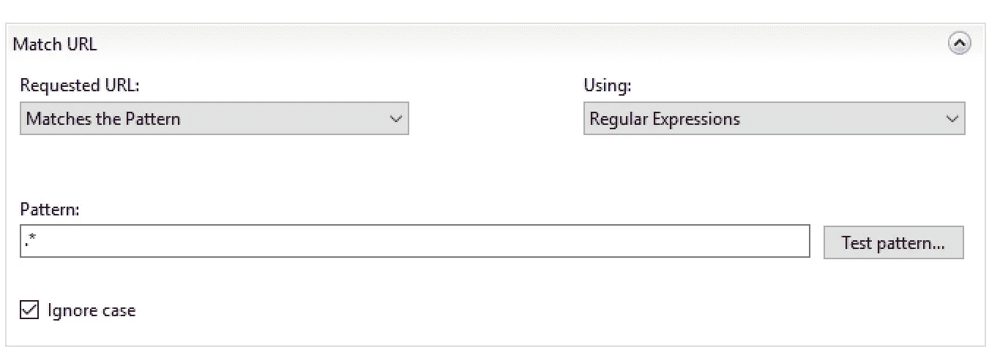
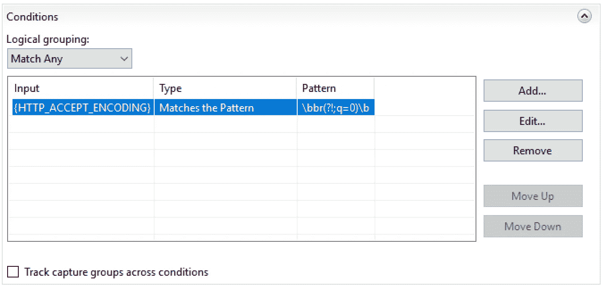
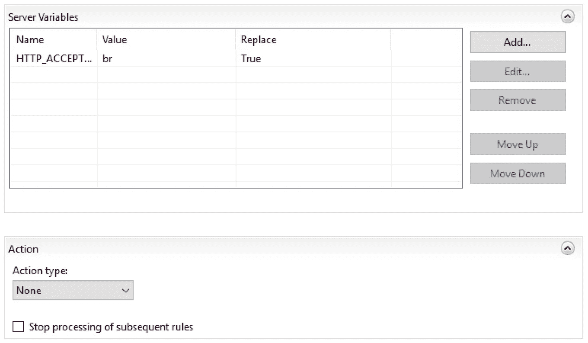
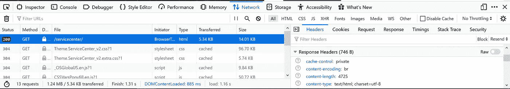
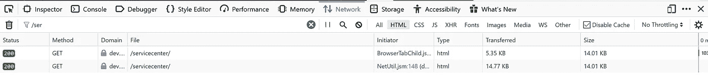

# OutSystems，Brotli 和你

> 原文：<https://itnext.io/outsystems-brotli-and-you-5da3c17db134?source=collection_archive---------6----------------------->

不管目标人群、平台或预期用途如何，应用程序的性能始终是开发时的一个重要因素。从开发和基础设施的角度来看，有许多关于如何提高应用程序性能的有用指南(查看系统[论坛](https://www.outsystems.com/forums/)和[最佳实践](https://success.outsystems.com/Documentation/Best_Practices))。

在前端仍然可以采取一些措施来提高应用程序的性能，并确保为您的用户提供一个一致而稳定的工作环境。进一步提高应用程序性能的一种方法是压缩。

## **CMPRSSN 又名压缩**

压缩——像挤压一样在尺寸、数量或体积上减少。拉上拉链。rar 文件。事实上，压缩文件和数据就在我们身边；即使在浏览网页时，你也会遇到压缩数据。

在整篇文章中，除非明确说明，否则术语数据和文件可以互换使用。

虽然压缩可以应用于应用程序的各个方面，但我们将重点关注 web 文件的压缩，例如 HTML、JS、ASPX 等。在 web 服务器上压缩这些文件减少了服务器和客户端之间的网络流量，从而减少了页面被传送到客户端浏览器时的加载时间。

然而，你可能想知道警告在哪里。答案是压缩文件需要计算资源，在客户端解压缩文件也需要计算资源。在本文的后面，我们将深入探讨这一点以及其他需要考虑的可能的不利因素。

## 布罗特利

" [Brotli](https://github.com/google/brotli) "是谷歌在 2013 年左右开发的一种压缩算法，目的是减少 WOFF2 的大小，woff 2 是一种网络字体。如今，它可以用于几乎所有的文件格式。与其他最常用的标准(如 gzip 和 deflate)相比，它在压缩方面更高效，同时还保持了高性能。

它是在麻省理工学院许可下免费提供的。因此，有许多不同语言的变体/实现。此外，它在 [RFC-7932](https://tools.ietf.org/html/rfc7932') 中被正式标准化，从那以后，它被除了 Internet Explorer 之外的所有现代浏览器广泛采用。
这也包括对移动浏览器的支持。



来自:[caniuse.com](https://caniuse.com/#search=brotli)

## **基础设施设置**

我们的测试设置是一个运行在 Windows 2016 和 IIS 10 版本 1607 上的标准内部 OutSystems 平台；描述如何实现这一点的步骤对于 IIS 10 版本 1709 是相同的，但是对于版本 1809 是不同的。对于刚开始使用外部系统的公司来说，这是一个相当现实的设置。
注意，这对于大型/企业环境来说有点不现实，因为我们的设置不包含多个前端和负载平衡。

## 我们如何测试

我们将通过访问各个页面/应用程序(包括外部系统服务中心页面)收集数据，然后通过浏览器开发人员控制台(默认为 F12)检查传输文件的大小。应该考虑到文件将被缓存，为了避免这一点，我们将强制重新加载没有缓存的内容。以及需要满足的其他变量，例如命中频率、最小尺寸等。这决定了它是否被压缩，如果被压缩，如何被压缩。

## 先决条件

在我们的安装中，我们使用了微软的实现，可以在这里找到[和](https://docs.microsoft.com/en-us/iis/extensions/iis-compression/iis-compression-overview)。

在这个网站上，您可以下载 IIS 在您的 IIS 服务器上支持 brotli 所需的模块。它还包括一个更新版本的 iiszlib.dll，比 IIS 标准安装中包含的版本更有效地使用 CPU。

除了那个模块，你需要下载 URLrewrite 模块，可以在[这里](https://docs.microsoft.com/en-us/iis/extensions/url-rewrite-module/using-the-url-rewrite-module)找到。这是确保所有请求都得到正确处理的关键部分。

## 实施步骤

下载上述两个模块后，安装它们就相当简单了。这可能会导致一些小的停机时间，因为您需要暂时停止 WAS 和 W3SVC 服务。
然而，如果有任何停机时间，那也是最小的，因为安装相当快。

为了确保 brotli 的充分使用，请使用 URLrewrite 模块创建一个新的重写规则。虽然该规则显示在微软网站上，但如何实现它并不明显。因此，我们将为您提供两种方法:
**1 —通过 IIS 管理控制台中的 GUI 进行配置**



IIS ->站点->默认网站(如果重命名，则使用该名称)-> URL 重写

首先，您需要创建一个新的服务器变量，这可以通过单击 view server variables 来完成。然后并给它命名:
“HTTP _ ACCEPT _ ENCODING”

然后返回并选择添加规则，并在入站选项下选择名为空白规则的选项。
并输入一个可区分的名称和以下信息:



这意味着规则适用于每个网址。



这确保了检查 HTTP_ACCEPT_ENCODING 头中的“br ”,并去掉其余部分。



该部分确保在可用时使用“br”。

**2 —直接通过 applicationhost.config 文件** 实现 applicationhost.config 文件位于`%windir%\system32\inetsrv\config`中，可以达到与选项 1 步骤相同的效果。它还可以用来检查您是否在上面的步骤中通过 GUI 正确配置了它。

为了达到效果/检查您是否正确地完成了选项 1，请参考以下内容。

```
<rewrite>
<allowedServerVariables>
<add name="HTTP_ACCEPT_ENCODING" />
</allowedServerVariables>
<rules>
<rule name="Prioritize Brotli">
<match url=".*" />
<conditions>
<add input="{HTTP_ACCEPT_ENCODING}" pattern="\bbr(?!;q=0)\b" /></conditions>
<serverVariables>
<set name="HTTP_ACCEPT_ENCODING" value="br" /></serverVariables>
</rule>
</rules>
</rewrite>
```

> 来源:[https://docs . Microsoft . com/en-us/IIS/extensions/IIS-compression/using-IIS-compression](https://docs.microsoft.com/en-us/iis/extensions/iis-compression/using-iis-compression)

上面显示的数值应输入/显示在“<urlcompression dostaticcompression="”true”" dodynamiccompression="”true”">”下方和“”上方</urlcompression>

遵循这两个步骤中的任何一个都将允许 brotli 与任何支持的浏览器一起工作。然而，如果浏览器不支持 brotli，它将在“accept_encoding”头中具有值 gzip、deflate，并且仍然能够通过这些方法加载页面。但是，如果您不想立即切换到 brotli 来处理每个网页或所有请求，该怎么办呢？好吧，看下一部分就知道了。

## 测试和结果

要验证一切正常工作，或者测量启用 brotli 对浏览器和服务器性能的影响，请在安装 IIS 压缩组件后使用以下技巧。

只需使用浏览器导航至您想要测试的页面，例如服务中心。访问开发工具(F12)，请注意，对于 chrome，这需要一个单独的插件。这里有一个示例插件

打开控制台，选择网络选项卡并转到任何页面。选择第一个请求，向下滚动到请求标题，您会看到浏览器支持:gzip、deflate 和 br


浏览器通过 accept-encoding 头告诉服务器它可以接受 gzip、deflate 和 br(otli)

如果您再次向上滚动，可以看到服务器使用 brotli 发送了它的响应。



内容编码 br 表示服务器使用 brotli 提供其内容

但是，假设您只是安装了 IIS 压缩模块，并且没有制定重写规则，您可以使用右侧的重新发送按钮来编辑您的请求头，以删除 gzip/deflate，从而强制使用 brotli。如果您正确安装了模块，您将得到一个响应，内容编码字段显示 br。
如果你喜欢通过外部工具检查，你可以使用[这个](https://tools.keycdn.com/brotli-test)

所以你可能想知道我如何能看到它是否有效。
一种方法是手动比较“已转移”栏中的值



这是对同一个页面(servicecenter 登录页面)的两个请求，第一个用 brotli 压缩发送，第二个用 gzip 发送。
这两个请求都没有任何缓存。但是如您所见，brotli 请求的大小比使用 gzip 发出的请求小 64%。
发起方不同，因为第一个请求是通过直接浏览页面，第二个请求是在编辑响应后从控制台启动的。

节省 9kb 听起来可能不多，但这只是一个例子。一个 web 应用程序包含许多页面。不仅仅是 HTML 文件可以被压缩。如前所述，默认情况下会压缩多种文件类型。但是，您可以通过检查 applicationhost.config 文件中的“compressiondirectory”部分来调整要压缩的文件类型。在那里你会发现两个部分，一个叫做“dynamicTypes ”,另一个叫做“staticTypes”。这些部分决定了什么文件类型将被压缩。不要对图像启用压缩，因为它们通常是压缩的。压缩图像会对交付图像的质量和大小产生负面影响。

对 brotli 的采用及其通过 [akamai](https://blogs.akamai.com/2016/02/understanding-brotlis-potential.html) 实现的节约进行的大规模测试表明，与 gzip 相比，brotli 实现的平均节约如下:

*   21%用于 HTML 文件
*   CSS 文件为 17%
*   JavaScript 文件为 14%

这也是需要记住的事情。较重的页面比较小的页面受益更多。这不是对每个问题的快速修复，而是增加页面加载速度的一个因素。作为不错的奖励。

## 陷阱

最大的实际问题是使用负载平衡或 CDN 来提供对内容的访问，因为它们中的大多数不支持 brotli。因此，将使用 gzip/deflate 传递流量，这将取消服务器上所做的任何更改。
然而，随着采用率的提高，预计对 brotli 的支持也会增加，这并非不合理

此外，在外部系统 PAAS 上安装 rewritemodule 和压缩模块可能是不可能的，因为您对在这些环境上运行的 IIS 的控制是有限的。

如上所述，最大的缺点是 CPU 利用率的增加。简单地说这是一个给定的，是一个特定的%的增长，这太宽泛了。

事实是，gzip 和 brotli 都使用了一种在更高压缩和更多 cpu 密集型之间进行权衡的尺度。和较低的压缩率，但 cpu 占用率较低。Gzip 有 9 个这样的级别，而 brotli 有 11 个，在这两种情况下，数字越大，对压缩的关注就越大，因此占用的 cpu 就越多。默认情况下，gzip 运行在 6 级，brotli 运行在 11 级！这意味着，开箱即用，brotli 非常严格地关注压缩，因此是 cpu 密集型的。但是，通过调整这个值，可以比默认设置下的 gzip 压缩得更好，cpu 效率更高。从而消除了 brotli 总是比 gzip 更消耗 CPU 的神话。找到适合你情况的最佳设置需要实验。

## 结论

传输数据的节省因基础设施的设置和配置而异。在某些情况下，节省很少。第一次设置可能需要一些时间。然而，一旦你发现哪些设置最适合你的需要，你就可以重用它们。因此，在第一次安装后，安装时间是最少的，您将继续从中受益，因为它不需要特殊的维护。许多移动用户，如那些无法访问高速互联网或仍然面临数据上限的用户，将从传输更多压缩文件中受益最多。因为您将能够提供更多的页面，从而提高客户满意度。通常情况下，加载与使用 brotli 相关的页面也会有明显的速度差异。

如果你想从一些了不起的人那里了解更多关于 OutSystems 的知识，一定要看看我们的 OutSystems month，来一次虚拟旅行。https://www.linkit.nl/en/events/virtual-roadtrip-OutSystems
T2