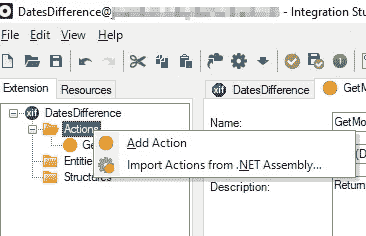
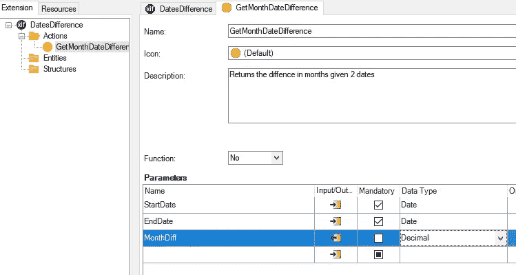
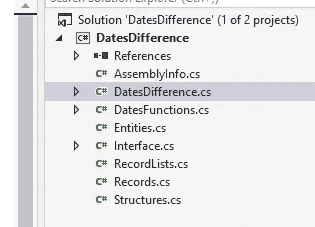
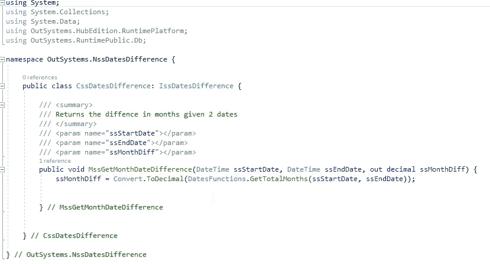
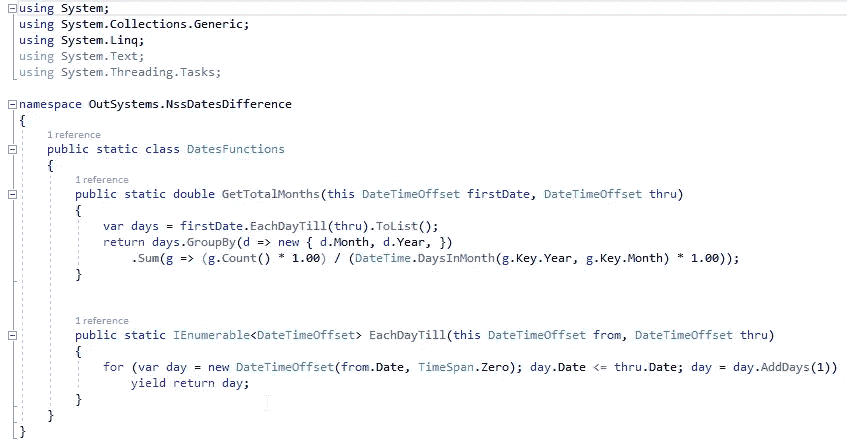
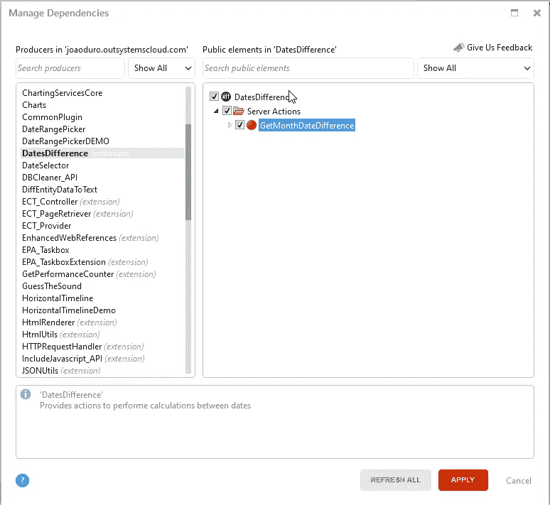
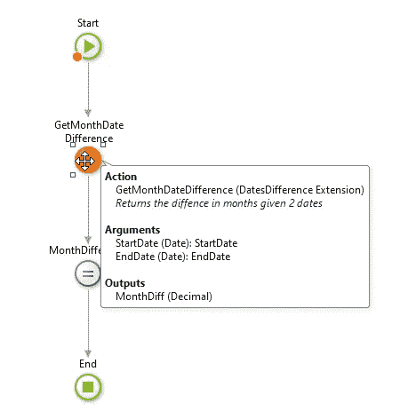

# Outsystems —创建一个. NET 扩展名—以月为单位的日期差异

> 原文：<https://itnext.io/outsystems-create-an-net-extension-date-difference-in-months-cedb4f5f4289?source=collection_archive---------1----------------------->

本文旨在简化。外部系统中的. NET 扩展。作为一个例子，我将演示如何在？NET 提供这两个日期之间的月份差异。

具有一些后端经验的 Outsystems 开发人员(不管是哪种语言)可以很容易地打开 Visual Studio，开始创建/重用一个 dll 用于他们的 Outsystems 项目。

*但是对于低代码的“新一代”开发者来说，这不像使用低代码那样容易理解或线性。*

# **在中创建扩展。净**

**为什么是**？
考虑这样一种情况，您的公司在给定某些参数的情况下进行一些估算保险成本的计算。在外部系统中从头开始创建这样一个引擎计算器是非常困难和耗时的。有了扩展，我们可以很容易地重用。外部系统中的. NET 代码。

**如何？**
**1)打开 Integration Studio** 
你可以从创建自己的动作开始，然后把它编码进去。或从. NET dll 导入操作

2)描述你的参数。

对于这个例子，我们需要一个开始日期和一个结束日期。输出将是一个小数，表示两个日期在月份上的差异。

3)编辑你的。net 代码(如果动作没有被导入)

这将打开 Visual Studio。您将看到一个带有扩展名的文件，在我的例子中是:DatesDifference.cs

该文件将包含您在 Integration Studio 中描述的操作，并且它现在包含您添加的参数:

您可以看到，MssGetMonthDateDifference 操作有一个输出参数，它将返回所需的计算，并使用操作 **GetTotalMonths** 。为此，我用计算操作本身创建了一个新文件(文件 DatesFunctions.cs)

有无数种方法可以计算两个日期之间的月差，但大多数方法都不考虑小数(天)，只返回整数(月)作为差。
我在本例中使用的计算月份小数差值的方法是由以下人员创建的:
[https://stack overflow . com/questions/27825610/month-difference-between-2-dates/65284425 # 65284425](https://stackoverflow.com/questions/27825610/month-difference-between-2-dates/65284425#65284425)

Visual Studio 中的最后一步是构建您的解决方案来检查任何错误。请考虑在您的 VS 解决方案中创建一个新项目，以便在那里执行一些单元测试。您可以轻松地调用您的新操作并测试它。为此，我使用了一个控制台应用程序。NET Framework)项目。

**4)验证、保存、上传并发布您的新扩展**

返回 Integration Studio，并单击 Verify。然后在弹出窗口中，您可以验证、保存、上传和发布您的解决方案。

现在，您应该准备好在外部系统的流程中使用您的新操作。

在外部系统中使用你的行动

转到管理依赖项，在那里找到您的新扩展操作并使用它们:

现在您可以重用它，并围绕它构建一些逻辑:

# **结论**

虽然很好用。NET 扩展，我们应该考虑以下几点:

*   的可维护性。NET 代码(源代码控制、测试、更改等)
*   有时候我们需要写作。NET 代码从零开始。考虑在外部系统中通过重用小的。NET 程序集操作，而不是一个包含所有逻辑的大程序集。
*   对于本文中使用的例子，我发现用。NET 的代码比在外部系统的底层代码中使用这样的动作要少得多。
*   测试。测试新构建的扩展可能很耗时，您需要在您的解决方案(VisualStudio)中创建一个新项目来创建一些单元测试。或者已经在 Outsystems 中的流程中使用它，并在那里进行测试(我不推荐这样做)。