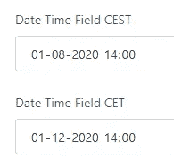
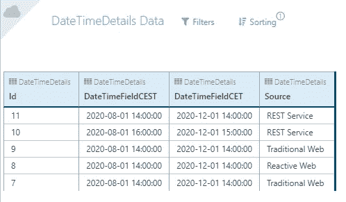
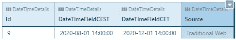
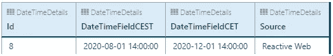
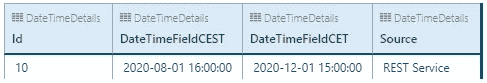
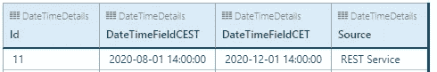
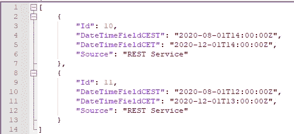

# 外部系统日期和时间处理

> 原文：<https://itnext.io/outsystems-date-time-handling-a2d6e57eff8d?source=collection_archive---------6----------------------->

随着 Mobile 和后来的 Reactive Web OutSystems 的发布，他们改变了对客户端日期时间值的实现的看法。

在过去，当只有(传统的)网络时，你必须[为运行在多个时区的应用程序实现你自己的功能](https://www.outsystems.com/forge/component-overview/500/time-zone)。随着 Mobile(以及后来的 Reactive Web)的发布，系统会为您处理多个时区，这对于开发人员来说应该是一个无忧的问题。

由于 OutSystems 处理日期-时间值的不同方式之间存在差异，这意味着作为开发人员，您应该知道在每种类型的交互中日期-时间是如何处理的。

我已经执行了几次测试，以找出日期时间处理的不同之处。

在本文中，您可以看到我所执行的不同测试，如果您有急事的话，还可以在最后看到一个总结。

## 首先澄清一下我是如何执行不同的测试的

我的所有测试都将运行两个预定义的日期时间，与客户端选择的时区无关。一个测试默认行为(冬季时间)，另一个测试夏令时开启时的行为(夏季时间)。

每个测试都使用默认测试集。

服务器目前运行在 CET 时区(欧洲中部时间)，即 UTC+01:00(阿姆斯特丹)，因为现在还是冬天。

在夏季，服务器将改为夏令时(与冬季相差一小时)。在夏季，服务器更改为 UTC+02:00，这与 CEST(中欧夏令时)相关

> 如果你有能力自由决定在哪个时区运行你的服务器，保持在 UTC，因为这是标准化的世界默认设置。

我在 OutSystems 数据库中创建了一个实体，它存储了我以不同方式保存的所有日期，以查看这些日期在不同应用程序类型和不同时区中的表现。

几次测试后的数据

## 1:传统网络

我从浏览器中创建了一个新记录，它在 UTC+01:00 运行。

保存值后，数据库显示与输入值相同的日期。

通过 Microsoft Windows 时区设置将客户端时区从 UTC+01:00(阿姆斯特丹)更改为 UTC+04:30(喀布尔),不会改变任何功能。结果与上面相同。这意味着系统只知道服务器端的时区。

## 2:反应式网络和移动(工作方式相同)

我从浏览器中创建了一个新记录，它在 UTC+01:00 运行。

保存值后，数据库显示与输入值相同的日期，因为客户端和服务器位于同一时区。

保存后在数据库中的表示。

上面创建的记录的反应式 Web 应用程序表示。

当我将时区更改为 UTC+04:30(喀布尔)时，您可以直接看到客户端表示的变化。

更改为不同时区后的反应式 Web 应用程序表示。

乍一看，很奇怪，当我把时区从 UTC+1:00 改为 UTC+4:30 时，CEST 只相差 2:30 小时。这是因为阿姆斯特丹实行夏令时，而喀布尔没有。这意味着在夏季，UTC+2:00(夏令时校正)和 UTC+4:30 之间只有 2:30 小时的差异。

## **3:休息终点**

REST 端点对日期时间字段使用 [ISO 8601 日期&时间](https://www.iso.org/iso-8601-date-and-time-format.html)格式。

我创建了一个将数据发送到外部系统的 POST 方法和一个从外部系统读取数据的 GET 方法。

为了发送数据，我必须将日期时间格式化为 ISO 8601 格式。有两种方法可以做到这一点:不添加时区的 UTC 和添加本地时区的 Date time。

对于第一个测试，我以 UTC 默认格式发送数据:

*   2020–08–01t 14:00:00Z(等于 2020–08–01t 14:00:00+00:00)

协调世界时 ISO 8601 的结果

正如您在图像中看到的，日期和时间字段从 UTC 转换为本地时区(1 或 2 小时加到该值上)。这是意料之中的，因为服务器在这个时区运行。

对于第二个测试，我以实际的服务器时区格式发送数据:

*   2020–08–01t 14:00:00+02:00(夏季)
*   2020–12–01t 14:00:00+01:00(冬季)

本地时区中 ISO 8601 的结果

如您所见，这些日期也被外部系统成功接受。

对于 REST 端点的最后一个测试，我通过一个 REST 方法从数据库中读取数据，这个 REST 方法是我之前通过 REST 发送的。

通过 REST 的所有输出都转换为 ISO 8601 UTC 符号。

在这些结果中，您还可以从第一个响应中看到 DateTime 值被转换回 UTC。第二个响应需要多一点理解，因为它的输出方式与输入方式不同。时间以 Z 而不是+0100 结束，这是 UTC 表示法而不是时区表示法。

当存储在数据库中时，不保存符号(+0100 或 Z)的上下文，并且当 DateTime 字段稍后通过 REST 输出时，您需要一个统一的符号，而不是基于它如何被发送到数据库的符号。由于这两种符号只是在视觉上不同，而不是在技术上不同，所以对于从 REST 方法中读取或写入日期的系统来说，这应该不是问题。

## 摘要

传统的 Web 只有一个事实，那就是服务器上配置的日期和时间。你做的一切都是在那个时区。

当数据在客户端和服务器端之间传输时，Reactive Web 和 Mobile 会自动转换日期和时间。客户端遵循客户端设备(pc、笔记本电脑、平板电脑或手机)上配置的日期、时间和时区。客户端一收到数据，日期就被转换为本地时区。请记住，计时器&进程确实在服务器上运行，并且是根据服务器时区设置运行的。

REST 方法有一个关于 DateTime 字段的独立转换。这里所有的日期时间都转换为 UTC，与客户端或服务器端的时区配置无关。这是传出数据的默认值。对于传入的数据，系统可以处理每个日期时间值，只要它是 ISO8601 格式的

## 最后的忠告

当在一个在不同时区有办公室或客户的国际组织中处理日期和时间时，我强烈建议从一个反应式 Web 模板启动您的应用程序。日期和时间功能的易用性以及系统从您手中接过的任务比传统的 Web 模板所能提供的功能要好。