# 外部系统良好实践(快速指南)

> 原文：<https://itnext.io/outsystems-good-practices-979bd16d99ed?source=collection_archive---------3----------------------->

# 介绍

本文旨在总结任何外部系统项目的一些典型指南和最佳实践。它是根据 Service Studio 接口组织的。

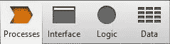

计时器和流程(BPT)

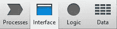

流程、屏幕、web 块/块、变量、主题

动作、角色、例外、引用

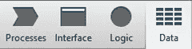

实体、结构、会话变量、站点属性、资源

# 处理

*   在 timers 中，创建一个站点属性“AllowExec”(例如:“site。Timer_Shipment_List_AllowExec”)，默认值为“False”(根据具体情况，默认值为“True”可能是有用的)，在移动到其他环境后保护正在运行的计时器。

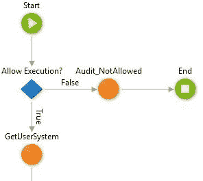

这个站点属性也可以在代码中的任何地方多次使用(比如循环使用)，这样用户就可以控制计时器，如果计时器有问题或者运行时间很长，它就可以停止。

*   在**开始**、**结束**使用审计和不同的流程决策可以帮助控制计时器的迭代(例如，知道有多少记录被处理，有多少记录被拒绝)。通过审计，可以通过 Service Studio 中的定制消息在一般日志(服务中心)中记录每次迭代。

**注意:**每次执行的审计数量有限(*已超过每个请求允许的最大审计数量(3000)。在当前请求中不会记录更多审核消息。*》。在这些情况下，我们可以有一个会计师和一个 IF，它决定在 X 次迭代后审计，而不是所有迭代。

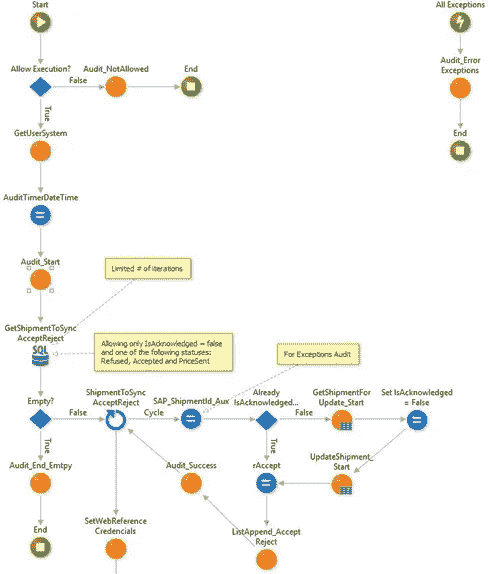

在审计操作中，可以编写个性化消息，并使用 ModuleName 对其进行标识，以便稍后在常规日志(服务中心)中进行标识和过滤。

示例:

*   **消息**:"—Timer _ Shipment _ accept reject[START]—(2019 年 05 月 07 日 12:30:01)"，
*   **ModuleName:**“Timer _ accept reject”。

ModuleName 应该很短，因为它的字符数有限。在本例中，我们特意放置了相同的时间戳(计时器一启动就存储在一个本地变量中)，以便于在一般日志中过滤事件(从而更容易识别与特定执行相关的所有消息)。

在此过程中，可能会有决策记录(例如，“运输与 SAPShipmentId = 21345 已同步接受/拒绝！(12:30:20 07/05/2019)").

在计时器异常流中使用审计进行执行控制也是一个好的实践，因为如果有异常，用户不会注意到。(例如“Timer _ Shipment _ accept reject sapsipmentid:23456 中出现错误—它已经被同步！(12:30:40 07/05/2019)") ")

一旦注册了流程的开始，就需要使用审计来注册流程的结束(例如:" "—Timer _ Shipment _ accept reject[END]—成功同步了 30 个传输，2 个未同步！(12:31:10 7/5/2019) ").

# 连接

*   根据实体对具有相同前缀的屏幕名称使用标准。

    然而，重要的是要有一个整个项目通用的标准。
*   识别记录、记录列表和参数(例如，使用实体名称删除:“客户语音”->“客户语音记录”或“客户语音列表”)
*   命名“Id”(例如“CustomerId”)
*   布尔使用像“Has”或“Is”这样的表达式(例如 IsLoading，HasRole)
*   填写表达的例子。

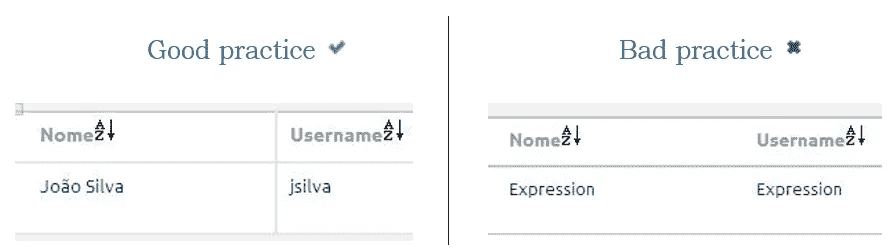

填写表达的例子。

*   避免将 CSS 放在网页块或屏幕上，放在主题上(为了避免创建多个 CSS 文件)。这同样适用于 Javascript 函数。
*   避免在屏幕上使用太多的局部变量和太多的输入参数，以避免过多的视图状态。
*   注意在准备过程中要放什么(例如避免非常繁重的查询，不加载二进制文件——只获取 id，在下载操作中获取二进制文件)
*   始终将各自的角色与屏幕相关联。
*   在准备屏幕时验证输入参数和权限(包含在弹出窗口中)。根据项目的环境，有时还需要验证该屏幕上可能允许或不允许的过程状态。我们绝不能盲目相信输入参数，也不能相信记录的预期状态，因为它们很容易被篡改(最明显的更改是直接在 URL 上进行的，但我们也可以很容易地篡改 AJAX 请求和表单中的数据提交)。

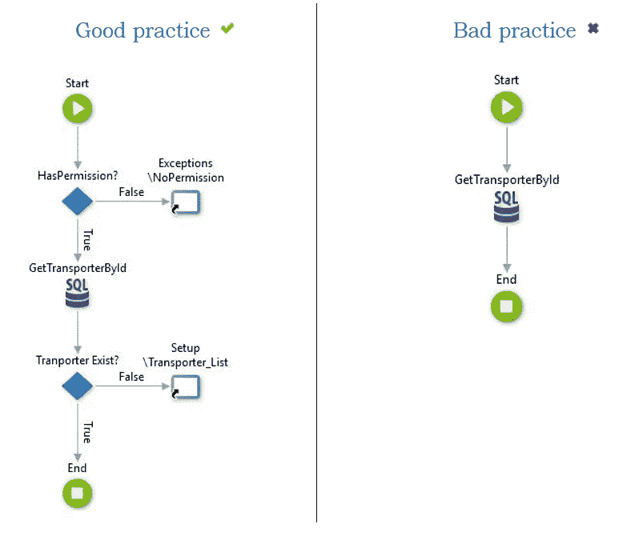

在准备屏幕时验证输入参数和权限(包含在弹出窗口中)。

*   如果您只想要一条记录，请使用 TOP 1(例如:填写一条编辑记录)

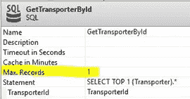

如果您只想要一条记录，请使用 TOP 1

*   在高级查询中，每当您不想返回和使用所有实体的属性时，请使用结构。

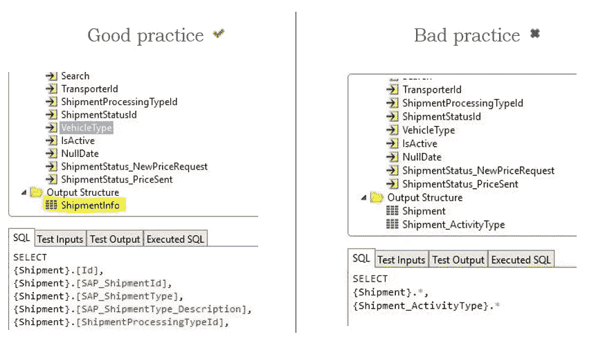

在高级查询中，每当您不想返回和使用所有实体的属性时，请使用结构。

*   避免空间之间的循环引用，以避免空间发布和解决方案中的错误。
    **注意:**为了深化这个主题，考虑 4 层画布架构很重要:[4 层画布](https://success.outsystems.com/Support/Enterprise_Customers/Maintenance_and_Operations/Designing_the_architecture_of_your_OutSystems_applications/01_The_4_Layer_Canvas)
*   此外，发现应用程序对于检测模块或应用程序之间的循环引用是必不可少的:[发现](https://www.outsystems.com/forge/component/409/discovery/)。
*   如果您想要使用测试或调试屏幕，请为此创建一个流。创建一个站点属性“AllowDebug ”,默认值为“False ”,并使用准备中的站点属性保护所有屏幕(除了将角色 administrator 与屏幕相关联之外)。

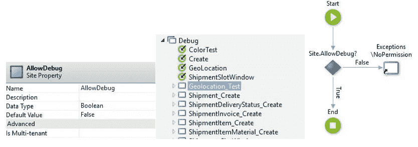

*   使用生产环境的默认值创建的站点属性。在开发、更改之后，在服务中心对所需的值进行测试。
*   向右对齐的异常:

异常向右对齐

*   查询优化:

1.  “EXISTS”而不是“IN”:
    ——“EXISTS”应该在子查询的结果是多个寄存器时使用。
    -当子查询结果较低或固定时，应使用“IN”。
2.  避免“For Each”，如果可能的话，在高级查询中做所有的事情。
3.  使用 SQL STUFF 获得逗号分隔的记录列表(例如:1，2，45，34，56，67，87)
4.  辅助查询(以 Table1 为(查询))
    ——辅助表 Table1 可以在另一个查询中使用(在同一个高级查询中)，就像它是一个真实的表一样。

*   当数据库异常发生时，它使用会话变量在服务中心注册。但是，在某些情况下，必须有更合适的处理方法，因此有必要了解正在发送的消息类型。因为消息总是相同的，所以对于每种情况，可以通过 IF 测试是否抛出了异常，并以这种方式继续处理。
    例:" Index (ToUpper (Session。ExceptionMessage)、ToUpper(" DELETE 语句与引用约束冲突"))< > -1)"

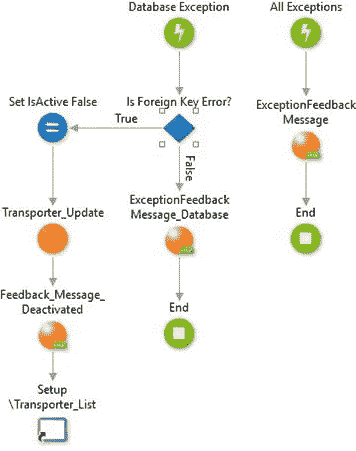

# 逻辑

*   英文代码和注释。
*   保持主垂直流以及组件之间的相等间距和对齐。

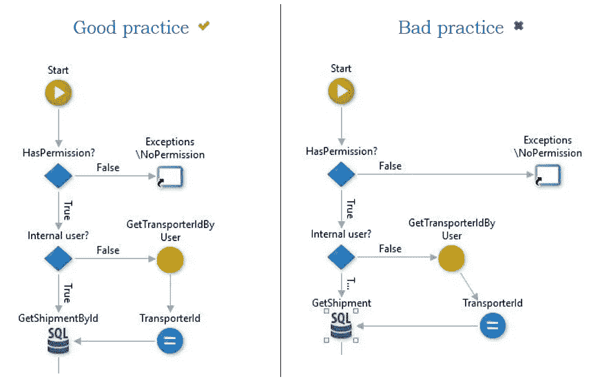

保持主垂直流

*   垂直方向 If = True，水平方向 If = False(尽可能向右)。

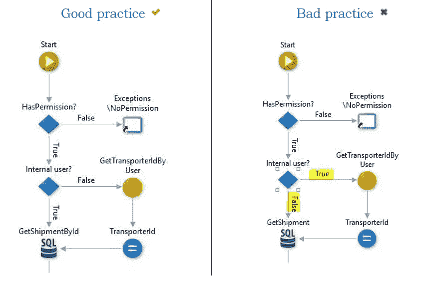

*   当代码不明显或复杂时，留下注释。

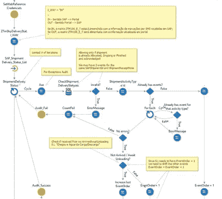

当代码不明显或复杂时，留下注释。

*   请务必填写名称和描述(操作、分配、站点属性等)

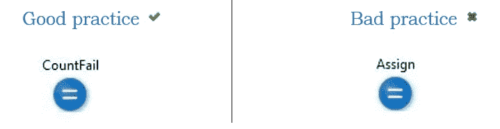

请务必填写名称和描述

*   始终识别元素(无论是 If、反馈消息、for each 等)

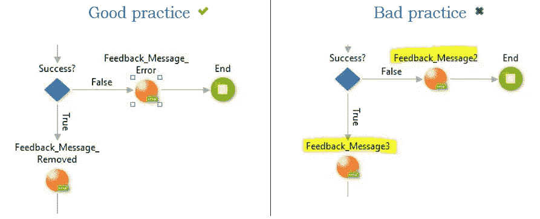

*   SQL 内联或要在查询中使用的变量或参数包括表达式“SQL”(例如“SQLShipmentStatusIds”)。
*   代码清理，删除未使用的动作和引用。
    注:来自最新平台版本:
    -8.0.1.65；
    ——9.0.1.65；
    -9 . 1 . 501 . 0；
    -10；
*   Service Studio 中有一项功能可以让移除 eSpace 中未使用的参考变得更容易。移除未使用的引用[是良好的架构实践](https://success.outsystems.com/Documentation/Best_Practices/Development/OutSystems_Platform_Best_Practices)。
*   按类别组织操作(创建文件夹，按概念对操作进行分组)。

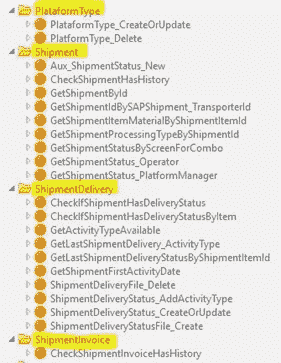

按类别组织行动

*   如果您只需要一条记录(如填写编辑记录)，请使用 TOP 1

如果您只想要一条记录，请使用 TOP 1

*   在高级查询中，每当您不想返回和使用所有实体的属性时，请使用结构。

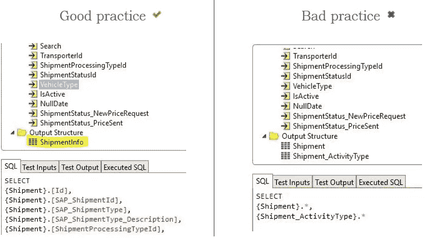

*   异常向右对齐。

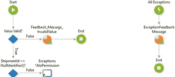

*   查询优化:

1.  “EXISTS”而不是“IN”:
    ——“EXISTS”应该在子查询的结果是多个寄存器时使用。
    -当子查询结果较低或固定时，应使用“IN”。
2.  避免“For Each”，如果可能的话，在高级查询中做所有的事情。
3.  使用 SQL STUFF 获得逗号分隔的记录列表(例如:1，2，45，34，56，67，87)
4.  辅助查询(以 Table1 为(查询))
    ——辅助表 Table1 可以在另一个查询中使用(在同一个高级查询中)，就像它是一个真实的表一样。

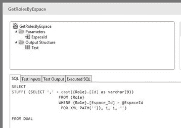

3.使用 SQL STUFF 获得逗号分隔的记录列表(例如:1，2，45，34，56，67，87)

# 数据

*   检查外键的删除规则，以避免相关记录出错。选择“删除”选项会导致相关记录也被删除。(级联删除)。
*   在每个项目中，定义一组可以在反馈信息中重用的信息是很重要的。应用此定义的一种方法是在项目的一个核心空间中创建一组场地属性:

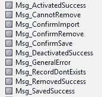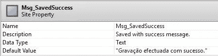

为了在其他空间中重用，可以创建一个结构，并创建将使用消息的相应操作:

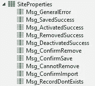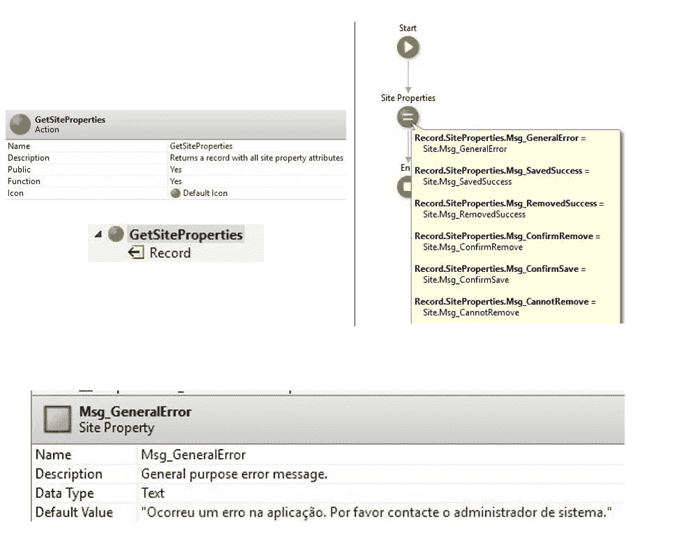

*   这个动作最重要的用法之一是“Msg_GeneralError”，因为它将替换应用程序生成的未处理的消息(“会话。ExceptionMessage”)，它将被呈现给最终用户。消息，除了是一个“丑陋的”消息之外，它对用户没有什么用处。

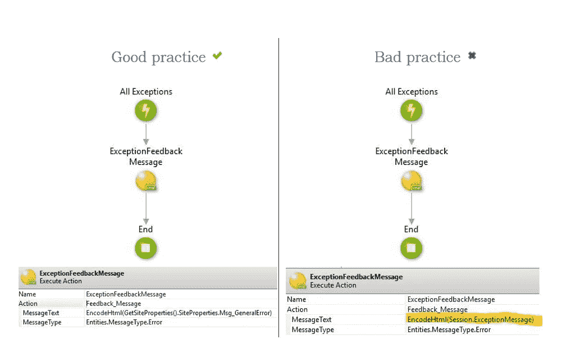