# OutSystems:分页/导航小部件如何工作

> 原文：<https://itnext.io/outsystems-how-the-pagination-navigation-widget-works-822526b06918?source=collection_archive---------4----------------------->

在你的应用程序中，你可能会显示信息列表。您正在显示的信息可能会变得比页面所能容纳的还要长，大多数情况下您希望使用分页来显示所有数据。

OutSystems 为您提供了一个组件，使您可以轻松地将此功能添加到您的应用程序中。它被称为 RichWidgets 附带的“List_Navigation”小部件。

本文描述了如何一步步地使用它，以便更好地理解这个小部件。

# 创建不带列表导航的国家页面

我有一个包含 227 个国家的国家实体。在屏幕上，我想显示国家的 id，名称和地区，按国家的名称排序。

# 第一步

在准备过程中，创建一个聚合来获取按名称排序的所有国家。

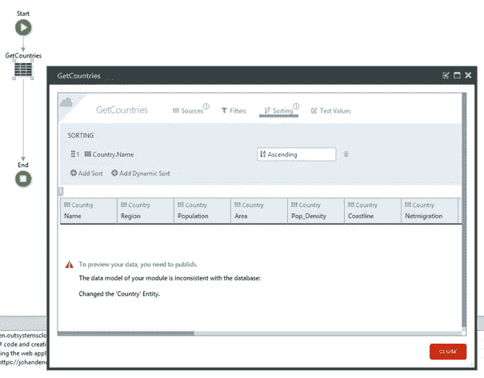

# 第二步

在屏幕上放置一个表记录小部件，将表小部件的源记录列表设置为步骤 1 中的聚合，并将行数设置为 9999，以确保显示所有国家。将列行号、id、名称和区域添加到表记录中。

表格上方显示了集合中的记录数。

因此，该页面按字母顺序显示了国家实体的所有记录。

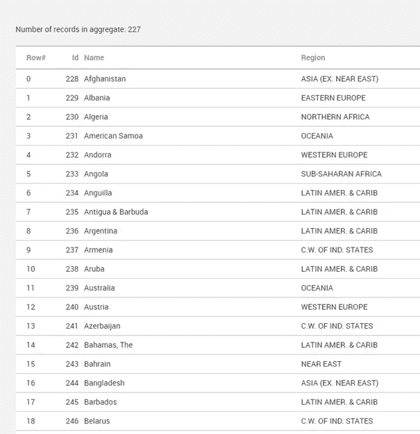

所有的 227 条记录都聚集在一起，所有的记录都作为一个长列表显示在屏幕上。

# 向屏幕添加分页/导航

现在，让我们使用“List_navigation”小部件在屏幕上只显示 10 个国家，并让用户控制这些国家的循环。

# 第一步

从 RichWidgets 模块中引用 List_Navigation 小部件。

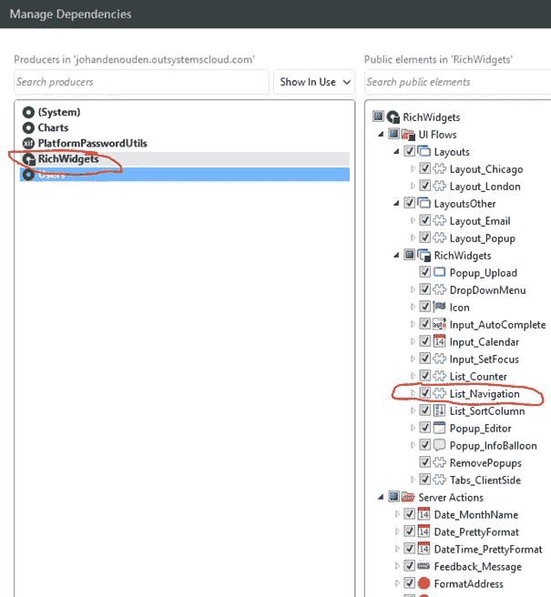

# 第二步

将 table records 小部件的行数设置为 10，这样屏幕上只显示 10 条记录。

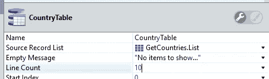

# 第三步

将 List_navigation 小部件添加到屏幕上，并设置小部件的属性。

**ListWidgetId** 小工具的 Id 显示数据
**LineCount** 将在数据小工具中显示的行数
**TotalRowCount** 可显示的总行数
**max page numbers** 在通知操作
屏幕上显示的最大页码数当按下 List_Navigation 的按钮时要调用的操作

填充的小部件如下所示

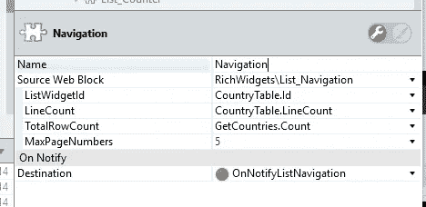

请注意，GetCountries 聚合的 Count 属性包含聚合的所有记录的数量，而 length 属性包含实际从数据库中提取并在聚合本身中的记录的数量。

屏幕现在看起来像这样。

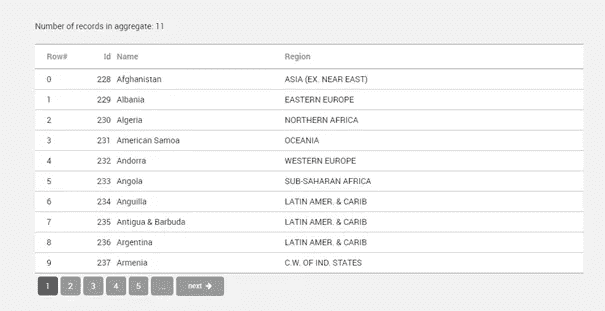

是啊！我们的分页是存在的，但是当按下按钮时没有任何反应。让我们来解决这个问题！

# 第四步

当用户按下按钮时，我需要实现 OnNotifyListnavigation 屏幕操作。

在这个函数中，我们需要重新查询 countries 聚合以获得需要显示的记录，刷新表达式以显示聚合中的记录数，并需要显示 table records 小部件以实际显示新记录。当然，我们需要刷新 List_Navigation 小部件本身来显示更改。

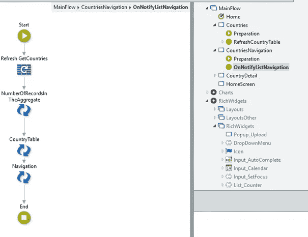

让我们再试一次！

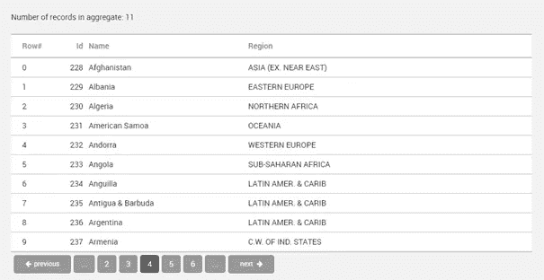

糟糕，还是不行。我们需要解决更多问题！

List_Navigation 小部件正在改变，它会显示你在哪个页面，现在会显示上一页按钮。但是集合中的记录数量没有改变，表记录小部件中的数据也没有改变。

# 第五步

让我们看看表记录器小部件的属性。

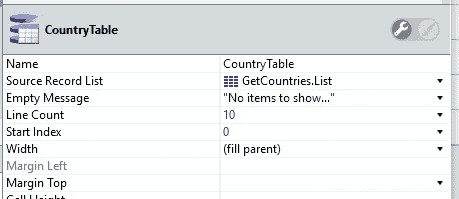

这里有一个 start index 属性，它告诉 table records 小部件从何处开始显示 table records 小部件源代码中的记录。现在它总是从列表的开头开始！

我需要告诉 table records 小部件从哪里开始显示记录，用户在哪个页面上！

为此，我们需要一个来自 RichWidgets 模块的服务器动作，称为“List_Navigation_GetStartIndex”。

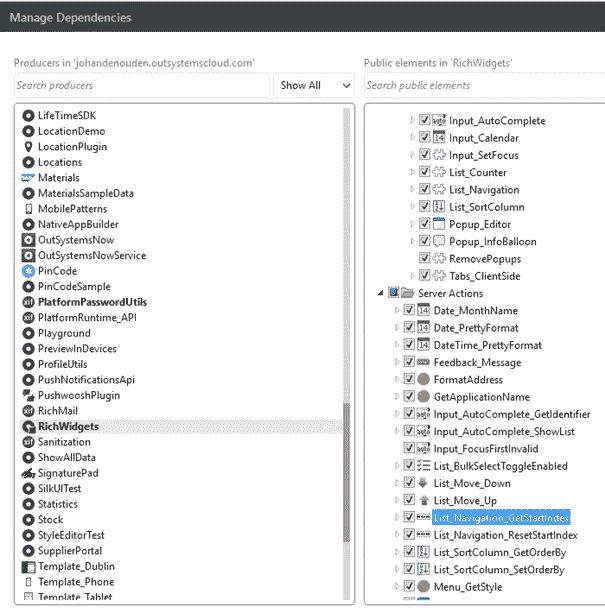

这个服务器动作告诉表记录小部件的当前起始索引。让我们在表记录小部件的开始索引属性中使用它。

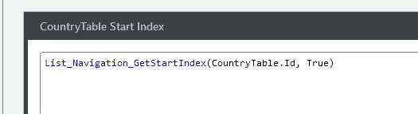

这个屏幕操作的第一个参数是 table records 小部件的运行时 id，第二个参数告诉它记住会话变量中的值。

请注意，这个函数的第一个参数不是 List_Navigation 小部件的运行时 id，而是表记录小部件的运行时 id！因为 List_Navigation 小部件通过 list_navigation 小部件的 ListWidgetId 属性连接到 table records 小部件，所以这是可行的！

其他的魔法正在这里发生！因为聚合 GetCountries 通过“源记录列表”属性连接到表记录小部件，所以聚合现在知道必须获取多少记录，以便表记录小部件可以显示正确的记录。

让我们再试一次。

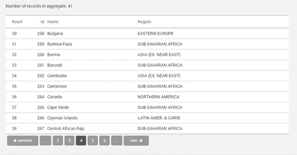

是啊！分页工作了！

# 一些提示和技巧

当表 records 小部件的源记录列表的内容发生变化时，由于当前页面的原因，源中的记录可能会比要显示的记录少。用户在第 10 页，但只有 4 页的记录。此时，您需要重置开始索引。这可以通过服务器动作“List _ Navigation _ ResetStartIndex”来完成。

聚合需要获取所有记录，直到屏幕上实际显示的记录。如果列表计数为 10，并且用户位于第 1.000 页，则聚合必须获取 10 * 1000 = 10.000 条记录，以便只显示最后 10 条记录。因此，当页数增加时，性能会下降。您可以使用一些高级的 SQL 技术来避免这个问题，但这超出了本文的范围。

我希望您喜欢我对 List_Navigation 小部件的解释。