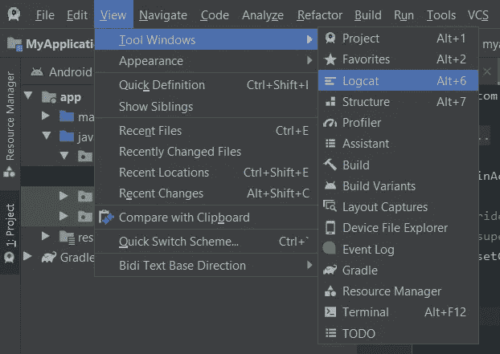
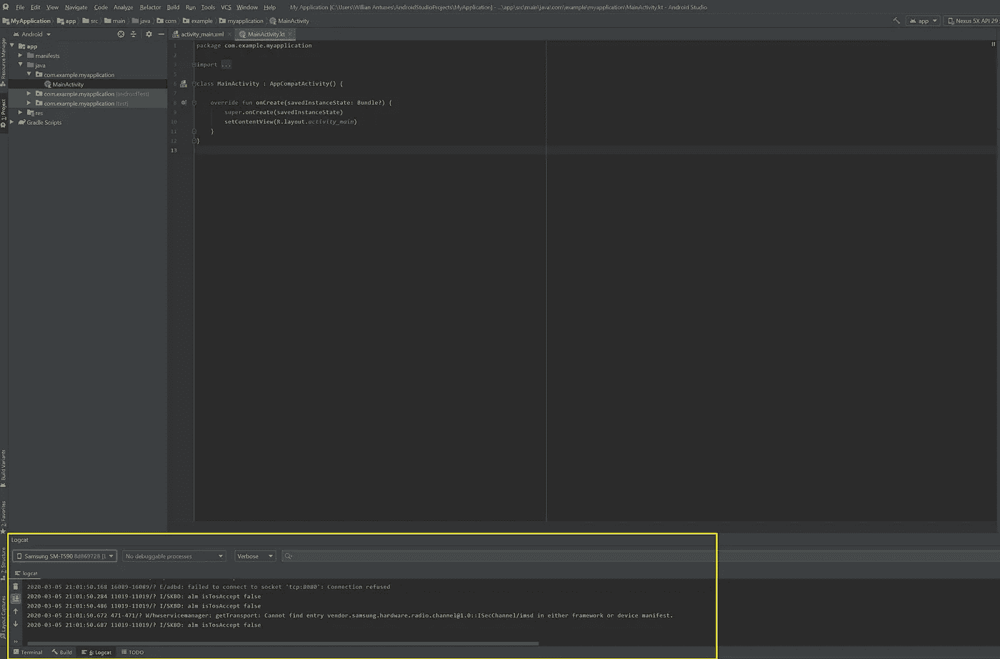
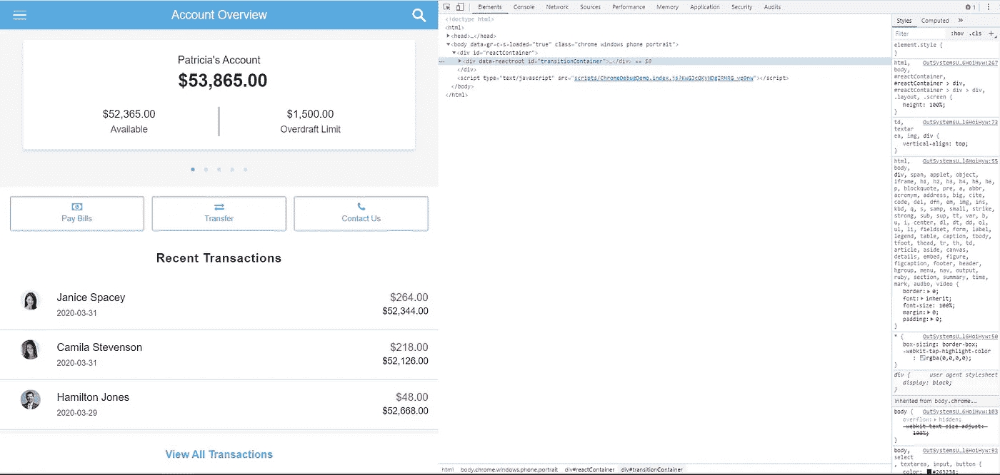
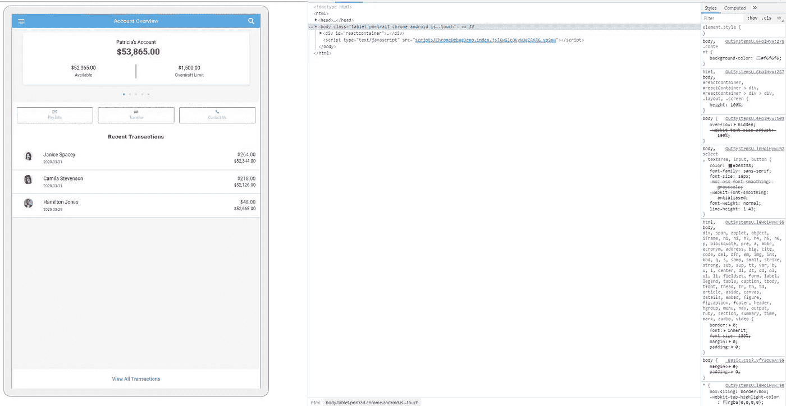

# 外部系统和移动应用——你永远不应该忘记的工具集

> 原文：<https://itnext.io/outsystems-mobile-a-toolset-that-you-should-never-forget-7ef21605352c?source=collection_archive---------4----------------------->

当解决一个问题时，一个错误的工具或者根本没有工具会产生更多的问题或者减慢这个过程。

如果您是一名 OutSystems Mobile 开发人员或者想成为一名开发人员，您可能会发现这篇文章很有用。

我们都知道问题是会发生的，很难找到问题的根源，因此也很难解决。这就是为什么拥有一个好的工具集可以帮助你找到问题的根源并解决它。

在这篇与我的朋友 [Rúben Bonito](https://medium.com/u/e2f51bc406db?source=post_page-----7ef21605352c--------------------------------) 共同撰写的文章中，我们分享了一个工具集，当你在外部系统中开发移动应用程序时，你可以考虑将它放在你的工具箱中。

**安卓工作室和 Logcat**

这是任何 android 应用程序开发人员的主要工具，在处理奇怪的崩溃和未知来源的问题时非常有用。出于明显的原因，我们不能在 Android Studio 中调试我们的外部系统应用程序(我使用的是 3.6.1 版本)，但是我们可以看到应用程序和 Android 操作系统抛出的所有日志和异常。

要访问日志和异常，我们只需要通过 USB 和 ADB ( [android Debug Bridge](https://developer.android.com/studio/command-line/adb) )将 Android 设备连接到我们的笔记本电脑。并使用以下路径:

一旦启用，Logcat 窗口将出现在屏幕底部(如下例所示):

**Chrome 工具包**

你们大多数人都知道这一点，但在开发网络或移动应用程序时，提到谷歌 Chrome 的[功能](https://developers.google.com/web/tools/chrome-devtools)并不过分。因为 OutSystems 移动应用程序是基于 Javascript、HTML 和 CSS 的，所以我们可以在浏览器中测试应用程序。这只有在不需要访问移动设备的本地资源或传感器的插件时才有效。

也就是说，Chrome 通过按 F12 键或在浏览器应用程序的右键菜单中选择 inspect 选项为我们提供了工具包。Chrome Toolkit 可以让你看到 HTML 的层次结构、本地存储、网络消耗等等:

这是一个很有价值的工具集，在开发和故障排除过程中很有帮助。

**设备上的 Chrome 调试器**

您是否知道 chrome 还提供了一种在真实设备中调试应用程序或网站的方法？！

在这里你可以看到你需要做些什么来准备好一切。当您遇到的问题只发生在真实设备中，而不是在桌面浏览器中测试时，这非常有用。

下图是我们与 chrome 连接的一个演示应用程序的例子，这是在 chrome 中调试它时的样子:

通过使用 chrome 远程调试；在检查 web 应用程序的元素时，您可以做任何您能够正常做的事情。

**AVD**

关于 Android 虚拟设备(AVD)及其功能，我们没有太多要说的，因为 out systems MVP[Armando Gomes](https://medium.com/u/a504e300f70a?source=post_page-----7ef21605352c--------------------------------)写了一篇关于它的很好的文章。

现在这个问题提出来了，你描述了很多针对 android 的工具，但是为什么没有提到任何针对 iOS 应用的东西。苹果比谷歌更受限制，我们甚至可以说是受限的，但我们确实有工具在 iOS 中排除故障。

不用我描述这些工具，你可以阅读 David Martins 在 OutSystems 博客上写的非常好的文章[。本文介绍了这些工具，以及如何使用它们对 Windows 设备上的 iOS 应用程序进行故障诊断。](https://www.outsystems.com/blog/posts/how-to-troubleshoot-ios-on-windows/)

我们还有一些有用的链接，您可以从中找到有关特定主题的更多信息:

*   [常见移动开发问题](https://success.outsystems.com/Documentation/11/Developing_an_Application/Troubleshooting_Applications/Solve_Common_Mobile_App_Development_Issues)
*   [检查 HTTPS 对 iOS 的请求](https://success.outsystems.com/Documentation/11/Developing_an_Application/Troubleshooting_Applications/Inspect_the_HTTP_requests_in_Mobile_Apps_for_iOS)
*   [手机应用陷入困境网络研讨会](https://www.outsystems.com/learn/lesson/1197/mobile-apps-in-trouble/)