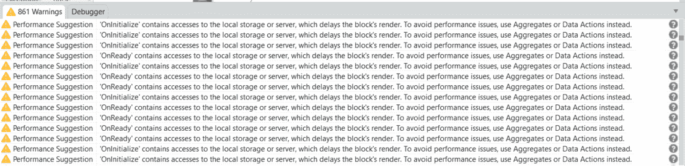
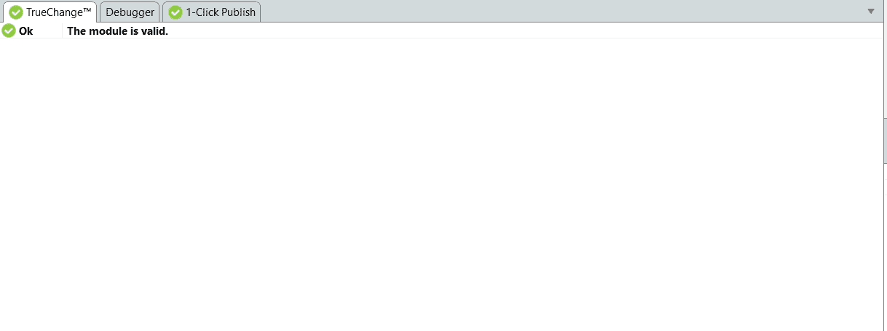

# OutSystems 移动开发最佳实践，为什么？

> 原文：<https://itnext.io/outsystems-mobile-development-best-practices-why-47d1b5dacea0?source=collection_archive---------4----------------------->

在不同的场景中为许多客户工作让我意识到遵循最佳实践的所有好处。这是我在开发移动应用程序时一直牢记的一点。

在本文中，我将分享这些好处，并解释为什么遵循面向外部系统的移动开发的最佳实践是必不可少的。

关于最佳实践的第一个问题总是它们为什么重要？

要回答这个问题，首先，我们应该了解什么是 OutSystems 平台，以及它在幕后是如何工作的。

OutSystems 是一个低代码平台，这意味着它为我们提供了一种无需用“标准”编程语言(例如 NET 或 Java)。在该平台中，我们能够以可视化的工作流方式开发应用程序。基本上，OutSystems 所做的是为您在平台中采取的每个动作生成一段代码。这带来了一些优势，这些优势是我们需要关注和理解最佳实践的原因之一。OutSystems 是生成代码并可以进行大量优化的工具，如果开发人员想用“标准”语言来做，这需要更多的工作和知识。

也就是说，遵循同样的思维方式，OutSystems 也为我们提供了开发过程中影响的大量分析。这种分析可以告诉所有可能导致问题的事情；运行时可能发生的问题，或改进代码和避免未来/性能问题的建议/警告。

一段时间以前，我收到一个客户的请求，他想改进一个运行缓慢的应用程序。我在那里遇到了以下场景:

我知道缓慢的主要原因可能是一些具体的东西，但毫无疑问，这些警告也是问题的一部分。我们可以不经进一步调查就得出这个结论。我开始着手这个项目，解决了所有的性能问题/警告。一个月后，我看到了下面的场景:

因此，所有的警告/建议都被修复了，我们没有遇到任何其他可能导致应用程序变慢的问题。当我们测试它的时候，一切都运行得很顺利。

这一经历促使我分享我能给出的关于 OutSystems mobile 开发的最重要的建议，你应该始终遵循和应用这些警告/建议，除非你有一个特定的需求，而这个需求是不可能按照最佳实践来解决的。

以下是需要注意的其他重要的外部系统移动最佳实践:

*   **选择 OutSystems 低代码而不是 JavaScript:**

与在服务器端运行一切的 OutSystems web 开发相比，在移动开发中，我们有在设备上运行的客户端动作。因此，你应该尽可能地使用它们而不是 javascript。

*   **为正在提取的内容设计一个空状态:**

这是最终用户可用性的一部分，以避免在屏幕上显示空元素。在聚合或数据操作中获取数据/内容时，您可以创建空状态。你总是会发现属性 IsDataFetched，你可以用它来处理这个空状态。

*   **设计一个轻量级的本地存储**

这是 OutSystems 也会尽力帮助你的事情。当您试图将服务器实体中的相同结构复制到本地存储时，外部系统会警告您不要这样做。本地存储不需要与服务器端的结构相同。您应该尝试对本地存储进行反规范化，并尽可能保持最小化，以避免复杂的查询，也避免大量的连接。当然，高端设备可以处理更多的数据，具有更强的处理能力，但是如果开发人员不关心本地存储的构建方式，低端设备可能会陷入困境。本地存储应该是服务器数据库的轻量级版本。

*   **故障排除**

如果你使用过 OutSystems mobile，你就会知道，如果事先没有考虑到，故障排除可能会很棘手。在您的应用程序有一个稳定的版本之前，最好有一种方法来查看您的本地存储数据。

要解决这种情况，您可以创建一个简单的列表和详细的屏幕，这将有助于您更好地了解应用程序背后发生的事情。这是必要的，因为在外部系统中调试时不可能看到本地存储。

另一个技巧是创建一个客户端日志系统，以便在故障排除时有一个更好的概览。

我在本文中提到的没有什么是秘密，你可以在 [OutSystems 文档](https://success.outsystems.com/Documentation/Best_Practices/OutSystems_Mobile_Best_Practices)中找到这个和更多的最佳实践。